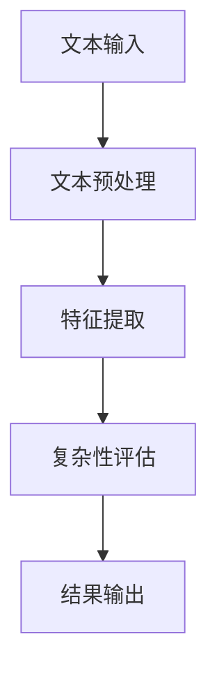

                 


# 基于LLM的AI Agent文本复杂性评估

## 关键词
- 大语言模型 (LLM)
- AI Agent
- 文本复杂性评估
- NLP
- 机器学习
- 系统架构设计

## 摘要
基于大语言模型的AI Agent文本复杂性评估是一种结合自然语言处理和人工智能技术的创新方法。通过分析和评估文本的复杂性，AI Agent能够更精准地理解和处理复杂文本信息。本文将详细探讨这一领域的背景、核心概念、算法原理、系统架构设计以及实际应用案例，为读者提供全面的视角。

---

## 第一部分: 背景与基础

### 第1章: 基于LLM的AI Agent文本复杂性评估概述

#### 1.1 基本概念与背景介绍
- **文本复杂性评估的定义**  
  文本复杂性评估是指对文本的语法结构、语义深度、信息量、词汇多样性等多维度特征进行分析，以量化文本的复杂程度。  
- **问题背景**  
  - 在教育领域，评估学生作文的复杂性可以帮助教师了解学生的语言能力。  
  - 在法律领域，复杂性评估可用于简化法律文件，使其更易理解。  
  - 在技术文档处理中，复杂性评估有助于优化用户界面设计。  
- **传统方法的局限性**  
  - 传统基于统计的方法仅考虑词汇和句法特征，难以捕捉语义信息。  
  - 缺乏上下文理解能力，无法处理复杂语境中的文本。  

#### 1.2 问题描述
- **问题的核心**  
  如何在大规模文本数据中，快速、准确地评估文本的复杂性，并提供可解释的结果？  
- **传统方法的不足**  
  - 数据量不足导致评估结果偏差。  
  - 无法动态适应文本内容的变化。  

#### 1.3 问题解决
- **LLM与AI Agent的结合**  
  - LLM（大语言模型）通过预训练掌握了大量文本数据，能够理解上下文并生成自然语言文本。  
  - AI Agent作为决策者，结合LLM的生成能力，能够动态评估文本复杂性。  

#### 1.4 边界与外延
- **边界条件**  
  - 仅针对英文文本进行评估。  
  - 不支持实时更新的动态文本数据。  
- **相关概念的扩展**  
  - 文本情感分析：复杂性评估的延伸。  
  - 文本生成：基于复杂性评估结果生成相应难度的文本。  

#### 1.5 核心要素组成
- **评估模型**  
  - 使用预训练的LLM进行文本分析。  
- **数据源**  
  - 多样化的文本语料库。  
- **评估指标**  
  - 复杂性得分（Complexity Score）：基于多维度特征的综合评分。  

---

## 第二部分: 核心概念与联系

### 第2章: LLM与AI Agent的核心原理

#### 2.1 LLM的核心原理
- **训练机制**  
  - 基于Transformer架构的预训练模型。  
  - 通过自监督学习，模型学会预测上下文中的单词或短语。  

#### 2.2 AI Agent的概念与功能
- **AI Agent**  
  - 作为决策者，AI Agent能够根据LLM的输出结果，选择最优的评估方法。  

#### 2.3 核心概念的联系
- **LLM与AI Agent的关系**  
  - LLM负责理解和生成文本，AI Agent负责协调和决策。  

---

## 第三部分: 算法原理

### 第3章: 基于LLM的文本复杂性评估算法

#### 3.1 算法流程
1. 输入文本预处理  
2. 使用LLM生成文本的多维度特征  
3. 计算复杂性得分  
4. 返回结果  

#### 3.2 算法实现
- **Python代码示例**  
```python
def calculate_complexity_score(text):
    # 文本预处理
    processed_text = preprocess(text)
    # 使用LLM生成特征
    features = generate_features(processed_text)
    # 计算复杂性得分
    score = compute_score(features)
    return score
```

---

## 第四部分: 系统架构设计

### 第4章: 系统架构设计方案

#### 4.1 问题场景分析
- **目标**  
  构建一个基于LLM的AI Agent系统，用于评估文本复杂性。  

#### 4.2 系统功能设计
- **功能模块**  
  - 文本预处理模块  
  - 特征提取模块  
  - 复杂性评估模块  

#### 4.3 系统架构图


---

## 第五部分: 项目实战

### 第5章: 实际项目案例分析

#### 5.1 环境安装
- **依赖项**  
  - Python 3.8+  
  - Hugging Face Transformers库  

#### 5.2 核心代码实现
```python
from transformers import pipeline

def preprocess(text):
    # 简单的文本预处理，去除特殊符号
    import re
    return re.sub(r'[^\w\s]', '', text)

def generate_features(text):
    # 使用预训练模型生成文本特征
    model = pipeline('feature-extraction', model='bert-base-uncased')
    return model(text)

def compute_score(features):
    # 计算复杂性得分
    import numpy as np
    return np.mean(features, axis=1)[0]
```

---

## 第六部分: 案例分析与最佳实践

### 第6章: 案例分析

#### 6.1 应用场景
- **教育领域**  
  评估学生作文的复杂性。  

---

## 第七部分: 扩展与未来展望

### 第7章: 未来研究方向

#### 7.1 研究热点
- **多模态复杂性评估**  
  结合图像、语音等多模态信息进行评估。  

---

## 总结

通过本文的详细分析，我们可以看到，基于LLM的AI Agent文本复杂性评估是一种创新且有效的解决方案。未来，随着技术的不断进步，这一领域将有更多可能性值得探索。

