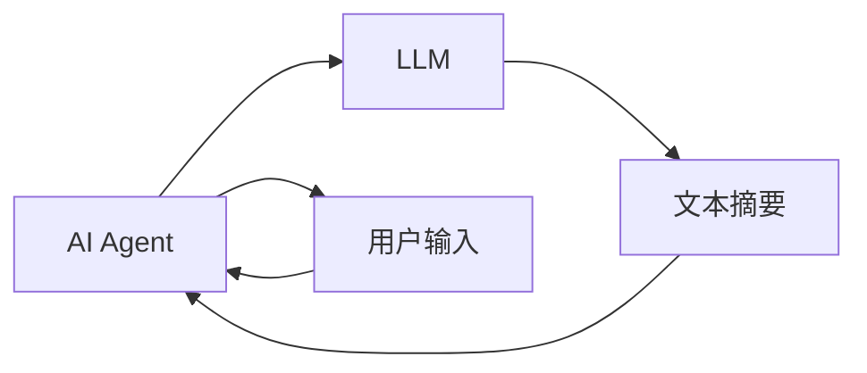
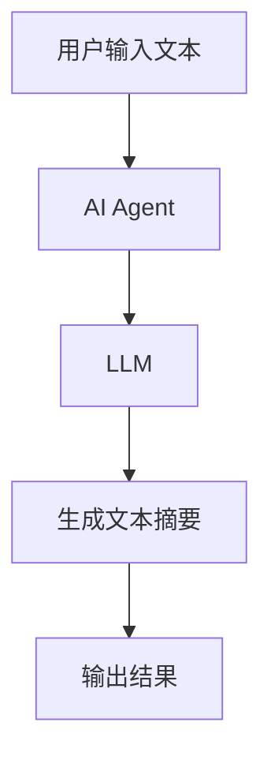

                 

# 基于LLM的AI Agent文本摘要生成

> 关键词：文本摘要生成, AI Agent, LLM, 生成式AI, 自然语言处理

> 摘要：本文将详细探讨基于大语言模型（LLM）的AI Agent在文本摘要生成中的应用。从问题背景、核心概念到算法原理、系统架构设计，再到项目实战，系统性地分析和讲解这一技术。通过实际案例和最佳实践，深入剖析其实现细节和应用价值。

---

# 第1章: 基于LLM的AI Agent文本摘要生成概述

## 1.1 问题背景与问题描述
### 1.1.1 文本摘要生成的需求背景
在信息爆炸的时代，用户每天需要处理大量的文本信息，包括新闻、报告、邮件等。如何快速获取文本的核心内容成为亟待解决的问题。传统的文本摘要技术依赖于关键词提取或基于规则的句子选择，但这种方法难以捕捉文本的深层语义信息，导致摘要结果不够准确或缺乏连贯性。

### 1.1.2 问题解决方法
基于LLM（Large Language Model）的AI Agent通过自然语言处理技术，能够更好地理解文本内容，并生成高质量的摘要。这种方法不仅能够提取关键词，还能根据上下文生成连贯、自然语言的摘要，极大地提升了用户体验。

### 1.1.3 问题边界与外延
本文将重点关注基于LLM的AI Agent在文本摘要生成中的应用，主要解决以下问题：
1. 如何利用LLM生成准确的文本摘要。
2. 如何设计AI Agent的架构，使其能够高效地处理文本摘要任务。
3. 如何优化生成式文本摘要的效果，使其更加自然和准确。

## 1.2 核心概念与技术特点
### 1.2.1 AI Agent的核心要素
AI Agent（人工智能代理）是一种能够感知环境并采取行动以实现目标的智能系统。在文本摘要生成中，AI Agent的主要功能包括：
- 文本理解和语义分析。
- 摘要生成与优化。
- 用户反馈处理与改进。

### 1.2.2 LLM的技术特点
LLM（Large Language Model）是一种基于深度学习的自然语言处理模型，具有以下特点：
- 大规模训练数据：通常基于数百万甚至数十亿的文本数据进行训练。
- 模型参数量大：参数量通常在 billions 级别。
- 多任务学习能力：能够处理多种NLP任务，如文本生成、翻译、问答等。

### 1.2.3 AI Agent与LLM的结合方式
AI Agent通过调用LLM的API，将文本输入模型，获取生成的摘要结果。这种结合方式使得AI Agent能够利用LLM的强大能力，快速生成高质量的文本摘要。

## 1.3 概念结构与核心要素
### 1.3.1 AI Agent的功能模块
AI Agent在文本摘要生成中的功能模块包括：
1. 输入解析模块：接收用户的输入文本并进行预处理。
2. 语义理解模块：分析文本内容，提取关键信息。
3. 摘要生成模块：利用LLM生成文本摘要。
4. 输出优化模块：对生成的摘要进行优化，提升可读性和准确性。

### 1.3.2 LLM在文本摘要中的角色
LLM在文本摘要生成中扮演以下角色：
- 语义理解：通过模型的语义理解能力，准确捕捉文本的核心内容。
- 文本生成：基于模型的生成能力，输出连贯、自然的摘要。
- 上下文处理：能够处理上下文关系，生成更准确的摘要结果。

### 1.3.3 生成式文本摘要的实现流程
生成式文本摘要的实现流程包括以下步骤：
1. 输入文本预处理：对输入文本进行分词、去停用词等处理。
2. 语义分析：利用LLM对文本进行语义分析，提取关键信息。
3. 摘要生成：基于模型生成初步摘要。
4. 摘要优化：对生成的摘要进行优化，提升质量和可读性。

## 1.4 本章小结
本章主要介绍了基于LLM的AI Agent在文本摘要生成中的背景和核心概念。通过分析AI Agent的功能模块和技术特点，明确了LLM在文本摘要生成中的重要作用。接下来的章节将深入探讨算法原理、系统架构设计和项目实战，帮助读者全面掌握这一技术。

--- 

# 第2章: AI Agent与LLM的关系

## 2.1 核心概念原理
### 2.1.1 AI Agent的定义与功能
AI Agent是一种能够感知环境、理解用户需求，并通过智能算法生成相应输出的代理系统。在文本摘要生成中，AI Agent的主要功能包括：
- 输入解析：将用户提供的文本输入转化为模型能够理解的形式。
- 语义理解：通过LLM对文本内容进行深度分析，提取关键信息。
- 摘要生成：基于模型生成高质量的文本摘要。

### 2.1.2 LLM的定义与技术特点
LLM（Large Language Model）是一种基于深度学习的自然语言处理模型，具有以下特点：
- **大规模训练数据**：通常基于数百万甚至数十亿的文本数据进行训练。
- **模型参数量大**：参数量通常在 billions 级别。
- **多任务学习能力**：能够处理多种NLP任务，如文本生成、翻译、问答等。

### 2.1.3 AI Agent与LLM的结合方式
AI Agent通过调用LLM的API，将文本输入模型，获取生成的摘要结果。这种结合方式使得AI Agent能够利用LLM的强大能力，快速生成高质量的文本摘要。

## 2.2 核心概念对比与联系
### 2.2.1 AI Agent与传统文本摘要工具的对比
| **对比维度** | **AI Agent** | **传统文本摘要工具** |
|--------------|---------------|-----------------------|
| **语义理解** | 强大的语义理解能力 | 依赖关键词提取或规则匹配 |
| **生成能力** | 可生成连贯的自然语言摘要 | 通常只生成关键词列表或简单摘要 |
| **灵活性** | 支持多种输入格式和输出格式 | 通常只支持固定的输入输出格式 |

### 2.2.2 LLM与传统NLP技术的对比
| **对比维度** | **LLM** | **传统NLP技术** |
|--------------|---------|------------------|
| **训练数据规模** | 大规模数据 | 较小规模数据 |
| **模型复杂度** | 高复杂度 | 较低复杂度 |
| **任务处理能力** | 支持多任务 | 通常专注于单一任务 |

### 2.2.3 AI Agent在文本摘要中的独特优势
AI Agent通过结合LLM的强大能力，能够在文本摘要生成中实现以下独特优势：
- **语义理解能力强**：能够准确捕捉文本的核心内容。
- **生成能力高**：能够生成连贯、自然的摘要结果。
- **灵活性高**：支持多种输入格式和输出格式，适应不同的应用场景。

## 2.3 实体关系图与流程图
### 2.3.1 AI Agent与LLM的实体关系图

### 2.3.2 文本摘要生成流程图

## 2.4 本章小结
本章详细探讨了AI Agent与LLM的关系，分析了AI Agent在文本摘要生成中的独特优势。通过对比传统文本摘要工具和传统NLP技术，明确了AI Agent的强大能力和适用场景。接下来的章节将深入探讨算法原理、系统架构设计和项目实战，帮助读者全面掌握这一技术。

