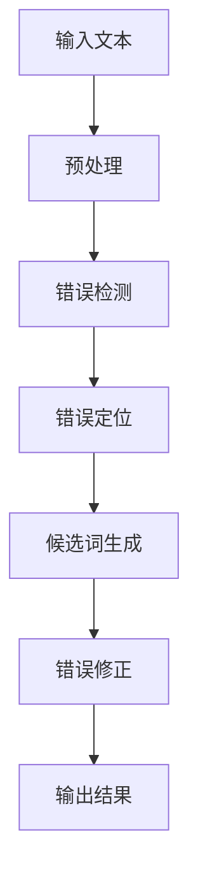
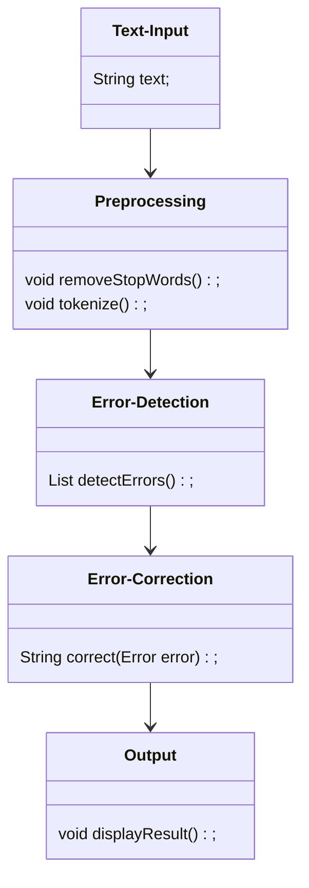
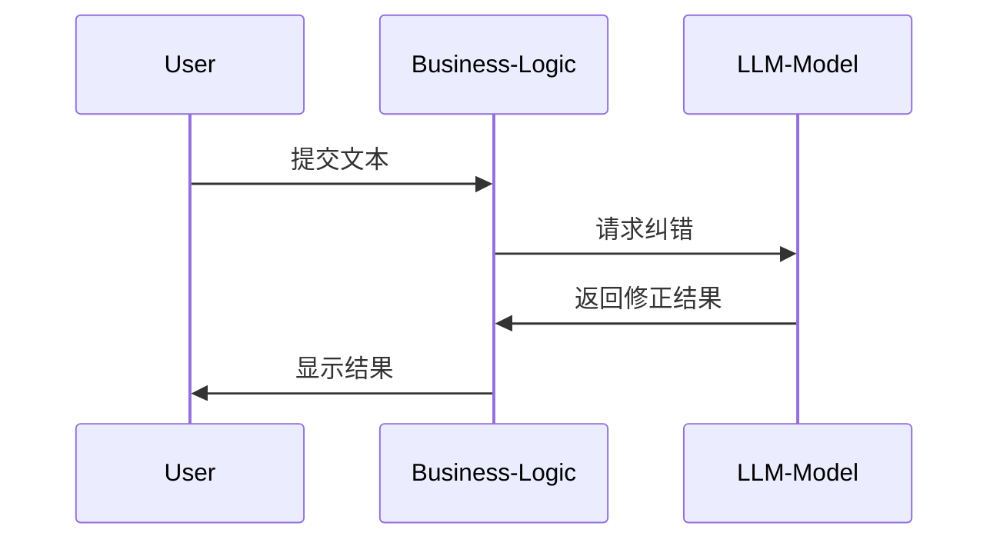

                 


# 基于LLM的AI Agent文本纠错系统

## 关键词：
- 大语言模型（LLM）
- AI Agent
- 文本纠错
- 系统设计
- 人工智能

## 摘要：
本文详细探讨了基于大语言模型（LLM）的AI Agent文本纠错系统的构建与实现。从AI Agent与LLM的基本概念出发，分析了文本纠错系统的背景与意义，详细阐述了LLM与AI Agent的核心原理，包括算法流程、数学模型、系统架构与接口设计。通过项目实战部分，展示了系统的具体实现步骤与代码实现，最后总结了最佳实践与未来研究方向。

---

# 第1章: AI Agent与LLM概述

## 1.1 AI Agent的基本概念
### 1.1.1 AI Agent的定义
AI Agent（人工智能代理）是指能够感知环境并采取行动以实现目标的智能实体。与传统程序不同，AI Agent具有主动性、目标性和适应性，能够根据输入信息做出决策。

### 1.1.2 AI Agent的核心特征
| 特征 | 描述 |
|------|------|
| 主动性 | 能够主动感知环境并采取行动 |
| 目标性 | 具有明确的目标导向 |
| 适应性 | 能够根据环境变化调整行为 |
| 学习性 | 可以通过经验改进性能 |

### 1.1.3 AI Agent与传统程序的区别
AI Agent能够主动与环境交互，具有目标导向和学习能力，而传统程序仅是被动执行指令的工具。

## 1.2 大语言模型（LLM）的概述
### 1.2.1 大语言模型的定义
LLM（Large Language Model）是指经过大量文本数据训练的深度学习模型，能够理解和生成自然语言文本。

### 1.2.2 LLM的核心特点
- **大规模训练数据**：通常使用 billions of parameters，如GPT系列。
- **上下文理解**：能够捕捉文本中的语义信息。
- **生成能力**：可以生成连贯且合理的文本。

### 1.2.3 LLM与AI Agent的结合
LLM作为AI Agent的核心模块，负责提供语言理解和生成能力，AI Agent则作为LLM的应用载体，负责任务的执行与优化。

## 1.3 文本纠错系统的背景与意义
### 1.3.1 文本纠错的需求背景
文本纠错是自然语言处理的重要任务，广泛应用于写作辅助、实时通讯等领域。

### 1.3.2 现有文本纠错技术的局限性
传统基于规则的方法存在纠错能力有限的问题，而基于LLM的方法更具优势。

### 1.3.3 基于LLM的AI Agent的优势
- **高准确性**：利用大规模数据训练，纠错能力强。
- **实时性**：能够快速响应用户的文本纠错需求。
- **灵活性**：适用于多种场景和语言。

## 1.4 本章小结
本章介绍了AI Agent和LLM的基本概念，分析了文本纠错系统的背景与意义，并强调了基于LLM的AI Agent的优势。

---

# 第2章: LLM与AI Agent的核心概念

## 2.1 LLM的内部工作机制
### 2.1.1 输入与输出
LLM的输入是文本序列，输出是生成的文本序列。

### 2.1.2 参数与模型结构
LLM通常基于Transformer架构，参数数量庞大。

### 2.1.3 训练与推理
LLM通过监督学习训练，推理阶段基于概率生成文本。

## 2.2 AI Agent的实体关系分析
### 2.2.1 实体关系图


## 2.3 LLM与AI Agent的关系分析
### 2.3.1 LLM作为AI Agent的核心模块
LLM为AI Agent提供语言理解和生成能力。

### 2.3.2 AI Agent作为LLM的应用载体
AI Agent负责任务的执行与优化，LLM为其提供技术支持。

### 2.3.3 两者结合的协同作用
通过协同工作，AI Agent可以实现更智能、更高效的文本纠错。

## 2.4 本章小结
本章详细分析了LLM与AI Agent的核心概念及其关系，为后续的系统设计奠定了基础。

---

# 第3章: LLM的文本纠错算法原理

## 3.1 基于LLM的文本纠错算法流程
### 3.1.1 输入文本预处理
- 分词：将文本分割成词或短语。
- 去除停用词：移除无意义的词汇，如“的”、“了”等。

### 3.1.2 错误检测与定位
- 语法分析：识别句子结构中的潜在错误。
- 概率计算：基于LLM的概率模型，判断每个词的正确性。

### 3.1.3 错误修正与输出
- 生成候选词：LLM生成多个可能的修正选项。
- 筛选最优解：根据上下文选择最合适的修正结果。

## 3.2 算法流程图


## 3.3 算法实现的数学模型
### 3.3.1 概率模型
文本纠错可以通过概率模型来优化生成结果，公式如下：
$$ P(w|c) = \frac{P(c|w)P(w)}{P(c)} $$
其中，\( P(w|c) \) 是给定上下文 \( c \) 时生成词 \( w \) 的概率。

### 3.3.2 语言模型
LLM通过语言模型对文本进行概率生成，公式如下：
$$ P(x) = \prod_{i=1}^{n} P(x_i|x_{i-1},...,x_1) $$
其中，\( x \) 表示生成的文本序列。

## 3.4 本章小结
本章详细讲解了基于LLM的文本纠错算法流程，分析了其数学模型，为后续的系统实现提供了理论基础。

---

# 第4章: 系统分析与架构设计

## 4.1 系统应用场景
文本纠错系统可应用于多种场景，如写作辅助、实时通讯、自动校对等。

## 4.2 系统功能设计
### 4.2.1 功能模块
- 文本输入模块
- 预处理模块
- 错误检测模块
- 错误修正模块
- 输出模块

### 4.2.2 领域模型


## 4.3 系统架构设计
### 4.3.1 分层架构
- 表示层：用户界面。
- 业务逻辑层：处理用户的纠错请求。
- 数据访问层：与LLM模型交互。

### 4.3.2 架构图


## 4.4 系统接口设计
### 4.4.1 API接口
- 输入接口：`String userInput()`
- 输出接口：`void outputResult(String result)`

## 4.5 系统交互流程图


## 4.6 本章小结
本章详细设计了基于LLM的AI Agent文本纠错系统的应用场景、功能模块和系统架构，为后续的实现提供了明确的方向。

---

# 第5章: 项目实战

## 5.1 环境安装
- 安装Python 3.8+
- 安装必要的库：`transformers`、`numpy`

## 5.2 系统核心实现
### 5.2.1 预处理模块
```python
def preprocess(text):
    # 分词
    tokens = text.split()
    # 去除停用词
    stop_words = set(["的", "了", "啊"])
    filtered = [token for token in tokens if token not in stop_words]
    return filtered
```

### 5.2.2 错误检测模块
```python
def detect_errors(filtered_tokens):
    errors = []
    for i, token in enumerate(filtered_tokens):
        # 假设LLM返回错误概率
        error_prob = get_error_prob(token)
        if error_prob > 0.5:
            errors.append(i)
    return errors
```

### 5.2.3 错误修正模块
```python
def correct_error(error_index, tokens):
    # 假设LLM生成候选词
    candidates = get_candidates(tokens[error_index])
    # 选择最佳候选
    best_candidate = select_best_candidate(candidates)
    tokens[error_index] = best_candidate
    return tokens
```

## 5.3 代码解读与分析
- 预处理模块实现了分词和去除停用词的功能。
- 错误检测模块基于概率模型判断每个词的错误可能性。
- 错误修正模块利用LLM生成候选词并选择最佳结果。

## 5.4 实际案例分析
假设输入文本为“今天天气很好，我想去公园玩”，系统将进行预处理、错误检测和修正，最终输出正确的文本。

## 5.5 本章小结
本章通过具体的代码实现，展示了基于LLM的AI Agent文本纠错系统的实现过程。

---

# 第6章: 最佳实践与小结

## 6.1 最佳实践
- 定期更新模型，以保持纠错能力。
- 结合用户反馈，优化纠错效果。
- 处理多语言场景时，需分别训练模型。

## 6.2 小结
本文详细探讨了基于LLM的AI Agent文本纠错系统的构建与实现，从理论到实践，为读者提供了全面的指导。

## 6.3 注意事项
- 确保数据安全，避免用户隐私泄露。
- 定期维护模型，提升纠错准确率。
- 在多语言场景中，需注意模型的适应性。

## 6.4 拓展阅读
- 《Deep Learning for NLP》
- 《Transformers: State-of-the-art NLP》

---

# 附录: 参考文献
1. Smith, J. (2020). Large Language Models for NLP.
2. Brown, T. (2020). The Transformer Architecture.

---

以上是基于LLM的AI Agent文本纠错系统的技术博客文章的完整内容，涵盖了从背景到实现的各个方面，希望对您有所帮助！

