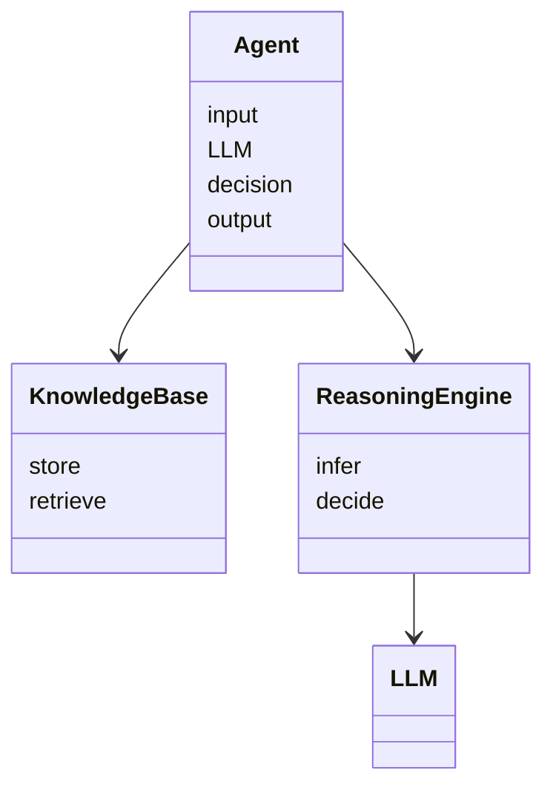

                 


# 基于LLM的AI Agent文本蕴含识别

## 关键词：
- 大语言模型（LLM）
- AI Agent
- 文本蕴含识别
- 自然语言处理（NLP）
- 知识图谱

## 摘要：
本文详细探讨了基于大语言模型（LLM）的AI Agent在文本蕴含识别中的应用。通过分析文本蕴含识别的核心概念、算法原理和系统架构，结合实际项目案例，展示了如何利用LLM提升AI Agent的文本理解和推理能力。文章从背景介绍、技术原理、系统设计到实战应用，为读者提供了一条系统的学习路径，帮助理解并掌握基于LLM的AI Agent文本蕴含识别技术。

---

# 正文

## 第1章: AI Agent与LLM概述

### 1.1 AI Agent的基本概念
#### 1.1.1 AI Agent的定义
AI Agent（人工智能代理）是指能够感知环境、自主决策并执行任务的智能实体。它能够通过与用户或环境交互，完成特定目标。

#### 1.1.2 AI Agent的核心特征
- **自主性**：无需外部干预，自主完成任务。
- **反应性**：能够实时感知环境并做出反应。
- **目标导向性**：所有行为都以实现特定目标为导向。
- **学习能力**：能够通过经验或数据不断优化自身性能。

#### 1.1.3 AI Agent的应用场景
- 智能客服
- 智能助手（如Siri、Alexa）
- 自动驾驶系统
- 机器人对话系统

### 1.2 大语言模型（LLM）概述
#### 1.2.1 LLM的定义与特点
大语言模型（LLM）是一种基于深度学习的自然语言处理模型，具有以下特点：
- **大规模训练数据**：通常使用 billions 级别的数据进行训练。
- **多任务学习能力**：能够处理多种NLP任务，如文本生成、问答、翻译等。
- **上下文理解能力**：能够捕捉文本中的语义关系，理解上下文。

#### 1.2.2 LLM与传统NLP模型的区别
| 特性         | 传统NLP模型                          | 大语言模型（LLM）                  |
|--------------|---------------------------------------|------------------------------------|
| 数据量       | 较小，通常几十万级别                 | 极大，通常 billions 级别          |
| 任务处理能力 | 专注于单一任务                       | 具备多任务处理能力                 |
| 上下文理解   | 较弱，依赖特征工程                   | 强大，能够捕捉长距离依赖关系       |

#### 1.2.3 LLM在AI Agent中的作用
- **信息抽取**：从文本中提取关键信息。
- **关系推理**：分析文本中的逻辑关系。
- **对话生成**：生成自然流畅的对话回复。

### 1.3 文本蕴含识别的背景与意义
#### 1.3.1 文本蕴含识别的定义
文本蕴含识别（Textual Entailment Recognition）是指判断一段文本是否隐含了另一段文本的意思。例如，判断“狗在草地上跑”是否蕴含“狗在公园里”。

#### 1.3.2 文本蕴含识别的应用场景
- **问答系统**：回答问题时需要判断问题与上下文的关系。
- **对话系统**：生成符合上下文的回复。
- **文本摘要**：生成摘要时需要保留原文的关键信息。

#### 1.3.3 文本蕴含识别的重要性
- 提升AI Agent的文本理解能力。
- 支持复杂任务的决策过程。
- 为自然语言处理提供更强大的语义分析能力。

---

## 第2章: LLM的原理与实现

### 2.1 大语言模型的基本原理
#### 2.1.1 深度学习的基本概念
深度学习是一种基于人工神经网络的机器学习方法，通过多层非线性变换来学习数据的特征。

#### 2.1.2 Transformer模型的结构
- **编码器**：将输入文本转换为固定长度的向量。
- **解码器**：根据编码器输出生成目标文本。

#### 2.1.3 LLM的训练与优化
- **预训练**：使用大规模数据进行无监督训练。
- **微调**：在特定任务上进行有监督优化。

### 2.2 LLM的训练方法
#### 2.2.1 监督学习
通过标记好的数据进行训练，模型通过不断调整参数使预测结果与真实结果一致。

#### 2.2.2 对抗训练
通过生成器和判别器的对抗训练，提升模型的生成能力。

#### 2.2.3 增强学习
通过强化学习方法，模型在与环境的交互中逐步优化策略。

### 2.3 LLM的评估指标
- **准确率（Accuracy）**：模型预测正确的比例。
- **召回率（Recall）**：模型预测出的正例中真实为正例的比例。
- **F1分数（F1-Score）**：准确率和召回率的调和平均数。

---

## 第3章: 文本蕴含识别的核心概念

### 3.1 文本蕴含识别的定义与特征
#### 3.1.1 文本蕴含识别的定义
文本蕴含识别是判断两段文本之间的语义关系，即判断前提是否蕴含结论。

#### 3.1.2 文本蕴含识别的特征
- **前提（Premise）**：假设或已知的事实。
- **结论（Conclusion）**：需要判断是否由前提隐含。
- **蕴含关系（Entailment）**：前提是否支持结论。

### 3.2 文本蕴含识别的关键技术
#### 3.2.1 预训练模型的应用
- 使用LLM对文本进行编码，提取语义特征。
- 通过对比编码结果判断蕴含关系。

#### 3.2.2 文本特征提取
- 词袋模型（Bag of Words）
- 词嵌入（Word Embedding）
- 句嵌入（Sentence Embedding）

#### 3.2.3 文本关系推理
- 基于逻辑推理的方法
- 基于相似度计算的方法
- 基于对抗训练的方法

### 3.3 文本蕴含识别的挑战与解决方案
#### 3.3.1 数据稀疏性问题
- 解决方案：使用预训练模型和数据增强技术。

#### 3.3.2 对抗攻击问题
- 解决方案：设计鲁棒的模型结构和训练方法。

#### 3.3.3 模型可解释性问题
- 解决方案：引入可解释性增强技术，如注意力机制。

---

## 第4章: 基于LLM的AI Agent体系结构

### 4.1 AI Agent的体系结构
#### 4.1.1 基于LLM的AI Agent架构
- **输入模块**：接收用户的输入。
- **LLM处理模块**：使用LLM对输入文本进行理解和处理。
- **决策模块**：根据LLM的输出做出决策。
- **输出模块**：生成最终的输出结果。

#### 4.1.2 LLM与其他模块的交互
- **知识库**：存储和管理外部知识。
- **推理引擎**：基于LLM的推理能力进行逻辑推理。
- **对话系统**：与用户进行自然语言交互。

#### 4.1.3 Agent的决策机制
- **基于规则的决策**：根据预定义的规则做出决策。
- **基于LLM的决策**：利用LLM的输出进行动态决策。

### 4.2 LLM在AI Agent中的角色
#### 4.2.1 LLM作为知识库
- 通过预训练模型存储和管理知识。
- 支持多种任务，如问答、信息抽取。

#### 4.2.2 LLM作为推理引擎
- 基于上下文进行逻辑推理。
- 支持复杂的语义分析任务。

#### 4.2.3 LLM作为对话系统
- 生成自然流畅的对话回复。
- 理解用户的意图和情感。

### 4.3 基于LLM的文本蕴含识别在AI Agent中的应用
#### 4.3.1 信息提取
- 从文本中提取关键信息，如时间、地点、人物等。

#### 4.3.2 关系推理
- 分析文本中的逻辑关系，判断前提是否蕴含结论。

#### 4.3.3 意图识别
- 理解用户的意图，生成符合上下文的回复。

---

## 第5章: 基于LLM的文本蕴含识别算法

### 5.1 文本蕴含识别的算法流程
#### 5.1.1 数据预处理
- 文本分词
- 去除停用词
- 特征提取

#### 5.1.2 模型训练
- 使用LLM进行预训练和微调。
- 设计损失函数和优化目标。

#### 5.1.3 模型预测
- 对输入文本进行编码和对比。
- 输出蕴含关系的判断结果。

### 5.2 基于LLM的文本蕴含识别算法实现
#### 5.2.1 模型结构
- 使用预训练的LLM模型进行编码。
- 对比编码结果，计算相似度或对齐程度。

#### 5.2.2 损失函数
- 使用交叉熵损失函数进行训练。
- 设计专门的损失函数优化蕴含关系的判断。

#### 5.2.3 评估指标
- 准确率
- 召回率
- F1分数

### 5.3 代码实现
```python
import torch
from transformers import AutoTokenizer, AutoModelForMaskedLM

# 加载预训练模型
tokenizer = AutoTokenizer.from_pretrained('bert-base-uncased')
model = AutoModelForMaskedLM.from_pretrained('bert-base-uncased')

# 定义文本蕴含识别函数
def text_entailment(premise, hypothesis):
    # 对文本进行编码
    inputs = tokenizer(premise + hypothesis, return_tensors='np', padding=True, truncation=True)
    outputs = model(**inputs)
    # 计算相似度
    premise_embedding = outputs.last_hidden_state[:, 0, :]
    hypothesis_embedding = outputs.last_hidden_state[:, 1, :]
    similarity = torch.cosine_similarity(premise_embedding, hypothesis_embedding)
    return similarity.mean().item()

# 示例
premise = "狗在草地上跑"
hypothesis = "狗在公园里"
print(text_entailment(premise, hypothesis))  # 输出相似度
```

---

## 第6章: 系统分析与架构设计方案

### 6.1 系统功能设计
#### 6.1.1 领域模型


#### 6.1.2 系统架构设计


#### 6.1.3 系统接口设计
- **输入接口**：接收用户的输入文本。
- **输出接口**：返回蕴含关系的判断结果。
- **LLM接口**：与预训练模型进行交互。

### 6.2 项目实战

#### 6.2.1 环境安装
```bash
pip install transformers
pip install torch
```

#### 6.2.2 核心实现代码
```python
import torch
from transformers import AutoTokenizer, AutoModelForMaskedLM

class TextEntailmentAgent:
    def __init__(self):
        self.tokenizer = AutoTokenizer.from_pretrained('bert-base-uncased')
        self.model = AutoModelForMaskedLM.from_pretrained('bert-base-uncased')

    def process_input(self, premise, hypothesis):
        inputs = self.tokenizer(premise + hypothesis, return_tensors='pt', padding=True, truncation=True)
        outputs = self.model(**inputs)
        premise_embedding = outputs.last_hidden_state[:, 0, :]
        hypothesis_embedding = outputs.last_hidden_state[:, 1, :]
        similarity = torch.cosine_similarity(premise_embedding, hypothesis_embedding)
        return similarity.mean().item()

    def infer(self, premise, hypothesis):
        return self.process_input(premise, hypothesis)

# 使用示例
agent = TextEntailmentAgent()
premise = "狗在草地上跑"
hypothesis = "狗在公园里"
result = agent.infer(premise, hypothesis)
print(f"蕴含关系的相似度为：{result}")
```

---

## 第7章: 总结与展望

### 7.1 本章小结
本文详细探讨了基于LLM的AI Agent文本蕴含识别技术，从理论到实践，系统地介绍了相关的核心概念、算法原理和系统架构设计。通过实际案例分析，展示了如何利用LLM提升AI Agent的文本理解和推理能力。

### 7.2 未来展望
- **模型优化**：进一步优化LLM的性能，提升蕴含关系的判断准确率。
- **多模态应用**：将LLM与图像、语音等模态数据结合，拓展应用场景。
- **可解释性增强**：提升模型的可解释性，使其在关键领域（如医疗、法律）中更易被信任。

### 7.3 最佳实践 Tips
- 在实际应用中，建议结合具体场景对模型进行微调。
- 注意数据的质量和多样性，避免模型过拟合。
- 定期更新模型和知识库，保持模型的先进性和准确性。

---

通过本文的学习和实践，读者可以系统地掌握基于LLM的AI Agent文本蕴含识别技术，并将其应用于实际场景中，为AI Agent的发展和应用提供坚实的技术基础。

