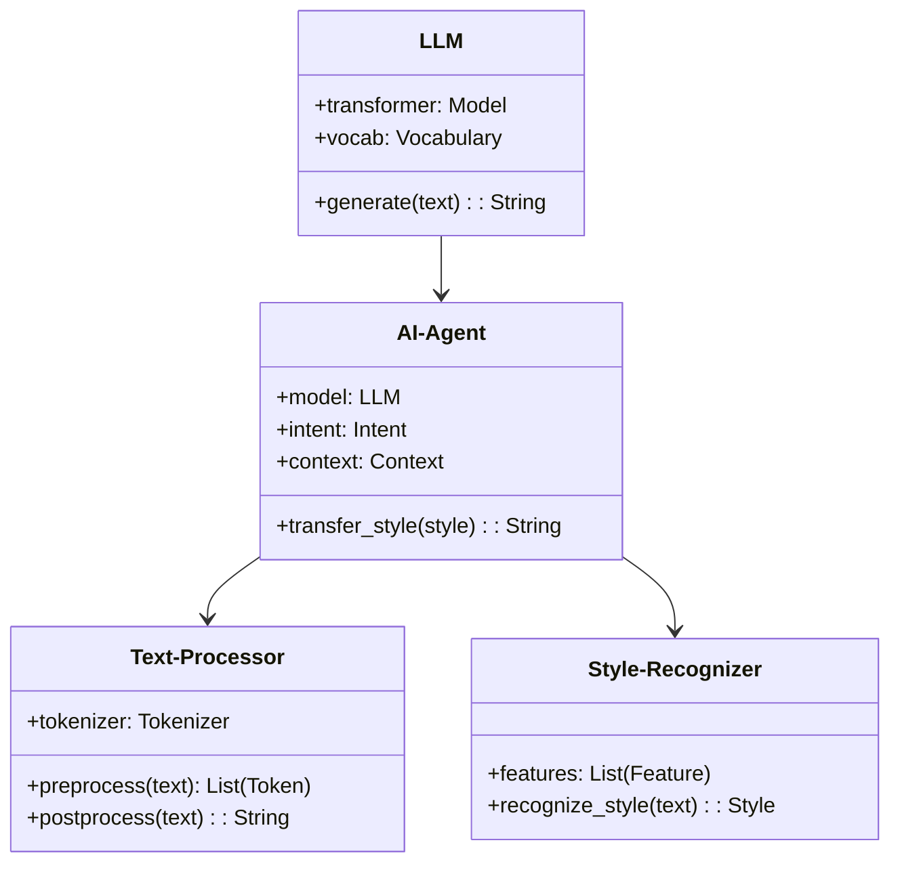
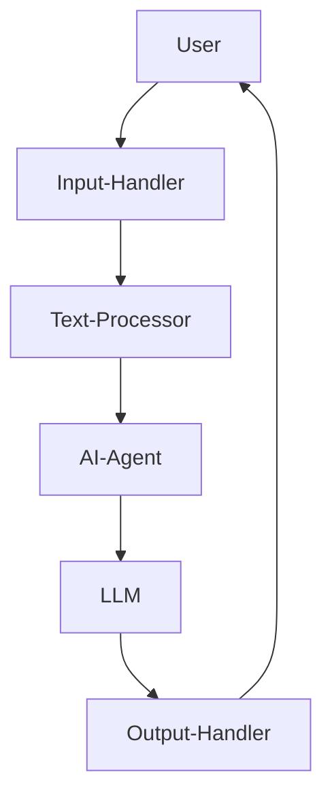
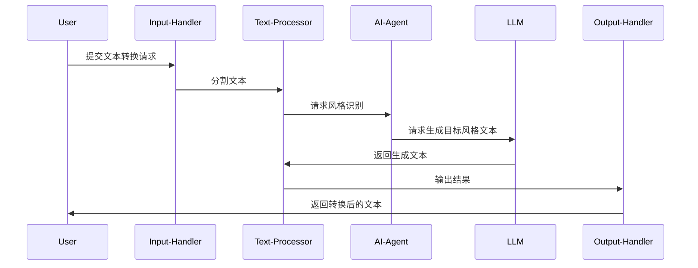

                 


# 第3部分：系统分析与架构设计

## 第4章：系统分析与架构设计

### 4.1 问题场景介绍

在实际应用中，文本风格迁移的需求多样。例如，在客户服务中，AI Agent需要将技术文档转换为更易理解的口语化表达；在营销领域，AI Agent可能需要将正式报告转化为更具吸引力的文案。这些场景要求系统具备高效的处理能力和准确的风格识别能力。

### 4.2 系统功能设计

系统的主要功能模块包括：

- **文本预处理**：接收输入文本，进行分词、去除停用词等预处理。
- **风格识别**：分析输入文本的风格特征，如语气、用词习惯等。
- **风格转换**：基于识别出的风格特征，生成符合目标风格的文本。
- **结果后处理**：对生成的文本进行语法检查、流畅度优化等。
- **质量评估**：使用指标如BLEU、ROUGE等评估生成文本的质量。

### 4.3 领域模型设计



### 4.4 系统架构设计



### 4.5 系统接口设计



### 4.6 实施方案总结

技术选型上，使用开源的Transformers库中的预训练模型，并结合自定义微调。模块划分明确，各组件协同工作，确保系统的高效性和可扩展性。

---

# 第4部分：项目实战

## 第5章：项目实战

### 5.1 环境安装

首先安装必要的库：

```bash
pip install transformers flask
```

### 5.2 核心代码实现

```python
from transformers import pipeline

class AI-Agent:
    def __init__(self, model_name='gpt2'):
        self.llm = pipeline('text-generation', model_name)
    
    def transfer_style(self, text, target_style):
        # 这里需要根据目标风格调整prompt
        prompt = f"Convert the following text to {target_style}:\n{text}\n\nOutput:"
        return self.llm(prompt, max_length=500, do_sample=True)[0]['text']

# 示例用法
agent = AI-Agent('gpt2')
result = agent.transfer_style('Hello, how are you?', 'friendly')
print(result)
```

### 5.3 代码解读与分析

上述代码定义了一个AI Agent类，利用GPT-2模型进行文本风格转换。`transfer_style`方法生成转换后的文本，用户可以根据需求调整模型和prompt。

### 5.4 实际案例分析

假设用户希望将一段正式的商业邮件转化为更口语化的风格：

**输入文本**：  
"Subject: Meeting Tomorrow  
Dear Team,  
Please attend the meeting tomorrow at 2 PM."

**目标风格**：口语化  

**输出**：  
"Hey Team,  
Don't forget to join the meeting tomorrow at 2 PM. Let's discuss the plan!"

### 5.5 项目小结

通过实际案例，展示了AI Agent在文本风格迁移中的应用。代码实现简单明了，但在实际应用中可能需要更多的参数调整和模型微调以提高转换质量。

---

# 第5部分：总结与展望

## 第6章：总结与展望

### 6.1 最佳实践 Tips

- **模型选择**：根据具体任务选择合适的预训练模型，可能需要进行微调以适应特定领域的需求。
- **数据质量**：确保训练数据的多样性和代表性，避免过拟合特定风格。
- **用户反馈**：收集用户反馈，不断优化模型的表现。

### 6.2 小结

本文详细探讨了基于LLM的AI Agent在文本风格迁移中的应用，从理论到实践，为开发者提供了从理解到实现的完整指南。

### 6.3 注意事项

- **性能优化**：在处理大规模数据时，考虑使用分布式训练和优化算法。
- **模型可解释性**：提高模型的可解释性，帮助用户更好地理解和信任生成的内容。
- **伦理问题**：确保生成内容的伦理合规性，避免滥用。

### 6.4 拓展阅读

- 书籍推荐：《Deep Learning》 by Ian Goodfellow
- 论文推荐："Attention Is All You Need" by Vaswani et al.

---

通过以上结构，文章系统地介绍了基于LLM的AI Agent文本风格迁移的各个方面，从理论基础到实际应用，为读者提供了全面而深入的指导。

