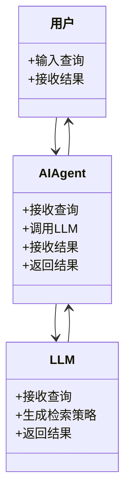
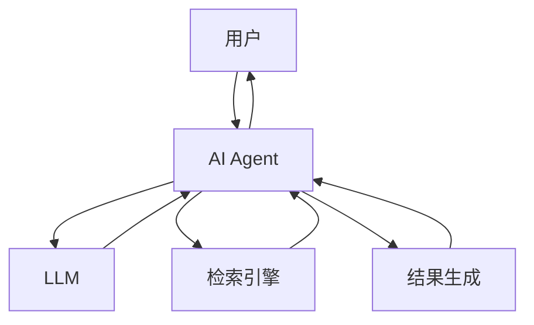
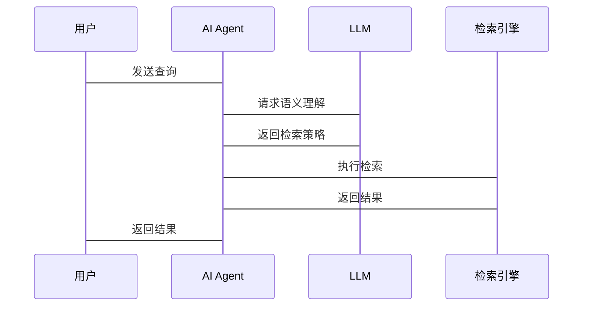

                 


# 基于LLM的AI Agent跨语言信息检索

## 关键词：
- 大语言模型（LLM）
- AI Agent
- 跨语言信息检索
- 自然语言处理
- 信息检索系统

## 摘要：
随着大语言模型（LLM）的快速发展，AI Agent在跨语言信息检索中的应用日益广泛。本文从跨语言信息检索的基本概念出发，详细探讨了AI Agent与LLM的结合原理、跨语言检索的算法实现、数学模型构建以及系统架构设计。通过实际项目案例分析，展示了如何利用AI Agent实现高效、准确的跨语言信息检索，并总结了最佳实践和未来发展方向。

---

# 第1章: 跨语言信息检索的背景与挑战

## 1.1 跨语言信息检索的定义与背景
### 1.1.1 信息检索的基本概念
信息检索是通过计算机技术从大量数据中快速找到所需信息的过程。常见的信息检索系统包括搜索引擎（如Google）和数据库查询系统。

### 1.1.2 跨语言信息检索的定义
跨语言信息检索（Cross-Language Information Retrieval, CLIR）是指在多种语言之间进行信息检索，即从一种语言的文档中检索另一种语言的相关信息。例如，用户用中文搜索英文网页内容。

### 1.1.3 跨语言信息检索的应用场景
- **多语言网站搜索**：支持用户用一种语言查询其他语言的网页。
- **全球化企业信息管理**：跨国公司在多语言环境下管理文档。
- **智能客服系统**：支持多语言对话的客服系统。

### 1.1.4 跨语言信息检索的核心问题
- **语言差异**：不同语言的词汇、语法差异导致信息检索的准确性下降。
- **语义理解**：跨语言检索需要理解不同语言之间的语义对齐。
- **性能优化**：跨语言检索需要高效的算法和模型。

## 1.2 AI Agent的基本概念
### 1.2.1 AI Agent的定义
AI Agent（人工智能代理）是一种能够感知环境、自主决策并执行任务的智能实体。例如，智能助手Siri、Alexa等。

### 1.2.2 AI Agent的核心功能
- **感知环境**：通过传感器或API获取外部信息。
- **决策与推理**：基于获取的信息进行分析和决策。
- **执行任务**：根据决策结果执行具体操作。

### 1.2.3 AI Agent与传统检索算法的区别
传统检索算法（如TF-IDF）基于统计方法，依赖关键词匹配。而AI Agent结合了机器学习和自然语言处理技术，能够理解语义并进行推理。

## 1.3 大语言模型（LLM）的基本概念
### 1.3.1 LLM的定义
LLM（Large Language Model）是基于深度学习的自然语言处理模型，具有大规模参数和强大的语义理解能力。

### 1.3.2 LLM的核心特点
- **大规模训练数据**：通常基于互联网文本进行训练。
- **上下文理解**：能够理解长文本的上下文关系。
- **多任务能力**：可以完成多种自然语言处理任务，如翻译、问答、文本生成。

### 1.3.3 LLM与AI Agent的结合
LLM作为AI Agent的核心模块，负责语义理解、信息检索和生成响应。

## 1.4 跨语言信息检索的核心问题
### 1.4.1 跨语言检索的主要挑战
- **文化差异**：不同语言背后的文化背景可能影响语义理解。
- **术语差异**：不同语言中术语可能有不同的含义。
- **性能瓶颈**：跨语言检索需要处理多语言数据，对计算资源要求高。

### 1.4.2 跨语言检索的关键技术
- **机器翻译**：将一种语言的内容转换为另一种语言以便检索。
- **跨语言语义对齐**：通过语言模型理解不同语言之间的语义关系。
- **多语言索引**：建立多语言的索引结构以支持快速检索。

### 1.4.3 跨语言信息检索的未来发展方向
- **多模态检索**：结合图像、音频等多种模态信息。
- **实时性优化**：提升跨语言检索的实时响应速度。
- **自适应学习**：模型能够自适应不同语言的语义差异。

## 1.5 本章小结
本章介绍了跨语言信息检索的基本概念、AI Agent的核心功能以及大语言模型的特点。强调了跨语言信息检索在实际应用中的重要性，并指出了其面临的主要挑战和未来发展方向。

---

# 第2章: LLM与AI Agent的核心概念与联系

## 2.1 LLM的基本原理
### 2.1.1 LLM的训练过程
LLM通过监督学习和无监督学习相结合的方式进行训练，通常使用Transformer架构。

### 2.1.2 LLM的模型结构
- **编码器**：将输入文本转换为向量表示。
- **解码器**：根据编码器的输出生成目标语言的文本。

### 2.1.3 LLM的推理机制
基于生成式模型，LLM通过概率分布生成最可能的输出。

## 2.2 AI Agent的基本原理
### 2.2.1 AI Agent的感知与决策
- **感知**：通过API获取多语言数据。
- **决策**：基于LLM的语义理解做出检索策略。

### 2.2.2 AI Agent的执行与反馈
- **执行**：根据决策结果调用检索引擎。
- **反馈**：根据用户反馈优化检索策略。

### 2.2.3 AI Agent的自适应能力
通过强化学习和在线学习，AI Agent能够自适应不同语言的检索需求。

## 2.3 跨语言信息检索的核心原理
### 2.3.1 跨语言检索的多语言理解
- **语言识别**：识别输入语言并选择合适的LLM进行处理。
- **语义对齐**：理解不同语言之间的语义关系。

### 2.3.2 跨语言检索的语义对齐
- **跨语言词嵌入**：将不同语言的词汇映射到同一语义空间。
- **多语言模型训练**：训练模型理解多种语言的语义。

### 2.3.3 跨语言检索的结果优化
- **结果排序**：基于相关性对检索结果进行排序。
- **结果生成**：生成符合目标语言的检索结果。

## 2.4 LLM与AI Agent的结合原理
### 2.4.1 LLM作为AI Agent的核心模块
- **语义理解**：LLM负责理解用户查询的语义。
- **多语言处理**：LLM支持多种语言的检索和生成。

### 2.4.2 AI Agent对LLM的扩展与增强
- **上下文记忆**：AI Agent帮助LLM记住对话上下文。
- **任务分解**：AI Agent将复杂任务分解为多个简单任务。

### 2.4.3 跨语言信息检索的协同工作流程
1. 用户输入多语言查询。
2. AI Agent调用LLM进行语义理解。
3. LLM生成检索策略。
4. AI Agent执行检索任务并返回结果。

## 2.5 本章小结
本章详细讲解了LLM和AI Agent的基本原理，并分析了它们在跨语言信息检索中的结合方式。强调了LLM作为AI Agent核心模块的重要性，以及AI Agent对LLM的扩展与增强作用。

---

# 第3章: 跨语言信息检索的算法原理

## 3.1 跨语言信息检索的主要算法
### 3.1.1 基于统计的跨语言检索算法
- **统计翻译模型**：基于概率统计的翻译方法。
- **基于互信息的检索**：利用互信息度量跨语言相关性。

### 3.1.2 基于机器学习的跨语言检索算法
- **支持向量机（SVM）**：用于分类和排序。
- **神经网络模型**：如卷积神经网络（CNN）和循环神经网络（RNN）。

### 3.1.3 基于深度学习的跨语言检索算法
- **多语言BERT**：预训练的多语言模型。
- **对比学习**：通过对比不同语言的表示来优化检索效果。

## 3.2 基于LLM的跨语言检索算法
### 3.2.1 基于LLM的跨语言检索流程
1. **输入处理**：接收多语言查询。
2. **语义理解**：LLM理解查询的语义。
3. **检索策略**：生成检索关键词。
4. **结果生成**：生成目标语言的检索结果。

### 3.2.2 基于LLM的跨语言检索模型
- **编码-解码架构**：编码输入语言，解码输出语言。
- **跨语言注意力机制**：通过注意力机制对齐不同语言的语义。

### 3.2.3 基于LLM的跨语言检索优化
- **多语言预训练**：通过预训练提升跨语言理解能力。
- **微调优化**：针对特定任务进行微调。

## 3.3 AI Agent在跨语言检索中的算法实现
### 3.3.1 AI Agent的跨语言检索任务分解
- **任务识别**：识别用户的检索任务。
- **语义分析**：分析查询的语义。
- **结果生成**：生成符合目标语言的检索结果。

### 3.3.2 AI Agent的跨语言检索算法实现
- **多任务学习**：同时学习多种语言的检索任务。
- **动态调整**：根据检索结果动态调整检索策略。

### 3.3.3 AI Agent的跨语言检索性能优化
- **并行计算**：通过并行计算提升检索速度。
- **缓存机制**：缓存常用查询结果，减少重复计算。

## 3.4 本章小结
本章详细讲解了跨语言信息检索的主要算法，以及基于LLM和AI Agent的实现原理。通过算法实现和优化策略，提升了跨语言信息检索的准确性和效率。

---

# 第4章: 跨语言信息检索的数学模型与公式

## 4.1 跨语言信息检索的基本数学模型
### 4.1.1 统计模型
- **概率模型**：$P(y|x)$ 表示查询$x$下结果$y$的概率。
- **向量空间模型**：将文本表示为向量，计算余弦相似度。

### 4.1.2 机器学习模型
- **线性回归模型**：$y = \beta x + \epsilon$。
- **逻辑回归模型**：$P(y=1|x) = \frac{1}{1 + e^{-\beta x}}$。

## 4.2 基于LLM的跨语言检索模型
### 4.2.1 LLM的损失函数
$$\mathcal{L}(\theta) = -\sum_{i=1}^{N} \log P(y_i|x_i; \theta)$$
其中，$\theta$是模型参数，$x_i$是输入，$y_i$是目标输出。

### 4.2.2 跨语言检索的相似度计算
$$\text{sim}(x, y) = \frac{x \cdot y}{\|x\| \|y\|}$$
其中，$x$和$y$分别是两种语言的文本向量表示。

### 4.2.3 多语言模型的预训练目标
$$\min_{\theta} \mathcal{L}(\theta) + \lambda \Omega(\theta)$$
其中，$\Omega(\theta)$是正则化项，$\lambda$是正则化系数。

## 4.3 AI Agent的跨语言检索算法数学模型
### 4.3.1 AI Agent的决策模型
$$P(a|s) = \text{policy}(s)$$
其中，$s$是状态，$a$是动作。

### 4.3.2 基于强化学习的优化目标
$$J(\theta) = \mathbb{E}_{s,a,r}[r \log P(a|s;\theta)]$$
其中，$r$是奖励函数。

### 4.3.3 跨语言检索的联合优化
$$\min_{\theta} \mathcal{L}(\theta) + \alpha J(\theta)$$
其中，$\alpha$是平衡系数。

## 4.4 本章小结
本章通过数学公式详细讲解了跨语言信息检索的基本模型和算法。从统计模型到深度学习模型，再到强化学习模型，为读者提供了全面的数学推导和公式解释。

---

# 第5章: 跨语言信息检索的系统分析与架构设计

## 5.1 跨语言信息检索的系统分析
### 5.1.1 问题场景介绍
- **多语言客服系统**：用户用中文查询英文文档。
- **多语言搜索引擎**：支持多种语言的网页搜索。

### 5.1.2 系统功能需求
- **多语言支持**：支持多种语言的输入和输出。
- **语义理解**：准确理解不同语言的语义。
- **高效检索**：快速返回检索结果。

## 5.2 跨语言信息检索的系统功能设计
### 5.2.1 领域模型设计


### 5.2.2 系统架构设计


### 5.2.3 系统接口设计
- **输入接口**：接收多语言查询。
- **输出接口**：返回目标语言的检索结果。

### 5.2.4 系统交互设计


## 5.3 跨语言信息检索的实现细节
### 5.3.1 模型选择与优化
- **模型选择**：选择适合任务的LLM模型。
- **参数优化**：通过微调优化模型参数。

### 5.3.2 系统性能优化
- **并行计算**：利用多线程和分布式计算提升性能。
- **缓存机制**：缓存常用查询结果，减少重复计算。

## 5.4 本章小结
本章通过系统分析和架构设计，详细展示了跨语言信息检索系统的实现细节。从功能需求到系统架构，为读者提供了清晰的设计思路和实现方案。

---

# 第6章: 跨语言信息检索的项目实战

## 6.1 环境安装与配置
### 6.1.1 开发环境
- **Python 3.8+**
- **TensorFlow/PyTorch**
- **Hugging Face库**

### 6.1.2 安装依赖
```bash
pip install transformers torch
```

## 6.2 核心实现
### 6.2.1 多语言语义理解
```python
from transformers import AutoTokenizer, AutoModelForMaskedLM

tokenizer = AutoTokenizer.from_pretrained("bert-base-multilingual")
model = AutoModelForMaskedLM.from_pretrained("bert-base-multilingual")
```

### 6.2.2 跨语言检索实现
```python
def cross_language_retrieval(query, target_language):
    # 翻译查询
    translated_query = translate(query, target_language)
    # 生成检索关键词
    keywords = generate_keywords(translated_query)
    # 执行检索
    results = search_engine.search(keywords)
    return results
```

### 6.2.3 结果生成
```python
def generate_response(results):
    response = ""
    for result in results:
        response += result.content + "\n"
    return response
```

## 6.3 项目实战与分析
### 6.3.1 实际案例分析
- **案例1**：用户用中文查询英文科技新闻。
- **案例2**：用户用西班牙语查询英文文献。

### 6.3.2 代码实现解读
- **翻译模块**：使用机器翻译API将查询翻译为目标语言。
- **检索模块**：根据翻译后的查询生成检索关键词。
- **结果生成模块**：将检索结果生成目标语言的响应。

## 6.4 项目小结
本章通过实际项目案例，详细讲解了跨语言信息检索的实现过程。从环境配置到核心代码实现，为读者提供了完整的实战指导。

---

# 第7章: 跨语言信息检索的最佳实践与小结

## 7.1 最佳实践
### 7.1.1 模型选择
- 根据任务需求选择合适的LLM模型。
- 考虑模型的计算资源需求。

### 7.1.2 数据处理
- 确保数据的多样性和平衡性。
- 处理多语言数据时注意文化差异。

### 7.1.3 性能优化
- 利用并行计算提升检索速度。
- 采用缓存机制减少重复计算。

## 7.2 注意事项
- **模型调优**：根据具体任务进行模型微调。
- **结果验证**：通过人工验证确保检索结果的准确性。
- **用户反馈**：根据用户反馈优化检索策略。

## 7.3 未来发展方向
- **多模态检索**：结合图像、音频等多种模态信息。
- **实时性优化**：提升跨语言检索的实时响应速度。
- **自适应学习**：模型能够自适应不同语言的语义差异。

## 7.4 全文小结
本文从跨语言信息检索的基本概念出发，详细探讨了AI Agent与LLM的结合原理、跨语言检索的算法实现、数学模型构建以及系统架构设计。通过实际项目案例分析，展示了如何利用AI Agent实现高效、准确的跨语言信息检索，并总结了最佳实践和未来发展方向。

---

# 结语

随着人工智能技术的不断发展，跨语言信息检索的应用场景将更加广泛。通过本文的深入探讨，读者可以全面了解基于LLM的AI Agent跨语言信息检索的核心原理和实现方法。未来，随着技术的进一步发展，跨语言信息检索将变得更加智能和高效，为多语言环境下的信息管理提供强有力的支持。

