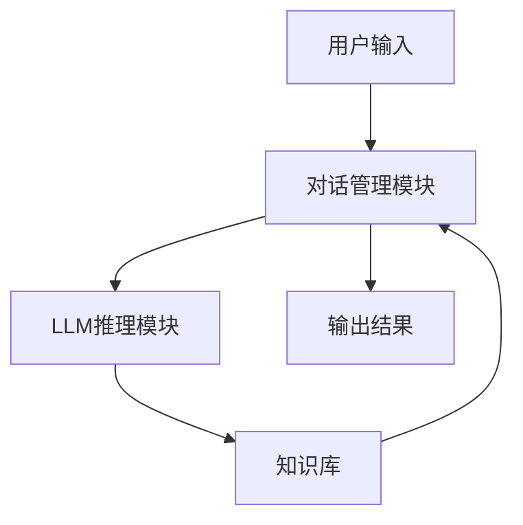
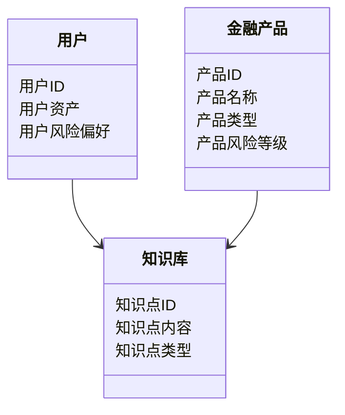
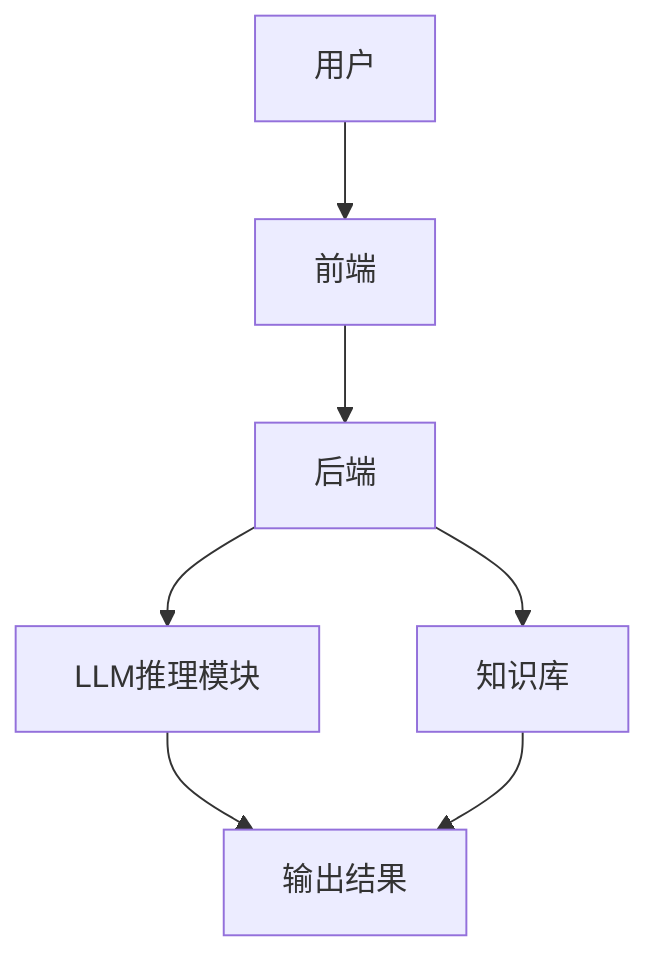
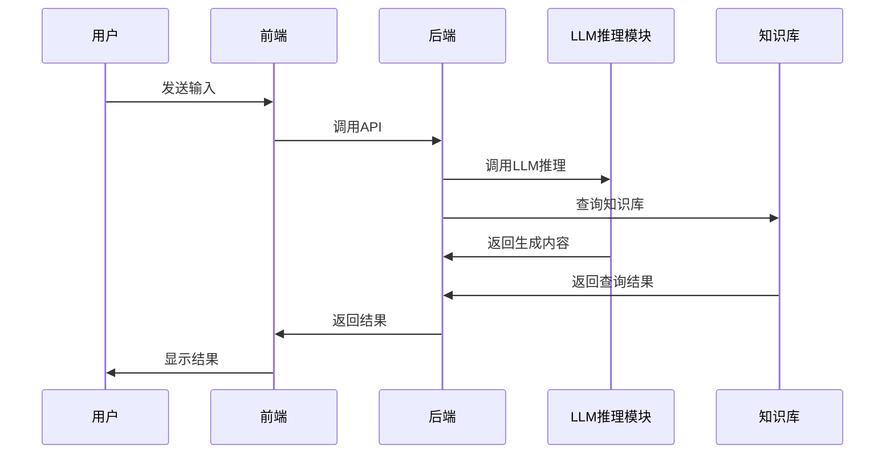

                 


# 基于LLM的金融对话系统开发实践

> 关键词：大语言模型（LLM）、金融对话系统、自然语言处理（NLP）、多轮对话、知识库

> 摘要：本文系统地探讨了基于大语言模型（LLM）的金融对话系统开发的各个方面，从问题背景到系统实现，从算法原理到项目实战，全面解析了该领域的核心技术与实践方法。文章深入分析了LLM在金融领域的应用潜力，详细介绍了金融对话系统的架构设计、核心算法及其优化策略，并通过实际案例展示了系统的开发与部署过程。

---

# 第一部分: 基于LLM的金融对话系统开发背景与基础

## 第1章: 问题背景与需求分析

### 1.1 问题背景

#### 1.1.1 传统金融对话系统的局限性

传统金融对话系统主要依赖于规则引擎和关键词匹配，存在以下问题：
- **知识覆盖不足**：难以应对复杂的金融问题，尤其是涉及多领域知识的查询。
- **对话逻辑单一**：缺乏上下文理解和多轮对话能力，用户体验较差。
- **维护成本高**：规则引擎的扩展性和维护性较差，难以应对金融领域的快速变化。

#### 1.1.2 大语言模型（LLM）的崛起与应用潜力

大语言模型（LLM）如GPT-3、GPT-4和PaLM等，在自然语言处理（NLP）领域取得了突破性进展，具备以下优势：
- **强大的语言理解能力**：能够处理复杂的上下文关系和多轮对话。
- **知识覆盖广泛**：通过海量数据训练，能够回答广泛领域的问题。
- **可扩展性高**：通过微调和迁移学习，可以快速适应特定领域需求。

#### 1.1.3 金融领域对话系统的特殊性与挑战

金融领域对话系统具有以下特殊性：
- **高准确性要求**：金融决策往往涉及资金和风险，系统必须确保输出的准确性和可靠性。
- **领域知识复杂性**：金融领域涉及丰富的专业术语和复杂的业务逻辑，需要系统具备深度知识库支持。
- **用户意图多样性**：用户可能同时具有投资、借贷、保险等多种需求，系统需要具备多任务处理能力。

### 1.2 问题描述

#### 1.2.1 金融对话系统的定义与目标

金融对话系统是一种基于自然语言处理技术的智能系统，旨在通过理解和生成自然语言，为用户提供个性化的金融咨询服务，包括投资建议、风险评估、财务规划等。

#### 1.2.2 用户需求分析

用户在使用金融对话系统时，通常有以下需求：
- **信息查询**：用户可能需要查询股票价格、基金净值等实时信息。
- **投资建议**：用户可能希望获得个性化的投资建议。
- **风险评估**：用户可能需要了解其投资组合的风险情况。
- **交互体验**：用户期望与系统进行自然流畅的对话。

#### 1.2.3 系统功能边界与外延

金融对话系统的功能边界包括：
- **核心功能**：包括信息查询、投资建议、风险评估等。
- **辅助功能**：包括用户身份验证、历史记录查询等。
- **外部依赖**：包括金融数据接口、知识库等。

### 1.3 问题解决思路

#### 1.3.1 基于LLM的对话系统优势

- **强大的上下文理解能力**：LLM能够处理复杂的对话上下文，确保多轮对话的连贯性。
- **灵活的知识库集成**：LLM可以通过微调或提示工程技术，与金融知识库无缝集成。
- **动态推理能力**：LLM能够根据对话历史动态推理用户意图，提供个性化的服务。

#### 1.3.2 金融领域知识库的构建与整合

金融知识库是金融对话系统的核心组成部分，需要包含以下内容：
- **金融产品信息**：包括股票、基金、债券等产品的基本信息。
- **市场数据**：包括实时价格、市场趋势等数据。
- **业务规则**：包括交易规则、风险提示等。

#### 1.3.3 多轮对话的逻辑推理与上下文管理

多轮对话的逻辑推理需要考虑以下因素：
- **对话历史**：系统需要记录和分析对话历史，确保每次回复与上下文相关。
- **用户意图识别**：系统需要通过意图识别技术，准确理解用户的深层需求。
- **知识库查询**：系统需要根据对话内容，动态查询知识库，提供准确的信息。

## 第2章: 核心概念与系统架构

### 2.1 大语言模型（LLM）原理概述

#### 2.1.1 LLM的基本概念与工作原理

大语言模型（LLM）是一种基于Transformer架构的深度学习模型，通过自监督学习的方式，从海量文本数据中学习语言的规律，从而具备生成和理解自然语言的能力。

#### 2.1.2 常见LLM模型及其特点对比

以下是几种常见的LLM模型及其特点对比：

| 模型名称 | 参数数量（亿） | 主要特点 | 适用场景 |
|----------|----------------|----------|----------|
| GPT-3    | 175            | 高生成能力，支持多语言 | 内容生成、对话系统 |
| PaLM     | 560            | 强大的理解能力，支持多种任务 | 多任务学习、对话系统 |
| Llama-2  | 70B            | 开源模型，支持微调 | 自定义应用 |

#### 2.1.3 LLM在金融领域的适用性分析

LLM在金融领域的适用性主要体现在以下几个方面：
- **内容生成**：生成金融报告、市场分析等文本内容。
- **信息抽取**：从金融文本中提取关键信息。
- **对话交互**：提供个性化的金融咨询服务。

### 2.2 金融对话系统的核心要素

#### 2.2.1 对话上下文管理

对话上下文管理是金融对话系统的核心要素之一，主要包括：
- **对话历史记录**：记录用户与系统之间的对话历史。
- **上下文理解**：理解对话的上下文关系，确保每次回复与前文相关。
- **上下文推理**：根据对话历史，推理用户的深层需求。

#### 2.2.2 知识库与领域推理

知识库是金融对话系统的重要组成部分，主要包括：
- **金融产品信息**：包括股票、基金、债券等产品的基本信息。
- **市场数据**：包括实时价格、市场趋势等数据。
- **业务规则**：包括交易规则、风险提示等。

领域推理是指系统根据对话内容，动态查询知识库，提供准确的信息。

#### 2.2.3 多轮对话的逻辑推理与反馈机制

多轮对话的逻辑推理需要考虑以下因素：
- **对话历史**：系统需要记录和分析对话历史，确保每次回复与上下文相关。
- **用户意图识别**：系统需要通过意图识别技术，准确理解用户的深层需求。
- **知识库查询**：系统需要根据对话内容，动态查询知识库，提供准确的信息。
- **反馈机制**：系统需要根据用户的反馈，动态调整对话策略。

### 2.3 系统架构设计

#### 2.3.1 系统架构图

以下是基于LLM的金融对话系统的架构图：



#### 2.3.2 功能模块划分

以下是系统的功能模块划分：

| 模块名称 | 功能描述 |
|----------|----------|
| 用户输入模块 | 接收用户输入，提取对话上下文 |
| 对话管理模块 | 分析用户意图，调用LLM模型，处理反馈信息 |
| LLM推理模块 | 生成回复，更新知识库 |
| 知识库模块 | 提供金融领域的知识支持 |

---

## 第3章: LLM算法原理与数学模型

### 3.1 LLM的训练过程

#### 3.1.1 监督微调（Fine-tuning）

监督微调是指在预训练模型的基础上，使用特定领域的数据进行微调，以适应特定任务的需求。监督微调的过程如下：

1. **预训练模型**：使用海量通用数据训练得到预训练模型。
2. **微调数据准备**：准备特定领域的数据，包括文本和标签。
3. **微调训练**：在预训练模型的基础上，使用特定领域的数据进行微调训练。

#### 3.1.2 基于强化学习的优化

基于强化学习的优化是指通过强化学习算法，进一步优化模型的生成能力。强化学习的过程如下：

1. **环境定义**：定义强化学习的环境，包括状态、动作和奖励。
2. **策略选择**：选择一个策略，根据当前状态选择动作。
3. **奖励机制**：根据策略的选择和环境的反馈，给予奖励或惩罚。
4. **策略更新**：根据奖励机制，更新策略，以最大化期望奖励。

#### 3.1.3 模型压缩与推理优化

模型压缩是指通过剪枝、量化等技术，减少模型的参数数量，降低模型的计算复杂度。推理优化是指通过优化推理过程，提高模型的推理速度。

### 3.2 LLM的数学模型

#### 3.2.1 变压器（Transformer）模型结构

Transformer模型由编码器和解码器组成，编码器负责将输入序列编码为一个向量，解码器负责根据编码向量生成输出序列。

#### 3.2.2 注意力机制（Attention）

注意力机制是一种用于计算序列中各个位置的重要性权重的机制。注意力机制的计算公式如下：

$$
\text{Attention}(Q, K, V) = \text{softmax}\left(\frac{QK^T}{\sqrt{d_k}}\right)V
$$

其中，$Q$是查询向量，$K$是键向量，$V$是值向量，$d_k$是键向量的维度。

#### 3.2.3 概率生成模型

概率生成模型是指模型根据输入，生成输出的概率分布，然后根据概率分布生成输出。生成模型的损失函数通常使用交叉熵损失函数。

#### 3.2.4 损失函数与优化目标

交叉熵损失函数的公式如下：

$$
\text{损失函数} = -\sum_{i=1}^{n} \log P(w_i | w_{<i})
$$

其中，$w_i$是生成的第$i$个词，$w_{<i}$是生成的前$i-1$个词。

### 3.3 金融对话系统的优化策略

#### 3.3.1 领域特定的损失函数设计

针对金融对话系统的优化，可以设计领域特定的损失函数，例如：

$$
\text{损失函数} = \lambda_1 \times \text{交叉熵损失} + \lambda_2 \times \text{领域损失}
$$

其中，$\lambda_1$和$\lambda_2$是调节系数，领域损失用于惩罚不符合金融领域规则的生成内容。

#### 3.3.2 知识库嵌入的向量表示

知识库嵌入的向量表示是指将知识库中的知识表示为向量，以便模型能够直接使用这些向量进行推理和生成。常用的向量表示方法包括Word2Vec和BERT。

#### 3.3.3 对话策略的动态调整

对话策略的动态调整是指根据对话的进展，动态调整对话策略。例如，当用户多次提到某个关键词时，系统可以调整生成策略，优先生成相关的内容。

---

## 第4章: 系统分析与架构设计

### 4.1 问题场景分析

#### 4.1.1 用户角色与需求分析

用户角色包括：
- **普通用户**：需要个性化的投资建议。
- **专业用户**：需要专业的市场分析。
- **机构用户**：需要定制化的金融服务。

用户需求包括：
- **信息查询**：查询股票价格、基金净值等实时信息。
- **投资建议**：获得个性化的投资建议。
- **风险评估**：了解投资组合的风险情况。

#### 4.1.2 系统功能场景划分

系统功能场景包括：
- **信息查询**：用户查询股票价格、基金净值等实时信息。
- **投资建议**：系统根据用户资产情况，提供投资建议。
- **风险评估**：系统评估用户投资组合的风险情况。
- **多轮对话**：用户与系统进行多轮对话，获取个性化的服务。

#### 4.1.3 系统性能指标

系统性能指标包括：
- **响应时间**：系统响应用户的平均时间。
- **准确率**：系统回答的准确率。
- **用户满意度**：用户的满意度调查结果。

### 4.2 系统功能设计

#### 4.2.1 领域模型设计

领域模型设计包括：
- **用户模型**：描述用户的基本信息和需求。
- **产品模型**：描述金融产品的基本信息和属性。
- **知识库模型**：描述知识库的结构和内容。

以下是领域模型的类图：



#### 4.2.2 系统架构设计

系统架构设计包括：
- **前端架构**：用户与系统进行交互的界面。
- **后端架构**：处理用户请求，调用LLM模型，返回结果。
- **知识库架构**：存储和管理金融领域的知识。

以下是系统的架构图：



### 4.3 系统接口设计

#### 4.3.1 系统接口设计

系统接口设计包括：
- **用户输入接口**：接收用户的输入，提取对话上下文。
- **知识库查询接口**：根据对话内容，查询知识库。
- **LLM推理接口**：调用LLM模型，生成回复。

以下是系统接口的设计：



---

## 第5章: 项目实战

### 5.1 环境安装

#### 5.1.1 开发环境安装

开发环境包括：
- **编程语言**：Python 3.8+
- **深度学习框架**：TensorFlow或PyTorch
- **LLM模型**：使用Hugging Face提供的开源模型
- **知识库**：使用MongoDB或Redis存储金融数据

安装命令示例：
```bash
pip install transformers torch tensorflow pandas numpy
```

#### 5.1.2 知识库数据准备

知识库数据准备包括：
- **数据清洗**：清洗金融数据，去除重复和错误数据。
- **数据结构化**：将数据结构化为可以被模型使用的格式。
- **数据存储**：将数据存储到数据库中。

数据清洗示例：
```python
import pandas as pd
data = pd.read_csv('financial_data.csv')
data.drop_duplicates(inplace=True)
data.dropna(inplace=True)
```

#### 5.1.3 系统核心代码实现

以下是系统核心代码实现：

```python
from transformers import AutoTokenizer, AutoModelForCausalLM
import torch

class FinancialDialogSystem:
    def __init__(self, model_name='gpt2'):
        self.tokenizer = AutoTokenizer.from_pretrained(model_name)
        self.model = AutoModelForCausalLM.from_pretrained(model_name)
        self.knowledge_base = self._initialize_knowledge_base()

    def _initialize_knowledge_base(self):
        # 初始化知识库，例如从数据库中加载数据
        return {}

    def generate_response(self, user_input):
        inputs = self.tokenizer(user_input, return_tensors='pt')
        outputs = self.model.generate(**inputs, max_length=100)
        response = self.tokenizer.decode(outputs[0], skip_special_tokens=True)
        return response

    def update_knowledge_base(self, new_data):
        # 更新知识库
        pass
```

### 5.2 代码应用解读与分析

#### 5.2.1 代码实现细节

上述代码实现了一个简单的金融对话系统，主要包括以下几个部分：
- **模型加载**：加载预训练的LLM模型和分词器。
- **知识库初始化**：初始化知识库，例如从数据库中加载数据。
- **生成回复**：根据用户输入，生成回复。
- **更新知识库**：更新知识库，例如添加新的数据。

#### 5.2.2 代码优化建议

代码优化建议包括：
- **模型优化**：通过剪枝、量化等技术优化模型。
- **知识库优化**：通过索引优化、分片优化等技术优化知识库的查询效率。
- **对话管理优化**：通过动态策略调整优化对话管理模块的性能。

### 5.3 实际案例分析

#### 5.3.1 案例分析

以下是一个实际案例的分析：

**用户输入**：我想了解如何投资股票。

**系统处理**：
1. **用户输入接收**：系统接收用户的输入。
2. **意图识别**：系统识别用户的意图是投资股票。
3. **知识库查询**：系统查询知识库，获取与股票投资相关的信息。
4. **LLM推理**：系统调用LLM模型，生成回复。
5. **回复输出**：系统将回复输出给用户。

**系统回复**：股票投资需要考虑多种因素，包括市场趋势、公司基本面、行业前景等。建议您根据自己的风险承受能力和投资目标，选择合适的股票。

#### 5.3.2 代码实现与解读

以下是上述案例的代码实现：

```python
def main():
    system = FinancialDialogSystem(model_name='gpt2')
    while True:
        user_input = input('用户输入：')
        response = system.generate_response(user_input)
        print('系统回复：', response)
```

### 5.4 项目小结

通过上述项目的开发，我们可以看到基于LLM的金融对话系统具有以下优势：
- **强大的生成能力**：LLM能够生成高质量的文本内容。
- **灵活的知识库集成**：系统可以方便地与知识库集成，提供准确的信息。
- **动态推理能力**：系统能够根据对话历史动态推理用户意图，提供个性化的服务。

---

## 第6章: 总结与展望

### 6.1 总结

本文系统地探讨了基于LLM的金融对话系统开发的各个方面，从问题背景到系统实现，从算法原理到项目实战，全面解析了该领域的核心技术与实践方法。文章深入分析了LLM在金融领域的应用潜力，详细介绍了金融对话系统的架构设计、核心算法及其优化策略，并通过实际案例展示了系统的开发与部署过程。

### 6.2 未来展望

未来，基于LLM的金融对话系统将朝着以下几个方向发展：
- **模型优化**：通过模型压缩、分布式训练等技术，进一步优化模型性能。
- **知识库增强**：通过知识图谱、符号推理等技术，进一步增强知识库的表达能力和推理能力。
- **多模态对话**：结合视觉、听觉等多模态信息，提供更加丰富的对话体验。
- **个性化服务**：通过用户画像、行为分析等技术，提供更加个性化的金融服务。

### 6.3 最佳实践 Tips

- **模型选择**：根据具体需求选择合适的LLM模型，例如选择开源模型进行微调，或者使用商业化的模型服务。
- **知识库构建**：构建高质量的知识库是系统成功的关键，需要结合领域专家的知识和数据工程师的技能。
- **对话管理**：对话管理模块是系统的核心，需要精心设计和优化，确保对话的连贯性和用户体验。
- **性能优化**：通过模型优化和知识库优化，确保系统的性能满足实际需求。

### 6.4 注意事项

- **数据安全**：金融数据涉及用户的隐私和资金安全，必须严格遵守数据安全法规。
- **模型风险管理**：金融领域的决策风险较高，需要严格控制模型的生成内容，避免产生错误的建议。
- **用户体验优化**：对话系统的用户体验是系统成功的关键，需要不断优化对话流程，提高用户满意度。

### 6.5 拓展阅读

- **《大语言模型的训练与优化》**：深入探讨LLM的训练与优化技术。
- **《金融知识图谱构建与应用》**：详细讲解金融知识图谱的构建与应用。
- **《多轮对话系统的实现与优化》**：系统地介绍多轮对话系统的实现与优化方法。

---

# 结语

基于LLM的金融对话系统是一个复杂而有趣的领域，它结合了自然语言处理、知识库管理和多轮对话技术，为金融领域的智能化服务提供了新的可能性。通过本文的探讨，我们希望能够为读者提供一个清晰的开发思路和实践指南，帮助他们在基于LLM的金融对话系统开发中取得成功。

