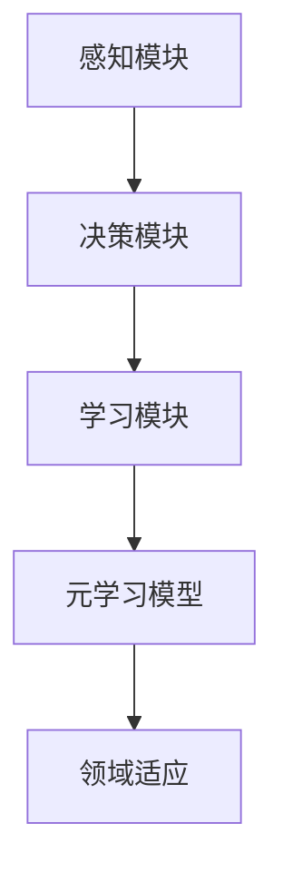
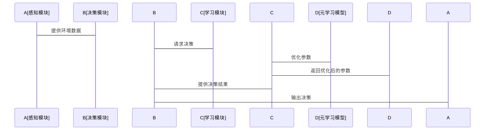

                 


# 基于元学习的AI Agent快速领域适应

> 关键词：元学习，AI Agent，领域适应，快速学习，迁移学习，Meta-LSTM，MAML

> 摘要：本文探讨了基于元学习的AI Agent在快速领域适应中的应用。通过分析元学习的核心概念、算法原理、系统架构设计以及实际项目案例，详细阐述了如何利用元学习提升AI Agent在不同领域的适应能力。文章结合数学模型、系统设计图和代码示例，为读者提供了全面而深入的指导。

---

# 第一部分: 元学习与AI Agent基础

## 第1章: 元学习与AI Agent概述

### 1.1 元学习的定义与背景

#### 1.1.1 元学习的基本概念
元学习（Meta-Learning）是一种机器学习范式，旨在通过学习如何学习来提高模型的适应能力。与传统机器学习不同，元学习不仅关注具体任务的解决，还关注模型在新任务上的快速适应能力。

#### 1.1.2 元学习的核心特点
- **快速适应性**：元学习模型能够在有限的数据和时间内适应新任务。
- **通用性**：元学习模型可以应用于多个不同领域或任务。
- **元参数**：元学习模型通过优化元参数来实现快速适应。

#### 1.1.3 元学习与传统机器学习的对比
| 对比维度 | 传统机器学习 | 元学习 |
|----------|--------------|--------|
| 数据需求 | 需要大量数据 | 需要少量数据 |
| 任务适应性 | 适应单一任务 | 适应多个任务 |
| 学习目标 | 学习具体任务 | 学习如何学习 |

### 1.2 AI Agent的定义与特点

#### 1.2.1 AI Agent的基本概念
AI Agent（人工智能代理）是指能够感知环境并采取行动以实现目标的智能实体。它可以是一个软件程序，也可以是物理设备。

#### 1.2.2 AI Agent的核心功能
- **感知**：通过传感器或数据输入感知环境。
- **决策**：基于感知信息做出决策。
- **行动**：执行决策以影响环境或获取新信息。

#### 1.2.3 AI Agent与传统程序的区别
| 对比维度 | AI Agent | 传统程序 |
|----------|-----------|-----------|
| 智能性 | 高度智能 | 智能性有限 |
| 学习能力 | 具备学习能力 | 通常不具备学习能力 |
| 环境交互 | 能与环境交互 | 通常不与环境交互 |

### 1.3 元学习在AI Agent中的应用

#### 1.3.1 元学习在AI Agent中的作用
元学习可以提升AI Agent的快速适应能力，使其能够在新环境中快速学习并做出决策。

#### 1.3.2 元学习如何提升AI Agent的适应能力
通过元学习，AI Agent可以在新任务中利用之前学习的知识，快速调整模型参数，适应新环境。

#### 1.3.3 元学习在不同领域的应用案例
- **自然语言处理**：元学习用于跨语言机器翻译。
- **计算机视觉**：元学习用于跨领域图像分类。
- **机器人控制**：元学习用于快速适应新环境。

---

## 第2章: 元学习的核心概念与原理

### 2.1 元学习的核心概念

#### 2.1.1 元学习的定义
元学习是一种通过优化元参数来提升模型在新任务上表现的学习范式。

#### 2.1.2 元学习的目标
元学习的目标是通过优化元参数，使得模型能够快速适应新任务。

#### 2.1.3 元学习的实现方式
- **基于梯度的元学习**：通过优化元参数直接优化模型。
- **基于模型的元学习**：通过构建元模型来辅助学习。

### 2.2 元学习的原理

#### 2.2.1 元学习的数学模型
元学习的数学模型通常包括以下几个部分：
1. **任务分布**：$p(\mathcal{T})$，表示任务的分布。
2. **元参数**：$\theta$，表示模型的参数。
3. **损失函数**：$\mathcal{L}(\theta, \mathcal{T})$，表示模型在任务$\mathcal{T}$上的损失。

#### 2.2.2 元学习的算法流程
1. **初始化**：初始化元参数$\theta$。
2. **元训练**：通过优化$\theta$使得模型在多个任务上表现良好。
3. **任务测试**：在新任务上，利用优化后的$\theta$进行快速适应。

#### 2.2.3 元学习的优化策略
- **梯度平均**：将多个任务的梯度进行平均，用于优化元参数。
- **任务权重**：根据任务的重要性进行加权优化。

### 2.3 元学习与迁移学习的关系

#### 2.3.1 迁移学习的基本概念
迁移学习是指将从一个任务上学到的知识应用到另一个任务上。

#### 2.3.2 元学习与迁移学习的异同
- **相同点**：两者都关注知识的转移和应用。
- **不同点**：元学习更关注快速适应新任务，而迁移学习更关注跨任务的知识转移。

#### 2.3.3 元学习在迁移学习中的优势
元学习可以更快地适应新任务，尤其是在数据量有限的情况下。

---

## 第3章: AI Agent的领域适应问题

### 3.1 领域适应的基本概念

#### 3.1.1 领域适应的定义
领域适应是指将模型从一个领域迁移到另一个领域，以适应新领域的数据分布。

#### 3.1.2 领域适应的目标
通过适应新领域，提高模型在新领域的表现。

#### 3.1.3 领域适应的挑战
- **数据分布差异**：不同领域的数据分布可能差异较大。
- **数据量有限**：新领域可能只有少量数据。

### 3.2 元学习在领域适应中的作用

#### 3.2.1 元学习如何解决领域适应问题
元学习可以通过优化元参数，使得模型能够快速适应新领域。

#### 3.2.2 元学习在领域适应中的优势
- **快速适应**：元学习可以在少量数据下快速适应新领域。
- **通用性**：元学习模型可以应用于多个领域。

#### 3.2.3 元学习在不同领域的应用案例
- **跨领域图像分类**：元学习用于将模型从ImageNet迁移到CIFAR。
- **跨语言机器翻译**：元学习用于将模型从英语翻译到其他语言。

### 3.3 快速领域适应的实现方法

#### 3.3.1 快速领域适应的基本概念
快速领域适应是指在有限的数据和时间内，快速适应新领域。

#### 3.3.2 元学习如何实现快速领域适应
通过优化元参数，使得模型能够快速调整参数以适应新领域。

#### 3.3.3 快速领域适应的优化策略
- **任务嵌入**：将任务信息嵌入模型中，以快速调整参数。
- **领域嵌入**：将领域信息嵌入模型中，以快速适应新领域。

---

## 第4章: 元学习算法的数学模型与公式

### 4.1 元学习算法的基本数学模型

#### 4.1.1 元学习的损失函数
元学习的损失函数通常包括两个部分：
1. **元损失**：$\mathcal{L}_\text{meta}$，用于优化元参数。
2. **任务损失**：$\mathcal{L}_\text{task}$，用于优化模型在具体任务上的表现。

总体损失函数可以表示为：
$$
\mathcal{L}(\theta) = \mathcal{L}_\text{meta} + \sum_{i=1}^N \mathcal{L}_\text{task}(f_\theta(x_i), y_i)
$$

其中，$N$表示任务的数量，$f_\theta(x_i)$表示模型在任务$i$上的输出。

#### 4.1.2 元学习的优化目标
元学习的优化目标是通过优化元参数$\theta$，使得模型在多个任务上表现良好。

优化目标可以表示为：
$$
\theta^* = \arg \min_{\theta} \mathcal{L}(\theta)
$$

#### 4.1.3 元学习的数学公式
元学习的数学公式通常涉及梯度计算和参数更新。例如，基于梯度的元学习算法可以表示为：

$$
\theta_{t+1} = \theta_t - \eta \cdot \nabla_\theta \mathcal{L}(\theta_t)
$$

其中，$\eta$表示学习率，$\nabla_\theta \mathcal{L}(\theta_t)$表示损失函数关于$\theta$的梯度。

---

## 第5章: AI Agent的系统架构设计

### 5.1 问题场景介绍

#### 5.1.1 问题背景
在实际应用中，AI Agent需要在不同领域快速适应并完成任务。

#### 5.1.2 问题描述
AI Agent需要在有限的数据和时间内，快速适应新领域并完成任务。

#### 5.1.3 问题解决
通过元学习，AI Agent可以在新领域快速调整模型参数，完成任务。

### 5.2 系统功能设计

#### 5.2.1 领域模型设计
领域模型需要能够表示不同领域的特征和任务。

#### 5.2.2 系统功能模块
- **感知模块**：负责感知环境并提取特征。
- **决策模块**：负责根据感知信息做出决策。
- **学习模块**：负责通过元学习快速适应新领域。

### 5.3 系统架构设计

#### 5.3.1 系统架构图


#### 5.3.2 接口设计
- **输入接口**：感知模块接收环境数据。
- **输出接口**：决策模块输出决策结果。

### 5.4 系统交互设计

#### 5.4.1 交互流程
1. 感知模块接收环境数据。
2. 决策模块根据感知数据做出决策。
3. 学习模块通过元学习快速适应新领域。
4. 输出决策结果。

#### 5.4.2 序列图


---

## 第6章: 项目实战

### 6.1 环境安装

#### 6.1.1 安装Python
安装Python 3.8及以上版本。

#### 6.1.2 安装依赖库
安装以下依赖库：
```bash
pip install numpy matplotlib scikit-learn
```

### 6.2 核心代码实现

#### 6.2.1 元学习模型实现
```python
import numpy as np

class MetaLSTM:
    def __init__(self, input_size, hidden_size):
        self.input_size = input_size
        self.hidden_size = hidden_size
        self.W = np.random.randn(self.hidden_size, self.input_size)
        self.U = np.random.randn(self.hidden_size, self.hidden_size)
        self.b = np.zeros(self.hidden_size)
    
    def forward(self, x):
        h = np.zeros((1, self.hidden_size))
        for t in range(x.shape[0]):
            h = np.tanh(np.dot(self.U, h.T) + np.dot(self.W, x[t].T) + self.b)
        return h
    
    def backward(self, x, y):
        pass
    
    def update(self, gradient):
        self.W -= learning_rate * gradient['W']
        self.U -= learning_rate * gradient['U']
```

#### 6.2.2 领域适应实现
```python
def adapt_domain(model, source_data, target_data):
    # 元训练
    for x_s, y_s in source_data:
        output = model.forward(x_s)
        loss = np.mean((output - y_s)**2)
        gradient = model.backward(x_s, y_s)
        model.update(gradient)
    
    # 快速适应
    for x_t, y_t in target_data:
        output = model.forward(x_t)
        loss = np.mean((output - y_t)**2)
        gradient = model.backward(x_t, y_t)
        model.update(gradient)
```

### 6.3 代码应用解读与分析

#### 6.3.1 代码功能模块
- **MetaLSTM类**：实现元学习模型。
- **adapt_domain函数**：实现领域适应。

#### 6.3.2 代码运行流程
1. 初始化模型参数。
2. 元训练阶段：在源领域上优化模型参数。
3. 快速适应阶段：在目标领域上快速调整模型参数。

### 6.4 实际案例分析

#### 6.4.1 案例背景
假设我们要将一个在ImageNet上训练好的模型迁移到CIFAR数据集。

#### 6.4.2 数据准备
- **源数据集**：ImageNet数据集。
- **目标数据集**：CIFAR数据集。

#### 6.4.3 模型训练
1. 在ImageNet数据集上进行元训练。
2. 在CIFAR数据集上进行快速适应。

#### 6.4.4 模型评估
评估模型在CIFAR数据集上的表现，计算准确率、召回率等指标。

### 6.5 项目小结

#### 6.5.1 项目总结
通过元学习，AI Agent可以在新领域快速适应并完成任务。

#### 6.5.2 经验与教训
- **经验**：元学习可以有效提升模型的适应能力。
- **教训**：不同领域的数据差异可能会影响模型的适应效果。

---

## 第7章: 总结与展望

### 7.1 元学习在AI Agent中的应用总结

#### 7.1.1 元学习的核心作用
元学习通过优化元参数，提升AI Agent的快速适应能力。

#### 7.1.2 元学习的优势
- **快速适应**：元学习可以在有限的数据和时间内快速适应新领域。
- **通用性**：元学习模型可以应用于多个领域。

### 7.2 未来展望

#### 7.2.1 元学习的未来发展
元学习将在更多领域得到应用，尤其是在数据量有限的情况下。

#### 7.2.2 AI Agent的未来趋势
AI Agent将更加智能化，具备更强的自主学习和适应能力。

### 7.3 最佳实践 tips

#### 7.3.1 小结
通过元学习，AI Agent可以在新领域快速适应并完成任务。

#### 7.3.2 注意事项
- **数据质量**：确保数据的多样性和代表性。
- **模型选择**：选择适合任务的元学习算法。

#### 7.3.3 拓展阅读
- **推荐书籍**：《元学习：从基础到实践》。
- **推荐论文**：《Meta-Learning with LSTM》。

---

# 结语

通过本文的详细讲解，读者可以全面理解基于元学习的AI Agent快速领域适应的方法和实现细节。希望本文能够为读者在相关领域的研究和实践提供有价值的参考和指导。

