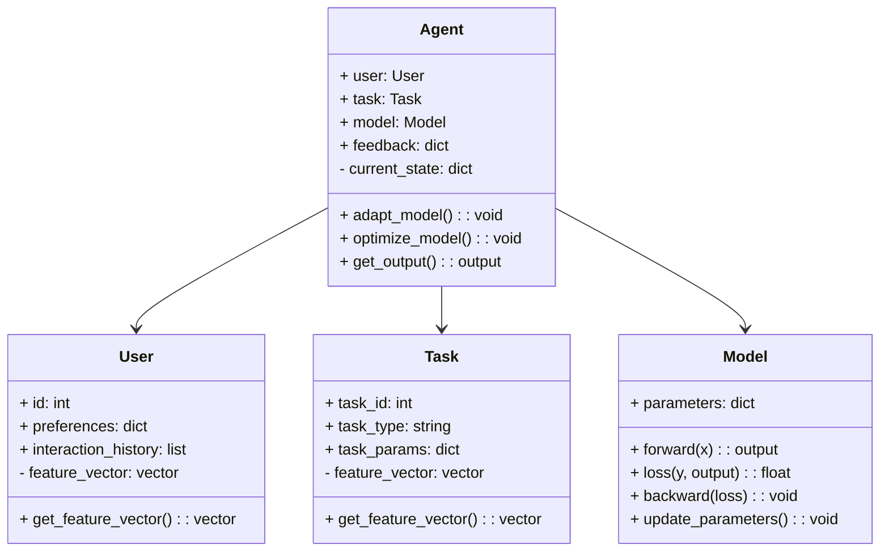
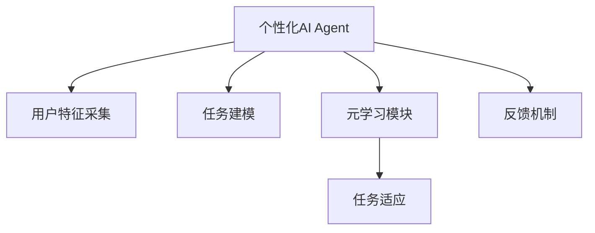
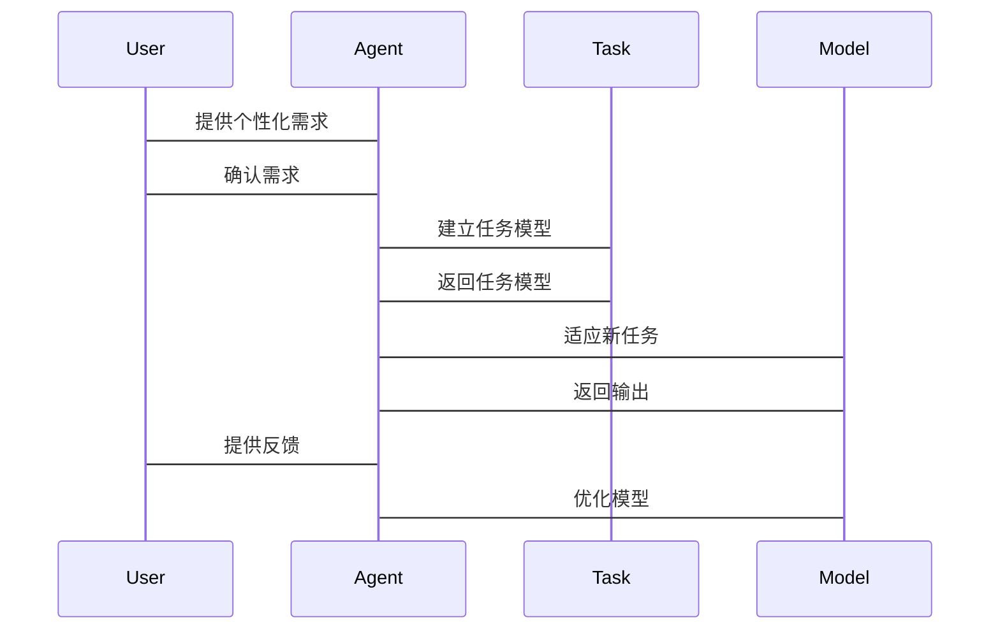

                 


# 基于元学习的个性化AI Agent定制

> 关键词：元学习，个性化AI Agent，Meta-Learning，自适应智能系统，AI定制化

> 摘要：本文深入探讨了基于元学习的个性化AI Agent定制方法，从理论基础到算法实现，再到系统架构设计，详细讲解了如何利用元学习快速适应个性化需求，构建高效、灵活的智能系统。

---

## 第1章 元学习与个性化AI Agent的背景介绍

### 1.1 元学习的基本概念

#### 1.1.1 元学习的定义
元学习（Meta-Learning）是一种机器学习范式，旨在通过训练模型在多个任务上进行学习，使得模型能够快速适应新任务，而无需大量标注数据。与传统机器学习不同，元学习注重模型的“元”能力，即模型能够理解不同任务之间的关系，并利用这些关系来加速新任务的学习。

#### 1.1.2 元学习的核心问题
元学习的核心问题是如何从多个任务中提取通用特征，并利用这些特征快速适应新任务。具体来说，元学习需要解决以下问题：
- **任务相似性**：如何衡量不同任务之间的相似性？
- **特征表示**：如何提取任务间共享的特征？
- **快速适应**：如何利用这些特征快速适应新任务？

#### 1.1.3 元学习的边界与外延
元学习的边界包括：
- **任务空间**：元学习适用于任务之间存在某种结构或相似性的场景。
- **数据需求**：元学习通常需要少量数据来快速适应新任务。
- **模型能力**：元学习依赖于模型的泛化能力。

元学习的外延包括：
- **多任务学习**：元学习是一种特殊的多任务学习，但多任务学习通常强调同时优化多个任务，而元学习强调快速适应新任务。
- **迁移学习**：元学习可以看作是一种迁移学习，但更注重任务之间的元结构。

### 1.2 个性化AI Agent的概念

#### 1.2.1 个性化AI Agent的定义
个性化AI Agent（Personalized AI Agent）是一种能够根据用户需求、偏好和行为动态调整其行为的智能体。个性化AI Agent的核心目标是提供高度定制化的服务，满足用户的个性化需求。

#### 1.2.2 个性化AI Agent的核心要素
个性化AI Agent的核心要素包括：
- **用户建模**：理解和表示用户的特征、需求和偏好。
- **任务适应**：根据用户需求快速调整模型的行为。
- **反馈机制**：通过用户反馈不断优化模型的输出。

#### 1.2.3 个性化AI Agent的应用场景
个性化AI Agent的应用场景包括：
- **智能助手**：如Siri、Alexa等，提供个性化推荐和服务。
- **教育助手**：根据学生的学习情况提供个性化的教学建议。
- **医疗助手**：根据患者的病情和历史数据提供个性化的诊断和治疗方案。

---

## 第2章 元学习与个性化AI Agent的核心概念与联系

### 2.1 元学习的原理

#### 2.1.1 元学习的核心概念
元学习的核心概念包括：
- **元任务**：元任务是指一组任务的集合，用于训练模型的元能力。
- **元模型**：元模型是一种能够快速适应新任务的模型。
- **元损失函数**：元损失函数用于衡量模型在新任务上的表现。

#### 2.1.2 元学习的算法框架
元学习的算法框架通常包括以下步骤：
1. **元任务训练**：在多个任务上训练元模型。
2. **任务适应**：利用元模型快速适应新任务。
3. **优化**：通过优化元模型的参数，使得模型能够在新任务上表现良好。

#### 2.1.3 元学习的数学模型
元学习的数学模型通常包括以下部分：
- **元任务的损失函数**：$L_{meta}(θ, θ')$，其中$θ$是元模型的参数，$θ'$是任务模型的参数。
- **优化目标**：$\min_{θ} \mathbb{E}_{t}[L_{meta}(θ, θ')]$，其中$t$表示元任务。

### 2.2 个性化AI Agent的构建过程

#### 2.2.1 个性化需求的提取
个性化需求的提取是个性化AI Agent的核心步骤之一。通常包括以下步骤：
1. **用户特征采集**：通过问卷、日志分析等方式采集用户的特征数据。
2. **需求分析**：根据用户特征数据，分析用户的个性化需求。
3. **需求建模**：将用户需求建模为一个或多个任务。

#### 2.2.2 元学习在个性化AI Agent中的应用
元学习在个性化AI Agent中的应用包括：
- **快速适应用户需求**：通过元学习，模型可以在较少的数据和计算资源下快速适应用户的个性化需求。
- **任务间的知识共享**：元学习能够将不同任务之间的知识进行共享，从而提高模型的泛化能力。
- **动态调整模型参数**：元学习能够动态调整模型参数，以适应用户需求的变化。

#### 2.2.3 元学习与个性化AI Agent的联系
元学习与个性化AI Agent的联系可以总结为：
- **元学习提供了快速适应新任务的能力**，这对于个性化AI Agent来说至关重要。
- **个性化AI Agent为元学习提供了丰富的应用场景**，元学习可以在个性化推荐、智能助手等领域发挥重要作用。

---

## 第3章 元学习算法的数学模型与公式

### 3.1 元学习的基本数学模型

#### 3.1.1 元学习的优化目标
元学习的优化目标可以表示为：
$$
\min_{θ} \mathbb{E}_{t}[L_{meta}(θ, θ')]
$$
其中，$θ$是元模型的参数，$θ'$是任务模型的参数，$L_{meta}$是元损失函数。

#### 3.1.2 元学习的损失函数
元学习的损失函数通常包括任务损失和元损失两部分：
$$
L_{meta}(θ, θ') = L_{task}(θ', t) + αL_{reg}(θ, θ')
$$
其中，$L_{task}$是任务损失函数，$L_{reg}$是正则化项，$α$是正则化系数。

#### 3.1.3 元学习的梯度计算
元学习的梯度计算通常涉及任务梯度和元梯度：
$$
\nabla_{θ} L_{meta} = \sum_{t} \nabla_{θ} L_{meta}(θ, θ')
$$

---

## 第4章 元学习算法的实现与代码示例

### 4.1 元学习算法的实现步骤

#### 4.1.1 数据预处理
元学习的数据预处理步骤包括：
1. **数据收集**：收集多个任务的数据。
2. **数据划分**：将数据划分为训练集、验证集和测试集。
3. **数据增强**：对数据进行增强，以提高模型的泛化能力。

#### 4.1.2 模型初始化
模型初始化步骤包括：
1. **选择模型架构**：选择适合元学习的模型架构，如MAML。
2. **初始化模型参数**：随机初始化模型参数。

#### 4.1.3 元学习的优化过程
元学习的优化过程包括：
1. **元任务训练**：在多个任务上训练元模型。
2. **任务适应**：利用元模型快速适应新任务。
3. **优化**：通过优化算法（如SGD、Adam）优化模型参数。

### 4.2 具体算法的代码实现

#### 4.2.1 MAML算法的Python代码实现
```python
import torch
import torch.nn as nn
import torch.optim as optim

class MetaLearner(nn.Module):
    def __init__(self, feature_dim, hidden_dim, output_dim):
        super(MetaLearner, self).__init__()
        self.fc1 = nn.Linear(feature_dim, hidden_dim)
        self.fc2 = nn.Linear(hidden_dim, output_dim)
    
    def forward(self, x, theta=None):
        if theta is None:
            theta = self.parameters()
        x = self.fc1(x)
        x = self.fc2(x)
        return x

def meta_learning_loss(model, X_spt, y_spt, X_qry, y_qry):
    model.zero_grad()
    spt_loss = model(X_spt).loss(y_spt)
    qry_loss = model(X_qry, theta=model.parameters()).loss(y_qry)
    total_loss = spt_loss + qry_loss
    return total_loss

def train(model, optimizer, X_spt, y_spt, X_qry, y_qry):
    optimizer.zero_grad()
    loss = meta_learning_loss(model, X_spt, y_spt, X_qry, y_qry)
    loss.backward()
    optimizer.step()
    return loss.item()
```

#### 4.2.2 Reptile算法的Python代码实现
```python
def reptile_train(model, optimizer, tasks):
    model.zero_grad()
    for task in tasks:
        optimizer.zero_grad()
        outputs = model(task['X'])
        loss = task['loss'](outputs, task['y'])
        loss.backward()
    optimizer.step()
    return

def evaluate(model, tasks):
    model.eval()
    total_loss = 0
    total_acc = 0
    for task in tasks:
        outputs = model(task['X'])
        loss = task['loss'](outputs, task['y'])
        total_loss += loss.item()
        _, predicted = torch.max(outputs.data, 1)
        total_acc += (predicted == task['y']).sum().item()
    return total_loss / len(tasks), total_acc / len(tasks)
```

---

## 第5章 个性化AI Agent的系统架构设计

### 5.1 系统功能设计

#### 5.1.1 需求分析
个性化AI Agent的需求分析包括：
1. **用户需求提取**：通过用户交互获取用户的个性化需求。
2. **任务建模**：将用户需求建模为具体的任务。
3. **任务适应**：根据任务模型快速适应用户的个性化需求。

#### 5.1.2 功能模块划分
个性化AI Agent的功能模块包括：
- **用户特征采集模块**：采集用户的特征数据。
- **任务建模模块**：将用户需求建模为具体的任务。
- **元学习模块**：利用元学习快速适应新任务。
- **反馈机制模块**：根据用户反馈调整模型的行为。

#### 5.1.3 功能流程设计
个性化AI Agent的功能流程包括：
1. 用户与AI Agent交互，提供个性化需求。
2. AI Agent采集用户的特征数据，并将其建模为具体的任务。
3. 元学习模块利用任务模型快速适应用户的个性化需求。
4. AI Agent根据用户反馈不断优化其行为。

### 5.2 系统架构设计

#### 5.2.1 类图设计


#### 5.2.2 架构图设计


#### 5.2.3 交互序列图


---

## 第6章 项目实战

### 6.1 环境安装

#### 6.1.1 Python版本要求
建议使用Python 3.6及以上版本。

#### 6.1.2 依赖安装
安装以下依赖：
```bash
pip install torch==1.9.0+numpy
pip install matplotlib
pip install scikit-learn
```

### 6.2 系统核心实现源代码

#### 6.2.1 元学习模块实现
```python
import torch
import torch.nn as nn
import torch.optim as optim

class MetaLearner(nn.Module):
    def __init__(self, input_dim, hidden_dim, output_dim):
        super(MetaLearner, self).__init__()
        self.fc1 = nn.Linear(input_dim, hidden_dim)
        self.fc2 = nn.Linear(hidden_dim, output_dim)
    
    def forward(self, x, theta=None):
        if theta is None:
            theta = self.parameters()
        x = self.fc1(x)
        x = self.fc2(x)
        return x

def train_meta_learner(model, optimizer, X_spt, y_spt, X_qry, y_qry):
    optimizer.zero_grad()
    outputs_spt = model(X_spt)
    loss_spt = nn.CrossEntropyLoss()(outputs_spt, y_spt)
    outputs_qry = model(X_qry, theta=model.parameters())
    loss_qry = nn.CrossEntropyLoss()(outputs_qry, y_qry)
    total_loss = loss_spt + loss_qry
    total_loss.backward()
    optimizer.step()
    return total_loss.item()
```

#### 6.2.2 个性化AI Agent实现
```python
class PersonalizedAIAssistant:
    def __init__(self, model, user_id):
        self.model = model
        self.user_id = user_id
        self.user_features = self.get_user_features(user_id)
        self.current_task = self.create_task(self.user_features)
    
    def get_user_features(self, user_id):
        # 获取用户的特征数据
        pass
    
    def create_task(self, user_features):
        # 根据用户特征创建任务
        pass
    
    def adapt_model(self):
        # 根据任务适应模型
        pass
    
    def get_output(self):
        # 返回模型的输出
        pass
```

### 6.3 代码应用解读与分析

#### 6.3.1 元学习模块的应用
元学习模块在个性化AI Agent中的应用包括：
1. **快速适应用户需求**：通过元学习，模型可以在较少的数据和计算资源下快速适应用户的个性化需求。
2. **任务间的知识共享**：元学习能够将不同任务之间的知识进行共享，从而提高模型的泛化能力。
3. **动态调整模型参数**：元学习能够动态调整模型参数，以适应用户需求的变化。

#### 6.3.2 个性化AI Agent的案例分析
案例分析：个性化医疗助手
- **用户需求**：根据患者的病情和历史数据提供个性化的诊断和治疗方案。
- **任务建模**：将患者的病情建模为一个分类任务。
- **元学习应用**：利用元学习快速适应不同患者的个性化需求。

---

## 第7章 最佳实践、小结、注意事项与拓展阅读

### 7.1 最佳实践

#### 7.1.1 元学习的应用建议
1. **选择合适的元学习算法**：根据具体场景选择适合的元学习算法。
2. **数据预处理**：确保数据的质量和多样性。
3. **模型优化**：通过调参和优化算法提高模型性能。

#### 7.1.2 个性化AI Agent的设计建议
1. **用户建模**：准确建模用户需求和偏好。
2. **任务适应**：确保模型能够快速适应新任务。
3. **反馈机制**：通过用户反馈不断优化模型的行为。

### 7.2 小结

本文详细探讨了基于元学习的个性化AI Agent定制方法，从理论基础到算法实现，再到系统架构设计，全面解析了如何利用元学习快速适应个性化需求，构建高效、灵活的智能系统。

### 7.3 注意事项

1. **数据隐私**：在个性化AI Agent的设计中，需要特别注意用户数据的隐私和安全。
2. **模型泛化能力**：元学习模型的泛化能力依赖于任务之间的相似性，因此在实际应用中需要确保任务之间的相似性。
3. **计算资源**：元学习需要较多的计算资源，因此在实际应用中需要考虑计算资源的限制。

### 7.4 拓展阅读

1. **元学习经典论文**：阅读元学习领域的经典论文，深入理解元学习的理论基础。
2. **个性化推荐系统**：研究个性化推荐系统的相关文献，了解其最新进展。
3. **深度强化学习**：学习深度强化学习的相关知识，了解其在个性化AI Agent中的应用。

---

通过本文的系统讲解，读者可以全面掌握基于元学习的个性化AI Agent定制方法，并能够在实际应用中灵活运用这些知识，开发出高效、个性化的智能系统。

