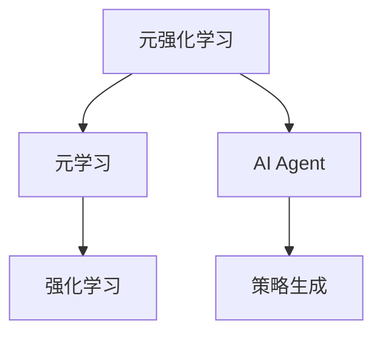
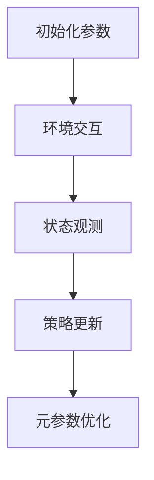
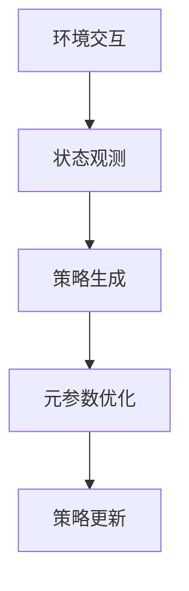
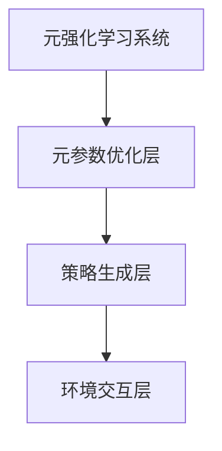

                 


# 基于元强化学习的AI Agent策略生成

> 关键词：元强化学习, AI Agent, 策略生成, 强化学习, 算法原理

> 摘要：本文深入探讨了基于元强化学习的AI Agent策略生成方法，从理论基础到算法实现，再到系统架构设计，详细阐述了元强化学习的核心概念、算法原理、系统实现和实际应用。通过本文的学习，读者能够全面理解元强化学习在AI Agent策略生成中的应用价值，并掌握其核心算法的设计与实现技巧。

---

# 第1章 元强化学习与AI Agent概述

## 1.1 元强化学习的基本概念

### 1.1.1 强化学习的基本原理

强化学习（Reinforcement Learning, RL）是一种通过试错机制优化决策策略的机器学习方法。学习主体（Agent）通过与环境交互，不断探索和利用环境的反馈（奖励或惩罚）来优化自身的策略。强化学习的核心在于通过最大化累积奖励来实现目标。

### 1.1.2 元强化学习的定义与特点

元强化学习（Meta-Reinforcement Learning, Meta-RL）是在强化学习基础上的进一步扩展，旨在通过元学习（Meta-Learning）机制，使AI Agent能够快速适应不同的任务和环境。元强化学习的特点包括：

1. **层次化学习**：元强化学习通常采用层次化结构，分为元学习层和任务学习层。
2. **快速适应性**：通过元学习，AI Agent能够快速掌握新任务的策略，而不需要从头开始学习。
3. **通用性**：元强化学习的目标是生成适用于多种任务的通用策略。

### 1.1.3 AI Agent的定义与分类

AI Agent是一种智能体，能够在复杂环境中感知、推理、决策并执行动作。AI Agent可以分为以下几类：

1. **反应式Agent**：基于当前环境状态做出反应，不依赖长期记忆。
2. **基于模型的Agent**：通过构建环境模型来优化决策策略。
3. **层次化Agent**：通过层次化任务分解来优化复杂问题。

---

## 1.2 元强化学习的背景与问题背景

### 1.2.1 传统强化学习的局限性

传统强化学习在处理复杂任务时存在以下问题：

1. **样本效率低**：传统RL需要大量交互才能收敛，尤其在复杂环境中。
2. **任务泛化性差**：针对单一任务优化的策略难以快速适应新任务。
3. **计算资源消耗大**：复杂任务的训练需要大量的计算资源。

### 1.2.2 元强化学习的提出动机

为了解决传统强化学习的局限性，元强化学习应运而生。元强化学习的核心思想是通过元学习机制，使AI Agent能够快速适应新任务，提高任务泛化能力。

### 1.2.3 AI Agent策略生成的核心问题

AI Agent策略生成的核心问题是如何在复杂动态环境中，通过最少的尝试，找到最优或近似最优的策略。元强化学习通过元学习机制，为这一问题提供了新的解决方案。

---

## 1.3 元强化学习的目标与应用领域

### 1.3.1 元强化学习的目标函数

元强化学习的目标是通过元学习层优化元参数，使得AI Agent能够快速适应新任务。目标函数通常包括：

$$
\theta = \arg\max_{\theta} \sum_{i=1}^{N} J(\theta_i)
$$

其中，$\theta$ 是元参数，$J(\theta_i)$ 是第i个任务的奖励函数。

### 1.3.2 元强化学习在AI Agent中的应用

元强化学习在AI Agent中的典型应用包括：

1. **多任务学习**：通过元学习，AI Agent可以在多个任务之间共享知识，提高学习效率。
2. **快速适应新环境**：元强化学习使AI Agent能够快速适应新环境，减少探索成本。
3. **复杂策略生成**：通过层次化学习，元强化学习能够生成复杂任务的多阶段策略。

### 1.3.3 元强化学习的边界与外延

元强化学习的边界在于其适用范围和任务类型。当前，元强化学习主要应用于游戏AI、机器人控制、推荐系统等领域。其外延包括与深度学习、图神经网络等技术的结合。

---

## 1.4 本章小结

本章介绍了元强化学习的基本概念、背景与问题背景，以及其在AI Agent策略生成中的应用。通过本章的学习，读者可以理解元强化学习的核心思想及其在AI Agent中的重要性。

---

# 第2章 元强化学习的核心概念与原理

## 2.1 元强化学习的核心概念

### 2.1.1 元学习的定义与特点

元学习（Meta-Learning）是一种通过学习如何学习的方法。其核心思想是通过元参数的优化，使模型能够快速适应新任务。元学习的特点包括：

1. **快速适应性**：通过元学习，模型可以在少量数据上快速学习新任务。
2. **任务多样性**：元学习适用于多任务学习场景。

### 2.1.2 元强化学习的层次结构

元强化学习的层次结构包括元学习层和任务学习层。元学习层负责优化元参数，任务学习层负责具体任务的策略优化。

### 2.1.3 元强化学习的数学模型

元强化学习的数学模型可以表示为：

$$
\theta = \arg\max_{\theta} \sum_{i=1}^{N} J(\theta_i)
$$

其中，$\theta$ 是元参数，$J(\theta_i)$ 是第i个任务的奖励函数。

---

## 2.2 元强化学习与传统强化学习的对比

### 2.2.1 传统强化学习的算法特点

传统强化学习算法（如Q-Learning、Policy Gradient）通常需要大量交互才能收敛，且难以快速适应新任务。

### 2.2.2 元强化学习的创新点

元强化学习的创新点在于其层次化学习机制和元参数优化方法，使AI Agent能够快速适应新任务。

### 2.2.3 元强化学习的核心要素对比

以下是元强化学习与传统强化学习的核心要素对比：

| 对比维度         | 传统强化学习             | 元强化学习             |
|------------------|--------------------------|--------------------------|
| 学习目标         | 单一任务优化             | 多任务快速适应           |
| 算法复杂度       | 高                     | 较低                   |
| 适应性           | 低                     | 高                     |

---

## 2.3 元强化学习的ER实体关系图

以下是元强化学习的ER实体关系图：



---

## 2.4 本章小结

本章详细介绍了元强化学习的核心概念与原理，包括元学习的定义、层次结构、数学模型以及与传统强化学习的对比。通过本章的学习，读者可以理解元强化学习的核心思想及其与传统强化学习的区别。

---

# 第3章 元强化学习的算法原理

## 3.1 元强化学习的主要算法

### 3.1.1 元Q-learning算法

元Q-learning算法是一种基于Q-learning的元强化学习算法。其核心思想是通过元参数优化，使AI Agent能够快速适应新任务。

### 3.1.2 元策略梯度算法

元策略梯度算法是一种基于策略梯度的元强化学习算法。其核心思想是通过元参数优化策略函数，使AI Agent能够快速适应新任务。

### 3.1.3 元Actor-Critic算法

元Actor-Critic算法是一种结合了Actor-Critic架构的元强化学习算法。其核心思想是通过元参数优化Actor和Critic的参数，使AI Agent能够快速适应新任务。

---

## 3.2 元Q-learning算法的详细讲解

### 3.2.1 算法流程图

以下是元Q-learning算法的流程图：



### 3.2.2 算法代码实现

以下是元Q-learning算法的Python实现代码：

```python
import numpy as np

class MetaQLearning:
    def __init__(self, state_space, action_space, meta_params):
        self.state_space = state_space
        self.action_space = action_space
        self.meta_params = meta_params
        self.Q = np.zeros((state_space, action_space))

    def update(self, state, action, reward, next_state):
        # 元参数优化
        self.meta_params = self.optimize_meta_params(self.meta_params, reward)
        # Q值更新
        self.Q[state][action] += self.meta_params['alpha'] * (reward + self.meta_params['gamma'] * np.max(self.Q[next_state]) - self.Q[state][action])

    def optimize_meta_params(self, meta_params, reward):
        # 简单的元参数优化方法
        meta_params['alpha'] += meta_params['beta'] * reward
        meta_params['gamma'] += meta_params['delta'] * reward
        return meta_params

# 示例用法
meta_params = {'alpha': 0.1, 'beta': 0.01, 'gamma': 0.9, 'delta': 0.001}
agent = MetaQLearning(state_space=5, action_space=4, meta_params=meta_params)
agent.update(state=0, action=1, reward=0.5, next_state=2)
```

---

## 3.3 元策略梯度算法的数学模型

元策略梯度算法的数学模型可以表示为：

$$
\nabla \theta = \sum_{i=1}^{N} \nabla \log \pi_\theta(a|s_i) \cdot J(\theta_i)
$$

其中，$\theta$ 是元参数，$J(\theta_i)$ 是第i个任务的奖励函数，$\pi_\theta(a|s_i)$ 是策略函数。

---

## 3.4 本章小结

本章详细介绍了元强化学习的主要算法，包括元Q-learning、元策略梯度和元Actor-Critic算法。通过本章的学习，读者可以理解元强化学习算法的核心思想及其数学模型。

---

# 第4章 元强化学习的系统分析与架构设计

## 4.1 系统功能设计

### 4.1.1 系统功能模块

元强化学习系统主要包括以下功能模块：

1. **环境交互模块**：负责与环境交互，收集状态和奖励。
2. **策略生成模块**：负责生成和优化策略。
3. **元参数优化模块**：负责优化元参数，快速适应新任务。

### 4.1.2 系统功能流程图

以下是系统功能流程图：



---

## 4.2 系统架构设计

### 4.2.1 系统架构图

以下是系统架构图：



---

## 4.3 本章小结

本章详细介绍了元强化学习系统的功能设计和架构设计，包括系统功能模块、流程图和架构图。通过本章的学习，读者可以理解元强化学习系统的整体结构及其各部分的功能。

---

# 第5章 元强化学习的项目实战

## 5.1 环境安装与配置

### 5.1.1 环境依赖

- Python 3.8+
- NumPy
- Gym库
- TensorFlow或PyTorch

### 5.1.2 安装步骤

```bash
pip install numpy gym tensorflow
```

---

## 5.2 系统核心实现源代码

### 5.2.1 元Q-learning算法实现

```python
import numpy as np
import gym

class MetaQLearningAgent:
    def __init__(self, env, meta_params):
        self.env = env
        self.state_space = env.observation_space.shape[0]
        self.action_space = env.action_space.n
        self.meta_params = meta_params
        self.Q = np.zeros((self.state_space, self.action_space))

    def act(self, state):
        # 策略选择动作
        if np.random.random() < self.meta_params['epsilon']:
            return np.random.randint(self.action_space)
        else:
            return np.argmax(self.Q[state])

    def update(self, state, action, reward, next_state):
        # 元参数优化
        self.meta_params = self.optimize_meta_params(self.meta_params, reward)
        # Q值更新
        self.Q[state][action] += self.meta_params['alpha'] * (reward + self.meta_params['gamma'] * np.max(self.Q[next_state]) - self.Q[state][action])

    def optimize_meta_params(self, meta_params, reward):
        # 简单的元参数优化方法
        meta_params['alpha'] += meta_params['beta'] * reward
        meta_params['gamma'] += meta_params['delta'] * reward
        meta_params['epsilon'] = max(0.01, min(0.5, meta_params['epsilon'] + meta_params['gamma'] * reward))
        return meta_params

# 示例用法
env = gym.make('CartPole-v1')
meta_params = {'alpha': 0.1, 'beta': 0.01, 'gamma': 0.9, 'delta': 0.001, 'epsilon': 0.1}
agent = MetaQLearningAgent(env, meta_params)
done = False
state = env.reset()

while not done:
    action = agent.act(state)
    next_state, reward, done, _ = env.step(action)
    agent.update(state, action, reward, next_state)
    state = next_state
```

---

## 5.3 代码应用解读与分析

### 5.3.1 代码功能解读

上述代码实现了一个基于元Q-learning的AI Agent，能够在CartPole环境中快速适应新任务。代码主要包括以下功能：

1. **环境初始化**：使用OpenAI Gym库创建CartPole环境。
2. **策略生成**：通过元Q-learning算法生成策略。
3. **元参数优化**：通过元参数优化快速适应新任务。

### 5.3.2 代码优化建议

1. **引入深度学习框架**：可以结合TensorFlow或PyTorch进行更复杂的策略生成。
2. **优化元参数更新机制**：可以采用更复杂的元参数优化方法，如Adam优化器。
3. **增加任务多样性**：可以在多个任务之间切换，进一步验证算法的泛化能力。

---

## 5.4 本章小结

本章通过一个实际的项目案例，详细讲解了元强化学习算法的实现与应用。通过本章的学习，读者可以掌握元强化学习算法的核心代码实现，并能够将其应用于实际项目中。

---

# 第6章 总结与展望

## 6.1 本章总结

本文深入探讨了基于元强化学习的AI Agent策略生成方法，从理论基础到算法实现，再到系统架构设计，详细阐述了元强化学习的核心概念、算法原理、系统实现和实际应用。通过本文的学习，读者可以全面理解元强化学习在AI Agent策略生成中的应用价值，并掌握其核心算法的设计与实现技巧。

## 6.2 未来研究方向

元强化学习的研究方向包括：

1. **多任务学习优化**：进一步优化多任务学习的元参数优化方法。
2. **复杂环境适应**：研究元强化学习在复杂动态环境中的适应性。
3. **与其他技术结合**：探索元强化学习与深度学习、图神经网络等技术的结合。

---

# 附录

## 附录A 元强化学习相关术语表

1. **元强化学习（Meta-Reinforcement Learning）**：通过元学习机制优化元参数，使AI Agent能够快速适应新任务的强化学习方法。
2. **元参数（Meta-Parameters）**：用于优化策略生成的高阶参数。
3. **任务学习层（Task-Learning Layer）**：负责具体任务的策略优化。
4. **元学习层（Meta-Learning Layer）**：负责优化元参数。

---

## 附录B 元强化学习相关数学公式汇总

1. 元Q-learning算法的目标函数：
$$
\theta = \arg\max_{\theta} \sum_{i=1}^{N} J(\theta_i)
$$

2. 元策略梯度算法的梯度更新公式：
$$
\nabla \theta = \sum_{i=1}^{N} \nabla \log \pi_\theta(a|s_i) \cdot J(\theta_i)
$$

---

通过本文的系统讲解，读者可以全面掌握基于元强化学习的AI Agent策略生成方法，并能够将其应用于实际项目中。

