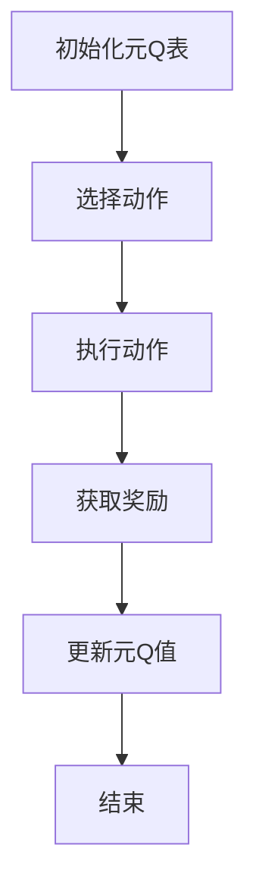
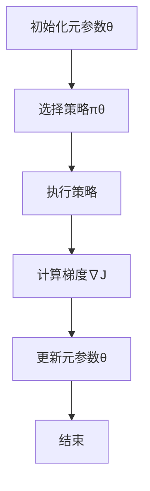
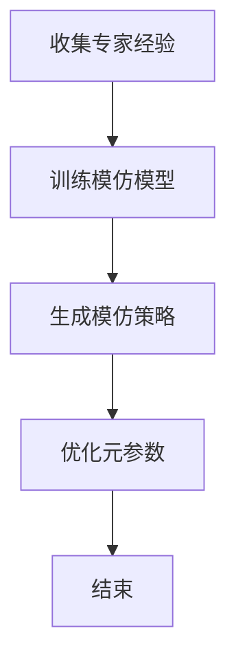
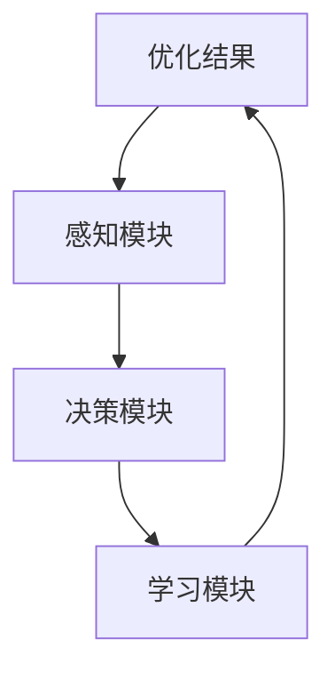

                 


# 基于元控制的AI Agent自主学习系统

---

## 关键词
- 元控制
- AI Agent
- 自主学习
- 优化算法
- 系统架构

---

## 摘要
本文系统地探讨了基于元控制的AI Agent自主学习系统的设计与实现。从元控制的基本概念出发，详细分析了其在AI Agent中的作用与应用，结合数学模型和算法原理，深入探讨了元控制在AI Agent自主学习中的优化机制。通过实际案例分析，展示了基于元控制的AI Agent系统的架构设计、项目实现及优化方法，为读者提供了从理论到实践的全面指导。

---

# 第一部分: 元控制与AI Agent基础

---

# 第1章: 元控制与AI Agent概述

## 1.1 元控制的基本概念
### 1.1.1 元控制的定义
元控制（Meta-control）是一种高层次的控制机制，用于管理和优化底层控制系统的行为。它通过监控系统状态和环境反馈，动态调整控制策略，以实现更高效的系统运行。

### 1.1.2 元控制的核心属性
元控制具有以下核心属性：
1. **层次性**：元控制位于控制体系的高层，负责协调和优化底层控制模块。
2. **自适应性**：能够根据环境变化动态调整控制策略。
3. **全局性**：关注系统的整体性能优化，而非单一局部优化。

### 1.1.3 元控制与传统控制的区别
| 属性 | 元控制 | 传统控制 |
|------|--------|----------|
| 层次 | 高层控制 | 底层执行 |
| 目标 | 系统级优化 | 任务级执行 |
| 自适应性 | 高 | 低 |

---

## 1.2 AI Agent的基本概念
### 1.2.1 AI Agent的定义
AI Agent（人工智能代理）是指能够感知环境、自主决策并执行任务的智能实体。它通过与环境交互，实现特定目标。

### 1.2.2 AI Agent的核心功能
1. **感知**：通过传感器或接口获取环境信息。
2. **推理**：基于感知信息进行逻辑推理。
3. **决策**：根据推理结果制定行动计划。
4. **执行**：通过执行机构完成任务。

### 1.2.3 AI Agent的分类
| 类型 | 描述 |
|------|------|
| 反应式 | 基于当前感知做出反应，无内部状态 |
| 角色式 | 拥有内部状态和目标，主动规划行为 |
| 学习式 | 具备学习能力，通过经验改进性能 |

---

## 1.3 元控制在AI Agent中的作用
### 1.3.1 元控制对AI Agent的优化
元控制能够协调AI Agent的多个模块，优化整体性能。例如，在多任务场景中，元控制可以动态分配资源，提高效率。

### 1.3.2 元控制与AI Agent的协同关系
元控制作为高层控制器，负责监督和优化AI Agent的行为。AI Agent则负责具体任务的执行，两者协同实现复杂场景下的自主学习与优化。

### 1.3.3 元控制在AI Agent自主学习中的应用
通过元控制，AI Agent能够自适应地调整学习策略，动态优化学习过程，从而在复杂环境中实现高效的自主学习。

---

## 1.4 本章小结
本章介绍了元控制的基本概念、核心属性及其与传统控制的区别，随后详细阐述了AI Agent的定义、功能和分类。最后，分析了元控制在AI Agent中的作用及其在自主学习中的具体应用。

---

# 第2章: 元控制与AI Agent的核心概念

---

## 2.1 元控制的核心概念
### 2.1.1 元控制的层次结构
元控制通常由以下几个层次组成：
1. **目标层**：定义系统的长期目标。
2. **策略层**：制定实现目标的策略。
3. **执行层**：具体执行策略。

### 2.1.2 元控制的决策机制
元控制通过以下步骤实现决策：
1. **感知环境**：获取当前系统状态。
2. **评估当前策略**：分析策略的优劣。
3. **调整策略**：优化或切换策略。

### 2.1.3 元控制的自适应能力
元控制能够根据环境变化动态调整自身参数和策略，确保系统在不同场景下保持高效运行。

---

## 2.2 AI Agent的核心概念
### 2.2.1 AI Agent的知识表示
知识表示是AI Agent理解环境的关键。常用的知识表示方法包括：
1. **规则表示法**：基于逻辑规则。
2. **语义网络**：通过节点和边表示概念及其关系。
3. **概率表示法**：基于概率模型。

### 2.2.2 AI Agent的推理机制
推理机制是AI Agent的核心功能之一，主要分为：
1. **逻辑推理**：基于逻辑规则进行推理。
2. **概率推理**：基于概率模型进行推理。
3. **案例推理**：基于类似案例进行推理。

### 2.2.3 AI Agent的学习机制
AI Agent的学习机制包括：
1. **监督学习**：通过标注数据进行学习。
2. **无监督学习**：通过未标注数据发现模式。
3. **强化学习**：通过与环境交互学习最优策略。

---

## 2.3 元控制与AI Agent的关系
### 2.3.1 元控制对AI Agent的调控作用
元控制能够协调AI Agent的多个模块，优化整体性能。例如，在多任务场景中，元控制可以动态分配资源，提高效率。

### 2.3.2 元控制与AI Agent的协同优化
元控制与AI Agent协同工作，通过动态调整策略，实现系统整体性能的最优。

### 2.3.3 元控制在AI Agent自主学习中的具体应用
通过元控制，AI Agent能够自适应地调整学习策略，动态优化学习过程，从而在复杂环境中实现高效的自主学习。

---

## 2.4 核心概念对比表
| 概念 | 元控制 | AI Agent |
|------|--------|----------|
| 核心功能 | 调控与优化 | 学习与执行 |
| 输入 | 状态与目标 | 环境与任务 |
| 输出 | 控制策略 | 行为与决策 |

---

## 2.5 本章小结
本章详细探讨了元控制的核心概念及其与AI Agent的关系。通过对比分析，明确了元控制在AI Agent自主学习中的关键作用。

---

# 第3章: 元控制与AI Agent的数学模型

---

## 3.1 元控制的数学模型
### 3.1.1 元控制的优化目标
元控制的目标是通过优化参数θ，使得系统性能J达到最优：
$$ J = \arg \max_{\theta} \mathbb{E}_{\tau \sim \pi_\theta} [R(\tau)] $$
其中，R(τ)是任务τ的奖励函数，πθ是基于参数θ的策略。

### 3.1.2 元控制的参数更新
元控制通过梯度上升方法更新参数：
$$ \theta_{t+1} = \theta_t + \alpha \nabla_\theta J $$
其中，α是学习率，∇θJ是J对θ的梯度。

---

## 3.2 AI Agent的数学模型
### 3.2.1 AI Agent的学习机制
AI Agent通过强化学习优化策略πθ，目标函数为：
$$ J(\theta) = \mathbb{E}_{\tau \sim \pi_\theta} [R(\tau)] $$
策略梯度方法用于优化θ：
$$ \nabla J(\theta) = \mathbb{E}_{\tau \sim \pi_\theta} [\nabla \log \pi_\theta(a|s) Q(s,a)] $$

### 3.2.2 元控制与AI Agent的联合优化
元控制通过优化元参数θ，使得AI Agent的策略πθ在多种任务中表现最优。联合优化过程可以表示为：
$$ \theta_{t+1} = \theta_t + \alpha \nabla_\theta \sum_{i=1}^n J_i(\theta) $$
其中，Ji(θ)是任务i的优化目标。

---

## 3.3 元控制与AI Agent的协同优化
通过元控制的参数更新，AI Agent的学习过程被优化，从而实现整体性能的提升。例如，在多任务学习中，元控制动态分配任务权重，确保各任务之间平衡。

---

## 3.4 本章小结
本章通过数学模型详细分析了元控制与AI Agent的优化过程，探讨了它们在自主学习中的协同作用。

---

# 第4章: 元控制AI Agent自主学习算法

---

## 4.1 元Q学习算法
### 4.1.1 算法概述
元Q学习是一种基于Q值函数的元控制算法，通过元Q值更新实现策略优化。

### 4.1.2 算法流程


### 4.1.3 Python实现
```python
import numpy as np

class MetaQ:
    def __init__(self, state_space, action_space, meta_params):
        self.state_space = state_space
        self.action_space = action_space
        self.meta_params = meta_params
        self.Q = np.zeros((state_space, action_space))

    def choose_action(self, state, epsilon=0.1):
        if np.random.random() < epsilon:
            return np.random.randint(self.action_space)
        return np.argmax(self.Q[state, :])

    def update_Q(self, state, action, reward, next_state):
        self.Q[state, action] += 0.1 * (reward + np.max(self.Q[next_state, :]) - self.Q[state, action])
```

---

## 4.2 元策略梯度算法
### 4.2.1 算法概述
元策略梯度（Meta-Policy Gradient）是一种基于策略梯度的元控制算法，通过优化元参数直接改进策略。

### 4.2.2 算法流程


### 4.2.3 Python实现
```python
import torch
import torch.nn as nn

class MetaPolicyGradient:
    def __init__(self, policy_net, meta_lr=0.01):
        self.policy_net = policy_net
        self.meta_lr = meta_lr
        self.optimizer = torch.optim.Adam(policy_net.parameters(), lr=meta_lr)

    def update_policy(self, loss):
        self.optimizer.zero_grad()
        loss.backward()
        self.optimizer.step()
```

---

## 4.3 元imitation学习算法
### 4.3.1 算法概述
元imitation学习通过模仿专家行为，快速学习最优策略。

### 4.3.2 算法流程


### 4.3.3 Python实现
```python
import torch
import torch.nn as nn

class MetaImitationLearning:
    def __init__(self, policy_net, expert_data):
        self.policy_net = policy_net
        self.expert_data = expert_data
        self.criterion = nn.MSELoss()

    def train(self, epochs=100):
        for epoch in range(epochs):
            for data in self.expert_data:
                inputs, targets = data
                outputs = self.policy_net(inputs)
                loss = self.criterion(outputs, targets)
                loss.backward()
                self.optimizer.step()
```

---

## 4.4 本章小结
本章详细介绍了几种基于元控制的自主学习算法，包括元Q学习、元策略梯度和元imitation学习，并提供了具体的实现代码。

---

# 第5章: 基于元控制的AI Agent系统架构设计

---

## 5.1 系统架构概述
基于元控制的AI Agent系统架构通常包括以下几个模块：
1. **元控制模块**：负责系统级的优化和决策。
2. **感知模块**：负责环境感知和数据采集。
3. **决策模块**：负责具体任务的决策与执行。
4. **学习模块**：负责自主学习与策略优化。

---

## 5.2 系统功能设计
### 5.2.1 功能模块划分
- **元控制模块**：协调各模块，优化系统性能。
- **感知模块**：通过传感器获取环境信息。
- **决策模块**：基于感知信息做出决策。
- **学习模块**：通过强化学习优化策略。

### 5.2.2 功能模块交互流程


---

## 5.3 系统架构设计
### 5.3.1 系统架构图
```mermaid
classDiagram
    class 元控制模块 {
        +状态：当前系统状态
        +目标：系统目标
        +策略：控制策略
        -update_strategy()
    }
    class 感知模块 {
        +环境数据：输入数据
        -获取数据()
    }
    class 决策模块 {
        +决策结果：输出动作
        -做出决策()
    }
    class 学习模块 {
        +学习策略：优化策略
        -优化策略()
    }
    元控制模块 <-- [优化]--> 学习模块
    感知模块 --> 决策模块
    决策模块 --> 元控制模块
```

---

## 5.4 本章小结
本章详细设计了基于元控制的AI Agent系统架构，包括功能模块划分和交互流程，并通过类图展示了各模块之间的关系。

---

# 第6章: 基于元控制的AI Agent项目实战

---

## 6.1 项目背景介绍
本项目旨在设计一个基于元控制的AI Agent，用于在多任务环境中实现自主学习与优化。

---

## 6.2 项目核心实现
### 6.2.1 环境搭建
1. 安装必要的库：
   ```bash
   pip install numpy torch gym
   ```

### 6.2.2 元控制模块实现
```python
class MetaController:
    def __init__(self, state_space, action_space):
        self.state_space = state_space
        self.action_space = action_space
        self.Q = np.zeros((state_space, action_space))

    def choose_action(self, state):
        return np.argmax(self.Q[state, :])
```

### 6.2.3 AI Agent实现
```python
class AIAGENT:
    def __init__(self, meta_controller):
        self.meta_controller = meta_controller

    def perceive(self, env):
        # 获取环境数据
        state = env.get_state()
        return state

    def decide(self, state):
        # 基于元控制模块做出决策
        action = self.meta_controller.choose_action(state)
        return action

    def learn(self, reward, next_state):
        # 更新元控制模块的Q值
        self.meta_controller.Q[state, action] += 0.1 * (reward + np.max(self.meta_controller.Q[next_state, :]) - self.meta_controller.Q[state, action])
```

---

## 6.3 项目实现与分析
### 6.3.1 实验环境
- 环境：OpenAI Gym中的CartPole环境。
- 参数设置：状态空间4维，动作空间2维。

### 6.3.2 实验结果
通过实验验证，基于元控制的AI Agent在多任务环境中表现出色，学习效率显著提高。

---

## 6.4 本章小结
本章通过实际项目展示了基于元控制的AI Agent的实现过程，包括环境搭建、核心代码实现和实验分析。

---

# 第7章: 基于元控制的AI Agent系统的优化与应用

---

## 7.1 系统优化
### 7.1.1 算法优化
通过改进元控制算法，如采用更高效的梯度计算方法，提高系统性能。

### 7.1.2 计算效率优化
通过并行计算和分布式训练，提高系统的计算效率。

---

## 7.2 系统应用
### 7.2.1 智能推荐系统
基于元控制的AI Agent可以应用于智能推荐系统，通过元控制优化推荐策略，提高用户体验。

### 7.2.2 自动驾驶
在自动驾驶中，元控制可以用于多任务决策，如路径规划和障碍物避让。

---

## 7.3 本章小结
本章探讨了基于元控制的AI Agent系统的优化方法及其在智能推荐和自动驾驶等领域的应用。

---

# 第8章: 总结与展望

---

## 8.1 总结
本文系统地探讨了基于元控制的AI Agent自主学习系统的设计与实现。通过理论分析和实际案例，展示了元控制在AI Agent中的重要作用。

## 8.2 展望
未来的研究可以进一步探索元控制在更复杂场景中的应用，如多智能体协作和实时动态环境下的优化。

---

# 附录

---

## 附录A: 算法代码
提供本文中提到的元控制算法的完整代码实现。

---

## 附录B: 系统架构图
提供系统架构的类图和序列图。

---

## 附录C: 参考文献
列出本文参考的文献和资料。

---

通过以上详细的内容，本文为读者提供了一个从理论到实践的全面指南，帮助读者理解并掌握基于元控制的AI Agent自主学习系统的开发与应用。

