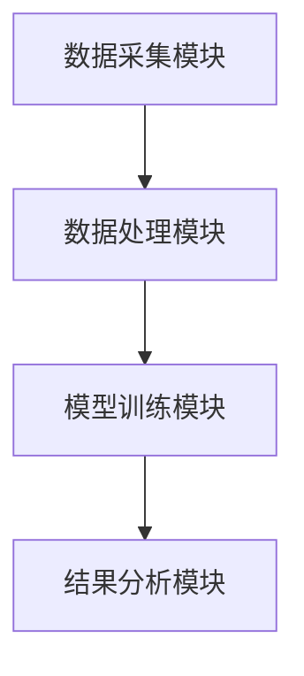
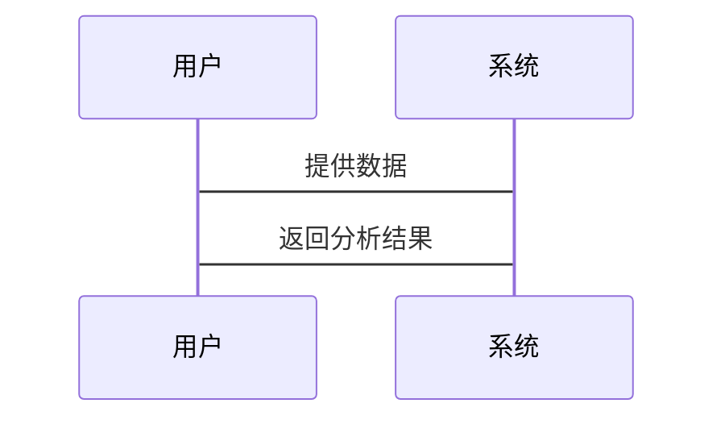

                 


# 《基于图卷积网络的AI Agent社交网络分析》

---

## 关键词：
- 图卷积网络（GCN）
- AI Agent
- 社交网络分析
- 图神经网络
- 社交影响力评估
- 用户行为分析

---

## 摘要：
本文详细探讨了基于图卷积网络（GCN）的AI Agent在社交网络分析中的应用。首先介绍了社交网络分析的背景与重要性，以及AI Agent的基本概念和功能。接着深入分析了图卷积网络的核心原理与算法实现，探讨了其在社交网络中的优势与应用场景。通过实际案例，本文详细展示了如何利用图卷积网络进行用户行为分析、社交影响力评估和社群划分。最后，结合项目实战，提供了系统的架构设计、接口设计和交互流程，总结了当前研究热点与未来发展趋势。

---

# 第3章: AI Agent的基本原理与社交网络分析

## 3.1 AI Agent的基本原理

### 3.1.1 AI Agent的定义与分类
AI Agent（智能体）是指在计算机系统中，能够感知环境并采取行动以实现目标的实体。AI Agent可以分为以下几类：
- **反应式AI Agent**：基于当前感知做出反应，不依赖历史信息。
- **认知式AI Agent**：具备复杂推理和决策能力，能够处理复杂任务。
- **协作式AI Agent**：能够与其他Agent或人类协作完成任务。

### 3.1.2 AI Agent的核心功能
AI Agent的核心功能包括：
- **感知环境**：通过传感器或数据接口获取环境信息。
- **决策与推理**：基于感知信息进行推理和决策。
- **行动执行**：根据决策结果执行相应操作。

### 3.1.3 AI Agent的决策机制
AI Agent的决策机制通常包括以下步骤：
1. **感知环境**：获取当前环境状态。
2. **目标设定**：明确目标和优先级。
3. **推理与规划**：基于当前状态和目标，制定行动方案。
4. **执行决策**：选择最优行动并执行。

---

## 3.2 AI Agent在社交网络分析中的应用

### 3.2.1 用户行为分析
AI Agent可以通过分析用户的社交网络行为，预测用户的兴趣、情感倾向和行为模式。例如：
- **用户兴趣预测**：基于用户的社交行为数据，预测用户的兴趣领域。
- **情感分析**：通过文本挖掘技术，分析用户的情感倾向。
- **行为模式识别**：识别用户的异常行为，如虚假账号或恶意攻击。

### 3.2.2 社交影响力评估
AI Agent可以评估用户在社交网络中的影响力，帮助识别关键用户（意见领袖）。具体方法包括：
- **影响力传播模型**：基于图结构，模拟信息传播路径。
- **影响力评分模型**：通过数学模型计算用户的影响力得分。

### 3.2.3 社群划分
AI Agent可以自动划分社交网络中的社群，帮助理解用户群体的结构。常用方法包括：
- **社区检测算法**：如Louvain算法或标签传播算法。
- **层次聚类**：基于用户行为或属性进行层次聚类。

---

## 3.3 图卷积网络在社交网络分析中的应用

### 3.3.1 图卷积网络的基本思想
图卷积网络（GCN）是一种处理图结构数据的深度学习模型。其基本思想是通过在图中传播信息，捕获节点之间的关系。GCN的核心公式为：
$$
Z = A X W + b
$$
其中：
- \( A \) 是邻接矩阵。
- \( X \) 是节点特征矩阵。
- \( W \) 是权重矩阵。
- \( b \) 是偏置项。

### 3.3.2 图卷积网络的应用场景
- **节点分类**：预测节点的类别标签。
- **链接预测**：预测节点之间是否存在边。
- **图结构分析**：分析图的结构特征。

---

# 第4章: 图卷积网络的算法实现

## 4.1 数据预处理

### 4.1.1 图数据的表示
图数据通常由节点和边组成，可以用邻接矩阵或邻接列表表示。例如，社交网络数据可以表示为：
$$
A = \begin{bmatrix}
0 & 1 & 1 \\
1 & 0 & 1 \\
1 & 1 & 0
\end{bmatrix}
$$

### 4.1.2 节点特征提取
节点特征通常包括文本、行为数据等。例如，用户文本可以用词袋模型或词嵌入（如Word2Vec）表示。

---

## 4.2 模型训练

### 4.2.1 前向传播
GCN的前向传播过程如下：
1. **输入层**：输入节点特征 \( X \)。
2. **卷积层**：通过邻接矩阵 \( A \) 进行传播：
$$
H = A X W_1 + b_1
$$
3. **激活函数**：对输出进行激活：
$$
H = \sigma(H)
$$
4. **输出层**：输出最终结果：
$$
Z = H W_2 + b_2
$$

### 4.2.2 损失函数与优化
常用的损失函数包括交叉熵损失（分类任务）和二元交叉熵损失（二分类任务）。优化方法通常使用Adam优化器。

---

## 4.3 模型评估与优化

### 4.3.1 模型评估
评估指标包括准确率、召回率、F1分数等。

### 4.3.2 模型优化
优化方法包括：
- **超参数调整**：如学习率、批量大小。
- **模型结构优化**：如增加层数或使用残差连接。

---

# 第5章: 系统分析与架构设计

## 5.1 系统架构设计

### 5.1.1 系统功能模块
- **数据采集模块**：采集社交网络数据。
- **数据处理模块**：预处理数据并构建图结构。
- **模型训练模块**：训练GCN模型。
- **结果分析模块**：分析模型输出并生成报告。

### 5.1.2 系统架构图


---

## 5.2 系统接口设计

### 5.2.1 接口设计
- **数据接口**：提供数据输入和输出接口。
- **模型接口**：提供模型训练和预测接口。

### 5.2.2 交互流程


---

# 第6章: 项目实战

## 6.1 环境搭建

### 6.1.1 环境要求
- Python 3.7+
- PyTorch 1.9+
- NetworkX 2.8+

### 6.1.2 安装依赖
```bash
pip install torch networkx matplotlib
```

---

## 6.2 核心代码实现

### 6.2.1 数据预处理
```python
import networkx as nx

# 创建图结构
G = nx.Graph()
G.add_edges_from([(1, 2), (2, 3), (1, 3)])

# 节点特征矩阵
X = torch.randn(3, 10)  # 3个节点，每个节点10维特征
```

### 6.2.2 模型实现
```python
import torch
import torch.nn as nn
import torch.nn.functional as F

class GCN(nn.Module):
    def __init__(self, input_dim, hidden_dim, output_dim):
        super(GCN, self).__init__()
        self.W1 = nn.Parameter(torch.randn(input_dim, hidden_dim))
        self.W2 = nn.Parameter(torch.randn(hidden_dim, output_dim))
        self.b1 = nn.Parameter(torch.zeros(hidden_dim))
        self.b2 = nn.Parameter(torch.zeros(output_dim))

    def forward(self, X, A):
        H = torch.mm(A, torch.mm(X, self.W1) + self.b1)
        H = F.relu(H)
        Z = torch.mm(H, self.W2) + self.b2
        return Z

model = GCN(10, 5, 2)
```

---

## 6.3 实际案例分析

### 6.3.1 案例介绍
假设我们有一个包含3个用户的社交网络，目标是预测用户的兴趣类别。

### 6.3.2 训练过程
```python
criterion = nn.CrossEntropyLoss()
optimizer = torch.optim.Adam(model.parameters(), lr=0.01)

for epoch in range(100):
    outputs = model(X, A)
    loss = criterion(outputs, labels)
    loss.backward()
    optimizer.step()
```

### 6.3.3 结果分析
```python
predicted = torch.argmax(outputs, 1)
print(predicted)
```

---

## 6.4 项目小结
通过本章的项目实战，我们详细展示了如何基于图卷积网络构建AI Agent，并应用于社交网络分析。从环境搭建到代码实现，再到结果分析，整个过程清晰明了。

---

# 第7章: 系统优化与未来展望

## 7.1 系统优化

### 7.1.1 模型优化
- 使用更深的网络结构（如GCN++）。
- 引入注意力机制（如GAT）。

### 7.1.2 系统性能优化
- 优化数据预处理流程。
- 使用分布式计算加速训练。

---

## 7.2 未来展望

### 7.2.1 研究热点
- 图神经网络的可解释性。
- 图数据的实时处理与分析。

### 7.2.2 技术发展趋势
- 图神经网络与强化学习的结合。
- 图数据的安全与隐私保护。

---

## 7.3 最佳实践Tips

### 7.3.1 数据处理
- 确保数据的完整性和准确性。
- 处理缺失值和异常值。

### 7.3.2 模型选择
- 根据任务需求选择合适的模型。
- 通过实验验证模型效果。

### 7.3.3 系统设计
- 设计模块化系统，便于扩展和维护。
- 使用可视化工具监控系统运行状态。

---

## 7.4 小结
通过本文的系统分析与优化，我们可以看到，基于图卷积网络的AI Agent在社交网络分析中具有广阔的应用前景。未来，随着技术的进步，这一领域将会有更多的创新与突破。

---

# 结语

基于图卷积网络的AI Agent社交网络分析是一项复杂但极具价值的技术。通过本文的详细讲解，我们了解了其核心原理、算法实现和实际应用。希望本文能够为读者提供有价值的参考，进一步推动这一领域的研究与实践。

