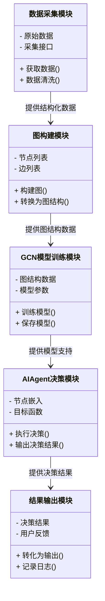
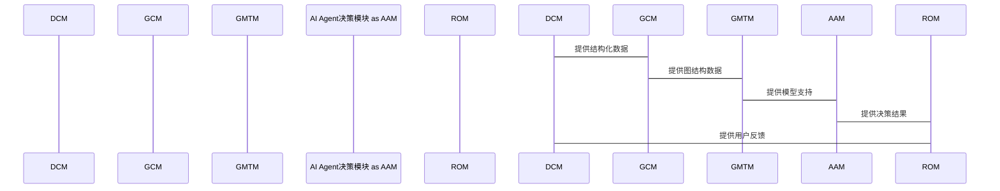

                 


# 第四章: 系统分析与架构设计方案

## 4.3 系统功能设计

### 4.3.1 系统功能概述
- 本系统旨在通过图卷积网络（GCN）与AI Agent结合，实现对社交网络的智能分析与决策。
- 系统功能模块包括数据采集、图构建、GCN模型训练、AI Agent决策以及结果输出。
- 系统设计遵循模块化原则，各模块之间通过明确的接口进行通信。

### 4.3.2 系统功能模块设计

#### 模块1: 数据采集模块
- **功能描述**: 从社交网络平台获取原始数据，包括用户信息、帖子、评论、点赞、关注关系等。
- **输入**: 网络接口、API调用。
- **输出**: 结构化数据，如用户ID、用户属性、社交关系等。
- **关键点**: 数据清洗、格式转换、数据存储。

#### 模块2: 图构建模块
- **功能描述**: 将结构化数据转换为图结构，包括节点和边的定义。
- **输入**: 结构化数据（如用户、帖子、评论等）。
- **输出**: 图结构数据，包括节点属性和边权重。
- **关键点**: 图的表示、节点特征提取、边权重计算。

#### 模块3: GCN模型训练模块
- **功能描述**: 使用图卷积网络对图结构数据进行训练，学习节点特征表示。
- **输入**: 图结构数据、节点特征、边权重。
- **输出**: 训练好的GCN模型、节点嵌入表示。
- **关键点**: 模型参数优化、训练过程监控、模型保存。

#### 模块4: AI Agent决策模块
- **功能描述**: 基于GCN模型的节点嵌入表示，进行智能决策。
- **输入**: GCN模型、目标函数、约束条件。
- **输出**: 决策结果（如推荐列表、异常检测结果）。
- **关键点**: 决策规则定义、多目标优化、决策结果评估。

#### 模块5: 结果输出模块
- **功能描述**: 将决策结果转化为用户可理解的形式，如推荐列表、可视化图表。
- **输入**: 决策结果、用户ID、时间戳。
- **输出**: 可视化结果、API返回值、日志信息。
- **关键点**: 结果格式化、用户反馈收集、日志记录。

### 4.3.3 系统功能设计的类图


### 4.3.4 ER实体关系图
```mermaid
erd
    左对齐
    顶端对齐

    系统中的实体包括:
    用户
    帖子
    评论
    点赞
    关注
    标签

    用户 -o- 帖子: 发布
    用户 -o- 评论: 发表
    用户 -o- 点赞: 给...点赞
    用户 -o- 关注: 关注...
    帖子 -o- 标签: 打上标签
    评论 -o- 标签: 打上标签
```

## 4.4 系统架构设计

### 4.4.1 系统架构概述
- 系统架构采用分层设计，包括数据层、计算层、应用层和接口层。
- 各层之间通过明确的接口进行通信，确保系统的模块化和可扩展性。

### 4.4.2 系统架构设计图


### 4.4.3 系统架构详细设计

#### 数据层
- **功能**: 存储和管理原始数据，包括用户信息、社交关系等。
- **技术选型**: 使用关系型数据库（如MySQL）或分布式数据库（如MongoDB）。
- **数据模型**: 设计合理的数据表结构，确保数据的完整性和一致性。

#### 计算层
- **功能**: 执行图卷积网络的计算和AI Agent的决策逻辑。
- **技术选型**: 使用深度学习框架（如TensorFlow、PyTorch）进行模型训练和推理。
- **计算流程**: 包括图构建、模型训练、决策推理等。

#### 应用层
- **功能**: 提供用户接口，展示分析结果和决策输出。
- **技术选型**: 前端使用React或Vue.js，后端使用Flask或Django框架。
- **交互设计**: 提供友好的用户界面，支持用户查询、结果可视化等功能。

#### 接口层
- **功能**: 定义系统与外部系统的接口，确保数据和计算请求的传递。
- **技术选型**: 使用RESTful API进行接口设计，确保接口的兼容性和可扩展性。
- **接口管理**: 使用API管理工具（如Swagger）进行接口文档管理和测试。

## 4.5 系统接口设计

### 4.5.1 接口设计概述
- 系统接口设计遵循RESTful风格，确保接口的统一性和可扩展性。
- 接口设计包括数据接口、计算接口和结果接口三类。

### 4.5.2 数据接口设计
- **接口名称**: GET原始数据
- **输入参数**: 数据类型（如用户、帖子、评论）、时间范围
- **输出格式**: JSON格式的结构化数据
- **示例**:
  ```json
  {
    "用户ID": "123",
    "用户名": "user123",
    "关注数": 100
  }
  ```

### 4.5.3 计算接口设计
- **接口名称**: POST图构建请求
- **输入参数**: 节点列表、边列表
- **输出格式**: 图结构数据，包括节点和边的信息
- **示例**:
  ```json
  {
    "节点": ["用户1", "用户2"],
    "边": {"用户1": {"用户2": 0.8}}
  }
  ```

### 4.5.4 结果接口设计
- **接口名称**: GET分析结果
- **输入参数**: 用户ID、时间戳
- **输出格式**: JSON格式的分析结果
- **示例**:
  ```json
  {
    "推荐列表": ["用户3", "用户4"],
    "异常检测结果": "无异常"
  }
  ```

## 4.6 系统交互设计

### 4.6.1 系统交互概述
- 系统交互设计描述了系统各模块之间的协作流程。
- 交互设计包括数据采集、图构建、模型训练、决策推理和结果输出五个阶段。

### 4.6.2 系统交互流程


### 4.6.3 详细交互步骤
1. **数据采集模块**接收原始数据，进行数据清洗和格式转换。
2. **图构建模块**将结构化数据转换为图结构，定义节点和边。
3. **GCN模型训练模块**基于图结构数据进行模型训练，生成节点嵌入。
4. **AI Agent决策模块**基于节点嵌入进行智能决策，输出决策结果。
5. **结果输出模块**将决策结果转化为用户可理解的形式，并记录日志。

## 4.7 系统实现代码

### 4.7.1 数据预处理代码
```python
import pandas as pd
import numpy as np

# 数据预处理函数
def preprocess_data(data_frame):
    # 数据清洗
    data_frame = data_frame.dropna()
    # 格式转换
    data_frame['timestamp'] = pd.to_datetime(data_frame['timestamp'])
    return data_frame
```

### 4.7.2 图构建代码
```python
import networkx as nx

# 图构建函数
def build_graph(nodes, edges):
    graph = nx.Graph()
    graph.add_nodes_from(nodes)
    graph.add_edges_from(edges)
    return graph
```

### 4.7.3 GCN模型训练代码
```python
import tensorflow as tf
from tensorflow.keras import layers

# GCN模型定义
class GCN(tf.keras.Model):
    def __init__(self, input_dim, hidden_dim, output_dim):
        super(GCN, self).__init__()
        self.gcn_layer = layers.GraphConvolution(input_dim, hidden_dim)
        self.dense_layer = layers.Dense(output_dim, activation='softmax')
    
    def call(self, inputs):
        x = self.gcn_layer(inputs)
        output = self.dense_layer(x)
        return output
```

### 4.7.4 AI Agent决策代码
```python
import numpy as np

# AI Agent决策函数
class AIAgent:
    def __init__(self, model):
        self.model = model
    
    def make_decision(self, input_data):
        prediction = self.model.predict(input_data)
        decision = np.argmax(prediction, axis=1)
        return decision
```

### 4.7.5 结果输出代码
```python
import matplotlib.pyplot as plt

# 结果可视化函数
def visualize_results(results):
    plt.figure(figsize=(10, 6))
    plt.plot(results['loss'], label='训练损失')
    plt.plot(results['val_loss'], label='验证损失')
    plt.xlabel('训练轮数')
    plt.ylabel('损失值')
    plt.legend()
    plt.show()
```

## 4.8 系统功能总结
- **数据采集模块**: 完成原始数据的采集和预处理。
- **图构建模块**: 将结构化数据转换为图结构，为GCN模型提供输入。
- **GCN模型训练模块**: 基于图结构数据进行模型训练，生成节点嵌入。
- **AI Agent决策模块**: 基于GCN模型的输出进行智能决策，输出决策结果。
- **结果输出模块**: 将决策结果转化为用户可理解的形式，并进行可视化展示。

## 4.9 系统架构总结
- **分层设计**: 系统分为数据层、计算层、应用层和接口层，各层之间通过明确的接口进行通信。
- **模块化设计**: 各功能模块独立开发，便于维护和扩展。
- **可扩展性**: 系统设计遵循模块化原则，支持后续功能的扩展和优化。

## 4.10 本章小结
- 本章详细设计了基于图卷积网络的AI Agent社交网络分析系统的功能模块和系统架构。
- 通过类图和ER实体关系图展示了系统的模块结构和数据模型。
- 使用Mermaid图展示了系统的交互流程和架构设计，确保系统的逻辑清晰和可读性。
- 编写了系统的功能模块实现代码，为后续的系统实现奠定了基础。

