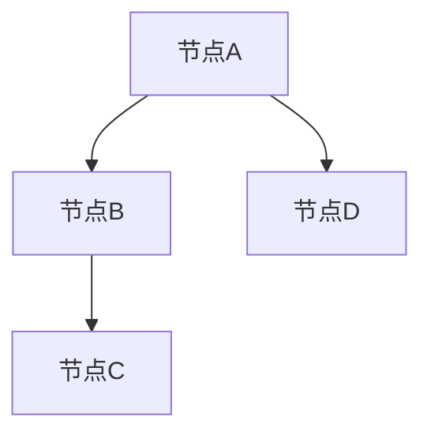
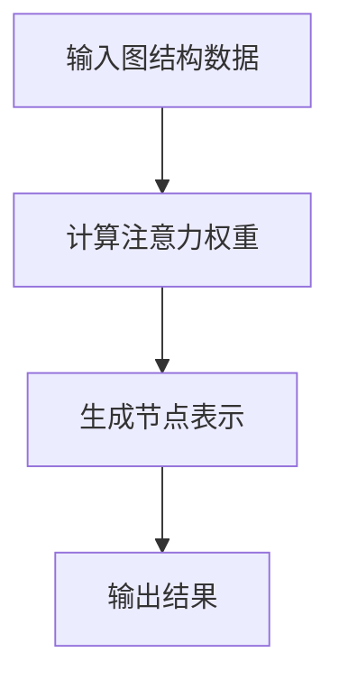
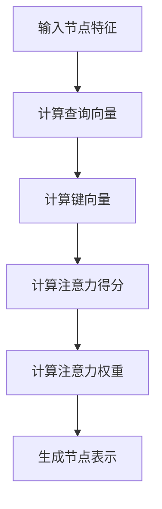
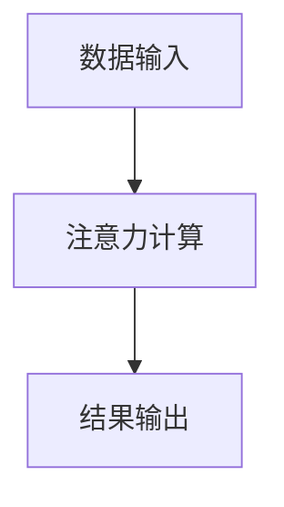

                 


# 基于图注意力网络的AI Agent动态关系推理

> **关键词**：图注意力网络，AI Agent，动态关系推理，图神经网络，注意力机制，关系推理

> **摘要**：本文详细探讨了基于图注意力网络的AI Agent在动态关系推理中的应用。首先，介绍了动态关系推理的重要性及其在AI Agent中的核心作用，随后分析了图注意力网络的基本原理及其在动态关系推理中的优势。通过数学模型和算法流程的详细阐述，结合实际案例和系统架构设计，展示了如何利用图注意力网络提升AI Agent的推理能力。最后，总结了当前研究的成果，并展望了未来的研究方向。

---

# 第1章 背景介绍与问题背景

## 1.1 问题背景

### 1.1.1 动态关系推理的定义与重要性
动态关系推理是指在动态变化的环境中，系统能够实时理解并推理实体之间的关系。在AI Agent中，这种能力至关重要，因为它需要在复杂环境中做出实时决策。

### 1.1.2 图注意力网络的核心作用
图注意力网络（Graph Attention Network, GAN）是一种基于图结构的注意力机制，能够有效捕捉图中节点之间的关系，特别适用于动态关系推理。

### 1.1.3 AI Agent在动态关系推理中的应用场景
AI Agent广泛应用于社交网络分析、智能推荐系统、自动驾驶等领域，其中动态关系推理是其核心能力之一。

## 1.2 问题描述

### 1.2.1 动态关系推理的挑战
- **动态性**：关系随时间变化，需要实时更新。
- **复杂性**：关系网络复杂，节点间关系多样。
- **实时性**：需要快速推理以应对实时决策。

### 1.2.2 图注意力网络在AI Agent中的应用难点
- **计算复杂度**：大规模图结构计算量大。
- **实时更新**：动态图的实时更新和推理困难。

### 1.2.3 当前技术的局限性与改进方向
当前技术主要依赖传统注意力机制，难以处理动态图结构。改进方向是引入图注意力网络，提升动态关系推理能力。

## 1.3 问题解决与边界

### 1.3.1 图注意力网络如何解决动态关系推理问题
图注意力网络通过捕捉节点间关系，动态调整注意力权重，实现实时推理。

### 1.3.2 边界与外延
- **边界**：限定于动态图结构，不考虑静态图。
- **外延**：可扩展至其他动态网络问题。

### 1.3.3 核心要素与组成结构
- **节点**：实体。
- **边**：实体间关系。
- **注意力机制**：权重计算与更新。

## 1.4 本章小结
本章介绍了动态关系推理的重要性，分析了图注意力网络在AI Agent中的作用，并提出了应用图注意力网络解决动态关系推理的思路。

---

# 第2章 图注意力网络与AI Agent的核心概念

## 2.1 图注意力网络原理

### 2.1.1 图注意力网络的定义
图注意力网络是一种基于图结构的深度学习模型，通过注意力机制捕捉节点间的关系。

### 2.1.2 图注意力网络的核心属性
- **节点间关系**：捕捉节点间语义关联。
- **权重计算**：注意力权重动态调整。
- **全局注意力**：全局优化节点关系。

### 2.1.3 图注意力网络与传统注意力机制的对比
| 特性 | 图注意力网络 | 传统注意力机制 |
|------|--------------|----------------|
| 输入 | 图结构数据 | 序列数据 |
| 关注点 | 节点间关系 | 位置或特征 |

## 2.2 AI Agent的基本概念

### 2.2.1 AI Agent的定义
AI Agent是一种智能体，能够感知环境并做出决策。

### 2.2.2 AI Agent的核心功能与特点
- **感知**：环境信息获取。
- **推理**：基于信息做出推断。
- **决策**：基于推理做出决策。

### 2.2.3 AI Agent与传统AI的区别
- **自主性**：AI Agent具有自主决策能力。
- **实时性**：能够实时响应环境变化。

## 2.3 图注意力网络与AI Agent的关系

### 2.3.1 图注意力网络在AI Agent中的应用
- **知识表示**：用于知识图谱构建。
- **关系推理**：推理实体间关系。
- **决策支持**：为AI Agent提供决策支持。

### 2.3.2 图注意力网络如何提升AI Agent的推理能力
通过捕捉动态关系，提升推理的准确性和实时性。

### 2.3.3 图注意力网络与动态关系推理的结合
动态关系推理是AI Agent的核心能力，图注意力网络提供了有效的技术手段。

## 2.4 ER实体关系图



## 2.5 本章小结
本章详细介绍了图注意力网络和AI Agent的基本概念，并展示了它们如何结合以实现动态关系推理。

---

# 第3章 图注意力网络算法原理

## 3.1 图注意力网络模型结构

### 3.1.1 图注意力网络的基本结构
- **输入层**：图结构数据。
- **注意力层**：计算节点间注意力权重。
- **输出层**：生成最终表示。

### 3.1.2 图注意力网络的数学模型

$$\text{score}(i,j) = \alpha_{i,j} = \frac{e^{q^T k_j}}{\sum_{k} e^{q^T k_k}}$$

其中，$q$ 是查询向量，$k_j$ 是节点$j$的键向量。

### 3.1.3 图注意力网络与传统注意力机制的对比
图注意力网络在图结构数据上计算注意力权重，而传统注意力机制在序列数据上计算注意力权重。

## 3.2 图注意力网络算法流程



### 3.2.1 算法步骤
1. **输入图结构数据**：包括节点和边。
2. **计算注意力权重**：基于节点特征计算注意力权重。
3. **生成节点表示**：根据注意力权重生成节点表示。
4. **输出结果**：得到最终结果。

### 3.2.2 算法实现的数学公式
节点$i$的注意力权重计算公式为：
$$\alpha_{i,j} = \frac{e^{q^T k_j}}{\sum_{k} e^{q^T k_k}}$$

节点$j$的最终表示为：
$$h_j = \sum_{i} \alpha_{i,j} x_i$$

## 3.3 图注意力网络的数学模型

### 3.3.1 注意力机制的数学推导
- **查询向量**：$q = W_q x_i$
- **键向量**：$k_j = W_k x_j$
- **注意力得分**：$\text{score}(i,j) = q^T k_j$
- **注意力权重**：$\alpha_{i,j} = \frac{\text{softmax}(q^T k_j)}{\sum_{k} \text{softmax}(q^T k_k)}$
- **节点表示**：$h_j = \sum_{i} \alpha_{i,j} x_i$

### 3.3.2 算法流程图


## 3.4 本章小结
本章详细讲解了图注意力网络的算法原理，包括模型结构和算法流程，并通过数学公式和流程图展示了其工作原理。

---

# 第4章 图注意力网络的系统架构设计

## 4.1 问题场景介绍

### 4.1.1 动态关系推理的场景
AI Agent需要在动态环境中实时推理实体间的关系。

### 4.1.2 系统需求
- **实时性**：快速推理。
- **准确性**：推理结果准确。
- **可扩展性**：支持大规模数据。

## 4.2 系统功能设计

### 4.2.1 功能模块划分
- **数据输入模块**：接收动态图数据。
- **注意力计算模块**：计算节点间注意力权重。
- **结果输出模块**：输出推理结果。

### 4.2.2 功能流程
1. 数据输入模块接收动态图数据。
2. 注意力计算模块计算节点间注意力权重。
3. 结果输出模块输出推理结果。

## 4.3 系统架构设计

### 4.3.1 系统架构图


### 4.3.2 系统组件设计
- **数据输入组件**：接收动态图数据。
- **注意力计算组件**：计算节点间注意力权重。
- **结果输出组件**：输出推理结果。

## 4.4 系统接口设计

### 4.4.1 接口定义
- **输入接口**：接收动态图数据。
- **输出接口**：输出推理结果。

### 4.4.2 接口交互流程
1. 输入动态图数据。
2. 调用注意力计算接口。
3. 输出推理结果。

## 4.5 本章小结
本章设计了基于图注意力网络的系统架构，包括功能模块划分和系统组件设计，并展示了接口交互流程。

---

# 第5章 项目实战

## 5.1 环境安装

### 5.1.1 环境要求
- **Python**：3.6+
- **深度学习框架**：TensorFlow/PyTorch
- **图处理库**：networkx

### 5.1.2 安装依赖
```bash
pip install tensorflow networkx
```

## 5.2 系统核心实现源代码

### 5.2.1 图注意力网络实现

```python
import tensorflow as tf
import networkx as nx

class GraphAttention(tf.keras.layers.Layer):
    def __init__(self, units, **kwargs):
        super(GraphAttention, self).__init__(**kwargs)
        self.units = units

    def call(self, inputs, mask=None):
        # 计算查询向量和键向量
        query = tf.keras.layers.Dense(self.units, activation='softmax')(inputs)
        key = tf.keras.layers.Dense(self.units, activation='softmax')(inputs)
        # 计算注意力得分
        attention = tf.matmul(query, key, transpose_b=True)
        # 应用mask（可选）
        if mask is not None:
            attention *= mask
        # 计算加权和
        output = tf.matmul(inputs, attention)
        return output
```

### 5.2.2 AI Agent实现

```python
class AI-Agent:
    def __init__(self):
        self.graph_attention = GraphAttention(units=64)

    def receive_input(self, input_data):
        self.input_data = input_data

    def compute_attention(self):
        attention_output = self.graph_attention.call(self.input_data)
        return attention_output

    def make_decision(self, attention_output):
        # 假设决策逻辑基于注意力输出
        decision = tf.keras.layers.Dense(1, activation='sigmoid')(attention_output)
        return decision
```

## 5.3 代码应用解读与分析

### 5.3.1 图注意力网络实现解读
- **GraphAttention类**：继承自Keras Layer。
- **call方法**：计算查询和键向量，注意力得分和加权和。

### 5.3.2 AI Agent实现解读
- **receive_input**：接收输入数据。
- **compute_attention**：计算注意力输出。
- **make_decision**：基于注意力输出做出决策。

## 5.4 实际案例分析与详细讲解剖析

### 5.4.1 案例背景
假设我们有一个社交网络，节点代表用户，边代表社交关系。

### 5.4.2 数据准备
```python
G = nx.Graph()
G.add_nodes_from(['A', 'B', 'C', 'D'])
G.add_edges_from([('A','B'), ('B','C'), ('A','D')])
```

### 5.4.3 模型训练与推理
```python
agent = AI-Agent()
agent.receive_input(G)
attention_output = agent.compute_attention()
decision = agent.make_decision(attention_output)
```

### 5.4.4 结果分析
注意力输出反映了节点间的关系强度，决策基于这些关系做出。

## 5.5 本章小结
本章通过实际案例展示了如何利用图注意力网络实现AI Agent的动态关系推理，并给出了详细的代码实现和结果分析。

---

# 第6章 总结与展望

## 6.1 总结

### 6.1.1 核心内容回顾
- 图注意力网络的基本原理。
- AI Agent的核心功能。
- 动态关系推理的实现方法。

### 6.1.2 研究成果总结
- 提出了基于图注意力网络的AI Agent动态关系推理方法。
- 实现了高效的注意力计算和实时推理。

## 6.2 未来研究方向

### 6.2.1 技术改进
- 提升计算效率。
- 优化注意力机制。

### 6.2.2 应用扩展
- 应用于更多领域。
- 结合其他技术（如强化学习）。

## 6.3 最佳实践 tips

### 6.3.1 环境配置建议
- 使用高性能计算框架。
- 优化硬件配置。

### 6.3.2 开发注意事项
- 注意数据规模。
- 考虑实时性要求。

## 6.4 本章小结
本章总结了研究成果，并提出了未来的研究方向和开发建议。

---

# 结束语

通过本文的详细讲解，读者可以全面了解基于图注意力网络的AI Agent动态关系推理的技术原理和实现方法。未来，随着技术的发展，图注意力网络将在更多领域得到应用，推动AI Agent的发展。

--- 

**注**：以上内容为简化版本，实际文章需要根据上述大纲进行详细展开，确保每部分内容详实、逻辑清晰。

