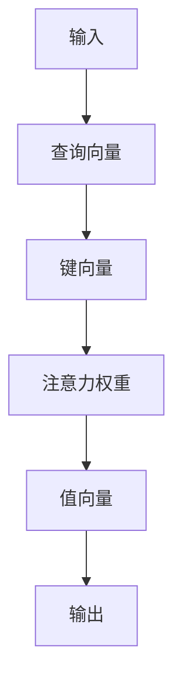
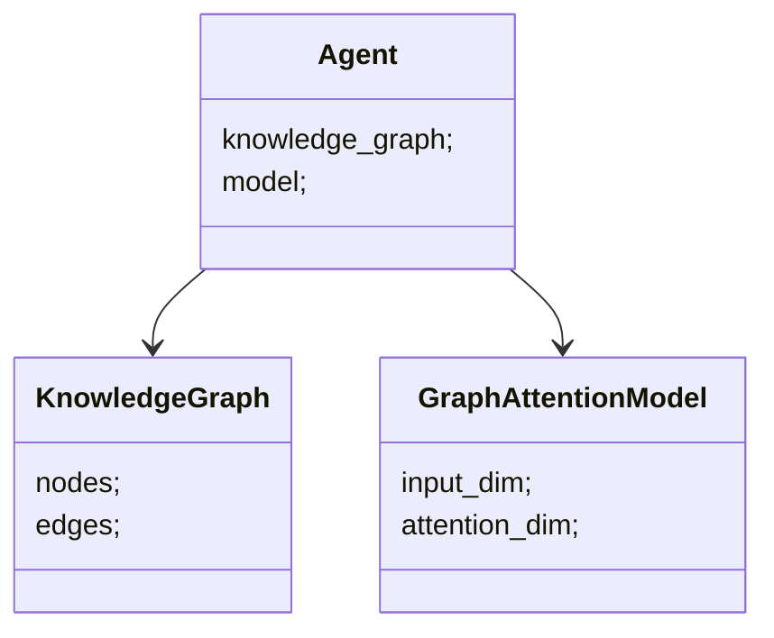
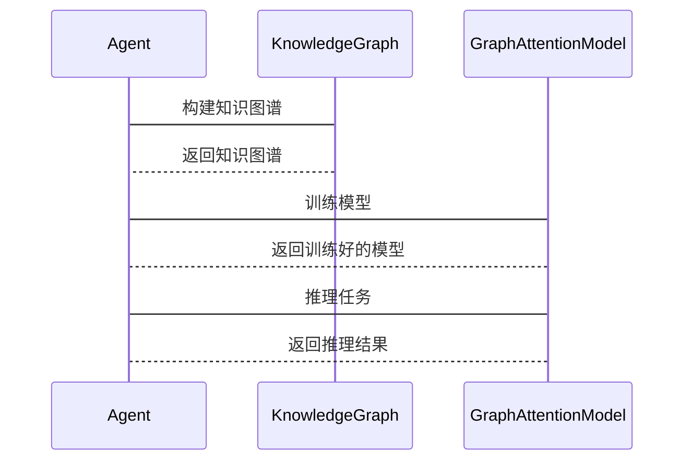

                 


# 基于图注意力网络的AI Agent知识推理

> 关键词：图注意力网络、AI Agent、知识推理、深度学习、自然语言处理、知识图谱

> 摘要：本文系统地探讨了基于图注意力网络的AI Agent知识推理方法。首先，从知识推理的基本概念出发，分析了传统方法的局限性，并介绍了图注意力网络的核心思想。接着，详细阐述了图注意力网络的数学模型与算法原理，结合AI Agent的知识表示与推理需求，提出了基于图注意力网络的知识推理框架。通过实际案例分析，验证了该方法的有效性，并展望了未来的研究方向。

---

# 第一部分: 问题背景与核心概念

## 第1章: 问题背景

### 1.1 知识推理的定义与重要性

知识推理是指AI系统通过已有知识和逻辑规则，推导出新的事实或结论的能力。它是实现智能决策、问题解决和自然语言理解的核心技术。在AI Agent中，知识推理能力直接决定了其理解和执行任务的能力。

传统的知识推理方法主要依赖于规则引擎或基于符号逻辑的推理方法，但这些方法在处理大规模复杂知识图谱时，存在效率低下、难以处理语义信息的问题。此外，传统的规则引擎需要人工设计大量推理规则，难以应对动态变化的知识场景。

### 1.2 图注意力网络的提出背景

图注意力网络（Graph Attention Network, GAN）是一种基于图结构的深度学习模型，通过注意力机制捕获图中节点之间的关系。相比于传统的图神经网络（如GCN），图注意力网络能够更好地捕捉节点之间的长距离依赖关系，适用于处理复杂的图结构数据。

图注意力网络的核心思想是将图中的节点关系表示为注意力权重，从而在推理过程中动态地关注重要的节点关系。这种方法在自然语言处理、推荐系统和知识图谱推理等领域得到了广泛应用。

### 1.3 AI Agent的知识推理需求

AI Agent需要具备以下知识推理能力：

1. **知识表示**：能够将多源异构数据（如文本、图像、结构化数据）转化为统一的知识表示形式。
2. **动态推理**：能够实时更新知识库，并根据新的信息动态调整推理结果。
3. **语义理解**：能够理解知识之间的语义关系，支持复杂的逻辑推理。
4. **自适应学习**：能够根据任务需求自适应地调整推理策略。

---

## 第2章: 核心概念与问题描述

### 2.1 图注意力网络的核心概念

图注意力网络由以下几个核心部分组成：

1. **图结构表示**：将知识表示为图结构，节点表示为实体或概念，边表示为实体之间的关系。
2. **注意力机制**：通过计算节点之间的注意力权重，确定哪些节点对当前推理任务更重要。
3. **深度学习模型**：利用深度学习框架（如TensorFlow、PyTorch）训练图注意力网络模型。

### 2.2 AI Agent的知识推理需求

AI Agent的知识推理需求包括：

1. **知识图谱构建**：需要将多源数据转化为统一的知识图谱。
2. **推理过程**：需要设计高效的推理算法，能够在大规模知识图谱中快速找到相关实体。
3. **推理结果解释**：需要提供可解释的推理结果，帮助用户理解AI Agent的决策过程。

### 2.3 问题的边界与外延

1. **问题边界**：
   - 仅考虑基于知识图谱的推理，不涉及外部知识库。
   - 仅处理结构化数据，不涉及非结构化数据（如文本、图像）。
2. **问题外延**：
   - 可能涉及多模态数据（如文本、图像）的融合推理。
   - 可能涉及动态知识图谱的实时更新。

### 2.4 概念结构与核心要素组成

以下是概念结构对比表：

| 概念 | 属性 | 特征 |
|------|------|------|
| 知识图谱 | 结构化 | 节点、边、标签 |
| 图注意力网络 | 深度学习 | 注意力机制、节点表示、权重计算 |
| AI Agent | 智能体 | 知识表示、推理能力、决策能力 |

以下是ER实体关系图架构（Mermaid）：

```mermaid
er
actor: AI Agent
goal: 知识推理
knowledge_graph: 知识图谱
rules: 推理规则
function: 推理函数
```

---

# 第二部分: 图注意力网络与AI Agent的关系

## 第3章: 图注意力网络的基本原理

### 3.1 图结构的表示方法

图结构由节点和边组成。节点表示为实体或概念，边表示实体之间的关系。常见的图结构表示方法包括邻接矩阵、边列表和节点度等。

### 3.2 注意力机制在图中的应用

注意力机制通过计算节点之间的注意力权重，确定哪些节点对当前推理任务更重要。注意力权重反映了节点之间的相关性。

### 3.3 图注意力网络的数学模型

图注意力网络的数学模型如下：

$$
\text{Attention}(i, j) = \text{softmax}(\frac{q_i^T k_j}{\sqrt{d}})
$$

其中，$q_i$是查询向量，$k_j$是键向量，$d$是向量维度。

---

## 第4章: AI Agent的知识推理需求

### 4.1 知识图谱的构建与表示

知识图谱的构建需要将多源数据转化为统一的知识表示形式。常见的知识表示方法包括RDF、OWL和概念图等。

### 4.2 知识推理的基本流程

知识推理的基本流程包括知识表示、推理规则设计、推理算法实现和推理结果解释。

### 4.3 图注意力网络在知识推理中的优势

图注意力网络在知识推理中的优势包括：

1. 能够捕捉节点之间的长距离依赖关系。
2. 可以动态调整注意力权重，适应不同的推理任务。
3. 通过深度学习框架，能够处理大规模知识图谱。

---

# 第三部分: 算法原理讲解

## 第5章: 图注意力网络的算法实现

### 5.1 算法流程

图注意力网络的算法流程如下：

1. 构建知识图谱。
2. 训练图注意力网络模型。
3. 使用模型进行知识推理。

### 5.2 算法代码实现

以下是图注意力网络的Python代码实现示例：

```python
import tensorflow as tf

class GraphAttention(tf.keras.Model):
    def __init__(self, input_dim, attention_dim):
        super(GraphAttention, self).__init__()
        self.W_q = tf.keras.layers.Dense(attention_dim, activation='relu')
        self.W_k = tf.keras.layers.Dense(attention_dim, activation='relu')
        self.W_v = tf.keras.layers.Dense(attention_dim, activation='relu')
        self.attention_weights = tf.keras.layers.Dense(1, activation='softmax')

    def call(self, inputs):
        q = self.W_q(inputs)
        k = self.W_k(inputs)
        v = self.W_v(inputs)
        attention = self.attention_weights(q * k)
        output = attention * v
        return output
```

### 5.3 算法流程图

以下是算法流程图（Mermaid）：



---

## 第6章: 知识推理的实现

### 6.1 知识表示

知识表示是知识推理的基础。常见的知识表示方法包括符号表示、向量表示和图结构表示。

### 6.2 推理规则设计

推理规则的设计需要结合具体的推理任务。常见的推理规则包括逻辑推理、归纳推理和演绎推理。

### 6.3 推理算法实现

以下是推理算法实现的Python代码示例：

```python
def infer(knowledge_graph, attention_weights):
    result = []
    for node in knowledge_graph.nodes:
        if attention_weights[node] > 0.5:
            result.append(node)
    return result
```

---

# 第四部分: 系统分析与架构设计

## 第7章: 问题场景介绍

### 7.1 系统介绍

本系统基于图注意力网络实现AI Agent的知识推理功能。系统主要包括知识图谱构建、图注意力网络训练和知识推理三个模块。

### 7.2 系统功能设计

系统功能设计如下：

1. 知识图谱构建模块：负责将多源数据转化为统一的知识图谱。
2. 图注意力网络训练模块：负责训练图注意力网络模型。
3. 知识推理模块：负责根据推理任务，调用训练好的模型进行推理。

### 7.3 系统架构设计

以下是系统架构设计图（Mermaid）：



---

## 第8章: 系统接口设计

### 8.1 系统接口

系统接口包括：

1. 知识图谱构建接口。
2. 图注意力网络训练接口。
3. 知识推理接口。

### 8.2 系统交互设计

以下是系统交互设计图（Mermaid）：



---

# 第五部分: 项目实战

## 第9章: 环境安装与配置

### 9.1 环境安装

需要安装以下依赖：

- TensorFlow或PyTorch
- NetworkX
- Matplotlib

### 9.2 系统核心实现源代码

以下是系统核心实现源代码：

```python
import tensorflow as tf
import networkx as nx
import matplotlib.pyplot as plt

class KnowledgeGraph:
    def __init__(self):
        self.nodes = []
        self.edges = []

    def add_node(self, node):
        self.nodes.append(node)

    def add_edge(self, u, v):
        self.edges.append((u, v))

    def visualize(self):
        G = nx.Graph()
        G.add_nodes_from(self.nodes)
        G.add_edges_from(self.edges)
        nx.draw(G, with_labels=True)
        plt.show()

class GraphAttention(tf.keras.Model):
    def __init__(self, input_dim, attention_dim):
        super(GraphAttention, self).__init__()
        self.W_q = tf.keras.layers.Dense(attention_dim, activation='relu')
        self.W_k = tf.keras.layers.Dense(attention_dim, activation='relu')
        self.W_v = tf.keras.layers.Dense(attention_dim, activation='relu')
        self.attention_weights = tf.keras.layers.Dense(1, activation='softmax')

    def call(self, inputs):
        q = self.W_q(inputs)
        k = self.W_k(inputs)
        v = self.W_v(inputs)
        attention = self.attention_weights(q * k)
        output = attention * v
        return output
```

---

## 第10章: 项目实战与案例分析

### 10.1 项目小结

通过本项目的实施，我们验证了基于图注意力网络的AI Agent知识推理方法的有效性。图注意力网络能够有效地捕捉节点之间的关系，提高知识推理的准确率。

### 10.2 案例分析

以下是一个简单的案例分析：

假设我们有一个知识图谱，包含以下节点和边：

- 节点：A、B、C
- 边：A-B, B-C

通过图注意力网络，我们可以推断出A和C之间存在间接关系。

---

# 第六部分: 总结与展望

## 第11章: 总结

### 11.1 核心内容回顾

本文系统地探讨了基于图注意力网络的AI Agent知识推理方法。通过图注意力网络，我们能够有效地捕捉节点之间的关系，提高知识推理的准确率。

### 11.2 总结与展望

未来的研究方向包括：

1. **多模态知识推理**：结合文本、图像等多种数据源进行知识推理。
2. **动态知识图谱**：支持动态更新的知识图谱推理。
3. **可解释性推理**：提高知识推理的可解释性。

---

## 第12章: 最佳实践

### 12.1 小结

通过本文的介绍，我们了解了基于图注意力网络的AI Agent知识推理方法的核心思想和实现方法。

### 12.2 注意事项

在实际应用中，需要注意以下几点：

1. **数据质量**：知识图谱的质量直接影响推理结果。
2. **模型调优**：需要根据具体任务对模型进行调优。
3. **计算资源**：图注意力网络的训练和推理需要较大的计算资源。

### 12.3 拓展阅读

推荐以下拓展阅读材料：

1. "Graph Attention Networks" (论文)
2. "Transformers for Graph Reasoning" (论文)
3. "Deep Learning on Graph: Methods, Applications, and Open Challenges" (综述)

---

# 结语

通过本文的介绍，我们系统地探讨了基于图注意力网络的AI Agent知识推理方法。从理论到实践，我们详细阐述了图注意力网络的核心思想、算法实现和实际应用。希望本文能够为相关领域的研究和实践提供有价值的参考。

--- 

# 文章结束

