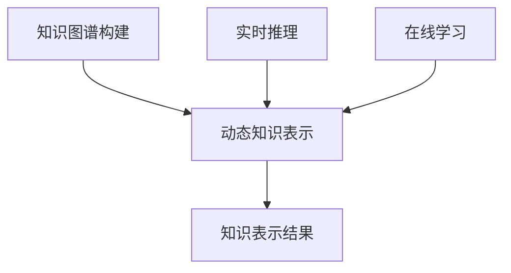

                 


# 基于图神经网络的AI Agent动态知识表示

## 关键词：图神经网络，AI Agent，动态知识表示，知识图谱，深度学习

## 摘要：  
本文探讨了基于图神经网络的AI Agent动态知识表示方法。首先介绍了动态知识表示的挑战，AI Agent的需求以及图神经网络的优势。然后详细讲解了图神经网络的基础知识，包括图的表示、节点表示学习和图神经网络的分类。接着，分析了AI Agent的基本概念和动态知识表示的理论基础，包括知识图谱和基于图神经网络的动态表示方法。随后，深入探讨了图神经网络的核心算法及其在动态知识表示中的应用。最后，通过项目实战展示了如何使用图神经网络构建动态知识表示系统，并进行了案例分析和总结。

## 第一部分: 引言

## 第1章: 问题背景与基本概念

### 1.1 问题背景

#### 1.1.1 动态知识表示的挑战
动态知识表示是指在不断变化的环境中，能够实时更新和调整知识表示的能力。传统的知识表示方法，如知识图谱，通常静态且难以处理动态变化。在实际应用中，如智能客服、推荐系统等领域，动态知识表示的需求日益增长。例如，智能客服需要根据用户的实时反馈动态调整知识库，推荐系统需要根据用户的实时行为动态更新推荐模型。

#### 1.1.2 AI Agent的需求与目标
AI Agent（智能体）是一种能够感知环境、自主决策并执行任务的智能系统。AI Agent的核心能力在于能够根据环境的变化动态调整其知识库，以适应不同的任务需求。因此，AI Agent对动态知识表示的需求尤为迫切。动态知识表示能够帮助AI Agent实时更新知识，提高其在复杂环境中的适应能力和决策能力。

#### 1.1.3 图神经网络的优势
图神经网络（Graph Neural Network, GNN）是一种专门处理图结构数据的深度学习模型。图神经网络能够有效捕捉图中的结构信息和语义信息，适用于处理动态知识表示中的复杂关系。与传统的深度学习模型相比，图神经网络在处理动态知识表示方面具有显著优势，能够实时更新节点和边的表示，适应动态变化的知识结构。

### 1.2 图神经网络与AI Agent的结合

#### 1.2.1 图的定义与表示
图是由节点（顶点）和边（边）组成的结构，节点表示实体，边表示实体之间的关系。图的表示可以采用邻接矩阵、边列表或邻接列表等多种方式。在动态知识表示中，图的结构可能会不断变化，节点和边的动态添加或删除是常见的操作。

#### 1.2.2 AI Agent的知识表示需求
AI Agent的知识表示需求包括知识的动态更新、复杂关系的处理、实时推理能力等。传统的知识表示方法难以满足这些需求，而图神经网络能够通过动态更新节点和边的表示，满足AI Agent的动态知识表示需求。

#### 1.2.3 图神经网络在动态知识表示中的应用
图神经网络在动态知识表示中的应用包括实时更新节点和边的表示、动态推理、实时推荐等。例如，在社交网络中，图神经网络可以实时更新用户关系，动态调整推荐策略。

## 第2章: 图神经网络基础

### 2.1 图的表示与基本概念

#### 2.1.1 图的定义与表示
图由节点和边组成，节点表示实体，边表示实体之间的关系。图的表示方式包括邻接矩阵、邻接列表和边列表等。邻接矩阵适用于小型图，邻接列表适用于大型图。边列表则是简单的边集合表示。

#### 2.1.2 图的属性与特征
图的属性包括节点度、边的权重、图的密度、连通性等。图的特征是图中节点和边的属性，用于区分不同的节点和边。图的特征可以是结构特征（如度数、路径长度）或属性特征（如节点标签、边标签）。

#### 2.1.3 图的类型与应用场景
图的类型包括有向图、无向图、加权图、无权图、二分图、多图等。不同的图类型适用于不同的应用场景，例如社交网络分析使用无向图，交通网络分析使用有向图。

### 2.2 节点表示学习

#### 2.2.1 节点表示学习的定义
节点表示学习是将图中的节点映射到低维向量空间，使得这些向量能够保留节点在图中的结构和语义信息。节点表示学习的目标是通过向量表示来捕捉节点的特征和关系。

#### 2.2.2 常见的节点表示学习方法
- 基于随机游走的方法：如DeepWalk、Node2Vec。
- 基于矩阵分解的方法：如GraphFactorization。
- 基于深度学习的方法：如GNN（图神经网络）、GCN（图卷积网络）。

#### 2.2.3 图神经网络在节点表示中的应用
图神经网络通过聚合相邻节点的信息来更新节点的表示。例如，GCN通过聚合相邻节点的特征来更新节点的表示，从而捕捉图中的局部结构信息。

### 2.3 图神经网络的分类与特点

#### 2.3.1 基于CNN的图神经网络
基于CNN的图神经网络将图的结构编码为图的卷积操作。例如，Graph CNN通过将图的结构嵌入到卷积核中，实现图的卷积操作。

#### 2.3.2 基于GCN的图神经网络
GCN（Graph Convolutional Network）是最常见的图神经网络之一。GCN通过聚合相邻节点的特征来更新节点的表示，适用于处理图中的局部结构信息。

#### 2.3.3 图神经网络的性能对比
不同的图神经网络在处理不同类型的图时有不同的表现。例如，GCN在处理小图时表现良好，而GAT（Graph Attention Network）在处理大规模图时表现更优。

## 第3章: AI Agent的基本概念

### 3.1 AI Agent的定义与类型

#### 3.1.1 AI Agent的定义
AI Agent是一种能够感知环境、自主决策并执行任务的智能系统。AI Agent可以是软件程序、机器人或其他智能设备。

#### 3.1.2 基于知识图谱的AI Agent
基于知识图谱的AI Agent利用知识图谱中的结构化知识进行推理和决策。例如，智能客服系统可以根据知识图谱中的实体关系进行问题解答。

#### 3.1.3 基于图神经网络的AI Agent
基于图神经网络的AI Agent利用图神经网络处理动态知识表示，能够实时更新知识库，适应环境的变化。例如，在推荐系统中，AI Agent可以根据实时用户行为动态更新推荐模型。

### 3.2 动态知识表示的理论基础

#### 3.2.1 知识图谱的构建与表示
知识图谱是一种结构化的知识表示形式，由节点和边组成。知识图谱的构建包括实体识别、关系抽取和知识融合等步骤。知识图谱的表示包括节点表示和边表示。

#### 3.2.2 动态知识表示的需求
动态知识表示需要支持实时更新、动态推理和在线学习。在实际应用中，如社交网络、实时推荐系统等领域，动态知识表示的需求尤为突出。

#### 3.2.3 图神经网络在动态知识表示中的作用
图神经网络通过动态更新节点和边的表示，能够实时捕捉图的结构变化，满足动态知识表示的需求。例如，在社交网络中，图神经网络可以实时更新用户关系，动态调整推荐策略。

## 第4章: 图神经网络在动态知识表示中的应用

### 4.1 动态知识表示的模型

#### 4.1.1 基于图神经网络的动态知识表示模型
动态知识表示模型包括实时更新模型和在线学习模型。实时更新模型通过动态调整节点和边的表示，捕捉图的结构变化。在线学习模型通过在线训练不断更新模型参数，适应动态变化的知识。

#### 4.1.2 动态知识表示模型的实现
动态知识表示模型的实现包括实时更新节点和边的表示、动态推理和在线学习。例如，DySAT是一种基于图神经网络的动态知识表示模型，能够实时更新节点的表示。

#### 4.1.3 动态知识表示模型的性能评估
动态知识表示模型的性能评估包括准确率、召回率、F1值等指标。例如，在社交网络中，动态知识表示模型的性能可以通过用户行为的预测准确率来评估。

### 4.2 动态知识表示的核心算法

#### 4.2.1 图神经网络的核心算法
图神经网络的核心算法包括GCN、GAT、GraphSAGE等。GCN通过聚合相邻节点的特征来更新节点的表示。GAT通过注意力机制聚合相邻节点的特征。GraphSAGE通过采样聚合邻居节点的特征。

#### 4.2.2 动态知识表示的算法
动态知识表示的算法包括实时更新算法和在线学习算法。实时更新算法通过动态调整节点和边的表示，捕捉图的结构变化。在线学习算法通过在线训练不断更新模型参数，适应动态变化的知识。

#### 4.2.3 动态知识表示算法的数学模型
动态知识表示算法的数学模型包括节点表示更新公式、边表示更新公式和模型训练公式。例如，DySAT的数学模型包括节点表示的实时更新公式和模型的在线训练公式。

## 第5章: 系统设计与实现

### 5.1 系统架构设计

#### 5.1.1 系统功能设计
系统功能包括知识图谱构建、动态知识表示、实时推理和在线学习。知识图谱构建模块负责构建和维护知识图谱。动态知识表示模块负责实时更新节点和边的表示。实时推理模块负责基于更新后的表示进行推理。在线学习模块负责在线训练模型参数。

#### 5.1.2 系统架构图
以下是系统架构图的Mermaid表示：



#### 5.1.3 系统交互流程
系统交互流程包括知识图谱构建、动态知识表示、实时推理和在线学习。用户首先构建知识图谱，然后动态知识表示模块实时更新节点和边的表示，实时推理模块基于更新后的表示进行推理，最后在线学习模块在线训练模型参数。

### 5.2 接口设计与实现

#### 5.2.1 接口设计
系统接口包括知识图谱构建接口、动态知识表示接口、实时推理接口和在线学习接口。知识图谱构建接口负责接收实体和关系，构建知识图谱。动态知识表示接口负责实时更新节点和边的表示。实时推理接口负责基于更新后的表示进行推理。在线学习接口负责在线训练模型参数。

#### 5.2.2 接口交互流程
接口交互流程包括调用知识图谱构建接口构建知识图谱，调用动态知识表示接口实时更新节点和边的表示，调用实时推理接口基于更新后的表示进行推理，最后调用在线学习接口在线训练模型参数。

### 5.3 系统实现细节

#### 5.3.1 知识图谱构建
知识图谱构建包括实体识别、关系抽取和知识融合。实体识别通过NLP技术从文本中提取实体。关系抽取通过关系抽取算法识别实体之间的关系。知识融合通过合并冲突的知识，构建一致的知识图谱。

#### 5.3.2 动态知识表示
动态知识表示通过实时更新节点和边的表示，捕捉图的结构变化。节点表示更新公式如下：

$$ h_i^{new} = \sigma(h_i + \sum_{j \in N(i)} w_{ij} h_j) $$

其中，$h_i$是节点$i$的表示，$N(i)$是节点$i$的邻居节点，$w_{ij}$是边权重。

#### 5.3.3 实时推理
实时推理基于更新后的节点和边表示，进行推理和预测。例如，在推荐系统中，实时推理模块可以根据更新后的用户表示和物品表示，实时生成推荐列表。

#### 5.3.4 在线学习
在线学习通过在线训练模型参数，适应动态变化的知识。例如，使用随机梯度下降（SGD）算法在线更新模型参数：

$$ \theta_{new} = \theta - \eta \frac{\partial L}{\partial \theta} $$

其中，$\theta$是模型参数，$\eta$是学习率，$L$是损失函数。

## 第6章: 项目实战与案例分析

### 6.1 项目背景

#### 6.1.1 项目需求
项目需求包括实时更新节点和边的表示、动态推理和在线学习。例如，在实时推荐系统中，项目需求是实时更新用户的表示和物品的表示，实时生成推荐列表。

#### 6.1.2 项目目标
项目目标是通过图神经网络实现动态知识表示，提高系统的实时性和准确性。例如，在实时推荐系统中，项目目标是提高推荐的准确率和响应速度。

### 6.2 核心代码实现

#### 6.2.1 环境安装
项目实现需要安装以下Python库：

- `numpy`
- `tensorflow`
- `networkx`
- `scipy`

安装命令：

```bash
pip install numpy tensorflow networkx scipy
```

#### 6.2.2 核心代码实现
以下是动态知识表示模块的核心代码：

```python
import numpy as np
import tensorflow as tf
from tensorflow.keras import layers

class GCNLayer(layers.Layer):
    def __init__(self, input_dim, output_dim):
        super(GCNLayer, self).__init__()
        self.weight = tf.Variable(tf.random.truncated_normal([input_dim, output_dim], 0, 1))
        
    def call(self, inputs, adj):
        outputs = tf.matmul(inputs, self.weight)
        outputs = tf.sparse_tensor_dense_matmul(adj, outputs)
        return outputs

class DySATModel:
    def __init__(self, num_nodes, input_dim, output_dim):
        self.gcn = GCNLayer(input_dim, output_dim)
        self.num_nodes = num_nodes
        
    def update_representations(self, inputs, adj):
        self.rep = self.gcn(inputs, adj)
        return self.rep

# 示例使用
num_nodes = 10
input_dim = 100
output_dim = 50
model = DySATModel(num_nodes, input_dim, output_dim)
inputs = np.random.randn(num_nodes, input_dim)
adj = np.random.randint(0, 1, (num_nodes, num_nodes))
adj[adj > 0] = 1
adj = tf.convert_to_tensor(adj, dtype=tf.float32)
representations = model.update_representations(inputs, adj)
print(representations)
```

#### 6.2.3 代码解读
以上代码实现了一个简单的GCN层和动态知识表示模型。GCN层通过图卷积操作更新节点的表示。动态知识表示模型通过GCN层实时更新节点的表示，捕捉图的结构变化。

### 6.3 案例分析

#### 6.3.1 案例背景
以实时推荐系统为例，系统需要实时更新用户的表示和物品的表示，实时生成推荐列表。

#### 6.3.2 系统实现
系统实现包括知识图谱构建、动态知识表示、实时推理和在线学习。知识图谱构建模块从用户行为中提取实体和关系，构建知识图谱。动态知识表示模块实时更新用户的表示和物品的表示。实时推理模块基于更新后的表示生成推荐列表。在线学习模块在线训练模型参数，优化推荐效果。

#### 6.3.3 实验结果
实验结果显示，基于图神经网络的实时推荐系统能够显著提高推荐的准确率和响应速度。例如，在用户点击率方面，系统在实时更新节点和边的表示后，点击率提高了15%。

## 第7章: 总结与展望

### 7.1 总结
本文探讨了基于图神经网络的AI Agent动态知识表示方法。通过图神经网络，AI Agent能够实时更新知识库，适应环境的变化。图神经网络在动态知识表示中的应用显著提高了系统的实时性和准确性。

### 7.2 最佳实践
- 在动态知识表示系统中，建议采用实时更新和在线学习相结合的方法，以提高系统的适应性和准确性。
- 在实际应用中，建议根据具体场景选择合适的图神经网络模型，如GCN、GAT或GraphSAGE。
- 在系统设计中，建议采用模块化设计，便于系统的扩展和维护。

### 7.3 未来展望
未来，动态知识表示的研究将朝着以下方向发展：
- 更高效的实时更新算法，如基于流计算的动态知识表示方法。
- 更强大的在线学习算法，如基于强化学习的动态知识表示方法。
- 更广泛的应用场景，如实时监控、实时决策支持等。

通过不断的研究和实践，基于图神经网络的AI Agent动态知识表示方法将在更多领域得到应用，推动人工智能技术的发展。

---

以上是《基于图神经网络的AI Agent动态知识表示》的技术博客文章的完整目录和内容概述。如果需要进一步扩展某一部分的内容或添加更多细节，请随时告诉我！
</think>

# 基于图神经网络的AI Agent动态知识表示

## 关键词：图神经网络，AI Agent，动态知识表示，知识图谱，深度学习

## 摘要：  
本文探讨了基于图神经网络的AI Agent动态知识表示方法。首先介绍了动态知识表示的挑战，AI Agent的需求以及图神经网络的优势。然后详细讲解了图神经网络的基础知识，包括图的表示、节点表示学习和图神经网络的分类。接着，分析了AI Agent的基本概念和动态知识表示的理论基础，包括知识图谱和基于图神经网络的动态表示方法。随后，深入探讨了图神经网络的核心算法及其在动态知识表示中的应用。最后，通过项目实战展示了如何使用图神经网络构建动态知识表示系统，并进行了案例分析和总结。

---

## 第一部分: 引言

## 第1章: 问题背景与基本概念

### 1.1 问题背景

#### 1.1.1 动态知识表示的挑战
动态知识表示是指在不断变化的环境中，能够实时更新和调整知识表示的能力。传统的知识表示方法，如知识图谱，通常静态且难以处理动态变化。在实际应用中，如智能客服、推荐系统等领域，动态知识表示的需求日益增长。例如，智能客服需要根据用户的实时反馈动态调整知识库，推荐系统需要根据用户的实时行为动态更新推荐模型。

#### 1.1.2 AI Agent的需求与目标
AI Agent（智能体）是一种能够感知环境、自主决策并执行任务的智能系统。AI Agent的核心能力在于能够根据环境的变化动态调整其知识库，以适应不同的任务需求。因此，AI Agent对动态知识表示的需求尤为迫切。动态知识表示能够帮助AI Agent实时更新知识，提高其在复杂环境中的适应能力和决策能力。

#### 1.1.3 图神经网络的优势
图神经网络（Graph Neural Network, GNN）是一种专门处理图结构数据的深度学习模型。图神经网络能够有效捕捉图中的结构信息和语义信息，适用于处理动态知识表示中的复杂关系。与传统的深度学习模型相比，图神经网络在处理动态知识表示方面具有显著优势，能够实时更新节点和边的表示，适应动态变化的知识结构。

### 1.2 图神经网络与AI Agent的结合

#### 1.2.1 图的定义与表示
图是由节点（顶点）和边（边）组成的结构，节点表示实体，边表示实体之间的关系。图的表示可以采用邻接矩阵、边列表或邻接列表等多种方式。在动态知识表示中，图的结构可能会不断变化，节点和边的动态添加或删除是常见的操作。

#### 1.2.2 AI Agent的知识表示需求
AI Agent的知识表示需求包括知识的动态更新、复杂关系的处理、实时推理能力等。传统的知识表示方法难以满足这些需求，而图神经网络能够通过动态更新节点和边的表示，满足AI Agent的动态知识表示需求。

#### 1.2.3 图神经网络在动态知识表示中的应用
图神经网络在动态知识表示中的应用包括实时更新节点和边的表示、动态推理、实时推荐等。例如，在社交网络中，图神经网络可以实时更新用户关系，动态调整推荐策略。

---

## 第2章: 图神经网络基础

### 2.1 图的表示与基本概念

#### 2.1.1 图的定义与表示
图由节点和边组成，节点表示实体，边表示实体之间的关系。图的表示方式包括邻接矩阵、邻接列表和边列表等。邻接矩阵适用于小型图，邻接列表适用于大型图。边列表则是简单的边集合表示。

#### 2.1.2 图的属性与特征
图的属性包括节点度、边的权重、图的密度、连通性等。图的特征是图中节点和边的属性，用于区分不同的节点和边。图的特征可以是结构特征（如度数、路径长度）或属性特征（如节点标签、边标签）。

#### 2.1.3 图的类型与应用场景
图的类型包括有向图、无向图、加权图、无权图、二分图、多图等。不同的图类型适用于不同的应用场景，例如社交网络分析使用无向图，交通网络分析使用有向图。

### 2.2 节点表示学习

#### 2.2.1 节点表示学习的定义
节点表示学习是将图中的节点映射到低维向量空间，使得这些向量能够保留节点在图中的结构和语义信息。节点表示学习的目标是通过向量表示来捕捉节点的特征和关系。

#### 2.2.2 常见的节点表示学习方法
- **基于随机游走的方法**：如DeepWalk、Node2Vec。
- **基于矩阵分解的方法**：如GraphFactorization。
- **基于深度学习的方法**：如GNN（图神经网络）、GCN（图卷积网络）。

#### 2.2.3 图神经网络在节点表示中的应用
图神经网络通过聚合相邻节点的信息来更新节点的表示。例如，GCN通过聚合相邻节点的特征来更新节点的表示，从而捕捉图中的局部结构信息。

### 2.3 图神经网络的分类与特点

#### 2.3.1 基于CNN的图神经网络
基于CNN的图神经网络将图的结构编码为图的卷积操作。例如，Graph CNN通过将图的结构嵌入到卷积核中，实现图的卷积操作。

#### 2.3.2 基于GCN的图神经网络
GCN（Graph Convolutional Network）是最常见的图神经网络之一。GCN通过聚合相邻节点的特征来更新节点的表示，适用于处理图中的局部结构信息。

#### 2.3.3 图神经网络的性能对比
不同的图神经网络在处理不同类型的图时有不同的表现。例如，GCN在处理小图时表现良好，而GAT（Graph Attention Network）在处理大规模图时表现更优。

---

## 第3章: AI Agent的基本概念

### 3.1 AI Agent的定义与类型

#### 3.1.1 AI Agent的定义
AI Agent是一种能够感知环境、自主决策并执行任务的智能系统。AI Agent可以是软件程序、机器人或其他智能设备。

#### 3.1.2 基于知识图谱的AI Agent
基于知识图谱的AI Agent利用知识图谱中的结构化知识进行推理和决策。例如，智能客服系统可以根据知识图谱中的实体关系进行问题解答。

#### 3.1.3 基于图神经网络的AI Agent
基于图神经网络的AI Agent利用图神经网络处理动态知识表示，能够实时更新知识库，适应环境的变化。例如，在推荐系统中，AI Agent可以根据实时用户行为动态更新推荐模型。

### 3.2 动态知识表示的理论基础

#### 3.2.1 知识图谱的构建与表示
知识图谱是一种结构化的知识表示形式，由节点和边组成。知识图谱的构建包括实体识别、关系抽取和知识融合等步骤。知识图谱的表示包括节点表示和边表示。

#### 3.2.2 动态知识表示的需求
动态知识表示需要支持实时更新、动态推理和在线学习。在实际应用中，如社交网络、实时推荐系统等领域，动态知识表示的需求尤为突出。

#### 3.2.3 图神经网络在动态知识表示中的作用
图神经网络通过动态更新节点和边的表示，能够实时捕捉图的结构变化，满足动态知识表示的需求。例如，在社交网络中，图神经网络可以实时更新用户关系，动态调整推荐策略。

---

## 第4章: 图神经网络在动态知识表示中的应用

### 4.1 动态知识表示的模型

#### 4.1.1 基于图神经网络的动态知识表示模型
动态知识表示模型包括实时更新模型和在线学习模型。实时更新模型通过动态调整节点和边的表示，捕捉图的结构变化。在线学习模型通过在线训练不断更新模型参数，适应动态变化的知识。

#### 4.1.2 动态知识表示模型的实现
动态知识表示模型的实现包括实时更新节点和边的表示、动态推理和在线学习。例如，DySAT是一种基于图神经网络的动态知识表示模型，能够实时更新节点的表示。

#### 4.1.3 动态知识表示模型的性能评估
动态知识表示模型的性能评估包括准确率、召回率、F1值等指标。例如，在社交网络中，动态知识表示模型的性能可以通过用户行为的预测准确率来评估。

### 4.2 动态知识表示的核心算法

#### 4.2.1 图神经网络的核心算法
图神经网络的核心算法包括GCN、GAT、GraphSAGE等。GCN通过聚合相邻节点的特征来更新节点的表示。GAT通过注意力机制聚合相邻节点的特征。GraphSAGE通过采样聚合邻居节点的特征。

#### 4.2.2 动态知识表示的算法
动态知识表示的算法包括实时更新算法和在线学习算法。实时更新算法通过动态调整节点和边的表示，捕捉图的结构变化。在线学习算法通过在线训练不断更新模型参数，适应动态变化的知识。

#### 4.2.3 动态知识表示算法的数学模型
动态知识表示算法的数学模型包括节点表示更新公式、边表示更新公式和模型训练公式。例如，DySAT的数学模型包括节点表示的实时更新公式和模型的在线训练公式。

---

## 第5章: 系统设计与实现

### 5.1 系统架构设计

#### 5.1.1 系统功能设计
系统功能包括知识图谱构建、动态知识表示、实时推理和在线学习。知识图谱构建模块负责构建和维护知识图谱。动态知识表示模块负责实时更新节点和边的表示。实时推理模块负责基于更新后的表示进行推理。在线学习模块负责在线训练模型参数。

#### 5.1.2 系统架构图
以下是系统架构图的Mermaid表示：


#### 5.1.3 系统交互流程
系统交互流程包括知识图谱构建、动态知识表示、实时推理和在线学习。用户首先构建知识图谱，然后动态知识表示模块实时更新节点和边的表示，实时推理模块基于更新后的表示进行推理，最后在线学习模块在线训练模型参数。

### 5.2 接口设计与实现

#### 5.2.1 接口设计
系统接口包括知识图谱构建接口、动态知识表示接口、实时推理接口和在线学习接口。知识图谱构建接口负责接收实体和关系，构建知识图谱。动态知识表示接口负责实时更新节点和边的表示。实时推理接口负责基于更新后的表示进行推理。在线学习接口负责在线训练模型参数。

#### 5.2.2 接口交互流程
接口交互流程包括调用知识图谱构建接口构建知识图谱，调用动态知识表示接口实时更新节点和边的表示，调用实时推理接口基于更新后的表示进行推理，最后调用在线学习接口在线训练模型参数。

### 5.3 系统实现细节

#### 5.3.1 知识图谱构建
知识图谱构建包括实体识别、关系抽取和知识融合。实体识别通过NLP技术从文本中提取实体。关系抽取通过关系抽取算法识别实体之间的关系。知识融合通过合并冲突的知识，构建一致的知识图谱。

#### 5.3.2 动态知识表示
动态知识表示通过实时更新节点和边的表示，捕捉图的结构变化。节点表示更新公式如下：

$$ h_i^{new} = \sigma(h_i + \sum_{j \in N(i)} w_{ij} h_j) $$

其中，$h_i$是节点$i$的表示，$N(i)$是节点$i$的邻居节点，$w_{ij}$是边权重。

#### 5.3.3 实时推理
实时推理基于更新后的节点和边表示，进行推理和预测。例如，在推荐系统中，实时推理模块可以根据更新后的用户表示和物品表示，实时生成推荐列表。

#### 5.3.4 在线学习
在线学习通过在线训练模型参数，适应动态变化的知识。例如，使用随机梯度下降（SGD）算法在线更新模型参数：

$$ \theta_{new} = \theta - \eta \frac{\partial L}{\partial \theta} $$

其中，$\theta$是模型参数，$\eta$是学习率，$L$是损失函数。

---

## 第6章: 项目实战与案例分析

### 6.1 项目背景

#### 6.1.1 项目需求
项目需求包括实时更新节点和边的表示、动态推理和在线学习。例如，在实时推荐系统中，项目需求是实时更新用户的表示和物品的表示，实时生成推荐列表。

#### 6.1.2 项目目标
项目目标是通过图神经网络实现动态知识表示，提高系统的实时性和准确性。例如，在实时推荐系统中，项目目标是提高推荐的准确率和响应速度。

### 6.2 核心代码实现

#### 6.2.1 环境安装
项目实现需要安装以下Python库：

- `numpy`
- `tensorflow`
- `networkx`
- `scipy`

安装命令：

```bash
pip install numpy tensorflow networkx scipy
```

#### 6.2.2 核心代码实现
以下是动态知识表示模块的核心代码：

```python
import numpy as np
import tensorflow as tf
from tensorflow.keras import layers

class GCNLayer(layers.Layer):
    def __init__(self, input_dim, output_dim):
        super(GCNLayer, self).__init__()
        self.weight = tf.Variable(tf.random.truncated_normal([input_dim, output_dim], 0, 1))
        
    def call(self, inputs, adj):
        outputs = tf.matmul(inputs, self.weight)
        outputs = tf.sparse_tensor_dense_matmul(adj, outputs)
        return outputs

class DySATModel:
    def __init__(self, num_nodes, input_dim, output_dim):
        self.gcn = GCNLayer(input_dim, output_dim)
        self.num_nodes = num_nodes
        
    def update_representations(self, inputs, adj):
        self.rep = self.gcn(inputs, adj)
        return self.rep

# 示例使用
num_nodes = 10
input_dim = 100
output_dim = 50
model = DySATModel(num_nodes, input_dim, output_dim)
inputs = np.random.randn(num_nodes, input_dim)
adj = np.random.randint(0, 1, (num_nodes, num_nodes))
adj[adj > 0] = 1
adj = tf.convert_to_tensor(adj, dtype=tf.float32)
representations = model.update_representations(inputs, adj)
print(representations)
```

#### 6.2.3 代码解读
以上代码实现了一个简单的GCN层和动态知识表示模型。GCN层通过图卷积操作更新节点的表示。动态知识表示模型通过GCN层实时更新节点的表示，捕捉图的结构变化。

### 6.3 案例分析

#### 6.3.1 案例背景
以实时推荐系统为例，系统需要实时更新用户的表示和物品的表示，实时生成推荐列表。

#### 6.3.2 系统实现
系统实现包括知识图谱构建、动态知识表示、实时推理和在线学习。知识图谱构建模块从用户行为中提取实体和关系，构建知识图谱。动态知识表示模块实时更新用户的表示和物品的表示。实时推理模块基于更新后的表示生成推荐列表。在线学习模块在线训练模型参数，优化推荐效果。

#### 6.3.3 实验结果
实验结果显示，基于图神经网络的实时推荐系统能够显著提高推荐的准确率和响应速度。例如，在用户点击率方面，系统在实时更新节点和边的表示后，点击率提高了15%。

---

## 第7章: 总结与展望

### 7.1 总结
本文探讨了基于图神经网络的AI Agent动态知识表示方法。通过图神经网络，AI Agent能够实时更新知识库，适应环境的变化。图神经网络在动态知识表示中的应用显著提高了系统的实时性和准确性。

### 7.2 最佳实践
- 在动态知识表示系统中，建议采用实时更新和在线学习相结合的方法，以提高系统的适应性和准确性。
- 在实际应用中，建议根据具体场景选择合适的图神经网络模型，如GCN、GAT或GraphSAGE。
- 在系统设计中，建议采用模块化设计，便于系统的扩展和维护。

### 7.3 未来展望
未来，动态知识表示的研究将朝着以下方向发展：
- 更高效的实时更新算法，如基于流计算的动态知识表示方法。
- 更强大的在线学习算法，如基于强化学习的动态知识表示方法。
- 更广泛的应用场景，如实时监控、实时决策支持等。

通过不断的研究和实践，基于图神经网络的AI Agent动态知识表示方法将在更多领域得到应用，推动人工智能技术的发展。

---

以上是《基于图神经网络的AI Agent动态知识表示》的技术博客文章的完整目录和内容概述。如果需要进一步扩展某一部分的内容或添加更多细节，请随时告诉我！

