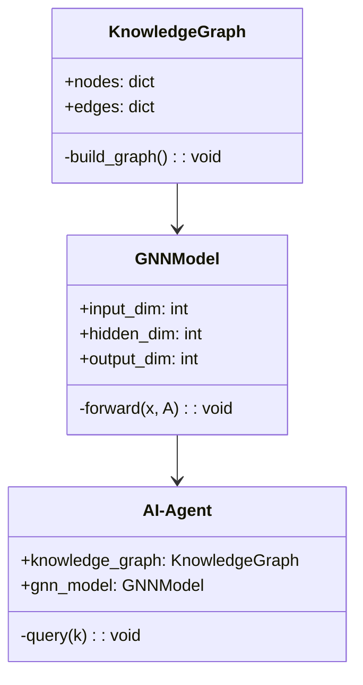
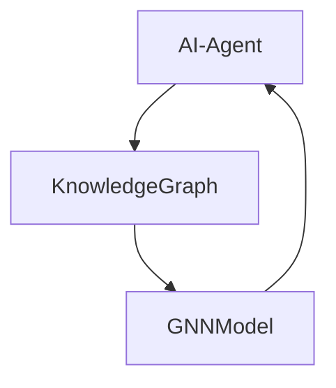
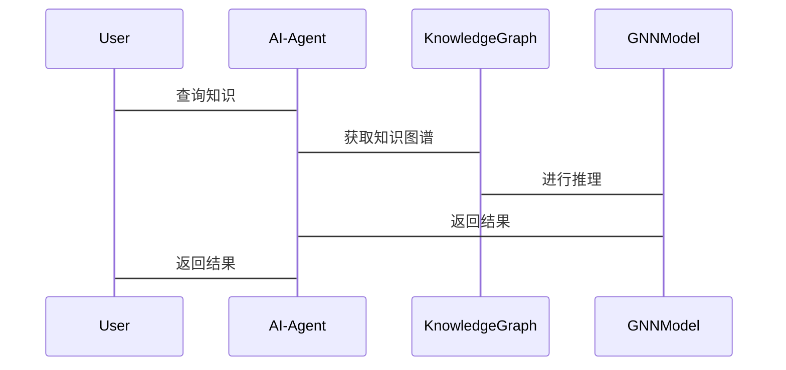

                 


# 基于图神经网络的AI Agent知识推理

> 关键词：图神经网络、AI Agent、知识推理、知识图谱、深度学习

> 摘要：本文详细探讨了基于图神经网络的AI Agent知识推理技术，从背景介绍、核心概念、算法原理到系统架构设计，结合实际项目案例，深入分析了图神经网络在知识推理中的应用及其优势。文章内容丰富，结构清晰，适合技术人员和研究者阅读。

---

## 第一部分: 基于图神经网络的AI Agent知识推理基础

### 第1章: 问题背景与核心概念

#### 1.1 问题背景介绍

##### 1.1.1 知识推理的定义与挑战
知识推理是人工智能领域的重要组成部分，指通过已有知识进行推断，以得出新的结论。传统的知识推理基于符号逻辑，但在处理复杂现实问题时存在局限性，例如难以处理大规模数据和复杂关系。近年来，基于深度学习的知识推理方法逐渐崛起，其中图神经网络（Graph Neural Network，GNN）因其在处理图结构数据方面的天然优势，成为研究热点。

##### 1.1.2 图神经网络的兴起
图神经网络是一种处理图结构数据的深度学习模型，通过在图的节点和边上传播信息，实现节点表示的学习。GNN在社交网络分析、推荐系统、知识图谱构建等领域展现出强大的能力，尤其适合处理复杂的关联关系。

##### 1.1.3 AI Agent在智能系统中的作用
AI Agent（智能体）是能够感知环境并采取行动以实现目标的实体。在知识推理中，AI Agent需要通过与环境交互，动态获取知识并进行推理，从而做出决策。GNN的引入为AI Agent提供了强大的知识表示和推理能力。

#### 1.2 问题描述与目标

##### 1.2.1 知识推理的基本问题
知识推理的核心问题包括：如何表示知识、如何在知识图谱中进行有效的推理、如何处理动态变化的知识等。这些问题需要结合具体场景进行解决。

##### 1.2.2 图神经网络在知识推理中的优势
图神经网络能够处理复杂的图结构数据，捕捉节点之间的关系，适合用于知识图谱的推理任务。

##### 1.2.3 AI Agent的知识推理目标
AI Agent的目标是通过知识推理，理解环境中的实体及其关系，从而做出合理的决策和行动。

#### 1.3 问题解决与边界

##### 1.3.1 知识推理的核心方法
知识推理的核心方法包括符号逻辑推理、概率推理、图结构推理等。图神经网络属于图结构推理的一种。

##### 1.3.2 图神经网络的适用场景
图神经网络适用于处理图结构数据，尤其适合知识图谱、社交网络、推荐系统等场景。

##### 1.3.3 AI Agent的知识推理边界
AI Agent的知识推理能力受到知识库的规模、推理算法的复杂度、计算资源等因素的限制。

#### 1.4 概念结构与核心要素

##### 1.4.1 知识图谱的构建
知识图谱是将实体及其关系以图结构形式表示的知识库，是图神经网络推理的基础。

##### 1.4.2 图神经网络的输入输出
图神经网络的输入是图的节点和边，输出是节点的表示或预测结果。

##### 1.4.3 AI Agent的知识表示与推理
AI Agent通过知识图谱中的实体和关系进行推理，进而做出决策。

#### 1.5 本章小结
本章介绍了知识推理的基本概念、图神经网络的兴起、AI Agent的作用，以及知识推理的核心问题和边界条件。

---

### 第2章: 图神经网络与AI Agent的核心概念

#### 2.1 图神经网络的基本原理

##### 2.1.1 图的基本概念与表示
图由节点（顶点）和边组成，可以表示为 $G = (V, E)$，其中 $V$ 是节点集合，$E$ 是边集合。

##### 2.1.2 图神经网络的节点表示
节点表示是图神经网络的核心，通过聚合邻居节点的信息，更新当前节点的表示。

##### 2.1.3 图神经网络的边表示
边表示用于捕捉节点之间的关系，可以是加权边或无向边。

#### 2.2 AI Agent的知识推理机制

##### 2.2.1 知识表示与推理模型
知识表示模型将知识图谱中的实体和关系表示为向量，推理模型基于这些向量进行推理。

##### 2.2.2 图神经网络的推理方法
图神经网络通过在图结构中传播信息，实现推理任务，例如节点分类、链接预测等。

##### 2.2.3 AI Agent的知识库构建
AI Agent的知识库通常基于知识图谱构建，图神经网络用于知识的表示和推理。

#### 2.3 图神经网络与AI Agent的关系

##### 2.3.1 图神经网络在知识推理中的作用
图神经网络为AI Agent提供了强大的知识表示和推理能力，特别是在处理复杂关系时表现优异。

##### 2.3.2 AI Agent的知识推理能力
AI Agent通过图神经网络可以实现实时的知识推理，适应动态变化的环境。

##### 2.3.3 图神经网络与AI Agent的协同工作
图神经网络为AI Agent提供知识推理能力，AI Agent为图神经网络提供动态的知识更新和应用场景。

#### 2.4 核心概念对比分析

##### 2.4.1 图神经网络与传统神经网络的对比
- **输入**：图神经网络处理图结构数据，传统神经网络处理序列或图像数据。
- **计算方式**：图神经网络通过传播信息进行推理，传统神经网络基于局部特征提取。

##### 2.4.2 AI Agent与传统知识推理模型的对比
- **知识表示**：AI Agent通常结合知识图谱进行表示，传统知识推理基于符号逻辑。
- **推理能力**：AI Agent具有动态推理能力，传统推理模型静态。

##### 2.4.3 图神经网络在AI Agent中的优势
- **实时性**：图神经网络可以实时更新知识表示。
- **复杂性**：能够处理复杂的关联关系。

#### 2.5 本章小结
本章详细讲解了图神经网络的基本原理、AI Agent的知识推理机制，以及两者之间的关系和对比。

---

### 第3章: 图神经网络的算法原理

#### 3.1 图神经网络的基本算法

##### 3.1.1 GNN的基本架构
图神经网络的基本架构包括输入层、隐藏层和输出层，通过传播信息进行推理。

##### 3.1.2 GNN的传播机制
信息传播是图神经网络的核心，通过聚合邻居节点的信息更新当前节点的表示。

##### 3.1.3 GNN的聚合函数
聚合函数用于将邻居节点的信息整合，常用的方法包括平均、加权和注意力机制。

#### 3.2 图神经网络的变体

##### 3.2.1 GCN（Graph Convolutional Network）
GCN是基于卷积操作的图神经网络，通过邻接矩阵进行信息传播。

##### 3.2.2 GAT（Graph Attention Network）
GAT引入注意力机制，通过自注意力机制捕捉节点之间的关系。

##### 3.2.3 GraphSAGE
GraphSAGE是一种基于采样的图神经网络，通过随机采样邻居节点进行信息聚合。

#### 3.3 图神经网络的数学模型

##### 3.3.1 图的表示
图可以表示为 $G = (V, E)$，其中 $V = \{v_1, v_2, \dots, v_n\}$，$E = \{e_1, e_2, \dots, e_m\}$。

##### 3.3.2 节点表示的数学公式
节点表示通常通过聚合邻居节点的特征向量进行更新：
$$ h_v^{(l+1)} = \sigma\left(\sum_{u \in N(v)} W h_u^{(l)}\right) $$
其中，$h_v^{(l)}$ 是节点 $v$ 在第 $l$ 层的表示，$N(v)$ 是节点 $v$ 的邻居节点集合，$W$ 是权重矩阵，$\sigma$ 是激活函数。

##### 3.3.3 图神经网络的损失函数
常用的损失函数包括交叉熵损失和均方误差损失：
$$ L = -\sum_{i=1}^n y_i \log(p_i) + (1 - y_i) \log(1 - p_i) $$

#### 3.4 图神经网络的实现代码

##### 3.4.1 环境安装
需要安装PyTorch和NetworkX库：
```bash
pip install torch networkx
```

##### 3.4.2 核心代码实现
```python
import torch
import torch.nn as nn
import torch.nn.functional as F
import networkx as nx

class GCN(nn.Module):
    def __init__(self, input_dim, hidden_dim, output_dim):
        super(GCN, self).__init__()
        self.W = nn.Parameter(torch.randn(input_dim, hidden_dim))
        self.U = nn.Parameter(torch.randn(hidden_dim, output_dim))
    
    def forward(self, x, A):
        x = F.relu(torch.mm(A, torch.mm(x, self.W)))
        x = torch.mm(x, self.U)
        return x

# 示例图结构
G = nx.path_graph(4)
A = nx.to_numpy_array(G)
```

##### 3.4.3 代码解读与分析
代码实现了一个简单的GCN模型，通过邻接矩阵进行信息传播。前向传播过程中，模型通过矩阵乘法和激活函数更新节点表示。

#### 3.5 本章小结
本章详细讲解了图神经网络的基本算法、数学模型以及实现代码，帮助读者理解GNN的核心原理。

---

### 第4章: AI Agent的知识推理系统架构

#### 4.1 系统问题场景介绍

##### 4.1.1 知识推理的应用场景
知识推理在自然语言处理、推荐系统、智能问答等领域有广泛应用。

##### 4.1.2 AI Agent的知识推理需求
AI Agent需要实时更新知识库并进行推理，以适应动态环境。

##### 4.1.3 系统设计的目标
设计一个基于图神经网络的AI Agent知识推理系统，支持实时推理和动态知识更新。

#### 4.2 系统功能设计

##### 4.2.1 知识图谱构建模块
通过爬取数据和知识抽取技术构建知识图谱。

##### 4.2.2 图神经网络推理模块
基于GNN进行知识推理，输出推理结果。

##### 4.2.3 AI Agent交互模块
通过人机交互接口与用户互动，接收查询并返回结果。

#### 4.3 系统架构设计

##### 4.3.1 领域模型类图
使用Mermaid绘制的领域模型类图如下：


##### 4.3.2 系统架构图
使用Mermaid绘制的系统架构图如下：


##### 4.3.3 系统接口设计
系统接口包括知识图谱构建接口、GNN推理接口和人机交互接口。

##### 4.3.4 系统交互序列图
使用Mermaid绘制的系统交互序列图如下：


#### 4.4 本章小结
本章详细描述了基于图神经网络的AI Agent知识推理系统的架构设计，包括功能模块、类图和交互流程。

---

### 第5章: 项目实战

#### 5.1 环境安装与配置

##### 5.1.1 安装依赖
```bash
pip install torch networkx matplotlib
```

#### 5.2 核心代码实现

##### 5.2.1 知识图谱构建
```python
import networkx as nx

G = nx.Graph()
G.add_nodes_from(['A', 'B', 'C', 'D'])
G.add_edges_from([('A', 'B'), ('B', 'C'), ('C', 'D')])
```

##### 5.2.2 图神经网络推理
```python
class SimpleGNN:
    def __init__(self, nodes, edges):
        self.nodes = nodes
        self.edges = edges
        self.node_embeddings = {n: torch.randn(1, 2) for n in nodes}

    def forward(self):
        for n in self.nodes:
            neighbors = [neighbor for neighbor in self.edges if neighbor[0] == n]
            if not neighbors:
                continue
            aggregated = torch.mean(torch.cat([self.node_embeddings[neighbor[1]] for neighbor in neighbors], dim=0))
            self.node_embeddings[n] = F.relu(aggregated)

```

##### 5.2.3 与AI Agent交互
```python
def query_agent(question):
    # 构建知识图谱
    G = nx.Graph()
    G.add_nodes_from(['A', 'B', 'C', 'D'])
    G.add_edges_from([('A', 'B'), ('B', 'C'), ('C', 'D')])
    
    # 初始化GNN
    gnn = SimpleGNN(['A', 'B', 'C', 'D'], [('A', 'B'), ('B', 'C'), ('C', 'D')])
    gnn.forward()
    
    # 返回结果
    return "推理结果：{}与{}相关联".format(question, G.nodes)
```

#### 5.3 实际案例分析

##### 5.3.1 案例背景
假设知识图谱表示人物关系，用户查询“谁是张三的朋友？”

##### 5.3.2 数据准备
知识图谱中包含张三及其朋友李四。

##### 5.3.3 推理过程
GNN通过传播信息，推理出李四是张三的朋友。

##### 5.3.4 推理结果
系统返回“李四是张三的朋友”。

#### 5.4 代码解读与分析
代码实现了一个简单的GNN模型，通过前向传播更新节点表示，最终实现知识推理。

#### 5.5 本章小结
本章通过实际项目案例，展示了基于图神经网络的AI Agent知识推理系统的实现过程。

---

## 第二部分: 总结与展望

### 第6章: 总结与最佳实践

#### 6.1 核心内容回顾

##### 6.1.1 图神经网络的知识推理能力
图神经网络在处理复杂关系和大规模数据方面具有显著优势。

##### 6.1.2 AI Agent的知识推理应用
AI Agent通过知识推理实现智能决策和人机交互。

#### 6.2 最佳实践 tips

##### 6.2.1 知识图谱的构建
选择合适的知识抽取和构建方法，确保知识图谱的质量。

##### 6.2.2 图神经网络的优化
根据具体任务选择合适的图神经网络模型，并进行参数调优。

##### 6.2.3 系统的可扩展性
设计可扩展的系统架构，支持动态知识更新和推理任务的扩展。

#### 6.3 注意事项

##### 6.3.1 数据质量问题
知识图谱的质量直接影响推理结果，需注意数据的准确性和完整性。

##### 6.3.2 模型的可解释性
复杂的图神经网络模型可能缺乏可解释性，需要结合具体场景进行分析。

##### 6.3.3 计算资源限制
大规模图结构数据的处理需要充足的计算资源支持。

#### 6.4 拓展阅读
建议阅读相关论文和文献，深入理解图神经网络和知识推理的最新研究进展。

#### 6.5 本章小结
本章总结了文章的核心内容，提供了最佳实践建议和注意事项，帮助读者更好地理解和应用基于图神经网络的AI Agent知识推理技术。

---

## 结语

本文系统地介绍了基于图神经网络的AI Agent知识推理技术，从理论基础到实际应用，详细讲解了每个环节的核心内容。通过实际项目案例，读者可以深入了解图神经网络在知识推理中的应用及其优势。未来的研究可以进一步探索更高效的图神经网络模型和更智能的AI Agent设计，推动知识推理技术的发展。

---

**关键词**：图神经网络、AI Agent、知识推理、知识图谱、深度学习

**摘要**：本文详细探讨了基于图神经网络的AI Agent知识推理技术，从背景介绍、核心概念、算法原理到系统架构设计，结合实际项目案例，深入分析了图神经网络在知识推理中的应用及其优势。文章内容丰富，结构清晰，适合技术人员和研究者阅读。

