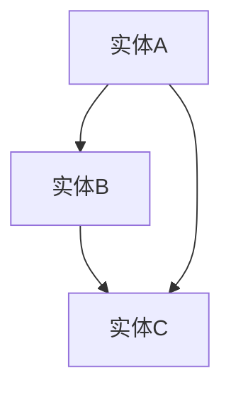
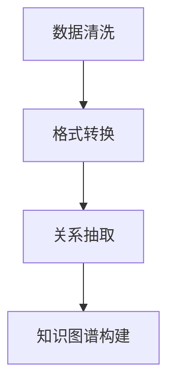
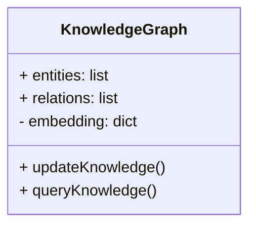
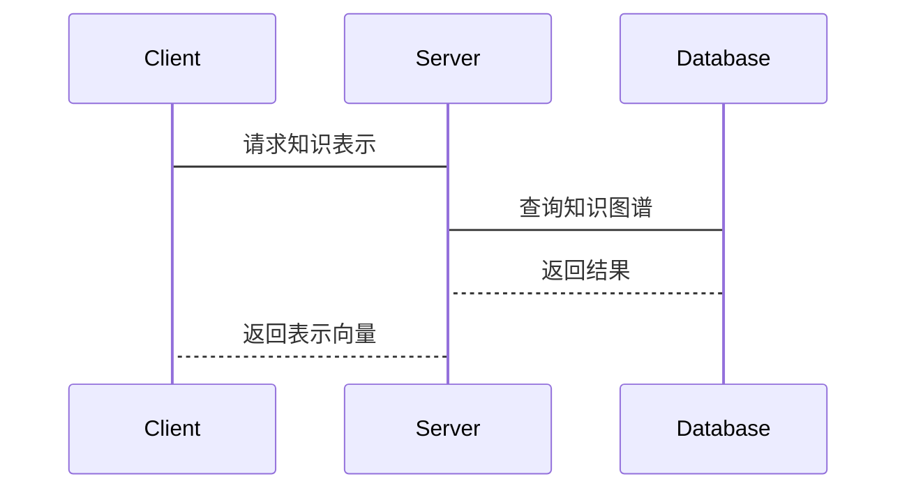

                 


# 基于图神经网络的AI Agent知识表示

## 关键词：
- 图神经网络
- AI Agent
- 知识表示
- 图结构
- 深度学习

## 摘要：
基于图神经网络的AI Agent知识表示是一种创新的知识管理方法，利用图结构和深度学习技术，实现更高效、更智能的知识表示与推理。本文详细探讨了图神经网络的核心原理、AI Agent的知识表示需求、基于图神经网络的知识表示算法、系统架构设计，以及实际项目中的应用案例和最佳实践。

---

# 第一部分: 基于图神经网络的AI Agent知识表示背景介绍

## 第1章: 问题背景与描述

### 1.1 问题背景
#### 1.1.1 当前知识表示技术的局限性
传统的知识表示方法（如向量表示、关键词表示）在处理复杂关系和上下文信息时存在局限性，难以满足AI Agent对动态、多模态知识的需求。

#### 1.1.2 图神经网络的兴起与优势
图神经网络（Graph Neural Networks, GNN）通过图结构捕捉数据之间的复杂关系，能够更自然地表示知识的关联性，成为知识表示领域的新兴技术。

#### 1.1.3 AI Agent在智能系统中的作用
AI Agent需要通过知识表示来理解、推理和决策，其知识表示的准确性和实时性直接影响其性能。

### 1.2 问题描述
#### 1.2.1 知识表示的核心问题
如何高效表示和推理复杂知识，同时支持动态更新和多模态数据。

#### 1.2.2 图神经网络在知识表示中的应用场景
适用于社交网络分析、知识图谱构建、推荐系统等领域。

#### 1.2.3 AI Agent的知识表示需求
AI Agent需要动态、实时的知识表示能力，支持多模态数据融合和复杂关系推理。

### 1.3 问题解决与边界
#### 1.3.1 基于图神经网络的知识表示解决方案
通过图结构和GNN技术，构建动态、多模态的知识表示模型。

#### 1.3.2 解决方案的边界与适用范围
适用于需要处理复杂关系和动态知识的场景，如智能推荐、对话系统等。

#### 1.3.3 解决方案的外延与扩展
扩展至知识图谱构建、实时推理和多模态数据融合。

### 1.4 概念结构与核心要素
#### 1.4.1 知识表示的核心概念
包括实体、关系、属性和上下文。

#### 1.4.2 图神经网络的关键要素
包括图结构、节点表示、边表示和传播规则。

#### 1.4.3 AI Agent的知识表示架构
包括知识获取、表示、推理和应用模块。

---

# 第二部分: 核心概念与联系

## 第2章: 图神经网络与AI Agent核心概念

### 2.1 图神经网络原理
#### 2.1.1 图的表示与图论基础
图由节点和边组成，节点表示实体，边表示关系。

#### 2.1.2 图神经网络的基本模型
- **GCN**：通过聚合邻居信息进行传播。
- **GAT**：使用注意力机制捕捉重要关系。

#### 2.1.3 图神经网络的训练与推理
包括正则化、优化器选择和推理阶段的应用。

### 2.2 AI Agent的知识表示
#### 2.2.1 知识表示的多样性与复杂性
知识表示需要支持多种数据类型和复杂关系。

#### 2.2.2 基于图结构的知识表示方法
通过图结构表示实体及其关系，支持动态更新和多模态融合。

#### 2.2.3 AI Agent的知识获取与更新
通过数据流和事件驱动的方式动态更新知识表示。

### 2.3 核心概念对比分析
#### 2.3.1 图神经网络 vs 传统知识表示方法
| 特性               | 图神经网络       | 传统知识表示方法 |
|--------------------|------------------|------------------|
| 关系建模           | 支持复杂关系     | 仅支持简单关系   |
| 可扩展性           | 高               | 低               |
| 表示能力           | 强               | 弱               |

#### 2.3.2 ER实体关系图


---

# 第三部分: 算法原理讲解

## 第3章: 图神经网络算法与知识表示

### 3.1 图神经网络模型
#### 3.1.1 GCN模型
- **传播规则**：$h^{(l+1)}_i = \sigma(\sum_{j \in N(i)} \frac{1}{|N(i)|} W h^{(l)}_j)$

#### 3.1.2 GAT模型
- **注意力机制**：$a_{ij} = \text{softmax}(\frac{W h_i + W h_j}{d})$

### 3.2 知识图谱构建
#### 3.2.1 数据预处理
- 数据清洗、标准化和格式转换。

#### 3.2.2 图谱构建流程


### 3.3 算法实现与优化
#### 3.3.1 Python代码实现
```python
import torch
class GCN(torch.nn.Module):
    def __init__(self, input_dim, hidden_dim):
        super(GCN, self).__init__()
        self.W = torch.nn.Parameter(torch.randn(input_dim, hidden_dim))
    def forward(self, adj, h):
        return torch.mm(adj, h @ self.W)
```

#### 3.3.2 模型优化策略
- 参数调整、正则化和分布式训练。

---

# 第四部分: 系统分析与架构设计

## 第4章: 系统架构设计

### 4.1 项目背景与需求分析
AI Agent需要动态、实时的知识表示能力，支持多模态数据融合和复杂关系推理。

### 4.2 系统功能设计
#### 4.2.1 领域模型设计


#### 4.2.2 系统架构设计


### 4.3 接口设计与交互流程
#### 4.3.1 API接口设计
- 输入：实体和关系。
- 输出：表示向量。

#### 4.3.2 交互流程图


---

# 第五部分: 项目实战

## 第5章: 项目实战与案例分析

### 5.1 环境安装与配置
#### 5.1.1 安装依赖
- Python、TensorFlow、PyTorch、NetworkX。

#### 5.1.2 环境配置
- 安装虚拟环境并激活。

### 5.2 系统核心实现
#### 5.2.1 知识图谱构建
- 使用NetworkX库构建图结构。

#### 5.2.2 图神经网络实现
- 实现GCN模型并训练。

### 5.3 案例分析与优化
#### 5.3.1 案例分析
- 以医疗领域为例，构建疾病-症状关系图。

#### 5.3.2 优化过程
- 调整模型参数，优化推理速度和准确性。

### 5.4 项目小结
项目实现了基于图神经网络的AI Agent知识表示，验证了其有效性和优势。

---

# 第六部分: 最佳实践与注意事项

## 第6章: 最佳实践与注意事项

### 6.1 最佳实践
#### 6.1.1 数据质量
- 确保数据准确性和完整性。

#### 6.1.2 模型选择
- 根据需求选择合适的图神经网络模型。

#### 6.1.3 性能优化
- 优化计算效率和内存使用。

### 6.2 小结
基于图神经网络的AI Agent知识表示具有广阔的应用前景。

### 6.3 注意事项
- 数据隐私保护
- 模型可解释性
- 系统实时性要求

### 6.4 拓展阅读
- 图神经网络的最新研究
- 多模态知识表示方法
- 图数据库与查询优化技术

---

通过以上目录结构，文章系统地介绍了基于图神经网络的AI Agent知识表示的核心概念、算法原理、系统架构设计和实际应用，为读者提供了全面的知识表示解决方案。

