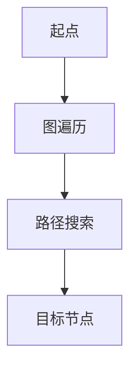

                 


# 基于图谱的AI Agent知识推理与补全

> 关键词：知识图谱，AI Agent，知识推理，知识补全，图谱推理，AI知识管理

> 摘要：本文详细探讨了基于知识图谱的AI Agent知识推理与补全技术，从理论基础到实际应用，分析了知识图谱在AI Agent中的关键作用，并结合实际案例，深入讲解了基于图谱的知识推理算法和知识补全方法，最后给出了系统设计与实现方案。

---

## 第1章: 知识图谱与AI Agent的背景与概念

### 1.1 问题背景与描述

随着人工智能技术的快速发展，AI Agent（智能体）在各个领域的应用越来越广泛。AI Agent需要具备知识表示、推理和学习的能力，以应对复杂多变的任务需求。然而，传统的知识表示方法（如基于规则的系统）在应对动态变化和复杂关系时显得力不从心。

知识图谱作为一种结构化知识表示的方法，以其强大的语义表达能力和灵活的推理机制，逐渐成为AI Agent知识管理的核心技术。通过构建知识图谱，AI Agent能够更好地理解和处理复杂的关系数据，实现知识的推理与补全。

### 1.2 核心概念与问题解决

#### 1.2.1 知识图谱的定义与作用
知识图谱是一种以图结构形式表示知识的技术，其中节点表示实体或概念，边表示实体之间的关系。知识图谱能够将分散的知识点组织成一个有机的整体，为AI Agent提供了丰富的语义信息。

#### 1.2.2 AI Agent的知识管理挑战
AI Agent需要处理海量异构数据，并能够动态更新和推理。传统的知识库难以应对这些挑战，而知识图谱的语义表达能力和动态扩展性为AI Agent的知识管理提供了新的解决方案。

#### 1.2.3 知识推理与补全的必要性
知识推理是AI Agent理解知识的核心能力，而知识补全则是确保知识完整性的重要手段。通过基于图谱的知识推理与补全技术，AI Agent能够更好地理解和处理复杂场景中的知识。

### 1.3 概念结构与核心要素

#### 1.3.1 知识图谱的核心要素
知识图谱由实体、属性和关系三部分组成：
- 实体：代表现实世界中的具体事物或概念。
- 属性：描述实体的特征或性质。
- 关系：描述实体之间的关联关系。

#### 1.3.2 AI Agent的知识处理流程
1. **知识获取**：从多种数据源获取知识，并进行清洗和预处理。
2. **知识表示**：将获取的知识转化为知识图谱的形式。
3. **知识推理**：基于知识图谱进行推理，推导出新的知识。
4. **知识补全**：利用推理结果补充知识图谱中的缺失信息。

---

## 第2章: 基于图谱的知识推理算法

### 2.1 知识图谱的表示与存储

#### 2.1.1 知识图谱的表示方法
知识图谱通常使用RDF（资源描述框架）或其扩展形式（如RDFS、OWL）进行表示。例如：
- 实体：`<http://example.org/Entity1>`
- 属性：`<http://example.org/property>`
- 关系：`<http://example.org/relation>`

#### 2.1.2 图谱的存储与查询
知识图谱可以通过图数据库（如Neo4j）进行存储，并使用SPARQL查询语言进行检索。

### 2.2 基于图谱的推理算法

#### 2.2.1 简单的图遍历算法
以下是一个基于深度优先搜索（DFS）的图遍历算法，用于从起点节点到目标节点的路径搜索：

```python
def graph_traversal(graph, start, end):
    visited = set()
    stack = [(start, [])]
    while stack:
        node, path = stack.pop()
        if node == end:
            return path + [node]
        if node not in visited:
            visited.add(node)
            for neighbor in graph[node]:
                stack.append((neighbor, path + [node]))
    return None
```

#### 2.2.2 基于概率的推理方法
假设我们有一个简单的知识图谱，其中包含以下关系：
- A是B的父亲。
- B是C的父亲。
- 那么，我们可以推断A是C的祖父。

概率推理可以通过贝叶斯网络进行，公式如下：
$$ P(C \text{是A的儿子} | A \text{是B的父亲}, B \text{是C的父亲}) = 1 $$

### 2.3 知识补全的技术实现

#### 2.3.1 空缺节点的补全
假设知识图谱中存在一个空缺节点，我们需要通过推理补全该节点的属性或关系。例如：
- 实体A：name = "李明"
- 实体B：name = "小红"
- 关系：A -> B，关系类型：friend

通过推理，我们可以推断出李明和小红是朋友关系。

#### 2.3.2 基于规则的补全
利用领域知识规则进行补全。例如，在医疗领域，如果一个患者有高血压和糖尿病，我们可以推断出他们可能需要定期检查血脂。

### 2.4 算法流程图



---

## 第3章: 系统设计与实现

### 3.1 系统架构设计

#### 3.1.1 系统功能模块
1. **知识获取模块**：从数据库或外部API获取知识数据。
2. **知识表示模块**：将知识数据转化为图谱形式。
3. **知识推理模块**：基于图谱进行推理。
4. **知识补全模块**：补充缺失的知识信息。

#### 3.1.2 系统架构图


### 3.2 接口设计与交互流程

#### 3.2.1 系统接口
1. `get_knowledge()`：获取原始知识数据。
2. `convert_to_graph()`：将知识数据转化为图谱。
3. `perform_reasoning()`：执行知识推理。
4. `complete_knowledge()`：进行知识补全。

#### 3.2.2 交互流程图

```mermaid
sequenceDiagram
client ->+> server: get_knowledge()
server -->+> client: knowledge_data
client ->+> server: convert_to_graph()
server -->+> client: graph_data
client ->+> server: perform_reasoning()
server -->+> client: inference_result
client ->+> server: complete_knowledge()
server -->+> client: complete_graph
```

---

## 第4章: 项目实战与案例分析

### 4.1 环境安装与配置

#### 4.1.1 安装依赖
```bash
pip install neo4j
pip install spacy
pip install graphviz
```

#### 4.1.2 配置Neo4j
安装并启动Neo4j数据库，配置好Cypher查询语言的访问权限。

### 4.2 核心代码实现

#### 4.2.1 知识图谱的构建

```python
from neo4j import GraphDatabase
from neo4j.exceptions import ServiceUnavailable

class GraphManager:
    def __init__(self, uri, user, password):
        self.driver = GraphDatabase.driver(uri, auth=(user, password))
    
    def close(self):
        self.driver.close()
    
    def create_node(self, label, properties):
        with self.driver.session() as session:
            session.write_transaction(
                lambda tx: tx.create_node(label, properties)
            )
    
    def create_relationship(self, start_label, start_id, rel_type, end_label, end_id):
        with self.driver.session() as session:
            session.write_transaction(
                lambda tx: tx.create_relationship(
                    start_label, start_id, rel_type, end_label, end_id
                )
            )
```

#### 4.2.2 推理算法的实现

```python
def infer_relationships(graph, threshold=0.7):
    # 假设graph是知识图谱数据
    # threshold是置信度阈值
    inferred = []
    for node in graph.nodes:
        for neighbor in graph.neighbors(node):
            if graph.get_edge_weight(node, neighbor) > threshold:
                inferred.append((node, neighbor))
    return inferred
```

### 4.3 案例分析与结果展示

#### 4.3.1 实际案例
假设我们有一个简单的知识图谱，包含以下实体和关系：
- 实体：A（Person）
- 实体：B（Person）
- 关系：A knows B

通过推理，我们可以推断出更多关系，例如：
- A knows B → B knows A

#### 4.3.2 结果展示
推理结果可以通过图谱可视化工具（如Gephi）进行展示，直观地看到知识图谱的扩展和推理结果。

---

## 第5章: 总结与最佳实践

### 5.1 本章小结
本文详细介绍了基于图谱的AI Agent知识推理与补全技术，从理论到实践，系统地分析了知识图谱的构建、推理算法的设计以及系统实现的关键步骤。

### 5.2 注意事项
1. 知识图谱的构建需要考虑数据的多样性和准确性。
2. 推理算法的选择需要根据具体场景和数据规模进行调整。
3. 知识补全需要结合领域知识和推理规则，以提高补全的准确性和完整性。

### 5.3 拓展阅读
1. 《知识图谱入门与实践》
2. 《图谱推理算法研究》
3. 《AI Agent设计与实现》

---

通过本文的系统讲解，读者可以全面掌握基于图谱的AI Agent知识推理与补全技术，并能够将其应用于实际项目中，解决复杂场景下的知识管理问题。

