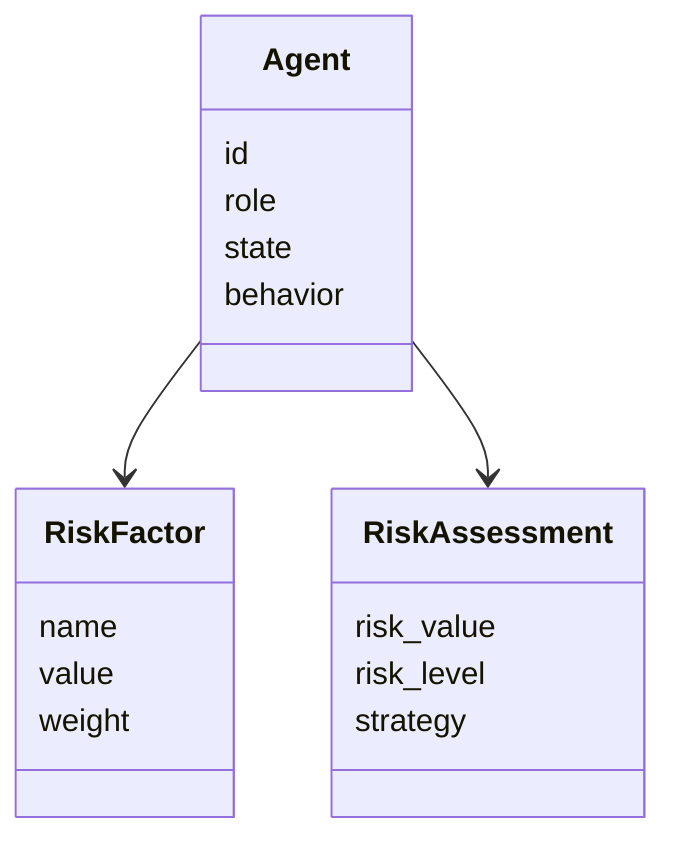
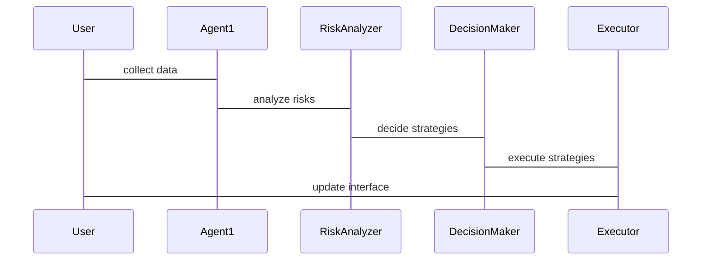

                 


---

# 基于多智能体的动态产业链风险评估模型

## 关键词：多智能体系统，产业链风险评估，动态系统，协作决策，风险管理

## 摘要：本文介绍了基于多智能体的动态产业链风险评估模型的构建与应用。通过分析产业链的动态特性，结合多智能体系统的协作机制，提出了一种创新的风险评估方法。该模型能够实时捕捉产业链中的潜在风险，通过多智能体的协同决策，实现对风险的动态预测和有效应对。文章详细阐述了模型的设计原理、算法实现、系统架构以及实际案例，为产业链风险管理提供了新的思路和方法。

---

# 第一部分: 背景介绍与核心概念

## 第1章: 问题背景与问题描述

### 1.1 产业链风险评估的重要性

#### 1.1.1 产业链的基本概念
产业链是指从原材料供应、生产制造、分销到最终用户的整个价值链。一个典型的产业链可能包括多个参与者，如供应商、制造商、分销商、零售商和消费者。产业链的健康运行对于企业的生存和发展至关重要。

#### 1.1.2 产业链风险的来源与影响
产业链中的风险可能来自多种因素，如市场波动、供应链中断、政策变化、技术问题等。这些风险可能会影响产业链的稳定性，导致成本增加、生产延误或利润下降。例如，原材料价格上涨可能导致制造商的成本增加，从而影响整个产业链的竞争力。

#### 1.1.3 动态产业链的特点与挑战
动态产业链是指在市场环境变化、技术进步或政策调整等外部因素的影响下，产业链的结构和运行方式不断变化的过程。动态产业链的特点包括：参与者数量变化、角色转换、协作方式多样化等。这种动态性使得传统的静态风险评估方法难以应对复杂多变的市场环境。

---

### 1.2 多智能体系统的核心优势

#### 1.2.1 多智能体系统的定义与特点
多智能体系统（Multi-Agent System, MAS）是指由多个智能体组成的分布式系统，这些智能体能够通过通信和协作完成复杂任务。多智能体系统的特点包括：分布式性、自主性、反应性、协作性和动态性。

#### 1.2.2 多智能体系统在风险评估中的应用潜力
多智能体系统在风险评估中的优势在于其能够模拟多个参与者的行为，并通过协作实现对复杂系统的实时监控和预测。例如，多智能体系统可以模拟供应商、制造商和分销商的行为，预测供应链中断的可能性，并提出相应的应对策略。

#### 1.2.3 多智能体系统与传统风险评估方法的对比
传统的风险评估方法通常基于静态模型，难以捕捉动态变化的市场环境。而多智能体系统能够实时更新模型参数，反映市场的动态变化，从而提供更加准确的风险评估结果。

---

## 第2章: 动态产业链风险评估模型的构建

### 2.1 动态产业链的定义与特征

#### 2.1.1 动态产业链的系统构成
动态产业链由多个参与者组成，每个参与者都可以看作一个智能体。这些智能体之间的关系和互动构成了动态产业链的复杂性。

#### 2.1.2 动态产业链的动态性表现
动态产业链的动态性主要表现在以下几个方面：
1. 市场需求的变化：消费者偏好、购买行为的变化会影响产业链的运行。
2. 技术进步：新技术的应用可能改变产业链的结构和运行方式。
3. 政策变化：政府政策的调整可能影响产业链的参与者和利益分配。

#### 2.1.3 动态产业链的风险传递机制
风险在动态产业链中的传递机制包括：
1. 上游风险传递到下游：例如，原材料价格上涨可能导致制造商成本增加，进而影响零售商的利润。
2. 下游风险影响上游：例如，消费者需求下降可能导致制造商减少订单，影响供应商的生产计划。

---

### 2.2 多智能体系统的动态协作机制

#### 2.2.1 多智能体系统的协作模型
多智能体系统的协作模型包括以下几种：
1. **任务分配模型**：智能体之间通过协商分配任务。
2. **信息共享模型**：智能体通过共享信息实现协作。
3. **协同决策模型**：智能体通过协作决策实现共同目标。

#### 2.2.2 动态协作中的信息共享与决策优化
在动态协作中，信息共享是关键。智能体需要实时交换信息，以便及时调整策略。例如，在供应链中断的情况下，制造商可以通过共享信息快速找到替代供应商。

#### 2.2.3 多智能体系统在风险评估中的角色分工
在动态产业链风险评估中，多智能体系统的角色分工如下：
1. **数据采集智能体**：负责采集市场数据、政策变化等信息。
2. **风险分析智能体**：负责分析数据，识别潜在风险。
3. **决策优化智能体**：负责制定应对策略，优化风险响应。

---

### 2.3 模型构建的边界与外延

#### 2.3.1 模型的适用范围与限制
动态产业链风险评估模型适用于复杂多变的市场环境，但其局限性在于对某些特定情况的预测能力有限，例如不可预见的突发事件。

#### 2.3.2 模型的扩展性与可维护性
模型的扩展性是指在增加新的参与者或调整模型参数时，模型仍能正常运行。可维护性是指模型在维护和更新时的便利性。

#### 2.3.3 模型的输入输出接口设计
模型的输入包括市场数据、政策变化等，输出包括风险评估结果和应对策略。模型的接口设计需要考虑数据格式和通信协议。

---

## 第3章: 核心概念与联系

### 3.1 多智能体系统的核心原理

#### 3.1.1 多智能体系统的通信机制
多智能体系统的通信机制包括：
1. **直接通信**：智能体之间通过直接交换信息。
2. **间接通信**：智能体通过中间媒介交换信息。

#### 3.1.2 多智能体系统的协同决策算法
协同决策算法包括：
1. **分布式决策算法**：基于局部信息做出决策。
2. **集中式决策算法**：通过集中信息做出全局决策。

#### 3.1.3 多智能体系统的自适应能力
多智能体系统的自适应能力使其能够根据环境变化调整策略。例如，当市场需求发生变化时，智能体可以快速调整生产计划。

---

### 3.2 动态产业链风险评估的数学模型

#### 3.2.1 风险评估的基本公式
风险评估的基本公式为：
$$
\text{风险值} = \text{风险因素} \times \text{风险权重}
$$

#### 3.2.2 动态产业链的数学表达
动态产业链的数学表达可以表示为：
$$
\text{动态风险} = f(\text{市场变化}, \text{技术进步}, \text{政策变化})
$$
其中，$f$ 是一个函数，用于综合考虑各种因素的影响。

#### 3.2.3 多智能体系统与风险评估的结合
多智能体系统与风险评估的结合体现在以下几个方面：
1. 智能体之间通过协作实现风险的实时监控。
2. 智能体通过共享信息优化风险评估结果。

---

### 3.3 核心概念的对比分析

#### 3.3.1 多智能体系统与传统风险评估方法的对比
| 对比维度 | 多智能体系统 | 传统风险评估方法 |
|----------|--------------|--------------------|
| 数据来源 | 动态数据，实时更新 | 静态数据，定期更新 |
| 模型复杂度 | 高度复杂，动态调整 | 较低复杂度，固定模型 |
| 处理能力 | 能处理复杂动态问题 | 适合处理简单静态问题 |

#### 3.3.2 动态产业链与静态产业链的对比
动态产业链与静态产业链的对比如下：
| 对比维度 | 动态产业链 | 静态产业链 |
|----------|------------|-------------|
| 结构复杂性 | 高 | 低 |
| 变化速度 | 快 | 慢 |
| 风险来源 | 多样化 | 单一化 |

#### 3.3.3 不同风险评估模型的优缺点分析
不同风险评估模型的优缺点如下：
| 模型类型 | 优点 | 缺点 |
|----------|-------|------|
| 静态模型 | 简单易懂，计算速度快 | 无法捕捉动态变化 |
| 动态模型 | 能够捕捉动态变化，结果更准确 | 计算复杂，需要大量数据支持 |
| 多智能体模型 | 能够模拟多个参与者的行为，结果更真实 | 实施成本高，需要复杂的协同机制 |

---

## 第4章: 算法原理讲解

### 4.1 多智能体系统的算法实现

#### 4.1.1 多智能体系统的通信协议设计
通信协议设计需要考虑以下方面：
1. 信息格式：数据的结构和格式。
2. 通信频率：智能体之间的通信频率。
3. 通信方式：直接通信或间接通信。

#### 4.1.2 多智能体系统的协同决策算法
协同决策算法的实现步骤如下：
1. 数据采集：智能体采集市场数据、政策变化等信息。
2. 数据分析：智能体分析数据，识别潜在风险。
3. 协同决策：智能体通过协作制定应对策略。
4. 策略执行：智能体执行制定的策略。

#### 4.1.3 多智能体系统的自适应优化算法
自适应优化算法的实现步骤如下：
1. 环境感知：智能体感知环境变化。
2. 参数调整：智能体根据环境变化调整参数。
3. 策略优化：智能体优化应对策略。

---

### 4.2 动态产业链风险评估的数学模型

#### 4.2.1 风险评估的基本公式
$$
\text{风险值} = \sum_{i=1}^{n} (\text{风险因素}_i \times \text{风险权重}_i)
$$

#### 4.2.2 动态产业链的数学表达
动态产业链的数学表达可以表示为：
$$
\text{动态风险} = \sum_{j=1}^{m} (\text{因素}_j \times \text{权重}_j)
$$
其中，$\text{因素}_j$ 是影响风险的因素，$\text{权重}_j$ 是因素的权重。

#### 4.2.3 多智能体系统与风险评估的结合
多智能体系统与风险评估的结合体现在以下几个方面：
1. 智能体之间通过协作实现风险的实时监控。
2. 智能体通过共享信息优化风险评估结果。

---

### 4.3 算法实现的代码示例

#### 4.3.1 算法实现的伪代码
```python
def multi_agent_risk_assessment():
    agents = initialize_agents()
    while True:
        data = collect_data(agents)
        risks = analyze_risks(data)
        strategies = decide_strategies(risks)
        execute_strategies(strategies)
        update_agents(agents)
```

#### 4.3.2 算法实现的具体步骤
1. 初始化多智能体系统，设置智能体数量和初始参数。
2. 智能体采集市场数据、政策变化等信息。
3. 数据分析，识别潜在风险。
4. 协同决策，制定应对策略。
5. 执行策略，优化参数。

#### 4.3.3 算法实现的优化建议
1. 增强智能体的自适应能力，使其能够更快地响应环境变化。
2. 提高智能体之间的通信效率，减少数据传输延迟。
3. 定期更新模型参数，确保模型的准确性和可靠性。

---

## 第5章: 系统分析与架构设计方案

### 5.1 系统功能设计（领域模型）



---

### 5.2 系统架构设计


---

### 5.3 系统接口设计

系统接口设计包括以下几个方面：
1. 数据接口：智能体之间通过API进行数据交换。
2. 控制接口：用户通过控制面板调整系统参数。
3. 输出接口：系统通过图表、报告等形式输出风险评估结果。

---

### 5.4 系统交互设计



---

## 第6章: 项目实战

### 6.1 环境安装与配置

#### 6.1.1 系统需求
1. 操作系统：Windows/Mac/Linux
2. Python版本：3.6+
3. 第三方库：numpy, matplotlib, networkx

#### 6.1.2 安装步骤
1. 安装Python：从官网下载并安装Python。
2. 安装第三方库：运行命令 `pip install numpy matplotlib networkx`。

---

### 6.2 系统核心实现

#### 6.2.1 智能体类的实现
```python
class Agent:
    def __init__(self, id, role):
        self.id = id
        self.role = role
        self.state = {}
    
    def collect_data(self):
        # 采集数据
        pass
    
    def analyze_risks(self, data):
        # 分析风险
        pass
    
    def decide_strategies(self, risks):
        # 制定策略
        pass
    
    def execute_strategy(self, strategy):
        # 执行策略
        pass
```

#### 6.2.2 风险评估模块的实现
```python
import numpy as np

class RiskAssessment:
    def __init__(self, factors, weights):
        self.factors = factors
        self.weights = weights
    
    def calculate_risk(self):
        risk = np.dot(self.factors, self.weights)
        return risk
```

---

### 6.3 代码应用解读与分析

#### 6.3.1 智能体类的应用
```python
agent1 = Agent(1, 'supplier')
agent1.collect_data()
```

#### 6.3.2 风险评估模块的应用
```python
factors = [2, 3, 4]
weights = [0.2, 0.3, 0.5]
risk_assessment = RiskAssessment(factors, weights)
risk_value = risk_assessment.calculate_risk()
print(risk_value)
```

---

### 6.4 实际案例分析

#### 6.4.1 案例背景
假设我们有一个电子制造产业链，包括供应商、制造商和零售商。

#### 6.4.2 数据采集与分析
```python
# 采集数据
data = {
    'market_demand': 100,
    'production_cost': 50,
    'policy_change': 0.1
}
# 分析风险
risk_assessment = RiskAssessment(data.keys(), data.values())
risk_value = risk_assessment.calculate_risk()
print(risk_value)
```

#### 6.4.3 风险应对策略
根据风险评估结果，智能体可以制定以下策略：
1. 增加库存以应对市场需求变化。
2. 优化生产流程以降低生产成本。
3. 调整价格以应对政策变化。

---

### 6.5 项目小结

通过实际案例分析，我们可以看到基于多智能体的动态产业链风险评估模型在实际应用中的有效性。智能体之间的协作能够实时捕捉市场变化，制定有效的应对策略，从而降低风险对产业链的影响。

---

## 第7章: 总结与展望

### 7.1 总结
本文详细介绍了基于多智能体的动态产业链风险评估模型的构建与应用。通过分析产业链的动态特性，结合多智能体系统的协作机制，提出了一种创新的风险评估方法。该模型能够实时捕捉产业链中的潜在风险，通过多智能体的协同决策，实现对风险的动态预测和有效应对。

---

### 7.2 最佳实践 tips

1. **数据准确性**：确保数据来源可靠，数据质量高。
2. **模型优化**：定期更新模型参数，确保模型的准确性和可靠性。
3. **系统维护**：及时修复系统漏洞，确保系统的稳定运行。
4. **人员培训**：对相关人员进行培训，提高系统的使用效率。

---

### 7.3 注意事项

1. **数据隐私**：在采集和处理数据时，要注意保护数据隐私。
2. **系统兼容性**：确保系统与不同平台和设备的兼容性。
3. **用户友好性**：设计友好的用户界面，方便用户使用。

---

### 7.4 拓展阅读

1. **多智能体系统**：深入学习多智能体系统的理论与应用。
2. **动态系统建模**：研究动态系统的建模方法与技巧。
3. **风险管理**：学习其他领域的风险管理方法与实践。

---

通过本文的介绍，读者可以全面了解基于多智能体的动态产业链风险评估模型的设计与实现。希望本文能够为产业链风险管理提供新的思路和方法，帮助企业在复杂多变的市场环境中更好地应对风险，实现可持续发展。

