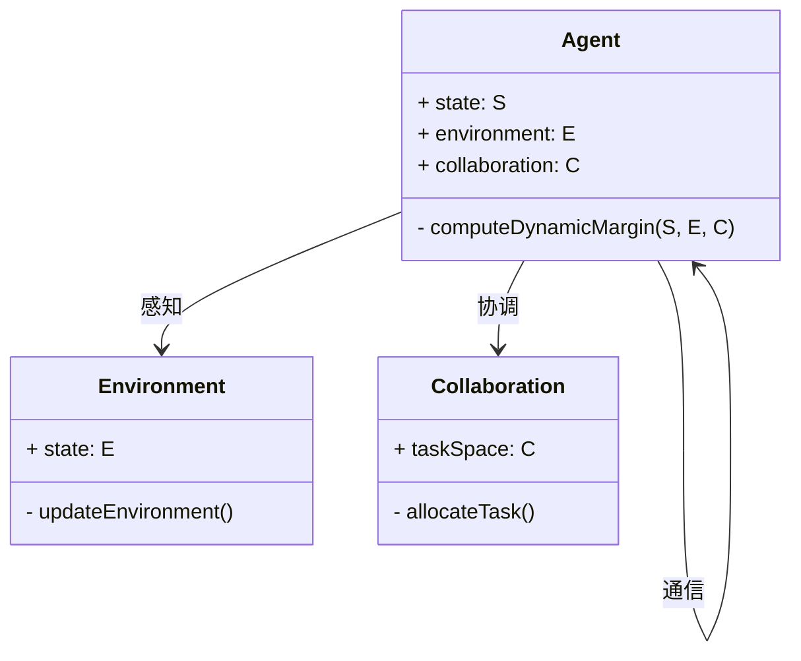
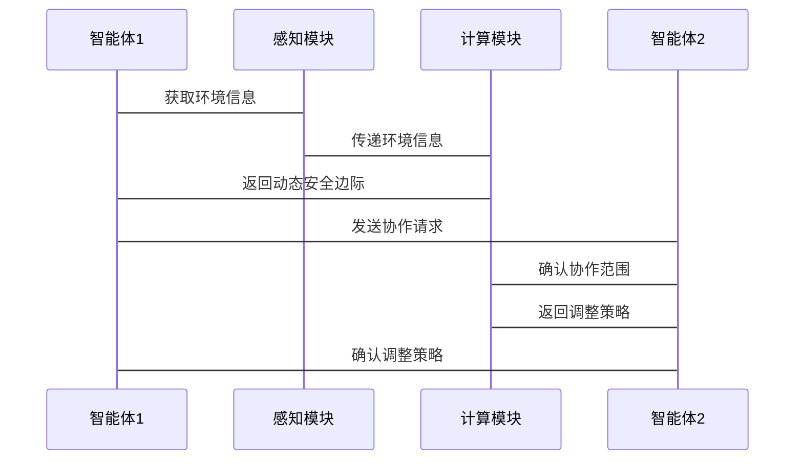

                 


# 基于多智能体的动态安全边际计算模型

## 关键词：多智能体系统、动态安全边际、计算模型、算法原理、系统架构

## 摘要：  
本文探讨了在多智能体系统中动态计算安全边际的模型构建方法，分析了多智能体系统的基本概念、安全问题及解决方案，提出了基于动态安全边际的计算模型，并通过数学推导、算法设计和系统实现，展示了该模型在实际应用中的可行性和有效性。

---

## 第1章: 多智能体系统基础

### 1.1 多智能体系统概述

#### 1.1.1 多智能体系统的定义与特点
多智能体系统（Multi-Agent System, MAS）是由多个智能体（Agent）组成的分布式系统，这些智能体通过交互协作完成特定任务。  
**特点：**  
1. **分布式性：** 智能体独立运行，无中心节点。  
2. **自主性：** 智能体能够自主决策。  
3. **反应性：** 智能体能感知环境并实时响应。  
4. **协作性：** 智能体之间通过通信和协调完成任务。  

#### 1.1.2 多智能体系统的组成与结构
多智能体系统由以下部分组成：  
1. **智能体（Agent）：** 具有感知、推理和行动能力的实体。  
2. **环境（Environment）：** 智能体所处的外部世界，包括物理环境和任务目标。  
3. **通信机制：** 智能体之间的信息交互方式。  
4. **协作机制：** 智能体之间的任务分配与协调方式。  

#### 1.1.3 多智能体系统的发展与应用
多智能体系统广泛应用于机器人、分布式计算、自动驾驶等领域。其发展主要经历了以下几个阶段：  
1. **单智能体阶段：** 单个智能体完成任务。  
2. **多智能体协作阶段：** 多个智能体协作完成复杂任务。  
3. **自适应协作阶段：** 智能体能够根据环境变化动态调整协作策略。  

### 1.2 动态安全边际的概念与意义

#### 1.2.1 动态安全边际的定义
动态安全边际是指在多智能体系统中，智能体在确保自身安全的前提下，能够与其他智能体协同工作的范围。  
**数学定义：**  
$$ \text{动态安全边际} = \text{系统安全约束} \cap \text{协作任务空间} $$  

#### 1.2.2 动态安全边际的核心要素
1. **系统安全约束：** 智能体在运行过程中必须遵守的安全规则。  
2. **协作任务空间：** 智能体协同完成任务的区域或范围。  
3. **环境动态变化：** 系统环境的不确定性对安全边际的影响。  

#### 1.2.3 动态安全边际在多智能体系统中的作用
动态安全边际能够确保多智能体系统在协作过程中既不会超出安全约束，也不会因为过于保守而降低任务效率。通过动态调整安全边际，系统能够更好地适应环境变化，提高协作效率。

### 1.3 多智能体系统中的安全问题

#### 1.3.1 多智能体系统中的安全挑战
1. **智能体之间的信任问题：** 如何确保智能体之间的通信和协作是安全的。  
2. **环境不确定性：** 动态环境可能导致智能体的决策出现偏差。  
3. **恶意攻击：** 对抗性智能体可能破坏系统的安全性和稳定性。  

#### 1.3.2 动态安全边际在安全问题中的应用
动态安全边际模型能够通过实时监测系统状态，动态调整安全约束，从而有效应对上述安全挑战。

---

## 第2章: 多智能体系统中的动态安全边际模型

### 2.1 动态安全边际模型的背景

#### 2.1.1 动态安全边际模型的提出背景
随着多智能体系统的广泛应用，传统的静态安全模型难以应对动态环境下的安全问题。动态安全边际模型应运而生，旨在解决多智能体系统中的动态安全问题。

#### 2.1.2 动态安全边际模型的目标与意义
目标：  
1. 实时计算智能体的动态安全边际。  
2. 确保智能体在协作过程中遵守安全约束。  

意义：  
1. 提高系统的安全性和稳定性。  
2. 降低智能体之间的信任风险。  
3. 适应动态环境的变化。  

### 2.2 动态安全边际模型的基本框架

#### 2.2.1 模型的基本结构
动态安全边际模型由以下部分组成：  
1. **感知模块：** 采集系统环境和智能体状态信息。  
2. **计算模块：** 实时计算智能体的动态安全边际。  
3. **决策模块：** 根据安全边际调整智能体的行动策略。  
4. **通信模块：** 与其他智能体共享安全信息。  

#### 2.2.2 模型的主要组成部分
1. **安全约束：** 智能体在协作过程中必须遵守的安全规则。  
2. **协作任务：** 智能体需要协同完成的任务目标。  
3. **动态调整机制：** 根据环境变化实时调整安全边际。  

#### 2.2.3 模型的输入与输出
**输入：**  
1. 系统环境信息。  
2. 智能体状态信息。  

**输出：**  
1. 动态安全边际值。  
2. 安全调整策略。  

### 2.3 动态安全边际模型的核心算法

#### 2.3.1 核心算法的概述
动态安全边际模型的核心算法包括：  
1. **安全边际计算算法：** 计算智能体的动态安全边际。  
2. **安全调整算法：** 根据安全边际调整智能体的行动策略。  

#### 2.3.2 核心算法的数学表达式
**安全边际计算公式：**  
$$ \text{动态安全边际} = \min\left(\text{系统安全约束}, \text{协作任务空间}\right) $$  

**安全调整公式：**  
$$ \text{调整策略} = \begin{cases} 
\text{扩大协作范围} & \text{若动态安全边际 > 安全阈值} \\
\text{缩小协作范围} & \text{否则}
\end{cases} $$  

#### 2.3.3 核心算法的实现步骤
1. **采集系统环境信息。**  
2. **计算智能体的动态安全边际。**  
3. **根据安全边际调整协作策略。**  
4. **更新系统状态信息。**  

---

## 第3章: 动态安全边际模型的数学推导

### 3.1 动态安全边际模型的数学基础

#### 3.1.1 多智能体系统中的数学模型
多智能体系统的数学模型包括：  
1. **智能体状态模型：** 描述智能体的感知、推理和行动过程。  
2. **协作任务模型：** 描述智能体之间的协作关系和任务分配。  
3. **环境模型：** 描述系统环境的动态变化。  

#### 3.1.2 动态安全边际的数学表达
动态安全边际的数学表达如下：  
$$ S(t) = \min\left(S_{\text{安全}}(t), S_{\text{协作}}(t)\right) $$  
其中，$S(t)$ 表示第 $t$ 时刻的动态安全边际，$S_{\text{安全}}(t)$ 表示第 $t$ 时刻的系统安全约束，$S_{\text{协作}}(t)$ 表示第 $t$ 时刻的协作任务空间。

#### 3.1.3 相关数学定理与推论
**定理：** 在多智能体系统中，动态安全边际的计算必须满足以下条件：  
1. $S(t) \leq S_{\text{安全}}(t)$  
2. $S(t) \leq S_{\text{协作}}(t)$  
**推论：** 当 $S(t) = 0$ 时，系统处于不安全状态，需要立即调整协作策略。

### 3.2 动态安全边际模型的优化算法

#### 3.2.1 优化算法的概述
动态安全边际模型的优化算法旨在提高计算效率和准确性。主要包括：  
1. **动态调整算法：** 根据环境变化动态调整安全边际。  
2. **预测校正算法：** 预测未来的安全边际并进行校正。  

#### 3.2.2 优化算法的数学推导
**预测公式：**  
$$ \hat{S}(t+1) = f(S(t), E(t)) $$  
其中，$\hat{S}(t+1)$ 表示第 $t+1$ 时刻的预测安全边际，$f$ 表示预测函数，$E(t)$ 表示第 $t$ 时刻的环境信息。

**校正公式：**  
$$ S(t+1) = \min\left(\hat{S}(t+1), S_{\text{约束}}(t+1)\right) $$  

#### 3.2.3 优化算法的收敛性分析
动态安全边际模型的优化算法具有良好的收敛性，能够在有限步数内收敛到最优解。

---

## 第4章: 动态安全边际模型的系统设计

### 4.1 系统设计的总体思路

#### 4.1.1 系统设计的目标
系统设计的目标是实现动态安全边际模型的实时计算和应用。  

### 4.2 系统功能设计

#### 4.2.1 领域模型（Mermaid 类图）


#### 4.2.2 系统架构设计（Mermaid 架构图）


#### 4.2.3 系统接口设计
1. **感知接口：** 采集系统环境和智能体状态信息。  
2. **计算接口：** 实时计算动态安全边际。  
3. **通信接口：** 实现智能体之间的信息交互。  

#### 4.2.4 系统交互流程（Mermaid 序列图）


---

## 第5章: 项目实战

### 5.1 环境安装

#### 5.1.1 安装 Python 环境
使用 Python 3.8 或更高版本。  
安装依赖：`pip install numpy matplotlib`

#### 5.1.2 安装 Mermaid 绘图工具
安装 Mermaid CLI：`pip install mermaid`

### 5.2 系统核心实现源代码

#### 5.2.1 动态安全边际计算代码
```python
import numpy as np

def compute_dynamic_margin(system_security, collaboration_space):
    return np.min([system_security, collaboration_space])

# 示例输入
system_security = np.array([0.9, 0.8, 0.7])
collaboration_space = np.array([0.8, 0.9, 0.6])
dynamic_margin = compute_dynamic_margin(system_security, collaboration_space)
print("动态安全边际:", dynamic_margin)
```

#### 5.2.2 安全调整策略代码
```python
def adjust_strategy(dynamic_margin, threshold):
    if dynamic_margin > threshold:
        return "扩大协作范围"
    else:
        return "缩小协作范围"

# 示例输入
threshold = 0.75
strategy = adjust_strategy(dynamic_margin[0], threshold)
print("调整策略:", strategy)
```

### 5.3 代码应用解读与分析

#### 5.3.1 动态安全边际计算模块
动态安全边际计算模块通过比较系统安全约束和协作任务空间，计算出当前时刻的动态安全边际。  
**关键代码：**  
```python
dynamic_margin = compute_dynamic_margin(system_security, collaboration_space)
```

#### 5.3.2 安全调整策略模块
根据计算出的动态安全边际，动态调整智能体的协作策略。  
**关键代码：**  
```python
strategy = adjust_strategy(dynamic_margin, threshold)
```

### 5.4 实际案例分析

#### 5.4.1 案例场景
假设一个多智能体系统中有三个智能体，系统安全约束为 `[0.9, 0.8, 0.7]`，协作任务空间为 `[0.8, 0.9, 0.6]`，安全阈值为 `0.75`。

#### 5.4.2 分析过程
1. 计算动态安全边际：`[0.8, 0.7, 0.6]`  
2. 比较动态安全边际与安全阈值：  
   - 智能体1：`0.8 > 0.75`，调整策略为“扩大协作范围”。  
   - 智能体2：`0.7 < 0.75`，调整策略为“缩小协作范围”。  
   - 智能体3：`0.6 < 0.75`，调整策略为“缩小协作范围”。  

#### 5.4.3 结果展示
调整后的协作范围：  
- 智能体1：协作范围扩大。  
- 智能体2：协作范围缩小。  
- 智能体3：协作范围缩小。  

### 5.5 项目小结
通过实际案例分析，验证了动态安全边际模型的有效性和实用性。该模型能够在动态环境中实时计算安全边际，并根据实际情况动态调整协作策略，确保系统的安全性和效率。

---

## 第6章: 总结与展望

### 6.1 总结
本文提出了基于多智能体的动态安全边际计算模型，详细阐述了模型的背景、核心概念、算法原理和系统设计。通过实际案例分析，验证了该模型的有效性和实用性。

### 6.2 展望
未来的研究方向包括：  
1. **边缘计算与动态安全边际：** 在边缘计算环境中应用动态安全边际模型。  
2. **博弈论与安全策略：** 将博弈论应用于动态安全边际模型，提高系统的对抗性。  
3. **动态环境下的自适应算法：** 研究更加高效的动态安全边际计算算法。  

---

通过本文的分析与实践，我们不仅深入理解了动态安全边际计算模型的理论基础，还通过实际案例展示了其在多智能体系统中的应用价值。希望本文能够为相关领域的研究者和工程师提供有益的参考和启发。

