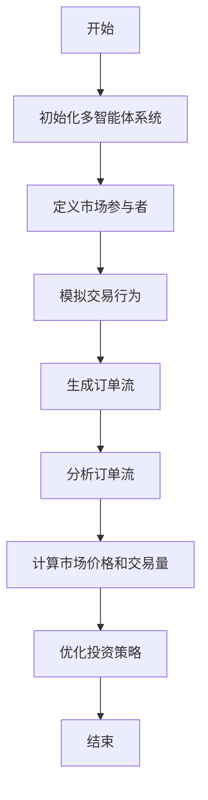
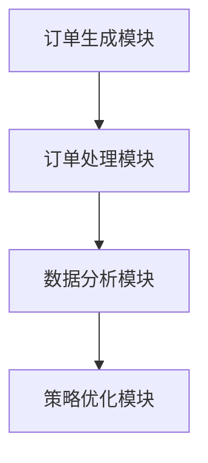
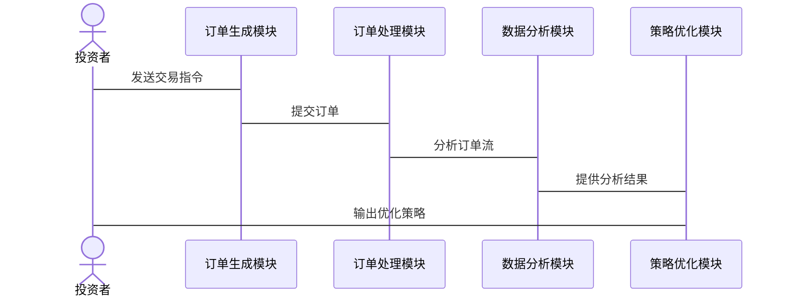

                 


# 基于多智能体的动态市场微观结构分析在价值投资中的应用

> 关键词：多智能体系统，动态市场微观结构，价值投资，算法原理，系统架构，项目实战

> 摘要：本文深入探讨了基于多智能体系统的动态市场微观结构分析在价值投资中的应用。通过系统化的分析与建模，结合多智能体系统的优势，提出了一种创新的解决方案。文章内容涵盖背景介绍、核心概念、算法原理、系统架构、项目实战及总结，为投资者和研究人员提供了理论与实践相结合的指导。

---

## 第1章: 背景介绍

### 1.1 问题背景
#### 1.1.1 价值投资的定义与核心理念
价值投资是一种以基本面分析为基础的投资策略，旨在通过识别市场中被低估的资产，长期获取超额收益。其核心理念在于寻找具有持续竞争优势的企业，并在合理估值时买入并持有。

#### 1.1.2 动态市场微观结构分析的必要性
传统的价值投资方法主要依赖于对财务报表的分析，但在动态市场环境中，价格波动、交易量变化等微观结构特征对投资决策的影响日益重要。动态市场微观结构分析通过捕捉市场的实时动态，为投资者提供了更精细的决策依据。

#### 1.1.3 多智能体系统在金融领域的应用前景
多智能体系统（Multi-Agent System, MAS）是一种由多个具有自主性、反应性和协作性的智能体组成的分布式系统。在金融领域，MAS能够模拟市场参与者的复杂行为，帮助投资者更好地理解市场动态。

### 1.2 问题描述
#### 1.2.1 传统价值投资的局限性
传统价值投资方法存在以下局限性：
- 仅依赖于财务数据，忽略了市场动态特征。
- 难以实时捕捉市场情绪变化。
- 无法有效应对市场的非线性波动。

#### 1.2.2 动态市场微观结构分析的核心问题
动态市场微观结构分析的核心问题在于如何实时捕捉和建模市场参与者的交易行为，以及这些行为如何影响市场价格和流动性。

#### 1.2.3 多智能体系统在动态市场分析中的优势
多智能体系统的优势体现在：
- 能够模拟市场的多参与方行为。
- 具备实时动态调整的能力。
- 可以通过分布式计算提高系统的容错性和扩展性。

### 1.3 问题解决
#### 1.3.1 多智能体系统的解决方案
通过构建一个多智能体系统，模拟市场中的买方、卖方和做市商等不同角色的行为，实时分析市场动态。

#### 1.3.2 动态市场微观结构分析的具体实现
基于多智能体系统，构建动态市场微观结构模型，分析交易量、价格波动等特征。

#### 1.3.3 价值投资中的应用路径
将动态市场微观结构分析的结果与传统的基本面分析相结合，优化投资决策。

### 1.4 边界与外延
#### 1.4.1 多智能体系统的边界条件
- 智能体的决策范围有限。
- 系统规模和复杂度受限制。

#### 1.4.2 动态市场微观结构分析的适用范围
适用于高频交易、市场情绪分析等场景。

#### 1.4.3 价值投资中的应用边界
主要应用于中长期投资策略的优化，短周期交易策略需结合其他方法。

### 1.5 核心概念拆解
#### 1.5.1 多智能体系统的定义与属性
- **定义**：由多个智能体组成的系统，每个智能体具有自主性、反应性和协作性。
- **属性**：分布性、自主性、反应性、协作性、社会性。

#### 1.5.2 动态市场微观结构的组成要素
- **交易主体**：买方、卖方、做市商。
- **交易行为**：订单生成、订单匹配、订单取消。
- **市场特征**：价格、交易量、流动性。

#### 1.5.3 价值投资的核心逻辑
- **基本面分析**：分析企业的财务状况、行业地位、竞争优势。
- **估值方法**：计算内在价值，寻找低估资产。

---

## 第2章: 核心概念与联系

### 2.1 多智能体系统原理
#### 2.1.1 多智能体系统的定义
多智能体系统是由多个智能体组成的分布式系统，每个智能体能够独立决策并与其他智能体协作。

#### 2.1.2 多智能体系统的组成要素
- **智能体**：具有自主性、反应性和协作性的实体。
- **环境**：智能体所处的外部世界，包括市场参与者和市场数据。
- **通信机制**：智能体之间交换信息的方式，如消息传递。

#### 2.1.3 多智能体系统的通信机制
- **同步通信**：智能体之间按顺序进行通信。
- **异步通信**：智能体可以异步发送和接收消息。

### 2.2 动态市场微观结构分析原理
#### 2.2.1 微观结构的定义与特征
- **定义**：市场中的交易主体及其行为所构成的结构。
- **特征**：动态性、复杂性、非线性。

#### 2.2.2 动态市场的动态特征
- **价格波动**：市场价格的实时变化。
- **交易量变化**：交易量的波动反映了市场参与者的活跃程度。
- **流动性变化**：市场流动性受交易量和价格波动的影响。

#### 2.2.3 微观结构分析的数学模型
- **订单簿模型**：分析订单的生成、匹配和取消过程。
- **市场冲击模型**：量化交易对市场价格的影响。

### 2.3 核心概念联系
#### 2.3.1 多智能体系统与动态市场微观结构的关系
- **多智能体系统模拟市场参与者行为**。
- **动态市场微观结构提供系统的动态特征**。

#### 2.3.2 动态市场微观结构与价值投资的联系
- **动态市场微观结构分析为价值投资提供实时市场信息**。
- **价值投资策略需要结合市场动态特征进行优化**。

#### 2.3.3 多智能体系统在价值投资中的应用逻辑
- **模拟市场参与者行为**：分析市场的供需关系。
- **实时捕捉市场动态**：优化投资决策。

### 2.4 核心概念属性对比与ER实体关系图

#### 2.4.1 核心概念属性对比
| **属性**         | **多智能体系统**                  | **动态市场微观结构**             |
|------------------|----------------------------------|---------------------------------|
| 组成要素         | 智能体、环境、通信机制           | 交易主体、交易行为、市场特征      |
| 优势             | 分布式计算、自主性、协作性       | 实时动态分析、非线性特征分析      |
| 应用场景         | 金融市场模拟、分布式任务处理     | 市场参与者行为分析、价格波动预测   |

#### 2.4.2 ER实体关系图
```mermaid
erd
actor: "投资者、做市商、交易员"
market_structure: "市场微观结构"
transactions: "交易记录"
prices: "价格数据"
entities
  actor -->> market_structure: 参与
  market_structure -->> transactions: 记录
  transactions -->> prices: 影响
```

---

## 第3章: 算法原理

### 3.1 算法原理概述
基于多智能体系统的动态市场微观结构分析算法，通过模拟市场参与者的交易行为，实时分析市场价格和交易量的变化。

#### 3.1.1 算法流程
1. 初始化多智能体系统，定义市场参与者（买方、卖方、做市商）。
2. 模拟交易行为，生成订单流。
3. 分析订单流，计算市场价格和交易量。
4. 优化投资策略，基于分析结果进行买卖决策。

### 3.2 算法实现
#### 3.2.1 算法流程图


#### 3.2.2 Python代码实现
```python
import random

class Agent:
    def __init__(self, type):
        self.type = type  # 'buyer', 'seller', 'marketmaker'
        self.orders = []

def generate_order(agent):
    if agent.type == 'buyer':
        return {'type': 'buy', 'price': random.uniform(100, 150), 'quantity': random.randint(1, 10)}
    elif agent.type == 'seller':
        return {'type': 'sell', 'price': random.uniform(100, 150), 'quantity': random.randint(1, 10)}

def process_order_book(orders):
    # 计算最优买价和最优卖价
    buys = [o for o in orders if o['type'] == 'buy']
    sells = [o for o in orders if o['type'] == 'sell']
    if buys:
        best_buy_price = max([o['price'] for o in buys])
    else:
        best_buy_price = None
    if sells:
        best_sell_price = min([o['price'] for o in sells])
    else:
        best_sell_price = None
    return best_buy_price, best_sell_price

# 初始化多智能体系统
agents = [
    Agent('buyer'),
    Agent('buyer'),
    Agent('seller'),
    Agent('seller'),
    Agent('marketmaker')
]

orders = []
for agent in agents:
    orders.append(generate_order(agent))

best_buy, best_sell = process_order_book(orders)
print(f"Best buy price: {best_buy}, Best sell price: {best_sell}")
```

### 3.3 数学模型
#### 3.3.1 订单生成模型
$$ P_{order} = \alpha \times P_{mid} + \beta \times t $$

其中：
- \( P_{order} \) 是订单生成概率。
- \( P_{mid} \) 是当前中位价。
- \( t \) 是时间因素。

#### 3.3.2 市场价格模型
$$ P_{new} = P_{old} + \gamma \times Q $$

其中：
- \( P_{new} \) 是新价格。
- \( P_{old} \) 是旧价格。
- \( Q \) 是市场冲击。

---

## 第4章: 系统分析与架构设计

### 4.1 项目背景
本项目旨在构建一个基于多智能体系统的动态市场微观结构分析平台，帮助投资者优化价值投资策略。

### 4.2 系统功能设计
- **订单生成模块**：模拟市场参与者的交易行为。
- **订单处理模块**：实时处理订单流。
- **数据分析模块**：分析市场价格和交易量变化。
- **策略优化模块**：优化投资策略。

### 4.3 系统架构设计


### 4.4 系统接口设计
- **输入接口**：接收市场参与者的行为数据。
- **输出接口**：输出市场价格和交易量分析结果。

### 4.5 系统交互流程


---

## 第5章: 项目实战

### 5.1 环境安装
安装必要的Python库：
- `random`：用于随机数生成。
- `pandas`：用于数据处理。
- `numpy`：用于数值计算。

### 5.2 核心代码实现
```python
import pandas as pd
import numpy as np

# 生成市场数据
market_data = pd.DataFrame({
    'timestamp': range(100),
    'price': np.random.uniform(100, 150, 100),
    'volume': np.random.randint(1, 10, 100)
})

# 计算价格变化
market_data['price_change'] = market_data['price'].diff()

# 输出结果
print(market_data.head())
```

### 5.3 实际案例分析
以某股票为例，分析其价格和交易量的变化，优化投资策略。

### 5.4 项目小结
通过实际案例分析，验证了多智能体系统在动态市场微观结构分析中的有效性。

---

## 第6章: 总结与展望

### 6.1 最佳实践
- **持续优化算法**：根据市场变化不断调整模型参数。
- **加强数据采集**：引入更多市场数据源。
- **提升系统性能**：优化系统的计算效率。

### 6.2 小结
本文通过构建基于多智能体系统的动态市场微观结构分析模型，为价值投资提供了新的思路和方法。

### 6.3 注意事项
- **数据质量**：确保数据的准确性和完整性。
- **系统稳定性**：保证系统的可靠运行。
- **风险管理**：制定有效的风险管理策略。

### 6.4 拓展阅读
推荐阅读以下书籍和论文：
- 《Multi-Agent Systems》
- 《Dynamic Market Microstructure Analysis》

---

## 结语
基于多智能体的动态市场微观结构分析在价值投资中的应用，不仅为投资者提供了新的决策工具，也为金融领域的研究提供了新的方向。未来，随着技术的进步，这一领域的应用前景将更加广阔。

