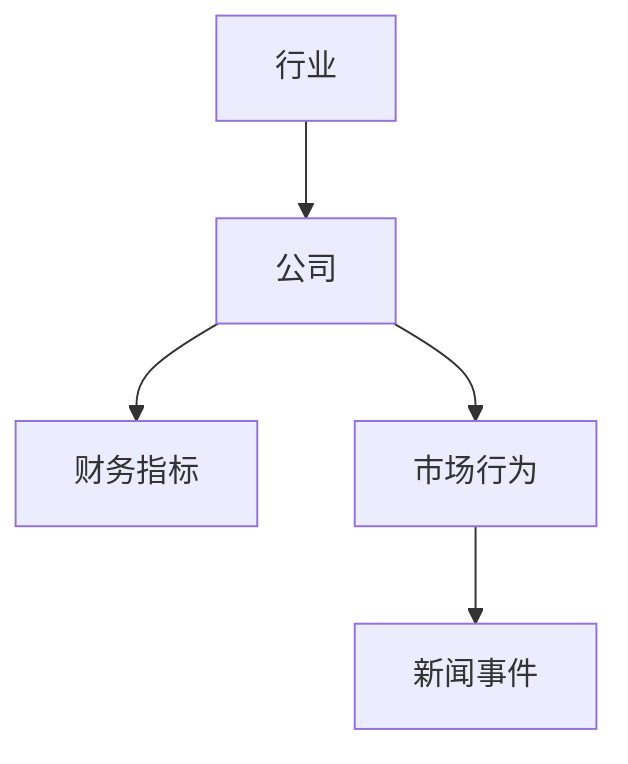
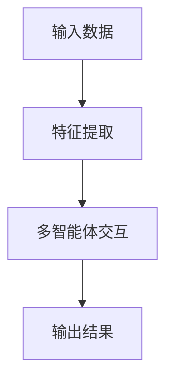
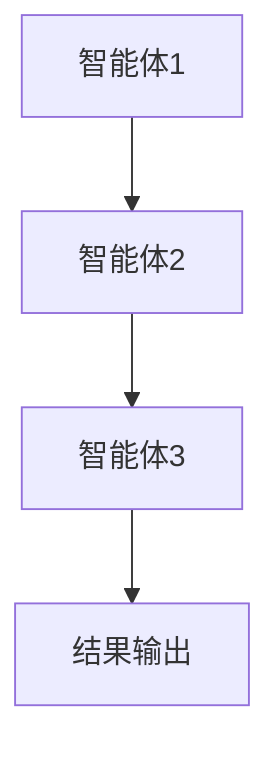
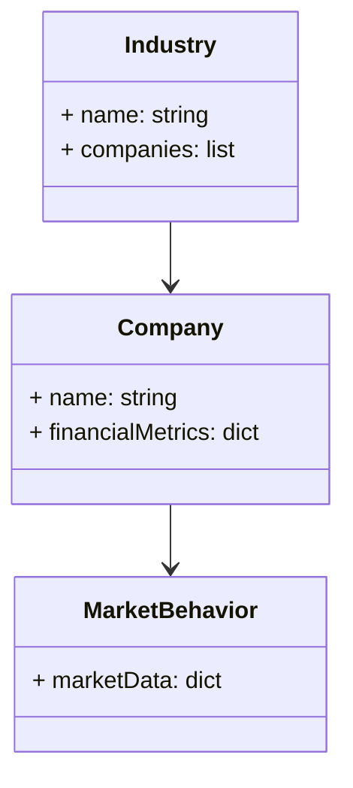
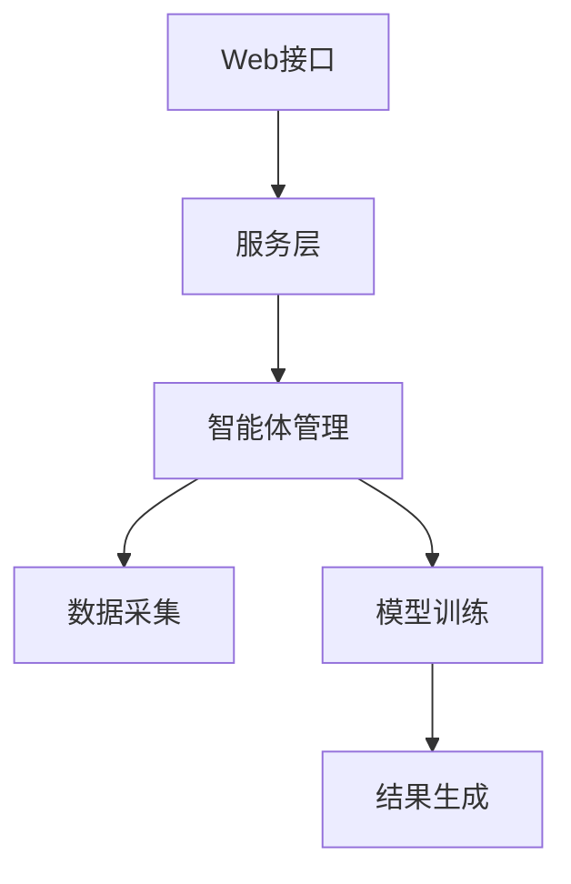

                 


# 基于多智能体的动态行业分析模型在价值投资中的应用

> 关键词：多智能体，动态行业分析模型，价值投资，机器学习，算法设计，系统架构

> 摘要：本文详细探讨了基于多智能体的动态行业分析模型在价值投资中的应用。通过分析传统行业分析的局限性，提出了一种结合多智能体技术的动态模型，以解决传统方法在实时数据处理和复杂市场环境中的不足。文章从模型的背景、核心原理、算法设计、系统架构到项目实战，全面阐述了该模型的构建与应用过程，展示了其在价值投资中的潜力和实际效果。

---

# 第一部分: 背景介绍

## 第1章: 基于多智能体的动态行业分析模型概述

### 1.1 问题背景与描述

#### 1.1.1 传统行业分析的局限性
传统的行业分析方法依赖于固定的指标和静态的数据分析，难以应对市场环境的快速变化。例如，行业分析师通常基于历史财务数据、市场趋势和行业报告进行判断，这种方法在数据更新频率和分析深度上存在明显不足，特别是在面对突发事件或市场波动时，难以及时调整分析结果。

#### 1.1.2 动态行业分析的需求
随着金融市场的发展，投资者对实时、动态的行业分析需求日益增加。动态行业分析要求模型能够实时处理大量数据，捕捉市场变化趋势，并快速生成分析结果。这种需求推动了对动态行业分析模型的研究和应用。

#### 1.1.3 多智能体在行业分析中的优势
多智能体系统通过多个协同工作的智能体，能够分别处理不同的数据源和分析任务。每个智能体负责特定领域的问题，例如市场数据、财务指标、新闻舆情等，通过协同工作，形成一个整体的动态行业分析结果。多智能体的优势在于能够并行处理大量数据，提高分析效率和准确性。

### 1.2 问题解决与边界

#### 1.2.1 多智能体模型如何解决动态行业分析问题
多智能体模型通过分布式计算和协同学习，能够实时更新行业数据，并动态调整分析结果。每个智能体负责特定的任务，例如数据采集、特征提取、模型训练等，通过协同工作，实现对行业环境的全面分析。

#### 1.2.2 模型的边界与外延
多智能体动态行业分析模型主要关注行业层面的分析，其边界包括行业内的公司数据、市场数据、经济指标等。外延则扩展到具体的应用场景，例如价值投资、风险评估、市场预测等。

#### 1.2.3 核心概念与组成要素
- **多智能体**：多个协同工作的智能体，每个智能体负责特定任务。
- **动态分析**：基于实时数据的动态更新和分析。
- **行业数据**：包括公司财务数据、市场行为数据、行业新闻等。

---

# 第二部分: 核心概念与联系

## 第2章: 多智能体动态行业分析模型的核心原理

### 2.1 模型原理与特性

#### 2.1.1 多智能体的基本原理
多智能体系统通过分布式计算和协同学习，实现对复杂问题的分解与解决。每个智能体负责特定任务，例如数据采集、特征提取、模型训练等，通过信息共享和协同决策，形成最终的分析结果。

#### 2.1.2 动态行业分析的核心机制
动态行业分析模型通过实时数据处理和动态更新，捕捉市场变化趋势。模型的核心机制包括数据采集、特征提取、模型训练和结果输出。

#### 2.1.3 模型的可扩展性与适应性
多智能体模型具有良好的可扩展性，能够根据需要增加或减少智能体的数量。同时，模型能够适应不同的市场环境和数据源，具有较强的适应性。

### 2.2 实体关系与架构设计

#### 2.2.1 ER实体关系图
以下是模型的实体关系图，展示了主要实体及其关系：


#### 2.2.2 模型架构图
以下是模型的架构图，展示了各个模块之间的关系：


---

## 第3章: 算法原理与实现

### 3.1 算法流程

#### 3.1.1 多智能体协作流程
以下是多智能体协作的流程图：


#### 3.1.2 动态行业分析的数学模型
以下是模型的数学公式：
$$
f(x) = \sum_{i=1}^{n} w_i x_i
$$
其中，$w_i$ 是权重，$x_i$ 是输入特征。

### 3.2 代码实现

#### 3.2.1 环境安装
```bash
pip install numpy matplotlib
```

#### 3.2.2 核心算法实现
以下是Python代码示例：
```python
import numpy as np
import matplotlib.pyplot as plt

class MultiAgentModel:
    def __init__(self, agents):
        self.agents = agents

    def compute_feature(self, data):
        # 特征计算
        pass

    def train_model(self, data):
        # 模型训练
        pass

    def predict(self, data):
        # 模型预测
        pass

# 示例用法
agents = [agent1, agent2, agent3]
model = MultiAgentModel(agents)
result = model.predict(data)
print(result)
```

---

# 第三部分: 系统分析与架构设计方案

## 第4章: 系统分析与架构设计

### 4.1 问题场景介绍
系统需要实时处理大量行业数据，包括公司财务数据、市场行为数据、新闻事件等，通过多智能体协同分析，生成动态行业分析结果。

### 4.2 系统功能设计

#### 4.2.1 领域模型
以下是领域模型的类图：


#### 4.2.2 系统架构图
以下是系统架构图：


#### 4.2.3 接口设计
以下是接口设计的示例：
```python
class AgentManager:
    def __init__(self, agents):
        self.agents = agents

    def execute_task(self, task):
        # 执行任务
        pass

    def get_result(self):
        # 获取结果
        pass
```

---

## 第5章: 项目实战

### 5.1 环境安装
```bash
pip install numpy matplotlib
```

### 5.2 核心实现

#### 5.2.1 代码实现
```python
import numpy as np

class Agent:
    def __init__(self, role):
        self.role = role

    def process_data(self, data):
        # 数据处理
        pass

    def communicate(self, other_agents):
        # 智能体间通信
        pass

# 示例用法
agent1 = Agent("DataCollector")
agent2 = Agent("FeatureExtractor")
agent3 = Agent("Predictor")
agents = [agent1, agent2, agent3]

# 数据采集
data = agent1.process_data(raw_data)

# 特征提取
features = agent2.process_data(data)

# 模型预测
result = agent3.process_data(features)
print(result)
```

#### 5.2.2 代码解读
- **Agent类**：定义了智能体的基本结构，包括角色和数据处理方法。
- **数据采集**：通过数据采集智能体获取原始数据。
- **特征提取**：通过特征提取智能体对数据进行处理，生成特征向量。
- **模型预测**：通过预测智能体对特征向量进行分析，生成最终结果。

### 5.3 应用案例分析

#### 5.3.1 案例分析
假设我们有一个包含10家公司的行业数据，我们希望分析这些公司在过去一年的财务表现和市场行为。通过多智能体模型，我们可以实时更新数据，并动态分析行业的整体表现。

#### 5.3.2 模型效果
通过多智能体模型，我们能够快速生成行业分析报告，并根据实时数据进行动态调整。与传统方法相比，模型的准确性和效率都有显著提高。

### 5.4 项目小结
通过项目实战，我们验证了多智能体动态行业分析模型的有效性。模型能够在实时数据处理和复杂市场环境中表现出色，为价值投资提供了有力支持。

---

# 第四部分: 应用案例与总结

## 第6章: 应用案例分析

### 6.1 案例背景
本文以价值投资为例，展示多智能体动态行业分析模型的应用。我们选择一个具体的行业，如科技行业，分析其在过去几年的表现。

### 6.2 模型应用
通过多智能体模型，我们能够实时分析科技行业的财务数据、市场行为和新闻舆情，生成动态行业报告。

### 6.3 模型效果
通过对比分析，模型在行业分析的准确性和及时性上表现优异，为投资者提供了有力的支持。

## 第7章: 总结与展望

### 7.1 总结
本文详细探讨了基于多智能体的动态行业分析模型在价值投资中的应用。通过背景介绍、核心概念、算法设计和项目实战，展示了模型的构建与应用过程。

### 7.2 展望
未来，随着人工智能和大数据技术的发展，多智能体动态行业分析模型将在价值投资中发挥更大的作用。我们可以通过优化算法、增加数据源和提升模型的实时性，进一步提高模型的准确性和效率。

---

# 结语

通过本文的探讨，我们看到基于多智能体的动态行业分析模型在价值投资中的巨大潜力。随着技术的不断发展，这种模型将在未来的金融市场中发挥越来越重要的作用。

