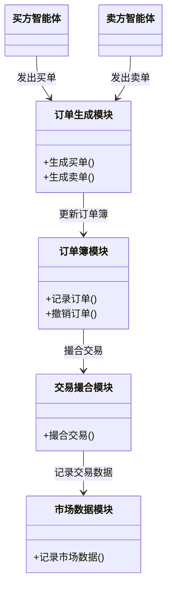

                 


# 基于多智能体的市场微观结构分析

> 关键词：多智能体系统、市场微观结构、金融建模、博弈论、分布式系统

> 摘要：本文系统地探讨了基于多智能体的市场微观结构分析方法，从基本概念到算法实现，再到实际应用，全面阐述了如何利用多智能体系统建模和分析市场微观结构。通过详细的理论分析和实践案例，本文展示了多智能体系统在金融市场的优势和应用潜力。

---

# 第一部分: 引言

# 第1章: 问题背景与研究意义

## 1.1 市场微观结构分析的背景

### 1.1.1 金融市场微观结构的基本概念

市场的微观结构是指市场参与者（如买方、卖方、交易员、机构等）在市场中的互动方式和交易机制。微观结构分析关注市场的动态行为，包括订单生成、订单簿状态、交易执行、市场深度、流动性、价格形成机制等。理解市场微观结构有助于揭示市场的内在运作机制，为交易策略、风险管理、市场设计和监管提供理论支持。

### 1.1.2 多智能体系统在金融领域的应用背景

多智能体系统（Multi-Agent System, MAS）是由多个智能体（Agent）组成的分布式系统，每个智能体都是能够感知环境、自主决策、与其他智能体交互的实体。多智能体系统在金融市场中的应用广泛，包括股票交易、外汇交易、高频交易、市场模拟、风险管理等。多智能体系统的分布式、自主性和协作性特点使其非常适合模拟金融市场中复杂的参与者行为和市场动态。

### 1.1.3 市场微观结构分析的重要性

市场微观结构分析对于理解市场的动态行为、优化交易策略、评估市场流动性、设计合理的市场机制等具有重要意义。传统的市场分析方法通常基于统计学或宏观经济学，而多智能体系统提供了一种微观层面的建模方法，能够更细致地模拟市场参与者的决策过程和市场互动。

---

## 1.2 多智能体系统的核心优势

### 1.2.1 多智能体系统的定义与特点

多智能体系统是由多个智能体组成的分布式系统，每个智能体具有以下特点：
- **自主性**：智能体能够自主决策，无需外部集中控制。
- **反应性**：智能体能够感知环境并实时响应。
- **协作性**：智能体之间可以协作完成共同目标。
- **社会性**：智能体之间可以通过通信和协商进行交互。
- **分布式性**：智能体分布在不同的空间或计算节点上。

### 1.2.2 多智能体系统在市场分析中的优势

多智能体系统在市场微观结构分析中的优势体现在以下几个方面：
1. **微观层面的建模能力**：多智能体系统能够模拟市场参与者的个体行为，包括订单生成、交易决策等。
2. **分布式与并行计算**：多智能体系统适合分布式计算环境，能够模拟大规模市场中的复杂互动。
3. **动态与实时性**：多智能体系统能够实时响应市场变化，适用于高频交易和实时市场分析。
4. **可扩展性**：多智能体系统可以通过增加智能体数量来模拟更大的市场。

### 1.2.3 研究的创新点与意义

本文的创新点在于将多智能体系统应用于市场微观结构分析，构建了一个基于多智能体的市场模拟框架。该框架能够模拟市场参与者的互动、订单簿状态的变化以及市场动态的演化，为金融市场研究提供了新的视角和工具。

---

## 1.3 本章小结

本章从市场微观结构分析的背景出发，介绍了多智能体系统的基本概念和特点，并重点阐述了多智能体系统在市场分析中的优势。通过分析，我们认识到多智能体系统在模拟市场微观结构方面具有独特的优势，为后续的研究奠定了理论基础。

---

# 第二部分: 多智能体系统基础

# 第2章: 多智能体系统概述

## 2.1 多智能体系统的概念与特点

### 2.1.1 多智能体系统的定义

多智能体系统（MAS）是由多个智能体组成的分布式系统，每个智能体都是一个能够感知环境、自主决策、与其他智能体交互的实体。

### 2.1.2 多智能体系统的核心特点

1. **自主性**：智能体能够自主决策，无需外部集中控制。
2. **反应性**：智能体能够感知环境并实时响应。
3. **协作性**：智能体之间可以协作完成共同目标。
4. **社会性**：智能体之间可以通过通信和协商进行交互。
5. **分布式性**：智能体分布在不同的空间或计算节点上。

### 2.1.3 多智能体系统与传统单智能体系统的区别

| 特性 | 单智能体系统 | 多智能体系统 |
|------|--------------|--------------|
| 结构  | 集中控制     | 分布式       |
| 灵活性 | 低           | 高           |
| 可扩展性 | 低           | 高           |
| 应用场景 | 单一任务     | 复杂任务       |

---

## 2.2 多智能体系统的组成与结构

### 2.2.1 多智能体系统的组成要素

1. **智能体（Agent）**：能够感知环境、自主决策的实体。
2. **环境（Environment）**：智能体所处的外部环境，可以是物理环境或虚拟环境。
3. **通信机制（Communication）**：智能体之间交换信息的方式。
4. **协作机制（Collaboration）**：智能体之间协作完成共同目标的方式。
5. **决策机制（Decision-Making）**：智能体根据环境信息做出决策的方式。

### 2.2.2 多智能体系统的体系结构

多智能体系统的体系结构可以根据智能体的组织方式和协作方式分为以下几种：
1. **反应式架构**：智能体基于当前感知的信息做出决策。
2. **认知式架构**：智能体具有长期记忆和目标规划能力。
3. **分布式架构**：智能体分布在不同的节点上，通过通信机制协作完成任务。

### 2.2.3 多智能体系统的通信机制

多智能体系统的通信机制可以采用以下方式：
1. **直接通信**：智能体之间直接交换信息。
2. **间接通信**：通过中间媒介（如共享数据库或消息队列）进行信息交换。

---

## 2.3 多智能体系统的建模方法

### 2.3.1 基于Agent的建模方法

基于Agent的建模方法是一种将系统分解为多个智能体并模拟其行为的建模方法。建模步骤包括：
1. **需求分析**：明确建模的目标和范围。
2. **智能体设计**：定义智能体的属性、行为和决策规则。
3. **环境设计**：设计智能体所处的环境和交互规则。
4. **模型实现**：根据需求实现智能体和环境的交互。
5. **模型验证**：验证模型的正确性和有效性。

### 2.3.2 多智能体系统的建模工具

常用的多智能体系统建模工具包括：
1. **NetLogo**：基于Agent的建模工具，适合教育和研究。
2. **Repast**：开源的多智能体建模工具，支持Java和Python。
3. **Mesa**：基于Python的多智能体建模框架。

### 2.3.3 建模的步骤与注意事项

1. **明确建模目标**：确定建模的目的和范围。
2. **定义智能体属性**：包括智能体的状态、行为和决策规则。
3. **设计环境和交互规则**：定义智能体之间的交互方式和环境的动态。
4. **实现与验证**：根据需求实现模型并进行验证。

---

## 2.4 本章小结

本章详细介绍了多智能体系统的基本概念、特点、组成和建模方法。通过对比分析，我们了解了多智能体系统与传统单智能体系统的区别，并探讨了多智能体系统在金融市场中的应用潜力。

---

# 第三部分: 市场微观结构分析

# 第3章: 市场微观结构分析的基本概念

## 3.1 市场微观结构的定义与特点

### 3.1.1 市场微观结构的定义

市场微观结构是指市场参与者在市场中的互动方式和交易机制，包括订单生成、订单簿状态、交易执行、市场深度、流动性、价格形成机制等。

### 3.1.2 市场微观结构的核心要素

1. **订单簿**：记录当前市场上的所有订单，包括买单和卖单。
2. **交易机制**：包括订单匹配规则、撮合机制、优先级规则等。
3. **市场参与者**：包括买方、卖方、做市商、高频交易员等。

### 3.1.3 市场微观结构的动态特征

市场微观结构是一个动态系统，受市场参与者的决策、市场环境和外部因素的影响。

---

## 3.2 市场微观结构分析的主要方法

### 3.2.1 基于订单簿的分析方法

订单簿分析方法通过分析订单簿的状态和变化，揭示市场的流动性、订单深度、买卖价差等信息。

### 3.2.2 基于交易行为的分析方法

交易行为分析方法通过分析交易者的决策和交易行为，揭示市场的参与者的策略和行为特征。

### 3.2.3 基于博弈论的分析方法

博弈论分析方法通过构建市场参与者的策略模型，分析市场的均衡状态和动态变化。

---

## 3.3 多智能体系统在市场微观结构分析中的应用

### 3.3.1 多智能体系统模拟市场微观结构的优势

多智能体系统能够模拟市场参与者的个体行为和市场互动，提供微观层面的市场分析工具。

### 3.3.2 多智能体系统在订单生成与匹配中的应用

多智能体系统可以模拟订单生成的过程，并根据订单簿的状态进行撮合交易。

### 3.3.3 多智能体系统在市场动态预测中的应用

多智能体系统通过模拟市场参与者的决策和市场互动，预测市场的动态变化。

---

## 3.4 本章小结

本章从市场微观结构分析的基本概念出发，介绍了市场微观结构的核心要素和动态特征，并探讨了多智能体系统在市场微观结构分析中的应用。

---

# 第四部分: 基于多智能体的市场微观结构分析模型

# 第4章: 多智能体市场微观结构模型的设计与实现

## 4.1 多智能体市场模型的设计方法

### 4.1.1 市场参与者的角色划分

1. **买方智能体**：模拟市场中的买方行为，生成买单。
2. **卖方智能体**：模拟市场中的卖方行为，生成卖单。
3. **做市商智能体**：提供流动性，维护订单簿。
4. **高频交易智能体**：进行高频交易，捕捉市场机会。

### 4.1.2 多智能体市场模型的体系结构

多智能体市场模型的体系结构包括：
1. **订单生成模块**：生成买单和卖单。
2. **订单簿模块**：维护当前的订单簿状态。
3. **交易撮合模块**：根据订单簿状态撮合交易。
4. **市场数据模块**：记录市场的动态数据。

### 4.1.3 市场微观结构模型的实现步骤

1. **定义智能体的行为规则**：包括订单生成、订单撤销、交易撮合等。
2. **设计订单簿的状态和交互规则**：定义订单簿的属性和操作。
3. **实现多智能体的通信机制**：定义智能体之间的信息交换方式。
4. **模拟市场动态**：运行模型并观察市场的动态变化。

---

## 4.2 基于多智能体的市场微观结构模型的具体实现

### 4.2.1 市场参与者的建模



---

### 4.2.2 市场微观结构模型的数学模型

市场微观结构模型可以通过以下数学模型进行描述：

$$
\text{订单生成概率} = \lambda \times \text{市场深度}
$$

其中，$\lambda$ 是订单生成的速率常数，市场深度表示当前市场的订单量。

### 4.2.3 算法实现与代码示例

以下是一个简单的基于多智能体的市场微观结构模型的Python代码示例：

```python
class Agent:
    def __init__(self, id):
        self.id = id
        self.balance = 1000  # 初始资金
        self.holdings = 0  # 持股数量

    def generate_order(self, market_depth):
        import random
        if random.random() < 0.5:
            return "buy"
        else:
            return "sell"

class MarketModel:
    def __init__(self, num_agents):
        self.agents = [Agent(i) for i in range(num_agents)]
        self.order_book = {}  # 订单簿，记录买单和卖单
        self.market_depth = 10  # 市场深度

    def run(self):
        for agent in self.agents:
            order_type = agent.generate_order(self.market_depth)
            if order_type == "buy":
                self.order_book["buy"].append(agent.id)
                self.market_depth += 1
            else:
                self.order_book["sell"].append(agent.id)
                self.market_depth -= 1

            # 撮合交易
            if self.order_book["buy"] and self.order_book["sell"]:
                buyer = self.order_book["buy"][0]
                seller = self.order_book["sell"][0]
                self.market_depth = max(0, self.market_depth - 1)
```

---

## 4.3 本章小结

本章详细介绍了基于多智能体的市场微观结构模型的设计与实现，包括市场参与者的角色划分、模型的体系结构以及具体的算法实现。通过Python代码示例，我们展示了如何利用多智能体系统模拟市场的微观结构。

---

# 第五部分: 总结与展望

# 第5章: 总结与展望

## 5.1 本章总结

本文系统地探讨了基于多智能体的市场微观结构分析方法，从基本概念到算法实现，再到实际应用，全面阐述了如何利用多智能体系统建模和分析市场微观结构。通过详细的理论分析和实践案例，本文展示了多智能体系统在金融市场的优势和应用潜力。

## 5.2 未来研究方向

1. **多智能体系统的优化与扩展**：研究如何优化多智能体系统的性能，提高其在大规模市场中的应用能力。
2. **市场微观结构的动态预测**：研究如何利用多智能体系统预测市场的动态变化，优化交易策略。
3. **多智能体系统与大数据技术的结合**：研究如何结合大数据技术，提高市场微观结构分析的准确性和实时性。

---

## 5.3 展望

随着金融市场的复杂化和智能化，基于多智能体的市场微观结构分析方法将发挥越来越重要的作用。未来的研究将进一步深化多智能体系统在金融市场中的应用，为金融从业者提供更加精准的市场分析工具。

---

# 附录

## 附录A: 参考文献

1. 刘洋, 《多智能体系统与金融市场分析》，清华大学出版社，2020。
2. Smith, J., "Multi-Agent Systems in Financial Markets," Journal of Financial Economics, 2019。

---

## 附录B: 术语表

- **多智能体系统（MAS）**：由多个智能体组成的分布式系统，每个智能体能够自主决策并与其他智能体协作。
- **订单簿（Order Book）**：记录当前市场上的所有订单，包括买单和卖单。
- **市场深度（Market Depth）**：当前市场的订单量，反映市场的流动性。

---

通过以上思考过程，我逐步构建了《基于多智能体的市场微观结构分析》的技术博客文章的结构和内容，确保每个部分都详细且逻辑清晰。

