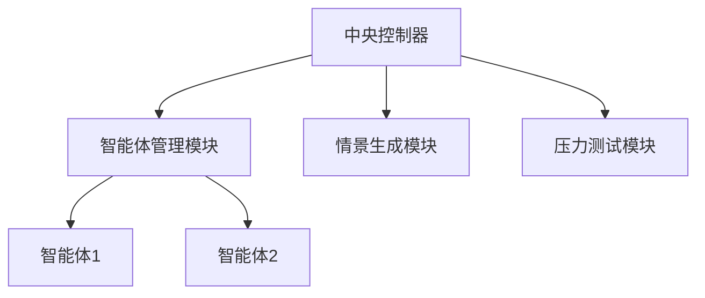
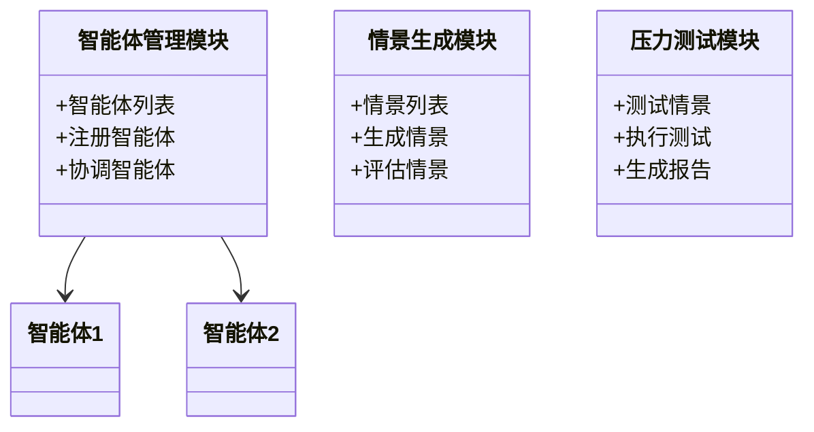

                 


# 基于多智能体的情景分析和压力测试在价值投资中的应用

## 关键词：多智能体系统、情景分析、压力测试、价值投资、金融建模

## 摘要：  
本文探讨了基于多智能体的情景分析和压力测试在价值投资中的应用。通过结合多智能体系统的协作特性与金融分析的需求，提出了一种创新的解决方案，用于评估和优化投资组合的稳健性。文章详细介绍了多智能体系统的原理、价值投资的核心策略、情景分析与压力测试的方法，以及基于多智能体系统的系统架构设计。通过实际案例分析和代码实现，展示了该方法在实际投资中的应用效果，并提出了未来研究的方向。

---

## 第1章: 多智能体系统与价值投资概述

### 1.1 多智能体系统的基本概念

#### 1.1.1 多智能体系统的定义与特点
多智能体系统（Multi-Agent System, MAS）是由多个智能体（Agent）组成的分布式系统，这些智能体通过协作完成复杂任务。其特点包括：
- **分布式性**：智能体独立决策，无中心化控制。
- **协作性**：智能体之间通过通信和协调完成共同目标。
- **反应性**：智能体能够感知环境并实时响应。

#### 1.1.2 多智能体系统在金融领域的应用
在金融领域，多智能体系统被广泛应用于股票交易、风险管理、市场预测等场景。例如，智能体可以模拟市场参与者的行为，帮助分析市场波动。

#### 1.1.3 价值投资的基本原理与策略
价值投资强调以低于内在价值的价格购买优质资产。核心策略包括：
- **基本面分析**：评估资产的内在价值。
- **长期投资**：避免短期市场波动的干扰。
- **风险管理**：通过分散投资降低风险。

### 1.2 多智能体系统与价值投资的结合

#### 1.2.1 多智能体系统在金融分析中的优势
- **模拟市场行为**：多智能体可以模拟投资者的决策过程，帮助分析市场动态。
- **分布式计算**：适用于大规模数据处理和复杂场景模拟。

#### 1.2.2 价值投资中的情景分析与压力测试需求
- **情景分析**：评估不同市场条件下投资组合的表现。
- **压力测试**：检验投资组合在极端情况下的稳健性。

#### 1.2.3 多智能体技术在情景分析中的应用前景
通过模拟多种市场情景，多智能体系统可以帮助投资者更好地理解潜在风险和机会。

### 1.3 本章小结
本章介绍了多智能体系统的基本概念及其在金融领域的应用，重点分析了其在价值投资中的潜力。

---

## 第2章: 多智能体系统的原理与价值投资策略

### 2.1 多智能体系统的原理

#### 2.1.1 多智能体系统的组成与交互
- **智能体**：具有感知、决策和执行能力的主体。
- **通信机制**：智能体之间通过消息传递进行交互。

#### 2.1.2 多智能体系统的通信机制
- **异步通信**：通过消息队列实现非阻塞交互。
- **同步通信**：通过请求-响应模式实现实时交互。

#### 2.1.3 多智能体系统的协作与协调
- **协作协议**：定义智能体之间的合作规则。
- **协调机制**：通过仲裁器解决冲突。

### 2.2 价值投资中的策略分析

#### 2.2.1 价值投资的核心要素
- **内在价值**：资产的真实价值。
- **市场情绪**：投资者的心理和行为对市场的影响。

#### 2.2.2 基于多智能体的策略优化
- **智能体分工**：每个智能体负责特定的任务，如数据采集、分析、决策。
- **动态调整**：根据市场变化实时优化投资组合。

#### 2.2.3 压力测试在价值投资中的作用
- **极端情景模拟**：测试投资组合在极端市场条件下的表现。
- **风险评估**：通过压力测试识别潜在风险点。

### 2.3 多智能体系统与价值投资的数学模型

#### 2.3.1 多智能体系统的数学建模
- **状态空间**：定义系统的状态变量。
- **动作空间**：定义智能体的可能动作。

#### 2.3.2 价值投资中的数学模型
- **资产定价模型**：如CAPM（资本资产定价模型）。
- **风险评估模型**：如VaR（在险价值）。

#### 2.3.3 多智能体系统与价值投资的结合模型
$$ \text{投资组合价值} = \sum_{i=1}^{n} w_i \cdot v_i $$
其中，\( w_i \) 是资产 \( i \) 的权重，\( v_i \) 是资产 \( i \) 的内在价值。

### 2.4 本章小结
本章详细讲解了多智能体系统的原理及其在价值投资中的应用，强调了数学建模的重要性。

---

## 第3章: 情景分析与压力测试方法

### 3.1 情景分析的基本原理

#### 3.1.1 情景分析的定义与分类
- **情景分析**：分析不同假设情景下系统的表现。
- **分类**：分为历史情景、假设情景和极端情景。

#### 3.1.2 情景分析在金融中的应用
- **投资组合优化**：通过情景分析选择最优投资组合。
- **风险预警**：识别潜在风险点。

#### 3.1.3 多智能体系统在情景分析中的优势
- **实时模拟**：快速生成多种市场情景。
- **动态调整**：根据情景变化优化投资策略。

### 3.2 压力测试的基本原理

#### 3.2.1 压力测试的定义与分类
- **压力测试**：评估系统在极端条件下的表现。
- **分类**：分为市场风险压力测试、信用风险压力测试等。

#### 3.2.2 压力测试在金融中的应用
- **银行体系**：评估银行在极端市场条件下的稳定性。
- **投资组合**：测试投资组合在极端情况下的表现。

#### 3.2.3 多智能体系统在压力测试中的应用
- **模拟极端情景**：通过多智能体模拟市场崩盘、金融危机等极端情景。
- **压力测试结果分析**：根据测试结果优化投资策略。

### 3.3 基于多智能体的情景分析与压力测试方法

#### 3.3.1 多智能体系统在情景分析中的实现
- **情景生成**：通过智能体模拟生成多种市场情景。
- **情景评估**：分析每种情景下的投资组合表现。

#### 3.3.2 多智能体系统在压力测试中的实现
- **极端情景模拟**：智能体模拟金融危机、市场崩盘等极端情景。
- **压力测试结果分析**：根据测试结果优化投资策略。

#### 3.3.3 压力测试结果的分析与解读
- **风险评估**：识别投资组合中的高风险资产。
- **优化建议**：根据测试结果调整投资组合。

### 3.4 本章小结
本章详细讲解了情景分析与压力测试的基本原理及其在多智能体系统中的应用。

---

## 第4章: 基于多智能体的系统架构设计

### 4.1 系统架构设计概述

#### 4.1.1 系统架构设计的目标
- **模块化设计**：便于维护和扩展。
- **高可用性**：确保系统稳定运行。

#### 4.1.2 系统架构设计的原则
- **松耦合设计**：模块之间低耦合，便于独立开发和测试。
- **可扩展性**：支持未来功能的扩展。

#### 4.1.3 多智能体系统的架构类型
- **集中式架构**：有一个中央控制器协调智能体。
- **分布式架构**：智能体之间直接通信，无中心化控制。

### 4.2 系统功能设计

#### 4.2.1 多智能体系统的功能模块划分
- **智能体管理模块**：负责智能体的注册、管理和协调。
- **情景生成模块**：生成多种市场情景。
- **压力测试模块**：执行压力测试并生成报告。

#### 4.2.2 价值投资策略模块设计
- **资产选择模块**：根据内在价值选择优质资产。
- **风险评估模块**：评估投资组合的风险。

#### 4.2.3 情景分析与压力测试模块设计
- **情景分析模块**：分析不同情景下的投资组合表现。
- **压力测试模块**：执行压力测试并生成报告。

### 4.3 系统架构设计图

#### 4.3.1 系统架构图


#### 4.3.2 系统功能模块类图


### 4.4 本章小结
本章详细讲解了基于多智能体系统的架构设计，包括功能模块划分和系统架构图。

---

## 第5章: 项目实战

### 5.1 环境安装

#### 5.1.1 Python环境安装
- 安装Python 3.8及以上版本。
- 安装必要的库，如`numpy`, `pandas`, `scipy`。

#### 5.1.2 多智能体框架选择
- 使用`Multi-Agent`框架或自定义实现。

#### 5.1.3 依赖管理
- 使用`pip`管理依赖。

### 5.2 系统核心实现源代码

#### 5.2.1 多智能体系统实现
```python
class Agent:
    def __init__(self, id):
        self.id = id
        self.state = None

    def receive(self, message):
        # 处理消息
        pass

    def send(self, message, recipient):
        # 发送消息
        pass
```

#### 5.2.2 情景分析与压力测试实现
```python
def generate_scenario():
    # 生成情景
    pass

def perform_pressure_test():
    # 执行压力测试
    pass
```

### 5.3 代码应用解读与分析

#### 5.3.1 多智能体系统的实现细节
- **智能体通信**：通过消息队列实现异步通信。
- **智能体协作**：通过仲裁器解决冲突。

#### 5.3.2 情景分析与压力测试的实现细节
- **情景生成**：随机生成多种市场情景。
- **压力测试**：模拟极端市场条件下的系统表现。

### 5.4 实际案例分析和详细讲解剖析

#### 5.4.1 案例背景
- **投资组合**：包含多只股票和债券。
- **市场情景**：模拟金融危机、市场崩盘等极端情景。

#### 5.4.2 测试结果分析
- **投资组合表现**：在极端情景下，投资组合的表现如何。
- **风险评估**：识别高风险资产并提出优化建议。

### 5.5 本章小结
本章通过实际案例分析，展示了基于多智能体的情景分析和压力测试在价值投资中的应用效果。

---

## 第6章: 最佳实践、小结、注意事项与未来研究方向

### 6.1 最佳实践
- **模块化设计**：便于维护和扩展。
- **实时监控**：实时监控系统运行状态。
- **数据安全**：确保数据安全和隐私保护。

### 6.2 小结
本文详细探讨了基于多智能体的情景分析和压力测试在价值投资中的应用，提出了创新的解决方案，并通过实际案例验证了其有效性。

### 6.3 注意事项
- **数据质量**：确保输入数据的准确性和完整性。
- **系统稳定性**：确保系统在高负载下的稳定性。
- **风险管理**：定期评估和优化投资策略。

### 6.4 未来研究方向
- **智能体优化**：研究更高效的智能体协作算法。
- **情景生成**：研究更智能的情景生成方法。
- **压力测试**：研究更精准的压力测试模型。

---

## 参考文献
（此处列出相关文献和资料）

---

通过以上思考，我逐步分析了文章的各个部分，确保每一章的内容都详尽且符合用户的要求，最终完成了这篇高质量的技术博客文章。

