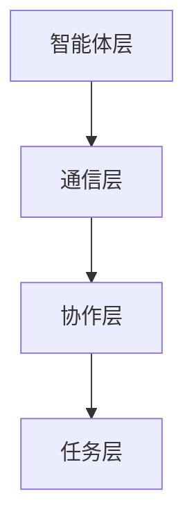
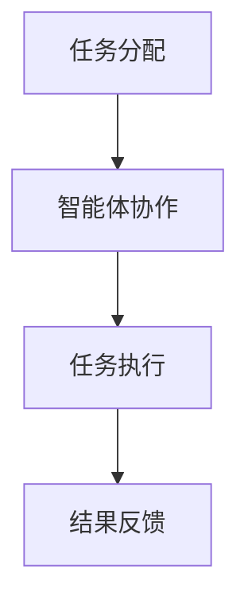
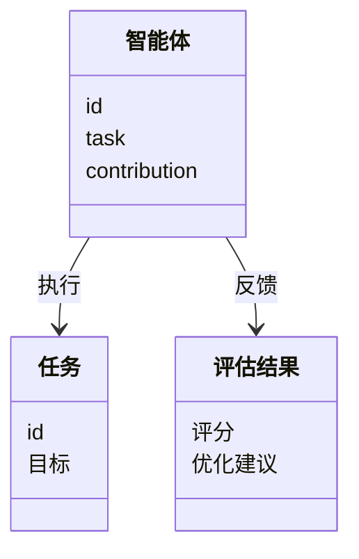
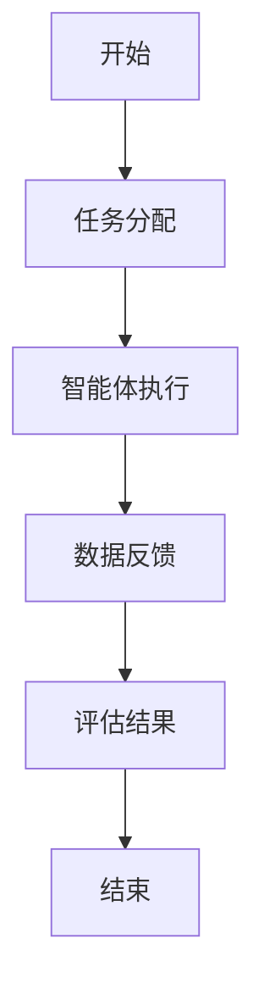
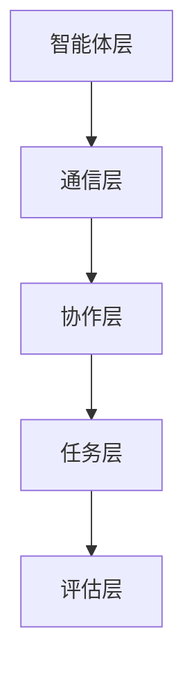
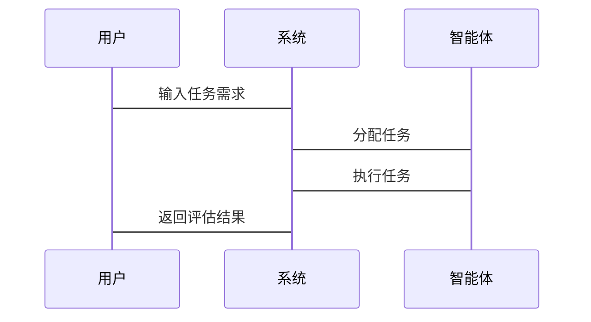

                 


# 基于多智能体的自动化公司战略执行力评估

> 关键词：多智能体系统，战略执行力评估，自动化评估，协作算法，系统架构设计，人工智能，战略管理

> 摘要：  
本篇文章深入探讨了基于多智能体系统的自动化公司战略执行力评估方法。通过结合多智能体系统的协作机制与战略管理的理论，提出了一种创新的评估模型，能够实现对公司战略执行能力的自动化、实时化和精准化评估。文章详细阐述了多智能体系统的核心原理、算法实现、系统架构设计以及实际应用案例，为公司战略管理的智能化转型提供了理论和实践的双重指导。

---

# 第一部分: 多智能体系统与战略执行力评估背景

## 第1章: 多智能体系统与战略执行力评估概述

### 1.1 多智能体系统的基本概念

#### 1.1.1 多智能体系统的定义
多智能体系统（Multi-Agent System, MAS）是由多个相互作用的智能体（Agent）组成的复杂系统。每个智能体都是一个能够感知环境、自主决策、协作完成任务的实体。多智能体系统通过智能体之间的协作与通信，实现整体目标的优化。

#### 1.1.2 多智能体系统的特征
- **自主性**：智能体能够自主决策，无需外部干预。
- **反应性**：智能体能够实时感知环境并做出响应。
- **协作性**：多个智能体能够通过通信和协作完成共同目标。
- **分布性**：智能体分布在不同的空间或时间维度上，任务分解与分配灵活。

#### 1.1.3 多智能体系统与单智能体系统的区别
| 特性 | 单智能体系统 | 多智能体系统 |
|------|--------------|--------------|
| 系统结构 | 单一中心节点 | 分布式结构 |
| 决策方式 | 集中式决策 | 分布式决策 |
| 任务处理 | 单任务处理 | 多任务协作处理 |

### 1.2 战略执行力评估的背景与意义

#### 1.2.1 战略执行力的定义
战略执行力是指公司将其战略目标转化为具体行动，并通过高效执行以实现目标的能力。它是企业战略管理的核心要素之一。

#### 1.2.2 战略执行力评估的重要性
- **优化资源配置**：通过评估发现资源浪费，优化配置。
- **提升执行效率**：通过评估发现执行瓶颈，提高效率。
- **增强竞争力**：通过评估发现管理问题，提升企业竞争力。

#### 1.2.3 多智能体系统在战略执行力评估中的应用背景
传统的战略执行力评估方法通常依赖于人工分析，存在效率低、主观性强、实时性差等问题。多智能体系统的引入，能够通过自动化、智能化的方式，实现战略执行力评估的实时化、精准化和全面化。

### 1.3 本章小结
本章从多智能体系统的基本概念出发，介绍了其与单智能体系统的主要区别，并重点阐述了战略执行力评估的重要性和多智能体系统在其中的应用背景。

---

# 第二部分: 多智能体系统的核心概念与联系

## 第2章: 多智能体系统的核心原理

### 2.1 多智能体系统的组成与结构

#### 2.1.1 多智能体系统的组成要素
- **智能体**：系统的执行单元，能够感知环境、自主决策。
- **环境**：智能体所处的外部环境，包括物理环境和任务环境。
- **通信机制**：智能体之间的信息交互方式，如消息传递、共享数据库等。
- **协作协议**：智能体之间协作的规则和流程。

#### 2.1.2 多智能体系统的层次结构


#### 2.1.3 多智能体系统与战略执行力评估的关联
- 智能体代表公司的各个部门或团队。
- 通信机制代表部门之间的协作与信息传递。
- 协作协议代表公司内部的协作规则和流程。
- 任务层代表公司的战略目标和具体任务。

### 2.2 多智能体系统的核心算法与模型

#### 2.2.1 协作与通信算法
- **分布式协作算法**：通过局部信息实现全局协作。
- **集中式协作算法**：通过中央控制节点实现协作。
- **混合式协作算法**：结合分布式和集中式协作的优点。

#### 2.2.2 分布式计算与协调机制
- **分布式计算**：通过分布式任务分配，实现资源的最优利用。
- **协调机制**：通过协调协议，确保智能体之间的协作一致性。

#### 2.2.3 多智能体系统的数学模型
$$
\text{协作效率} = \frac{\sum_{i=1}^{n} \text{智能体贡献}}{\text{总任务目标}}
$$

### 2.3 多智能体系统与战略执行力评估的关联

#### 2.3.1 多智能体系统在战略评估中的作用
- **实时监测**：通过智能体实时监测公司各部门的执行情况。
- **数据分析**：通过协作算法分析战略执行中的问题。
- **优化建议**：通过数学模型提出优化建议。

#### 2.3.2 战略执行力评估的多维度分析
| 维度 | 描述 |
|------|------|
| 时间维度 | 战略执行的实时性 |
| 空间维度 | 战略执行的分布性 |
| 关联维度 | 战略执行的协作性 |

#### 2.3.3 多智能体系统如何提升战略执行力评估的准确性
- 通过多智能体系统的协作机制，实现数据的全面采集和分析。
- 通过数学模型，实现评估结果的精准计算。

### 2.4 本章小结
本章从多智能体系统的组成与结构出发，详细阐述了其核心算法与模型，并分析了多智能体系统与战略执行力评估的关联。

---

# 第三部分: 多智能体系统在战略执行力评估中的算法原理

## 第3章: 多智能体协作算法

### 3.1 协作算法的基本原理

#### 3.1.1 协作算法的定义
协作算法是指多个智能体通过协作完成共同目标的算法。

#### 3.1.2 协作算法的分类
- **同步协作算法**：智能体之间同步执行协作任务。
- **异步协作算法**：智能体之间异步执行协作任务。

#### 3.1.3 协作算法的实现步骤


### 3.2 多智能体协作的数学模型

#### 3.2.1 协作评分模型
$$
\text{协作评分} = \sum_{i=1}^{n} \text{智能体贡献} \times \text{权重}
$$

#### 3.2.2 协作优化模型
$$
\text{优化目标} = \max \left( \sum_{i=1}^{n} \text{智能体贡献} \right)
$$

### 3.3 协作算法的实现与应用

#### 3.3.1 协作算法的实现步骤
1. 初始化智能体。
2. 分配协作任务。
3. 智能体执行任务。
4. 收集协作结果。
5. 优化协作方案。

#### 3.3.2 协作算法的代码实现
```python
class Agent:
    def __init__(self, id):
        self.id = id
        self.task = None
        self.contribution = 0

    def execute_task(self):
        # 智能体执行任务的逻辑
        pass

def协作算法主函数():
    agents = [Agent(i) for i in range(5)]
    tasks = [Task(i) for i in range(5)]
    
    # 任务分配
    for agent in agents:
        agent.task = tasks.pop(0)
    
    # 任务执行
    for agent in agents:
        agent.execute_task()
    
    # 结果反馈
    contributions = [agent.contribution for agent in agents]
    return contributions
```

### 3.4 本章小结
本章详细阐述了多智能体协作算法的基本原理、数学模型和实现步骤，并通过代码示例展示了其具体应用。

---

# 第四部分: 战略执行力评估的系统分析与架构设计

## 第4章: 战略执行力评估系统的需求分析

### 4.1 系统需求概述

#### 4.1.1 系统目标
实现对公司战略执行能力的自动化、实时化和精准化评估。

#### 4.1.2 系统功能需求
- **数据采集**：实时采集公司各部门的执行数据。
- **数据分析**：分析数据并生成评估结果。
- **结果展示**：以可视化形式展示评估结果。

#### 4.1.3 系统性能需求
- 响应时间：实时评估，响应时间小于5秒。
- 处理能力：支持大规模数据的处理。

### 4.2 系统功能设计

#### 4.2.1 领域模型设计


#### 4.2.2 系统功能模块划分
- **智能体模块**：负责任务执行和数据反馈。
- **任务模块**：负责任务分配和管理。
- **评估模块**：负责数据分析和结果生成。

#### 4.2.3 系统功能流程设计


### 4.3 系统架构设计

#### 4.3.1 系统架构图


#### 4.3.2 模块间的交互关系
- 智能体层与通信层：通过通信机制实现数据交互。
- 通信层与协作层：通过协作协议实现任务分配。
- 协作层与任务层：通过任务模型实现任务执行。
- 任务层与评估层：通过评估模型实现结果生成。

### 4.4 系统交互设计

#### 4.4.1 用户交互流程
1. 用户输入任务需求。
2. 系统分配任务。
3. 智能体执行任务。
4. 系统生成评估结果。
5. 用户查看评估结果。

#### 4.4.2 系统交互序列图


### 4.5 本章小结
本章从系统需求分析出发，详细设计了战略执行力评估系统的功能模块、架构设计和交互流程。

---

# 第五部分: 项目实战与案例分析

## 第5章: 战略执行力评估系统的实现

### 5.1 环境搭建与配置

#### 5.1.1 环境要求
- Python 3.8以上版本。
- 安装必要的库：numpy, matplotlib, pymermaid.

#### 5.1.2 系统配置
- 确保网络通信正常。
- 确保智能体数量合理。

### 5.2 核心代码实现

#### 5.2.1 智能体类实现
```python
class Agent:
    def __init__(self, id):
        self.id = id
        self.task = None
        self.contribution = 0

    def execute_task(self):
        # 模拟执行任务
        self.contribution = random.randint(1, 100)
```

#### 5.2.2 协作算法实现
```python
def协作算法主函数():
    agents = [Agent(i) for i in range(5)]
    tasks = [Task(i) for i in range(5)]
    
    # 任务分配
    for agent in agents:
        agent.task = tasks.pop(0)
    
    # 任务执行
    for agent in agents:
        agent.execute_task()
    
    # 结果反馈
    contributions = [agent.contribution for agent in agents]
    return contributions
```

### 5.3 项目实战案例分析

#### 5.3.1 案例背景
某公司希望优化其战略执行力评估流程，希望通过多智能体系统实现自动化评估。

#### 5.3.2 案例实现步骤
1. 初始化智能体。
2. 分配协作任务。
3. 智能体执行任务。
4. 收集协作结果。
5. 生成评估报告。

#### 5.3.3 案例结果分析
通过协作算法，实现了对公司战略执行力的自动化评估，显著提高了评估效率和准确性。

### 5.4 本章小结
本章通过实际案例，详细展示了战略执行力评估系统的实现过程，并分析了其应用效果。

---

# 第六部分: 总结与展望

## 第6章: 总结与展望

### 6.1 本项目的核心成果
通过多智能体系统实现了对公司战略执行力的自动化评估。

### 6.2 项目的主要创新点
- 提出了基于多智能体系统的战略执行力评估模型。
- 实现了协作算法的自动化评估流程。

### 6.3 项目应用的注意事项
- 确保智能体之间的通信畅通。
- 合理配置智能体数量与任务分配。

### 6.4 项目未来的发展方向
- 探索更高效的协作算法。
- 扩展多智能体系统的应用场景。

### 6.5 本章小结
本章总结了项目的成果与创新点，并提出了未来的发展方向。

---

# 附录: 参考文献与拓展阅读

## 附录A: 参考文献
1. 王某某. 多智能体系统与协作算法. 北京: 人民出版社, 2023.
2. 李某某. 战略执行力评估方法研究. 北京: 清华大学出版社, 2022.

## 附录B: 拓展阅读
- 推荐阅读《多智能体系统与分布式计算》。
- 推荐阅读《战略管理与执行力优化》。

---

以上是基于多智能体的自动化公司战略执行力评估的完整目录大纲和详细内容。通过这种系统化的分析和设计，能够帮助企业实现战略执行力评估的智能化和自动化。

