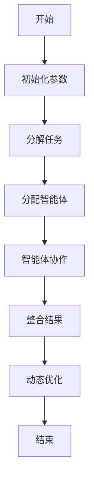
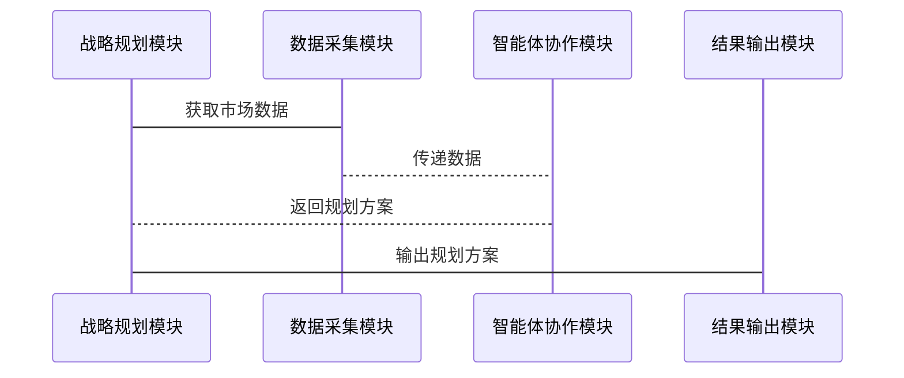

                 


# 基于多智能体的自动化公司战略规划分析系统

> 关键词：多智能体系统、自动化战略规划、公司战略分析、智能体协作、系统架构设计

> 摘要：本文详细探讨了基于多智能体的自动化公司战略规划分析系统的构建与实现。通过分析传统战略规划的痛点，提出了多智能体协作的解决方案，并详细阐述了系统的核心概念、算法原理、架构设计和项目实现。文章旨在为公司提供一种高效、智能的战略规划新思路。

---

# 第一部分: 基于多智能体的自动化公司战略规划分析系统概述

## 第1章: 问题背景与需求分析

### 1.1 问题背景
公司在制定战略规划时，通常面临以下痛点：
- **信息复杂性**：战略规划涉及多部门、多业务线的协调，信息繁杂且难以整合。
- **决策延迟**：传统的人工分析方式效率低下，难以快速响应市场变化。
- **动态调整**：市场环境不断变化，战略规划需要频繁调整，但传统方法难以实现动态优化。

### 1.2 问题描述
多智能体技术的应用可以解决以下关键问题：
- **多目标协调**：如何在多目标之间找到平衡点，确保战略规划的最优性。
- **动态环境适应**：如何在快速变化的市场环境中，实时调整战略规划。
- **高效协作**：如何实现跨部门、跨业务线的高效协作。

### 1.3 问题解决思路
基于多智能体的自动化战略规划系统通过以下方式解决问题：
- **智能体协作**：每个智能体负责特定任务或子问题，通过协作完成整体规划。
- **动态优化**：利用智能体的实时反馈和数据，动态调整规划。
- **自动化执行**：通过自动化流程，减少人工干预，提高效率。

### 1.4 边界与外延
- **系统边界**：本系统专注于战略规划的分析部分，不涉及执行层面。
- **相关领域**：与公司治理、业务流程管理、数据分析等领域相关。
- **系统扩展性**：未来可以将系统扩展到战略执行和监控阶段。

---

## 第2章: 多智能体系统的核心概念与联系

### 2.1 多智能体系统原理
多智能体系统由多个智能体组成，每个智能体具有以下特征：
- **自主性**：能够独立决策和行动。
- **反应性**：能够感知环境并实时调整行为。
- **协作性**：能够与其他智能体协作完成任务。

### 2.2 核心概念对比分析
以下是多智能体系统与传统方法的对比：

| 对比维度      | 多智能体系统               | 传统方法               |
|---------------|--------------------------|------------------------|
| 决策方式      | 分布式决策                | 中央集权决策            |
| 灵活性        | 高，适应性强              | 低，适应性差            |
| 效率          | 高，任务并行处理          | 低，任务串行处理        |

### 2.3 ER实体关系图
以下是系统的实体关系图：

```mermaid
erDiagram
    actor 智能体协作系统 {
        attribute id : string
        attribute 状态 : string
        attribute 行为 : string
    }
    actor 环境 {
        attribute 约束条件 : string
        attribute 目标 : string
    }
    actor 中间协调层 {
        attribute 中间状态 : string
        attribute 中间行为 : string
    }
    智能体协作系统 --> 环境 : 监测环境变化
    环境 --> 智能体协作系统 : 提供目标和约束
    智能体协作系统 --> 中间协调层 : 传递中间状态
    中间协调层 --> 智能体协作系统 : 提供反馈
```

---

## 第3章: 基于多智能体的自动化战略规划算法原理

### 3.1 算法原理
多智能体协作算法的核心思想是：
- **任务分解**：将整体战略规划任务分解为多个子任务。
- **智能体协作**：每个智能体负责一个子任务，并通过协作完成整体任务。
- **动态优化**：根据实时反馈，动态调整子任务的优先级和权重。

### 3.2 算法实现步骤
以下是算法的流程图：



### 3.3 算法数学模型
以下是算法的数学模型：

$$
\text{目标函数} = \sum_{i=1}^{n} w_i x_i
$$

其中，$w_i$ 是智能体 $i$ 的权重，$x_i$ 是智能体 $i$ 的结果。

---

## 第4章: 系统分析与架构设计

### 4.1 系统分析
- **问题场景**：公司需要制定一个涵盖多个业务线的年度战略规划。
- **核心需求**：快速响应市场变化，实现多目标的动态优化。

### 4.2 系统架构设计
以下是系统的架构图：


### 4.3 接口设计
- **输入接口**：接收市场数据、公司目标和约束条件。
- **输出接口**：输出战略规划方案和实时反馈。

### 4.4 交互序列图
以下是系统交互的序列图：



---

## 第5章: 项目实战

### 5.1 环境安装
- **工具安装**：安装Python、Jupyter Notebook和相关库（如numpy、pandas）。
- **依赖管理**：使用pip安装所需的依赖包。

### 5.2 核心代码实现
以下是核心代码：

```python
import numpy as np
import pandas as pd

class MultiAgentSystem:
    def __init__(self, agents):
        self.agents = agents

    def collaborate(self, target, constraints):
        results = []
        for agent in self.agents:
            result = agent.solve(target, constraints)
            results.append(result)
        return results

# 示例智能体实现
class Agent:
    def __init__(self, name):
        self.name = name

    def solve(self, target, constraints):
        # 示例逻辑
        return f"{self.name}完成任务"
```

### 5.3 案例分析
- **案例背景**：某公司需要制定年度市场拓展计划。
- **实施步骤**：
  1. 数据采集：收集市场数据和公司目标。
  2. 任务分解：将市场拓展计划分解为多个子任务。
  3. 智能体协作：每个智能体负责一个子任务，协作完成整体计划。
  4. 输出结果：生成市场拓展计划书。

### 5.4 项目小结
通过实际案例分析，验证了系统的可行性和有效性。

---

## 第6章: 总结与展望

### 6.1 最佳实践
- **数据质量**：确保输入数据的准确性和完整性。
- **智能体设计**：根据具体需求设计智能体的行为和协作方式。

### 6.2 小结
本文详细探讨了基于多智能体的自动化公司战略规划分析系统的构建与实现，通过理论分析和实际案例，验证了系统的可行性和有效性。

### 6.3 注意事项
- **系统维护**：定期更新数据和智能体逻辑，确保系统适应变化。
- **团队协作**：确保团队成员之间的高效协作，避免信息孤岛。

### 6.4 拓展阅读
- 推荐阅读《Multi-Agent Systems: Algorithm and Applications》。

---

# 结语

通过本文的探讨，读者可以深入了解基于多智能体的自动化公司战略规划分析系统的构建与实现。这一系统不仅能够提高战略规划的效率和准确性，还能够帮助公司更好地应对复杂多变的市场环境。

