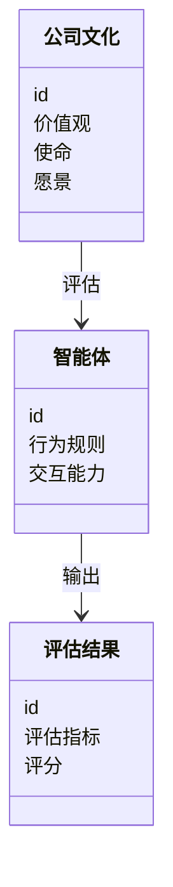
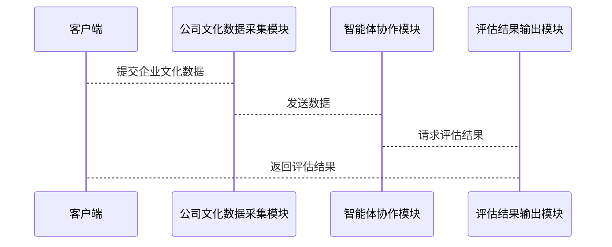

                 


# 基于多智能体的自动化公司文化评估系统

## 关键词：多智能体系统、公司文化评估、自动化评估、分布式决策、强化学习

## 摘要：本文介绍了一种基于多智能体的自动化公司文化评估系统，通过多智能体协作算法，结合强化学习和分布式决策，实现对公司文化的自动化评估。文章详细阐述了系统的设计思路、算法实现、系统架构，并通过实际案例展示了系统的应用效果。

---

## 第一部分：基于多智能体的自动化公司文化评估系统概述

### 第1章：公司文化评估的背景与挑战

#### 1.1 公司文化评估的背景
- **企业文化的重要性**：企业文化是企业发展的灵魂，直接影响企业的凝聚力、员工满意度和市场竞争力。
- **传统企业文化评估的局限性**：传统评估方法依赖人工调研，耗时长、成本高，且难以量化。
- **自动化评估的必要性**：随着企业规模的扩大，传统方法难以满足高效、精准的评估需求。

#### 1.2 多智能体系统的基本概念
- **多智能体系统的定义**：由多个相互作用的智能体组成的系统，每个智能体都能独立决策并协同完成任务。
- **多智能体系统的特征**：
  - 分布式：智能体独立决策。
  - 协作性：智能体之间通过信息共享协同工作。
  - 动态性：系统状态随智能体交互而变化。
- **多智能体系统的优缺点**：
  | 优点          | 缺点          |
  |---------------|---------------|
  | 高效性         | 复杂性         |
  | 灵活性         | 安全性         |
  | 可扩展性       | 可维护性       |

#### 1.3 自动化评估的核心目标
- 提供高效、准确的企业文化评估工具。
- 实现对企业文化的量化分析和动态监控。

---

### 第2章：自动化公司文化评估的核心概念

#### 2.1 问题背景与问题描述
- **问题背景**：企业文化评估的复杂性导致传统方法效率低下。
- **问题描述**：如何利用技术手段提高评估效率和准确性。
- **问题解决**：引入多智能体系统，实现自动化评估。

#### 2.2 核心概念与联系
- **实体关系图（ER图）**：
```mermaid
er
    entity 公司文化 {
        id
        价值观
        使命
        愿景
    }
    entity 智能体 {
        id
        行为规则
        交互能力
    }
    entity 评估结果 {
        id
        评估指标
        评分
    }
    公司文化 --N> 智能体: 评估
    智能体 --N> 评估结果: 输出
```

---

## 第二部分：多智能体协作算法原理

### 第3章：多智能体协作算法的实现

#### 3.1 多智能体协作的基本原理
- **基于强化学习的多智能体协作**：通过强化学习，智能体在协作中不断优化行为策略。
- **分布式决策机制**：每个智能体独立决策，同时通过信息共享协同工作。
- **联合学习与知识共享**：智能体之间共享知识，提高整体协作效率。

#### 3.2 多智能体协作算法的实现
- **算法流程图**：
```mermaid
graph TD
    A[智能体1] --> B[智能体2]: 信息共享
    B --> C[评估结果]: 决策输出
    C --> D[优化策略]: 反馈
    D --> A: 参数更新
```

#### 3.3 算法实现的数学模型
- **强化学习模型**：
$$ Q(s, a) = r + \gamma \max_{a'} Q(s', a') $$
其中：
- \( Q(s, a) \) 表示状态 \( s \) 下采取行动 \( a \) 的价值。
- \( r \) 是奖励值。
- \( \gamma \) 是折扣因子。
- \( s' \) 是下一个状态。

---

## 第三部分：系统分析与架构设计

### 第4章：系统架构设计

#### 4.1 项目背景
- **项目目标**：开发一个基于多智能体的自动化公司文化评估系统。
- **项目范围**：涵盖企业文化数据采集、智能体协作、评估结果输出。

#### 4.2 系统功能设计
- **领域模型图**：


#### 4.3 系统架构设计
- **系统架构图**：
```mermaid
archi
    客户端 -- 公司文化数据采集模块
    公司文化数据采集模块 --> 智能体协作模块
    智能体协作模块 --> 评估结果输出模块
    评估结果输出模块 --> 数据存储模块
```

#### 4.4 接口设计
- **智能体协作模块接口**：
  - 输入：公司文化数据
  - 输出：评估结果

#### 4.5 交互序列图


---

## 第四部分：项目实战

### 第5章：系统核心实现

#### 5.1 环境安装
- **Python环境**：安装Python 3.8及以上版本。
- **依赖库**：安装`mermaid`、`matplotlib`、`numpy`。

#### 5.2 核心代码实现
- **智能体协作模块**：
```python
import numpy as np

class Agent:
    def __init__(self, state_space, action_space):
        self.state_space = state_space
        self.action_space = action_space
        self.Q = np.zeros((state_space, action_space))

    def act(self, state):
        return np.argmax(self.Q[state])

    def update(self, state, action, reward, next_state):
        self.Q[state, action] = reward + 0.9 * np.max(self.Q[next_state])

# 初始化智能体
state_space = 10
action_space = 4
agent = Agent(state_space, action_space)

# 智能体协作
for _ in range(100):
    state = np.random.randint(0, state_space)
    action = agent.act(state)
    next_state = np.random.randint(0, state_space)
    reward = np.random.uniform(0, 1)
    agent.update(state, action, reward, next_state)
```

---

## 第五部分：总结与展望

### 第6章：总结与展望

#### 6.1 系统优势
- **高效性**：自动化评估节省时间和成本。
- **准确性**：基于强化学习的算法提高评估精度。
- **可扩展性**：支持大规模企业的评估需求。

#### 6.2 应用建议
- **数据质量**：确保输入数据的准确性和完整性。
- **系统维护**：定期更新算法模型，优化系统性能。

#### 6.3 未来展望
- **优化方向**：进一步优化强化学习算法，提升评估效率。
- **应用领域**：探索在其他领域的应用，如金融、教育等。

#### 6.4 注意事项
- **数据隐私**：确保企业文化评估数据的安全性和隐私性。
- **系统稳定性**：保证系统在高并发情况下的稳定性。

---

## 参考文献
1. 强化学习经典教材：《Reinforcement Learning: Theory and Algorithms》
2. 多智能体系统相关论文：《Multi-Agent Systems: A Survey》
3. 企业文化评估相关书籍：《Corporate Culture: The Promise of Deliverance》

---

通过本文的详细讲解，读者可以全面了解基于多智能体的自动化公司文化评估系统的实现原理和应用价值。希望本文能为相关领域的研究和实践提供有益的参考。

