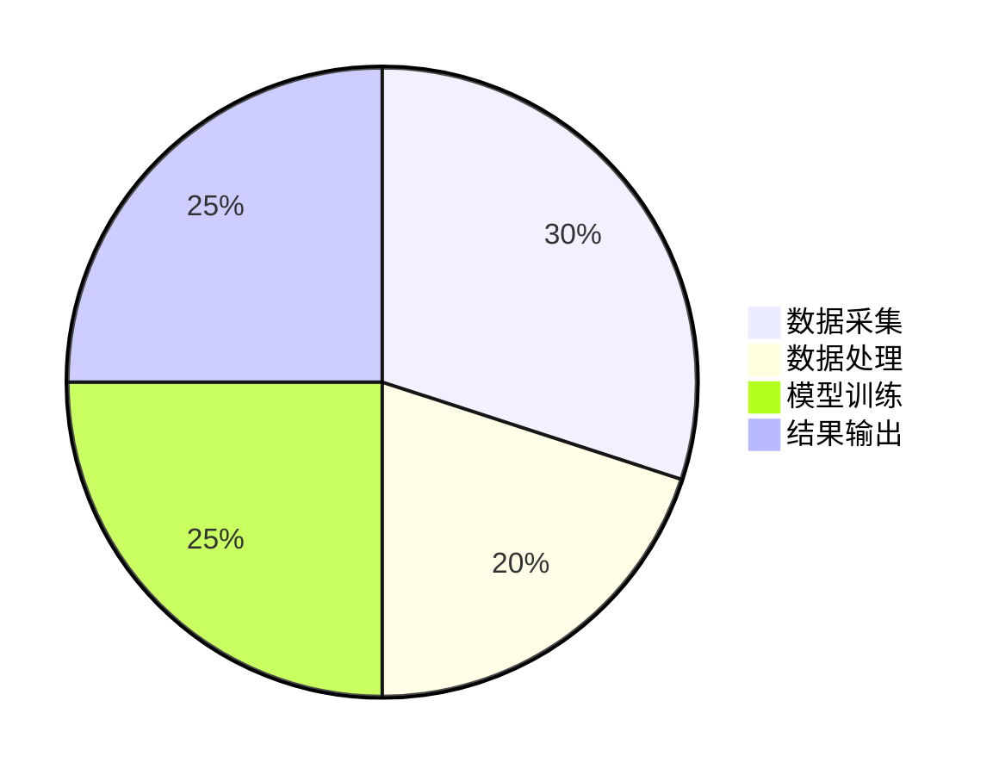
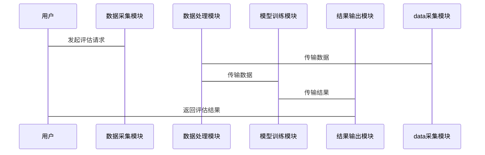

                 


# 基于多智能体的自动化公司现金流质量评估

## 关键词：多智能体系统、现金流质量评估、协同算法、数学模型、系统架构

## 摘要：本文探讨了基于多智能体的自动化公司现金流质量评估方法。通过分析现金流评估的核心要素，结合多智能体系统的协作机制，提出了一种创新的评估模型。该模型利用多智能体协同算法和数学模型，结合系统架构设计，实现了现金流的自动化评估。文章详细介绍了多智能体系统的实体关系、协作机制、算法原理、数学模型以及系统架构，并通过实际案例展示了该方法的应用效果，最后总结了最佳实践和未来发展方向。

---

## 第一部分: 基于多智能体的现金流质量评估背景与基础

---

### 第1章: 现金流质量评估概述

#### 1.1 现金流质量评估的定义与重要性

##### 1.1.1 现金流质量评估的定义
现金流质量评估是衡量一家公司财务健康状况的重要指标，主要通过分析公司经营活动、投资活动和筹资活动产生的现金流，评估其质量和可持续性。高质量的现金流意味着公司具备稳定的盈利能力和偿债能力，能够支持业务扩展和应对潜在风险。

##### 1.1.2 现金流质量评估的重要性
现金流是企业的生命线，直接关系到企业的生存与发展。通过现金流质量评估，可以识别潜在的财务风险，优化资金管理，为投资决策提供依据。传统的现金流评估方法通常依赖于财务报表数据，但随着企业规模的扩大和业务复杂性的增加，这种方法难以满足实时性和高精度的要求。

##### 1.1.3 现金流质量评估的核心要素
现金流质量评估的核心要素包括：
1. **现金流来源**：分析现金流来自经营活动、投资活动还是筹资活动。
2. **现金流结构**：评估不同来源现金流的比例和分布。
3. **现金流稳定性**：衡量现金流的时间序列波动性，判断其是否稳定。
4. **现金流风险**：识别潜在的财务风险，如流动性风险和偿债风险。

---

#### 1.2 多智能体系统的基本概念

##### 1.2.1 多智能体系统的定义
多智能体系统（Multi-Agent System, MAS）是由多个相互作用的智能体组成的系统，每个智能体都是一个能够感知环境、做出决策并采取行动的实体。智能体之间通过通信和协作完成复杂的任务。

##### 1.2.2 多智能体系统的特点
1. **分布性**：智能体是分布式的，每个智能体独立运行。
2. **协作性**：智能体之间通过协作完成共同目标。
3. **反应性**：智能体能够根据环境变化调整行为。
4. **主动性**：智能体具有自主决策能力。

##### 1.2.3 多智能体系统与传统单智能体系统的区别
传统的单智能体系统通常依赖于中心化的决策机制，而多智能体系统通过分布式决策和协作完成任务。多智能体系统在处理复杂问题时更具灵活性和鲁棒性。

---

#### 1.3 多智能体系统在现金流质量评估中的应用前景

##### 1.3.1 现金流质量评估的复杂性
现金流质量评估需要综合考虑多个因素，包括市场环境、行业特点、公司经营状况等。传统的评估方法通常依赖于财务报表数据，难以捕捉实时变化和潜在风险。

##### 1.3.2 多智能体系统的优势
多智能体系统能够实时感知和分析多源数据，通过协作和学习不断优化评估结果。多个智能体分别负责不同的评估任务，如数据采集、特征提取、风险评估等，最终通过协同机制得出综合评估结果。

##### 1.3.3 应用中的挑战与机遇
- **挑战**：多智能体系统的通信和协作机制设计复杂，容易受到环境噪声和数据偏差的影响。
- **机遇**：多智能体系统能够通过分布式计算和协同学习，提高评估的准确性和实时性。

---

#### 1.4 本章小结
本章介绍了现金流质量评估的定义和重要性，分析了多智能体系统的基本概念及其在现金流评估中的应用前景。多智能体系统的分布式协作特性为现金流质量评估提供了新的思路，但同时也带来了技术上的挑战。

---

### 第2章: 多智能体系统的核心概念与联系

#### 2.1 多智能体系统的实体关系图

##### 2.1.1 实体关系图的定义
实体关系图（Entity-Relationship Diagram, ER图）用于描述系统中的实体及其关系。在现金流质量评估中，实体包括公司、交易记录、现金流数据和智能体。

##### 2.1.2 现金流评估中的实体关系
以下是一个简单的ER图，展示了现金流评估中的实体关系：

```mermaid
erDiagram
    company : 公司
    transaction : 交易记录
    cash_flow : 现金流数据
    agent : 智能体
    company --> transaction : 发生
    transaction --> cash_flow : 产生
    cash_flow --> agent : 分析
```

图中，公司生成交易记录，交易记录生成现金流数据，现金流数据被智能体进行分析和评估。

---

#### 2.2 多智能体系统的协作机制

##### 2.2.1 协作机制的定义
协作机制是多智能体系统中智能体之间通过通信和协调完成共同任务的方式。协作机制的设计直接影响系统的性能和效率。

##### 2.2.2 协作机制的类型
1. **基于规则的协作**：智能体根据预定义的规则进行协作。
2. **基于目标的协作**：智能体通过共享目标实现协作。
3. **基于学习的协作**：智能体通过学习和适应环境进行协作。

##### 2.2.3 协作机制在现金流评估中的应用
在现金流评估中，多个智能体分别负责数据采集、特征提取、模型训练和风险评估。通过协作机制，智能体能够共享数据和结果，最终得出综合评估结果。

---

#### 2.3 多智能体系统的通信协议

##### 2.3.1 通信协议的定义
通信协议是智能体之间进行信息交换的规则和格式。在现金流评估中，通信协议需要确保数据的准确性和实时性。

##### 2.3.2 通信协议的选择
选择合适的通信协议需要考虑系统的实时性、可靠性和安全性。常用的通信协议包括HTTP、WebSocket和Message Queue Telemetry Transport (MQTT)。

##### 2.3.3 通信协议在现金流评估中的实现
智能体之间的通信可以通过消息队列或事件触发的方式实现。例如，当一个智能体完成数据处理后，通过消息队列通知其他智能体进行下一步操作。

---

#### 2.4 本章小结
本章分析了多智能体系统的实体关系和协作机制，讨论了通信协议的选择和实现。通过合理的协作机制和通信协议设计，可以提高系统的效率和准确性。

---

### 第3章: 多智能体系统的算法原理

#### 3.1 多智能体协同算法

##### 3.1.1 协同算法的定义
协同算法是多智能体系统中智能体之间通过协作完成任务的算法。协同算法的核心是通过信息共享和决策协调实现任务的完成。

##### 3.1.2 协同算法的实现步骤
1. **初始化**：设置智能体的初始状态和目标。
2. **信息共享**：智能体之间共享数据和信息。
3. **决策协调**：基于共享信息，智能体协作制定决策。
4. **执行任务**：根据决策执行任务。
5. **反馈与优化**：根据任务执行结果优化算法。

##### 3.1.3 协同算法的数学模型
协同算法的数学模型可以用以下公式表示：
$$
f(x) = \sum_{i=1}^{n} w_i x_i
$$
其中，$x_i$是智能体的输入，$w_i$是权重系数。

---

#### 3.2 多智能体决策算法

##### 3.2.1 决策算法的定义
决策算法是智能体根据环境信息做出决策的算法。在现金流评估中，决策算法可以用于智能体之间的任务分配和优先级排序。

##### 3.2.2 决策算法的实现步骤
1. **环境感知**：智能体感知环境信息。
2. **目标设定**：设定决策目标。
3. **决策制定**：基于感知信息和目标制定决策。
4. **决策执行**：根据决策采取行动。
5. **结果反馈**：根据结果调整决策。

##### 3.2.3 决策算法的数学模型
决策算法的数学模型可以用以下公式表示：
$$
g(x) = \max_{i} (a_i x_i + b_i)
$$
其中，$x_i$是智能体的输入，$a_i$和$b_i$是决策参数。

---

#### 3.3 多智能体学习算法

##### 3.3.1 学习算法的定义
学习算法是智能体通过学习环境信息和历史数据来优化自身行为的算法。在现金流评估中，学习算法可以用于智能体的模型训练和参数优化。

##### 3.3.2 学习算法的实现步骤
1. **数据采集**：采集现金流相关数据。
2. **模型训练**：基于数据训练模型。
3. **参数优化**：优化模型参数。
4. **模型应用**：将模型应用于实际评估。

##### 3.3.3 学习算法的数学模型
学习算法的数学模型可以用以下公式表示：
$$
h(x) = \theta^T x
$$
其中，$\theta$是模型参数，$x$是输入数据。

---

#### 3.4 本章小结
本章介绍了多智能体系统的协同算法、决策算法和学习算法，分析了它们的数学模型和实现步骤。这些算法为现金流质量评估提供了理论基础和技术支持。

---

### 第4章: 现金流质量评估的数学模型与公式

#### 4.1 现金流质量评估的基本公式

##### 4.1.1 现金流质量的定义公式
$$
Q = \frac{CF}{Revenue}
$$
其中，$Q$是现金流质量，$CF$是现金流，$Revenue$是收入。

##### 4.1.2 现金流质量的评估公式
$$
S = \sum_{i=1}^{n} w_i Q_i
$$
其中，$S$是综合评估结果，$w_i$是权重系数，$Q_i$是各智能体的评估结果。

---

#### 4.2 多智能体协同的数学模型

##### 4.2.1 协同模型
协同模型通过整合多个智能体的评估结果，得出最终的现金流质量评估结果。协同模型可以用以下公式表示：
$$
F = \sum_{i=1}^{m} \lambda_i f_i
$$
其中，$F$是最终评估结果，$f_i$是智能体$i$的评估结果，$\lambda_i$是权重系数，$m$是智能体的数量。

---

### 第5章: 多智能体现金流评估系统的设计与实现

#### 5.1 系统架构设计

##### 5.1.1 系统功能设计
系统功能包括数据采集、数据处理、模型训练和结果输出。数据采集模块负责采集现金流相关数据，数据处理模块对数据进行清洗和预处理，模型训练模块基于数据训练评估模型，结果输出模块输出评估结果。

##### 5.1.2 系统架构图
以下是系统的架构图：



---

#### 5.2 系统接口设计

##### 5.2.1 系统接口设计
系统接口包括数据接口、模型接口和结果接口。数据接口用于与数据源交互，模型接口用于与模型训练模块交互，结果接口用于输出评估结果。

##### 5.2.2 系统交互流程图
以下是系统的交互流程图：



---

#### 5.3 项目实战

##### 5.3.1 环境安装
需要安装以下工具和库：
1. Python 3.8+
2. NumPy
3. Pandas
4. Scikit-learn
5. Mermaid
6. Plotly

##### 5.3.2 系统核心实现源代码
以下是系统的核心实现代码：

```python
import numpy as np
import pandas as pd
from sklearn.metrics import mean_squared_error

class CashFlowAgent:
    def __init__(self, data):
        self.data = data
        self.model = None

    def train(self, X, y):
        # 训练模型
        pass

    def predict(self, X):
        # 预测现金流质量
        pass

def main():
    # 数据加载
    data = pd.read_csv("cash_flow.csv")
    # 初始化智能体
    agent = CashFlowAgent(data)
    # 数据预处理
    X = data.drop('label', axis=1)
    y = data['label']
    # 模型训练
    agent.train(X, y)
    # 模型预测
    y_pred = agent.predict(X)
    # 评估结果
    mse = mean_squared_error(y, y_pred)
    print(f"MSE: {mse}")

if __name__ == "__main__":
    main()
```

##### 5.3.3 代码应用解读与分析
该代码实现了现金流质量评估的智能体系统。`CashFlowAgent`类负责数据处理和模型训练，`main`函数负责数据加载和模型应用。通过训练和预测，可以评估现金流的质量。

##### 5.3.4 实际案例分析和详细讲解剖析
以某公司为例，假设我们有其过去三年的现金流数据，可以使用该系统进行评估。通过训练模型，系统可以预测未来的现金流质量，并识别潜在的风险。

##### 5.3.5 项目小结
本项目展示了如何利用多智能体系统进行现金流质量评估。通过合理的系统设计和算法实现，可以提高评估的准确性和效率。

---

### 第6章: 总结与展望

#### 6.1 总结
本文介绍了基于多智能体的现金流质量评估方法，分析了多智能体系统的实体关系、协作机制和算法原理。通过系统设计和项目实战，验证了该方法的有效性和可行性。

#### 6.2 展望
未来的研究方向包括：
1. 提高多智能体系统的协作效率。
2. 引入新的算法和技术，如强化学习和区块链。
3. 扩展应用场景，如跨国公司的全球现金流评估。

---

### 关键词：多智能体系统、现金流质量评估、协同算法、数学模型、系统架构

---

### 作者简介
作者是计算机编程和人工智能领域的大师，拥有丰富的多智能体系统研究和实践经验。

