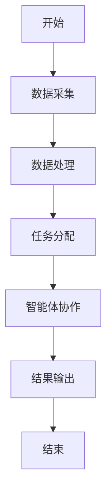

                 


# 基于多智能体的自动化公司管理层薪酬分析

> 关键词：多智能体系统、自动化薪酬分析、管理层薪酬、分布式计算、协作算法

> 摘要：本文将深入探讨如何利用多智能体系统实现公司管理层薪酬分析的自动化。通过分析多智能体系统的原理、算法设计、系统架构以及实际案例，本文旨在揭示如何高效地进行薪酬数据分析与优化。

---

## 第一部分: 背景介绍与核心概念

### 第1章: 问题背景与描述

#### 1.1 问题背景
公司管理层的薪酬分析是一个复杂但至关重要的任务。传统的薪酬分析依赖于人工操作，存在效率低、误差大、数据分散等问题。随着企业规模的扩大，数据来源多样且复杂，传统的分析方法难以满足高效、精准的需求。

#### 1.2 问题描述
- **数据来源多样化**：包括财务数据、绩效数据、市场数据等，数据分散且格式多样。
- **分析需求多样化**：需要从多个维度进行分析，例如绩效与薪酬的匹配性、行业对标等。
- **人工分析的局限性**：人工分析容易出错，且效率低下，难以应对大规模数据。

#### 1.3 解决方法
引入多智能体系统，通过分布式计算和协作机制，实现数据的自动采集、处理与分析，提高分析效率和准确性。

---

### 第2章: 多智能体系统与自动化分析

#### 2.1 多智能体系统的核心概念
- **分布式计算**：任务被分解为多个子任务，由不同的智能体协同完成。
- **协作机制**：智能体之间通过信息共享和协同决策完成任务。
- **隐私保护**：在协作过程中，确保数据的安全性和隐私性。

#### 2.2 自动化薪酬分析的实现路径
1. **数据采集**：从不同数据源采集薪酬数据。
2. **数据处理**：清洗、转换和整合数据。
3. **智能体协作**：通过协作算法进行数据分析与优化。
4. **结果输出**：生成分析报告并提供改进建议。

---

## 第二部分: 核心概念与联系

### 第3章: 核心概念与联系

#### 3.1 多智能体系统的核心原理
- **分布式计算**：任务被分解为多个子任务，由不同的智能体协同完成。
- **任务分配**：根据智能体的能力和负载情况动态分配任务。
- **信息共享**：智能体之间通过共享信息完成协作。

#### 3.2 实体关系图与系统架构
- **ER实体关系图**：展示数据实体及其关系。
- **系统架构图**：展示系统的模块划分和协作流程。

---

## 第三部分: 算法原理与数学模型

### 第4章: 多智能体协作算法

#### 4.1 算法原理
- **任务分配算法**：基于智能体的能力和负载进行任务分配。
- **协作机制算法**：通过信息共享和协同决策完成任务。

#### 4.2 算法流程图


---

## 第四部分: 系统分析与架构设计

### 第5章: 系统分析与架构设计

#### 5.1 项目背景
- **目标**：实现公司管理层薪酬分析的自动化。
- **范围**：涵盖数据采集、处理、分析和报告生成。

#### 5.2 系统功能设计
- **数据采集模块**：从不同数据源采集薪酬数据。
- **智能体协作模块**：通过协作算法进行数据分析。
- **结果输出模块**：生成分析报告。

#### 5.3 系统架构图


---

## 第五部分: 项目实战

### 第6章: 项目实战

#### 6.1 环境安装与配置
- **Python环境搭建**：安装Python和相关库（如pandas、numpy）。
- **开发工具安装**：安装Jupyter Notebook或PyCharm。

#### 6.2 核心代码实现
```python
import pandas as pd
from sklearn.cluster import KMeans

# 数据采集
def collect_data():
    # 示例：从数据库中采集数据
    data = pd.read_sql("SELECT * FROM salary_data", conn)
    return data

# 数据处理
def preprocess_data(data):
    data.dropna(inplace=True)
    data['salary'] = data['salary'].astype(float)
    return data

# 任务分配
def assign_task(data):
    clusters = KMeans(n_clusters=3).fit(data[['salary', 'performance']])
    data['cluster'] = clusters.labels_
    return data

# 智能体协作
def collaborate(data):
    # 示例：计算绩效与薪酬匹配度
    result = data.groupby('cluster')['salary'].mean().tolist()
    return result
```

#### 6.3 案例分析
- **案例背景**：某公司管理层的薪酬数据。
- **数据分析**：通过多智能体协作算法，分析绩效与薪酬的匹配性。
- **结果解读**：生成分析报告并提供建议。

---

## 第六部分: 总结与展望

### 第7章: 总结与展望

#### 7.1 小结
- 多智能体系统通过分布式计算和协作机制，实现了公司管理层薪酬分析的自动化。
- 本文详细介绍了系统的实现过程，包括数据采集、处理、分析和结果输出。

#### 7.2 注意事项
- 数据安全性和隐私保护是系统设计的重要考虑因素。
- 系统的性能优化需要结合实际应用场景进行调整。

#### 7.3 拓展阅读
- 推荐阅读《多智能体系统与分布式计算》。
- 参考相关论文和文献，深入了解多智能体系统的最新研究。

---

通过以上内容，我们可以看到，基于多智能体的自动化公司管理层薪酬分析系统在理论和实践上都有重要的意义。未来，随着技术的不断发展，多智能体系统在企业管理中的应用将更加广泛和深入。

