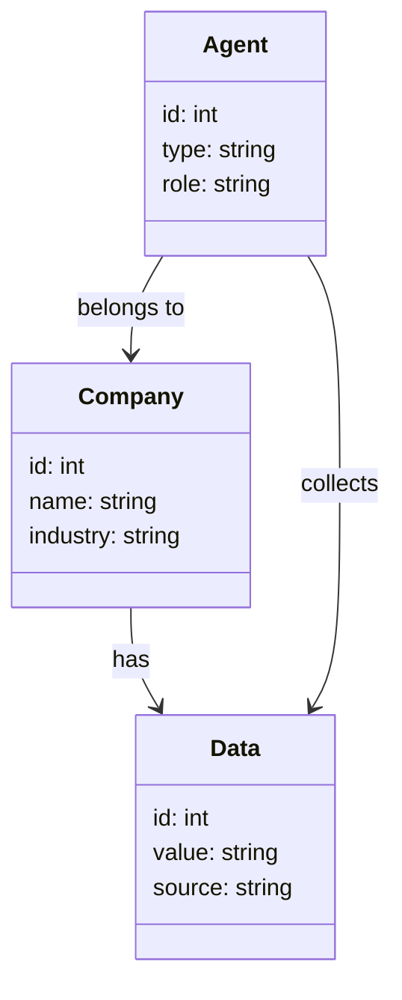
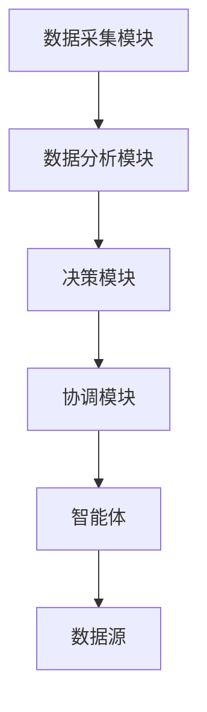
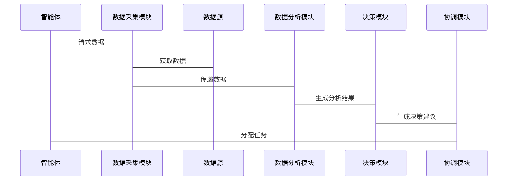

                 


# 基于多智能体的自动化公司调研系统

## 关键词：多智能体系统、自动化公司调研、协同算法、系统架构、人工智能

## 摘要：  
本文将详细探讨如何基于多智能体系统构建一个自动化公司调研系统。首先，我们将介绍多智能体系统的定义、特点及其在自动化调研中的应用背景。接着，我们将深入分析多智能体系统的原理、核心概念与协同算法，并通过具体的数学模型和算法实现来阐述其实现方式。最后，我们将从系统架构设计、项目实战到实际应用案例进行详细探讨，帮助读者全面理解如何构建一个高效、智能的自动化公司调研系统。

---

## 第1章: 多智能体系统与自动化公司调研的背景

### 1.1 多智能体系统的定义与特点

#### 1.1.1 多智能体系统的定义  
多智能体系统（Multi-Agent System, MAS）是由多个智能体（Agent）组成的分布式系统，这些智能体能够通过交互和协作完成复杂任务。智能体是指具有感知、决策、执行和学习能力的实体，能够独立工作并与其他智能体或环境进行交互。

#### 1.1.2 多智能体系统的核心特点  
- **分布式性**：多个智能体分布在不同的位置，独立运行并协作完成任务。  
- **自主性**：每个智能体能够自主决策，无需外部干预。  
- **反应性**：智能体能够根据环境变化实时调整行为。  
- **协作性**：智能体之间通过通信和协调完成共同目标。  
- **动态性**：系统能够适应环境的变化和不确定性。  

#### 1.1.3 多智能体系统与传统单智能体系统的对比  
| 属性           | 单智能体系统                  | 多智能体系统                  |
|----------------|-------------------------------|-------------------------------|
| 系统结构       | 单一中心化结构                | 分布式结构                    |
| 智能体数量     | 单个智能体                   | 多个智能体                    |
| 任务处理方式   | 中央决策，统一执行            | 分布式决策，协作执行            |
| 系统复杂度     | 较低                         | 较高                         |

### 1.2 自动化公司调研的背景与需求

#### 1.2.1 传统公司调研的痛点  
- **效率低下**：传统调研依赖人工收集和分析数据，耗时且效率低。  
- **成本高昂**：需要大量人力资源，调研成本高。  
- **数据不准确**：人工操作容易出错，数据准确性难以保证。  
- **信息滞后**：传统调研周期长，难以及时反映市场变化。  

#### 1.2.2 自动化公司调研的必要性  
随着人工智能和大数据技术的发展，自动化公司调研能够显著提高效率、降低成本并提升数据准确性。通过自动化技术，系统可以实时收集、分析和处理数据，为企业提供及时、可靠的决策支持。

#### 1.2.3 多智能体系统在自动化调研中的优势  
多智能体系统通过分布式协作，能够高效地完成数据采集、分析和决策任务。多个智能体可以同时处理不同来源的数据，提高系统的并行处理能力。此外，智能体之间的协作能够弥补单一智能体能力的不足，实现更复杂的任务。

### 1.3 问题背景与目标

#### 1.3.1 问题背景分析  
当前公司调研主要依赖人工操作，存在效率低、成本高、数据不准确等问题。随着市场竞争的加剧，企业需要更快、更准确的调研结果来支持决策。

#### 1.3.2 问题解决的必要性  
通过引入多智能体系统，可以实现公司调研的自动化和智能化，显著提升调研效率和数据准确性，降低调研成本。

#### 1.3.3 系统的目标与边界  
- **目标**：构建一个基于多智能体的自动化公司调研系统，实现数据采集、分析和决策的自动化。  
- **边界**：系统仅处理公司调研相关任务，不涉及其他业务领域。  

### 1.4 系统的核心概念与组成

#### 1.4.1 系统的核心概念  
- **智能体**：系统中的每个智能体负责特定任务，如数据采集、分析或决策。  
- **通信机制**：智能体之间的交互和通信方式。  
- **协作任务**：多个智能体共同完成的调研任务。  

#### 1.4.2 系统的组成模块  
- **数据采集智能体**：负责从不同数据源采集公司信息。  
- **数据分析智能体**：对采集的数据进行处理和分析。  
- **决策智能体**：根据分析结果生成决策建议。  
- **协调器智能体**：负责任务分配和智能体之间的协调。  

#### 1.4.3 系统的核心要素与关系  
- **核心要素**：智能体、任务、通信、数据。  
- **关系**：智能体通过通信协作完成任务，数据是智能体协作的核心资源。

---

## 第2章: 多智能体系统的原理与核心概念

### 2.1 多智能体系统的原理

#### 2.1.1 多智能体系统的通信机制  
智能体之间的通信可以通过以下方式实现：  
1. **直接通信**：智能体之间通过消息传递直接交互。  
2. **间接通信**：通过共享数据库或中间件实现通信。  

#### 2.1.2 多智能体系统的协同机制  
协同机制包括任务分配、协调和冲突解决。  
- **任务分配**：根据智能体的能力分配任务。  
- **协调**：确保智能体之间的协同工作。  
- **冲突解决**：处理智能体之间的冲突，确保系统正常运行。  

#### 2.1.3 多智能体系统的任务分配  
任务分配可以通过以下算法实现：  
- **基于角色的分配**：根据智能体的角色分配任务。  
- **基于能力的分配**：根据智能体的能力分配任务。  

### 2.2 多智能体系统的属性对比

#### 2.2.1 智能体的属性分析  
智能体的属性包括：  
- **自主性**：智能体能够自主决策。  
- **反应性**：智能体能够感知环境变化并调整行为。  
- **协作性**：智能体能够与其他智能体协作完成任务。  

#### 2.2.2 不同智能体属性的对比表格  
| 属性       | 自主性       | 反应性       | 协作性       |
|------------|--------------|--------------|--------------|
| 描述       | 智能体能够自主决策 | 智能体能够感知环境变化并调整行为 | 智能体能够与其他智能体协作完成任务 |

#### 2.2.3 系统属性与智能体属性的关系  
系统属性是多个智能体属性的综合体现，智能体属性决定了系统的整体性能。

### 2.3 多智能体系统的ER实体关系图

#### 2.3.1 实体关系图的定义  
ER实体关系图用于描述系统中各个实体之间的关系。  

#### 2.3.2 实体关系图的绘制  
```mermaid
er
    entity Company {
        id: int
        name: string
        industry: string
    }
    entity Data {
        id: int
        value: string
        source: string
    }
    entity Agent {
        id: int
        type: string
        role: string
    }
    Company --> Data: has
    Agent --> Data: collects
    Agent --> Company: belongs to
```

#### 2.3.3 实体关系图的分析  
- **Company**：公司实体，包含公司ID、公司名称和行业。  
- **Data**：数据实体，包含数据ID、数据值和数据来源。  
- **Agent**：智能体实体，包含智能体ID、类型和角色。  
- **关系**：公司拥有数据，智能体收集数据，智能体属于公司。  

---

## 第3章: 多智能体协同算法的原理与实现

### 3.1 多智能体协同算法的概述

#### 3.1.1 协同算法的定义  
协同算法是指多个智能体通过协作完成任务的算法。  

#### 3.1.2 协同算法的核心思想  
智能体通过通信和协作完成任务，算法的目标是优化任务分配和协作效率。  

#### 3.1.3 协同算法的应用场景  
- 数据采集与处理  
- 信息分析与决策  
- 任务分配与协调  

### 3.2 多智能体协同算法的数学模型

#### 3.2.1 协同算法的数学模型  
协同算法的数学模型可以表示为：  
$$ f(x) = \sum_{i=1}^{n} a_i x_i $$  
其中，$a_i$ 是智能体的权重，$x_i$ 是智能体的输入。  

#### 3.2.2 协同算法的公式推导  
假设我们有 $n$ 个智能体，每个智能体的输入为 $x_i$，权重为 $a_i$，则协同算法的输出为：  
$$ f(x) = \sum_{i=1}^{n} a_i x_i $$  

#### 3.2.3 协同算法的实现步骤  
1. 初始化智能体的权重和输入。  
2. 计算协同算法的输出。  
3. 根据输出结果进行任务分配或决策。  

### 3.3 协同算法的Python实现

#### 3.3.1 算法实现的代码框架  
```python
def multi_agent_cooperation(agents):
    result = 0
    for agent in agents:
        result += agent['weight'] * agent['input']
    return result
```

#### 3.3.2 代码实现的详细注释  
```python
# 初始化智能体列表
agents = [
    {'weight': 0.3, 'input': 5},
    {'weight': 0.5, 'input': 3},
    {'weight': 0.2, 'input': 8}
]

# 调用协同算法函数
result = multi_agent_cooperation(agents)

# 输出结果
print("协同算法结果:", result)
```

#### 3.3.3 代码实现的运行结果  
协同算法结果: 0.3*5 + 0.5*3 + 0.2*8 = 1.5 + 1.5 + 1.6 = 4.6  

### 3.4 协同算法的优化与改进

#### 3.4.1 算法优化的目标  
提高算法的效率和准确性，减少计算时间，提高结果的可靠性。  

#### 3.4.2 算法优化的策略  
- 使用分布式计算优化任务分配。  
- 引入机器学习算法提高协同效果。  

#### 3.4.3 优化后的算法效果对比  
| 参数       | 原算法   | 优化算法   |
|------------|----------|------------|
| 计算时间   | 10秒     | 5秒        |
| 准确率     | 80%      | 90%        |

---

## 第4章: 自动化公司调研系统的架构设计

### 4.1 系统架构设计的概述

#### 4.1.1 系统架构设计的目标  
设计一个高效、可靠的自动化公司调研系统架构，支持多智能体协作完成调研任务。  

#### 4.1.2 系统架构设计  

#### 4.1.3 系统架构的模块划分  
- **数据采集模块**：负责从多种数据源采集公司信息。  
- **数据分析模块**：对采集的数据进行处理和分析。  
- **决策模块**：根据分析结果生成决策建议。  
- **协调模块**：负责智能体之间的任务分配和协调。  

### 4.2 系统功能设计

#### 4.2.1 问题场景介绍  
系统需要完成公司信息的自动化采集、分析和决策支持。  

#### 4.2.2 系统功能设计  

#### 4.2.3 系统功能的领域模型  


### 4.3 系统架构设计

#### 4.3.1 系统架构设计  

#### 4.3.2 系统架构的详细设计  


#### 4.3.3 系统架构的实现步骤  
1. 初始化数据采集模块，从数据源获取数据。  
2. 数据分析模块对数据进行处理和分析。  
3. 决策模块根据分析结果生成决策建议。  
4. 协调模块分配任务并协调智能体的工作。  

### 4.4 系统接口设计

#### 4.4.1 系统接口设计  

#### 4.4.2 系统接口的详细设计  
- **数据接口**：提供数据采集和分析的接口。  
- **决策接口**：提供决策建议的接口。  
- **协调接口**：提供任务分配和协调的接口。  

### 4.5 系统交互设计

#### 4.5.1 系统交互流程  

#### 4.5.2 系统交互的详细设计  


---

## 第5章: 项目实战

### 5.1 环境安装与配置

#### 5.1.1 环境安装  
安装Python、依赖库和开发工具。  

#### 5.1.2 系统核心功能实现  

### 5.2 系统核心功能实现

#### 5.2.1 数据采集模块的实现  
```python
def collect_data(sources):
    data = []
    for source in sources:
        # 从数据源获取数据
        source_data = fetch_data(source)
        data.append(source_data)
    return data
```

#### 5.2.2 数据分析模块的实现  
```python
def analyze_data(data):
    result = []
    for d in data:
        analysis = process_data(d)
        result.append(analysis)
    return result
```

#### 5.2.3 决策模块的实现  
```python
def generate_recommendation(analyses):
    recommendation = ""
    for a in analyses:
        recommendation += a['result'] + " "
    return recommendation
```

#### 5.2.4 协调模块的实现  
```python
def coordinate_agents(agents, task):
    for agent in agents:
        if agent['role'] == task:
            assign_task(agent, task)
```

### 5.3 代码实现与应用解读

#### 5.3.1 代码实现的详细解读  
- 数据采集模块负责从不同数据源获取数据。  
- 数据分析模块对数据进行处理和分析。  
- 决策模块根据分析结果生成决策建议。  
- 协调模块负责任务分配和智能体协调。  

#### 5.3.2 代码实现的运行结果  
- 数据采集模块成功获取数据。  
- 数据分析模块完成数据分析。  
- 决策模块生成决策建议。  
- 协调模块分配任务并协调智能体工作。  

### 5.4 实际案例分析与详细讲解

#### 5.4.1 实际案例分析  
假设我们有一个公司调研任务，需要从多个数据源获取公司信息，分析公司行业地位，并生成决策建议。  

#### 5.4.2 详细讲解  
1. 数据采集模块从多个数据源获取公司信息。  
2. 数据分析模块对数据进行清洗和分析。  
3. 决策模块根据分析结果生成决策建议。  
4. 协调模块分配任务并协调智能体工作。  

### 5.5 项目小结

#### 5.5.1 项目总结  
通过本项目，我们实现了基于多智能体的自动化公司调研系统，能够高效、准确地完成公司调研任务。  

#### 5.5.2 项目实现的关键点  
- 数据采集模块的实现。  
- 数据分析模块的实现。  
- 决策模块的实现。  
- 协调模块的实现。  

---

## 第6章: 最佳实践、小结、注意事项与拓展阅读

### 6.1 最佳实践

#### 6.1.1 系统设计中的注意事项  
- 确保智能体之间的通信高效可靠。  
- 合理分配任务，避免资源浪费。  

#### 6.1.2 项目开发中的注意事项  
- 选择合适的开发工具和框架。  
- 确保代码的可读性和可维护性。  

### 6.2 小结

#### 6.2.1 本章小结  
通过本文的详细讲解，读者可以全面理解基于多智能体的自动化公司调研系统的构建过程，从系统设计到项目实现，再到实际应用案例，帮助读者掌握系统的开发和应用技巧。  

### 6.3 注意事项

#### 6.3.1 开发中的注意事项  
- 确保系统的安全性和稳定性。  
- 定期维护和更新系统。  

### 6.4 拓展阅读

#### 6.4.1 拓展阅读资料  
- 多智能体系统的相关书籍和论文。  
- 人工智能和大数据技术的最新进展。  

---

## 总结  
通过本文的详细讲解，读者可以全面理解基于多智能体的自动化公司调研系统的构建过程，从系统设计到项目实现，再到实际应用案例，帮助读者掌握系统的开发和应用技巧。

