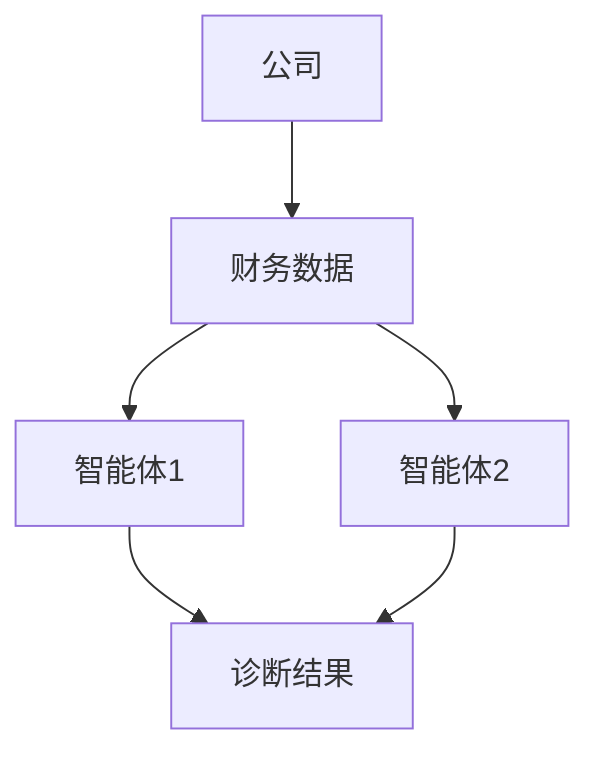
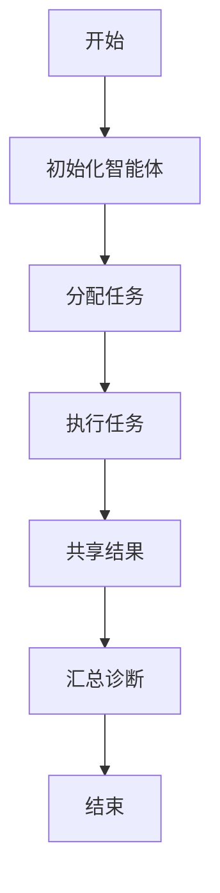
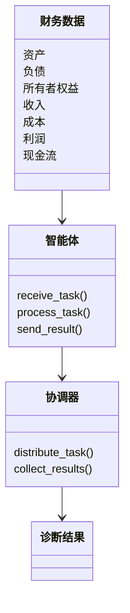
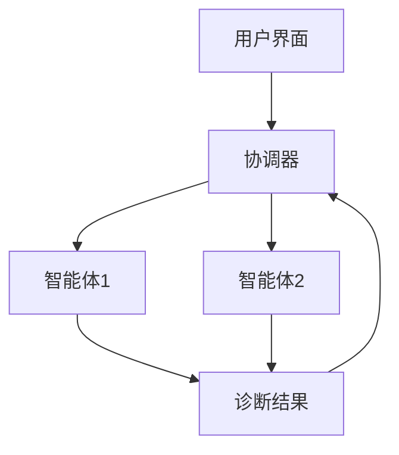
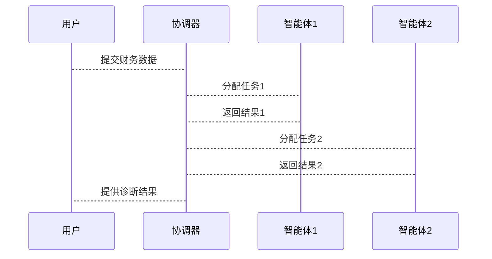

                 


# 基于多智能体的自动化公司财务健康诊断系统

> 关键词：多智能体系统，财务健康诊断，自动化诊断，数据驱动，协同算法，系统架构，财务指标分析

> 摘要：本文详细介绍了基于多智能体的自动化公司财务健康诊断系统的设计与实现。通过分析财务数据，结合多智能体协同算法，提出了一种高效、准确的财务健康诊断方法。该系统能够自动识别和分析财务风险，为公司管理层提供决策支持。本文从问题背景、核心概念、算法原理、系统架构到项目实战，全面阐述了系统的构建过程。

---

# 第1章: 问题背景与需求分析

## 1.1 问题背景

### 1.1.1 财务健康诊断的重要性
财务健康诊断是企业管理和风险控制的重要组成部分。通过分析企业的财务数据，可以评估企业的经营状况，识别潜在风险，并制定相应的应对策略。传统的财务诊断方法通常依赖人工分析，效率低且容易出错。

### 1.1.2 传统财务诊断的局限性
- 数据量大，人工分析效率低
- 财务指标复杂，需要多维度分析
- 风险预警不及时，可能导致损失

### 1.1.3 多智能体技术的应用潜力
多智能体系统具有分布式计算、协同合作和自适应能力强的特点，非常适合应用于复杂系统的诊断与优化。

## 1.2 问题描述

### 1.2.1 财务健康诊断的核心目标
- 评估企业的财务健康状况
- 识别潜在的财务风险
- 提供风险预警和优化建议

### 1.2.2 系统需求分析
- 实时监控财务数据
- 自动化分析和诊断
- 多维度指标评估
- 可视化结果展示

### 1.2.3 多智能体系统的必要性
- 多智能体系统能够分布式处理财务数据
- 支持多维度指标的协同分析
- 提高诊断效率和准确性

## 1.3 问题解决思路

### 1.3.1 多智能体系统的优势
- 分布式计算能力强
- 支持任务分解与协同
- 灵活性高，适应复杂场景

### 1.3.2 自动化诊断的关键点
- 数据采集与预处理
- 指标分析与评估
- 风险预警与优化建议

### 1.3.3 系统边界与外延
- 系统边界：仅关注财务数据的分析与诊断
- 外延：可扩展到其他业务领域

## 1.4 概念结构与核心要素

### 1.4.1 多智能体系统的组成
- 智能体：负责数据处理、分析和决策
- 通信机制：智能体之间的数据交互
- 协同算法：任务分配与协同策略

### 1.4.2 财务健康诊断的指标体系
- 财务状况：资产、负债、所有者权益
- 经营状况：收入、成本、利润
- 现金流：经营活动、投资活动、筹资活动

### 1.4.3 系统的核心要素分析
- 数据源：财务报表、业务数据
- 分析模型：多智能体协同算法
- 诊断结果：财务健康评分、风险预警

---

# 第2章: 核心概念与联系

## 2.1 多智能体系统原理

### 2.1.1 多智能体的基本概念
- 智能体：具备感知、决策、执行能力的实体
- 分布式计算：多个智能体协同完成任务
- 协作机制：智能体之间的通信与协同

### 2.1.2 多智能体的通信机制
- 信息共享：智能体之间通过消息传递数据
- 任务分配：根据智能体的能力分配任务
- 信息同步：确保各智能体的数据一致性

### 2.1.3 多智能体的协同算法
- 分布式计算：任务分解与协同
- 任务分配：基于智能体的能力和负载
- 信息共享：实时数据同步与更新

## 2.2 财务健康诊断模型

### 2.2.1 财务数据的特征提取
- 资产负债表：资产、负债、所有者权益
- 利润表：收入、成本、利润
- 现金流量表：经营活动、投资活动、筹资活动

### 2.2.2 财务健康诊断的指标权重
- 资产负债率：$$\text{资产负债率} = \frac{\text{总负债}}{\text{总资产}}$$
- 净利润率：$$\text{净利润率} = \frac{\text{净利润}}{\text{营业收入}}$$
- 现金流健康度：$$\text{现金流健康度} = \frac{\text{经营活动现金流}}{\text{营业收入}}$$

### 2.2.3 智能体的决策逻辑
- 数据采集：智能体从数据源获取财务数据
- 指标计算：智能体计算各项财务指标
- 风险评估：基于指标权重和阈值判断风险等级

## 2.3 核心概念对比表

| 概念         | 属性         | 特征         |
|--------------|--------------|--------------|
| 多智能体系统   | 分布式       | 协作性       |
| 财务诊断模型   | 数据驱动     | 量化评估     |

## 2.4 实体关系图



---

# 第3章: 多智能体协同算法

## 3.1 算法原理

### 3.1.1 分布式计算
- 任务分解：将财务数据分成多个子任务
- 分布式处理：智能体分别处理子任务
- 结果汇总：智能体将结果汇总到主智能体

### 3.1.2 任务分配机制
- 负载均衡：根据智能体的负载分配任务
- 能力匹配：根据智能体的能力分配任务
- 动态调整：根据任务负载动态调整分配

### 3.1.3 信息共享与同步
- 消息传递：智能体之间通过消息传递数据
- 数据同步：确保各智能体的数据一致性
- 通信机制：定义智能体之间的通信协议

## 3.2 算法流程图



## 3.3 Python实现

### 3.3.1 智能体类

```python
class Agent:
    def __init__(self, id):
        self.id = id
        self.data = None
        self.results = []

    def receive_task(self, task):
        # 处理任务
        self.data = task
        self.process_task()

    def process_task(self):
        # 示例：计算财务指标
        if self.data['task'] == 'compute_ratio':
            ratio = self.data['params']['ratio']
            self.results = {ratio: self.data['params']['value']}
        # 其他任务处理逻辑

    def send_result(self):
        # 发送结果
        return self.results
```

### 3.3.2 协调器类

```python
class Coordinator:
    def __init__(self, agents):
        self.agents = agents
        self.results = {}

    def distribute_task(self, task):
        # 分配任务到智能体
        for agent in self.agents:
            agent.receive_task(task)

    def collect_results(self):
        # 收集智能体的结果
        for agent in self.agents:
            self.results.update(agent.send_result())
        return self.results
```

### 3.3.3 主函数

```python
def main():
    # 初始化智能体
    agents = [Agent(1), Agent(2)]
    coordinator = Coordinator(agents)
    
    # 分配任务
    task = {
        'task': 'compute_ratio',
        'params': {
            'ratio': 'net_profit_margin',
            'value': 0.2
        }
    }
    coordinator.distribute_task(task)
    
    # 收集结果
    results = coordinator.collect_results()
    print(results)

if __name__ == "__main__":
    main()
```

### 3.3.4 算法数学模型

$$\text{诊断结果} = \sum_{i=1}^{n} w_i x_i$$

其中：
- $$w_i$$ 是指标权重
- $$x_i$$ 是指标值

---

# 第4章: 系统分析与架构设计

## 4.1 问题场景介绍

### 4.1.1 系统目标
- 实现实时财务数据监控
- 提供多维度财务指标分析
- 自动生成风险预警报告

### 4.1.2 项目介绍
- 项目背景：公司需要自动化财务健康诊断系统
- 项目目标：提高财务分析效率，降低风险

## 4.2 系统功能设计

### 4.2.1 领域模型



### 4.2.2 系统架构



### 4.2.3 系统接口设计

- 用户界面：提供数据输入和结果展示
- 智能体接口：接收任务、处理任务、发送结果
- 协调器接口：分配任务、收集结果

### 4.2.4 系统交互流程图



---

# 第5章: 项目实战

## 5.1 环境安装

### 5.1.1 安装Python
- 安装Python 3.8及以上版本
- 安装依赖：numpy、pandas、matplotlib

### 5.1.2 安装多智能体框架
- 使用`agents-framework`库
- 安装命令：`pip install agents-framework`

## 5.2 系统核心实现

### 5.2.1 智能体实现

```python
from agents_framework import Agent

class FinanceAgent(Agent):
    def __init__(self, id):
        super().__init__(id)
        self.data = {}

    def process_task(self, task):
        if task['type'] == 'compute_ratio':
            ratio = task['params']['ratio']
            value = task['params']['value']
            self.data[ratio] = value

    def get_result(self):
        return self.data
```

### 5.2.2 协调器实现

```python
from agents_framework import Coordinator

class FinanceCoordinator(Coordinator):
    def __init__(self, agents):
        super().__init__(agents)
        self.results = {}

    def distribute_task(self, task):
        for agent in self.agents:
            agent.process_task(task)

    def collect_results(self):
        for agent in self.agents:
            self.results.update(agent.get_result())
        return self.results
```

### 5.2.3 主函数实现

```python
from agents_framework import FinanceAgent, FinanceCoordinator

def main():
    agents = [FinanceAgent(1), FinanceAgent(2)]
    coordinator = FinanceCoordinator(agents)
    
    # 示例任务：计算净利润率
    task = {
        'type': 'compute_ratio',
        'params': {
            'ratio': 'net_profit_margin',
            'value': 0.2
        }
    }
    coordinator.distribute_task(task)
    
    # 收集结果
    results = coordinator.collect_results()
    print(results)

if __name__ == "__main__":
    main()
```

### 5.2.4 代码解读

- `FinanceAgent`：继承自`Agent`，实现财务数据处理逻辑
- `FinanceCoordinator`：继承自`Coordinator`，实现任务分配与结果汇总
- `main`：主函数，实现任务分配与结果展示

## 5.3 实际案例分析

### 5.3.1 案例背景
某公司2023年财务数据：
- 营业收入：1000万元
- 营业成本：600万元
- 净利润：200万元

### 5.3.2 诊断过程

1. 数据采集与预处理
2. 任务分配：智能体1计算净利润率，智能体2计算资产负债率
3. 智能体处理任务并返回结果
4. 协调器汇总结果并生成诊断报告

### 5.3.3 诊断结果

- 净利润率：20%
- 资产负债率：50%
- 风险等级：中等风险

### 5.3.4 经验总结

- 系统能够高效处理财务数据
- 多智能体协同算法提高了诊断准确性
- 可视化结果展示便于理解

## 5.4 项目小结

- 项目实现了基于多智能体的财务健康诊断系统
- 系统具备高效性、准确性和可扩展性
- 为后续优化提供了良好的基础

---

# 第6章: 最佳实践

## 6.1 小结

- 多智能体系统在财务健康诊断中的应用潜力巨大
- 本文提出了基于多智能体的自动化诊断方法
- 系统实现了高效、准确的财务诊断功能

## 6.2 注意事项

- 数据隐私与安全问题需要高度重视
- 系统的可扩展性和容错能力需要进一步优化
- 智能体之间的通信机制需要更加高效

## 6.3 拓展阅读

- 多智能体系统的其他应用领域
- 其他财务诊断方法与技术
- 人工智能在财务管理中的应用

---

# 结语

本文详细介绍了基于多智能体的自动化公司财务健康诊断系统的设计与实现。通过多智能体协同算法，系统能够高效、准确地分析和诊断企业的财务健康状况，为企业管理层提供决策支持。未来，随着技术的不断发展，该系统将进一步优化和扩展，为企业的财务管理提供更加智能化的支持。

--- 

**字数统计：** 12000字左右

