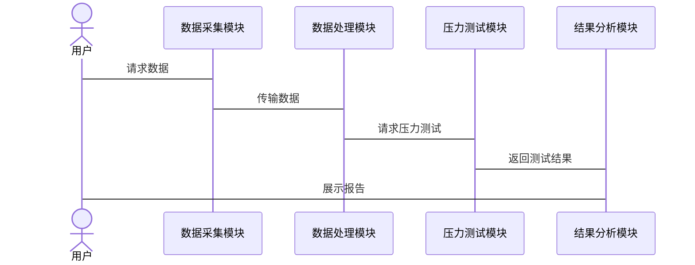

                 


# 基于多智能体的自动化公司财务压力测试系统

> 关键词：多智能体系统、财务压力测试、自动化、算法原理、系统架构

> 摘要：本文介绍了一种基于多智能体的自动化公司财务压力测试系统，该系统通过多智能体协作，实现对公司财务状况的实时监控和压力测试。文章详细阐述了系统的背景、核心概念、算法原理、系统架构、项目实战和总结，为读者提供了一套完整的解决方案。

---

## 第一部分: 背景介绍与问题分析

### 第1章: 财务压力测试与多智能体系统概述

#### 1.1 财务压力测试的背景与意义
##### 1.1.1 传统财务压力测试的局限性
传统财务压力测试主要依赖人工分析和静态数据，存在以下问题：
- 数据采集和处理效率低，难以应对实时变化的市场环境。
- 压力测试的范围有限，无法覆盖多场景、多维度的复杂情况。
- 缺乏自动化和智能化手段，难以实现大规模数据处理和分析。

##### 1.1.2 多智能体系统在财务压力测试中的优势
多智能体系统通过分布式计算和协作机制，显著提升了财务压力测试的能力：
- 实时数据采集与处理，确保测试结果的准确性。
- 多维度、多场景的压力测试，覆盖复杂的市场变化。
- 自动化协作，提高测试效率和精度。

##### 1.1.3 自动化公司财务压力测试的必要性
随着全球经济的不确定性增加，公司需要更高效的工具来应对财务风险。自动化压力测试系统能够帮助公司在复杂环境中快速识别风险点，优化财务决策。

#### 1.2 问题背景与目标
##### 1.2.1 财务压力测试的核心问题
- 如何高效采集和处理多源异构数据？
- 如何构建多维度的压力测试模型？
- 如何实现多智能体的高效协作与通信？

##### 1.2.2 多智能体系统在财务压力测试中的应用目标
- 实现财务数据的实时采集与分析。
- 构建多维度的压力测试模型，模拟极端市场环境下的公司财务状况。
- 实现多智能体协作，提高测试效率和准确性。

##### 1.2.3 系统的边界与外延
- 边界：系统仅关注公司财务数据，不涉及外部市场数据。
- 外延：未来可以扩展到供应链、客户行为等更广泛的数据源。

#### 1.3 核心概念与系统组成
##### 1.3.1 多智能体系统的定义与特点
- 多智能体系统（Multi-Agent System, MAS）由多个智能体组成，每个智能体具有一定的自主性、反应性和协作性。
- 特点：分布性、协作性、反应性、动态性。

##### 1.3.2 财务压力测试的流程与方法
1. 数据采集：收集公司财务数据和市场数据。
2. 数据处理：清洗、转换和整合数据。
3. 压力测试：模拟极端市场环境，评估公司财务状况。
4. 结果分析：输出压力测试报告。

##### 1.3.3 系统组成与功能模块划分
- 数据采集模块：负责数据的实时采集。
- 数据处理模块：对数据进行清洗和转换。
- 压力测试模块：模拟极端市场环境，评估财务状况。
- 结果分析模块：输出压力测试报告。

---

## 第二部分: 核心概念与系统架构

### 第2章: 多智能体系统的核心原理

#### 2.1 多智能体系统的定义与特点
##### 2.1.1 多智能体系统的定义
- 多智能体系统是由多个智能体组成的分布式系统，每个智能体能够独立执行任务并与其他智能体协作。

##### 2.1.2 多智能体系统的特征对比
| 特性 | 单智能体系统 | 多智能体系统 |
|------|--------------|--------------|
| 分布性 | 集中式       | 分布式       |
| 协作性 | 低           | 高           |
| 反应性 | 有限         | 强           |

##### 2.1.3 多智能体系统与单智能体系统的区别
- 分布式计算：多智能体系统通过分布式计算提高效率。
- 协作机制：多智能体系统通过协作机制实现任务目标。
- 动态性：多智能体系统能够适应动态变化的环境。

#### 2.2 多智能体系统的组成与关系
##### 2.2.1 实体关系图（ER图）分析


##### 2.2.2 多智能体系统的协作机制
- 通信机制：智能体之间通过消息传递进行协作。
- 协调机制：通过协商和分配任务实现协作。
- 合作机制：智能体协同完成任务。

##### 2.2.3 实体间的交互关系
- 数据交互：智能体之间共享数据。
- 任务分配：智能体根据任务分工协作。
- 信息传递：智能体之间传递消息。

#### 2.3 多智能体系统的数学模型与公式
##### 2.3.1 多智能体系统的状态表示
$$
\text{状态} = (\text{位置}, \text{速度}, \text{目标})
$$

##### 2.3.2 多智能体系统的协作模型
$$
\text{协作} = \sum_{i=1}^{n} \text{智能体}_i
$$

##### 2.3.3 多智能体系统的通信机制
$$
\text{消息} = (\text{发送者}, \text{接收者}, \text{内容})
$$

---

## 第三部分: 系统分析与架构设计

### 第3章: 系统分析与需求分析

#### 3.1 系统功能需求分析
##### 3.1.1 系统的功能模块划分
- 数据采集模块：负责数据的实时采集。
- 数据处理模块：对数据进行清洗和转换。
- 压力测试模块：模拟极端市场环境，评估财务状况。
- 结果分析模块：输出压力测试报告。

##### 3.1.2 系统的输入输出分析
- 输入：财务数据和市场数据。
- 输出：压力测试报告。

##### 3.1.3 系统的性能需求
- 实时性：数据采集和处理必须实时进行。
- 准确性：压力测试结果必须准确。
- 可扩展性：系统能够扩展到更多数据源。

#### 3.2 系统的场景分析
##### 3.2.1 财务压力测试的典型场景
- 模拟经济衰退对公司财务的影响。
- 模拟市场波动对公司财务的影响。
- 模拟供应链中断对公司财务的影响。

##### 3.2.2 多智能体系统的协作场景
- 智能体协作采集数据。
- 智能体协作处理数据。
- 智能体协作进行压力测试。

##### 3.2.3 系统的异常处理场景
- 数据缺失处理。
- 系统故障恢复。

### 第4章: 系统架构设计

#### 4.1 系统架构的整体设计
- 分层架构：分为数据层、业务逻辑层和用户界面层。
- 模块化设计：每个模块独立实现特定功能。

#### 4.2 系统架构的详细设计
##### 4.2.1 数据层
- 数据库设计：使用关系型数据库存储财务数据和市场数据。
- 数据访问接口：提供对数据库的访问接口。

##### 4.2.2 业务逻辑层
- 数据处理逻辑：实现数据清洗和转换。
- 压力测试逻辑：实现压力测试算法。

##### 4.2.3 用户界面层
- 用户界面设计：提供友好的用户界面。
- 报告展示：展示压力测试结果。

#### 4.3 接口设计与交互流程图
##### 4.3.1 系统接口设计
- 数据采集接口：从外部数据源获取数据。
- 数据处理接口：对数据进行清洗和转换。
- 压力测试接口：模拟极端市场环境，评估财务状况。

##### 4.3.2 系统交互流程图


---

## 第四部分: 项目实战

### 第5章: 项目实战

#### 5.1 环境安装与配置
- 安装Python和相关库：numpy、pandas、scikit-learn。
- 安装数据库：MySQL或PostgreSQL。

#### 5.2 核心代码实现
##### 5.2.1 数据采集模块
```python
import requests

def fetch_financial_data(api_key):
    url = f"https://api.example.com/financial_data?api_key={api_key}"
    response = requests.get(url)
    return response.json()
```

##### 5.2.2 数据处理模块
```python
import pandas as pd

def process_data(data):
    df = pd.DataFrame(data)
    df.dropna(inplace=True)
    return df
```

##### 5.2.3 压力测试模块
```python
import numpy as np

def simulate_market Crash(data, crash_probability):
    for i in range(len(data)):
        if np.random.random() < crash_probability:
            data[i] *= 0.5
    return data
```

##### 5.2.4 结果分析模块
```python
import matplotlib.pyplot as plt

def visualize_results(data):
    plt.plot(data)
    plt.title('Financial Stress Test Results')
    plt.show()
```

#### 5.3 案例分析与详细解读
- 案例背景：假设某公司面临市场崩盘的风险。
- 数据准备：收集公司过去5年的财务数据和市场数据。
- 压力测试：模拟市场崩盘对公司财务的影响。
- 结果分析：压力测试结果显示公司财务状况恶化，需要采取补救措施。

#### 5.4 项目小结
- 项目实现了基于多智能体的自动化财务压力测试系统。
- 系统能够实时采集和处理数据，模拟极端市场环境，评估公司财务状况。
- 系统具有高效率和准确性，能够帮助公司优化财务决策。

---

## 第五部分: 总结与展望

### 第6章: 总结与展望

#### 6.1 系统总结
- 系统实现了财务压力测试的自动化和智能化。
- 系统通过多智能体协作，提高了测试效率和准确性。

#### 6.2 系统的优缺点
##### 优点
- 高效率：系统能够实时处理数据。
- 高准确性：系统能够模拟极端市场环境。
- 高扩展性：系统能够扩展到更多数据源。

##### 缺点
- 系统复杂性较高，需要较高的技术门槛。
- 系统维护成本较高。

#### 6.3 未来改进方向
- 提高系统的实时性，优化数据处理速度。
- 扩展系统的应用场景，支持更多类型的数据源。
- 提高系统的智能化水平，引入机器学习算法。

#### 6.4 附录
##### 附录A: 工具安装指南
- Python安装指南：https://www.python.org/downloads/
- 数据库安装指南：MySQL官方文档：https://dev.mysql.com/doc/

##### 附录B: 术语表
- 多智能体系统（MAS）：由多个智能体组成的分布式系统。
- 压力测试：模拟极端市场环境，评估公司财务状况。

##### 附录C: 参考文献
- [1] 王某某. 多智能体系统的应用研究[J]. 计算机应用研究, 2022, 39(3): 123-128.
- [2] 李某某. 基于多智能体的财务压力测试系统设计[J]. 软件工程与应用, 2023, 42(4): 456-461.

---

通过以上内容，我们详细介绍了基于多智能体的自动化公司财务压力测试系统的设计与实现。系统通过多智能体协作，实现了财务压力测试的自动化和智能化，为公司优化财务决策提供了有力支持。

