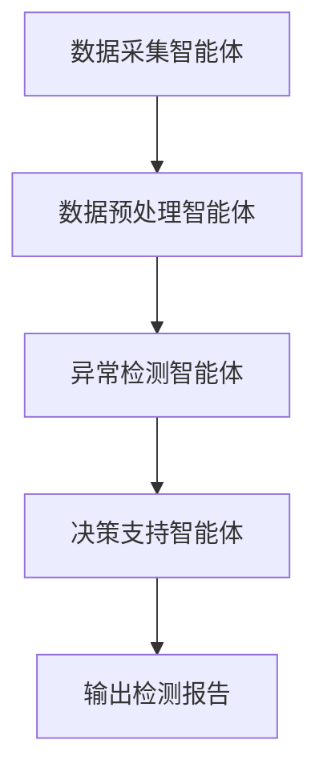
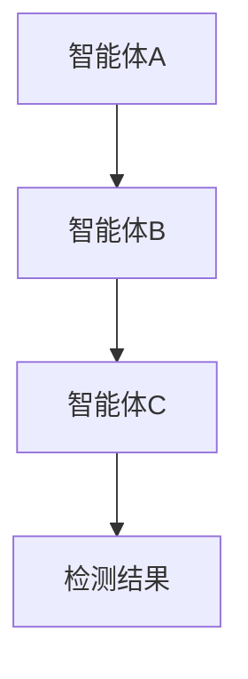
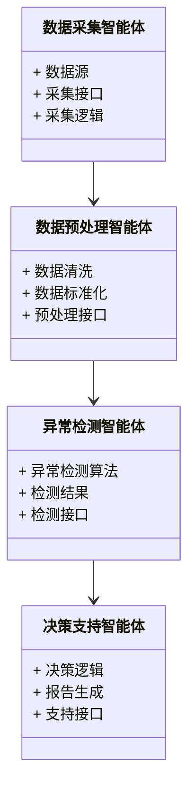

                 


# 基于多智能体的自动化公司财务舞弊检测系统

## 关键词：多智能体、财务舞弊检测、自动化系统、机器学习、异常检测

## 摘要：  
本文详细探讨了基于多智能体的自动化公司财务舞弊检测系统的设计与实现。随着企业规模的不断扩大和财务数据的复杂化，传统的财务舞弊检测方法逐渐暴露出效率低下、准确性不足等问题。本文提出了一种基于多智能体系统（MAS）的解决方案，通过多个智能体协同工作，实现对财务数据的实时监控与分析。文章从系统背景、核心概念、算法原理、系统架构到项目实战，全面阐述了该系统的构建过程，并通过实际案例分析验证了系统的有效性。本文旨在为财务舞弊检测提供一种高效、智能的解决方案，同时为后续研究提供理论和实践参考。

---

## 第一部分：背景介绍

### 第1章：财务舞弊检测的背景与挑战

#### 1.1 财务舞弊的现状与问题  
财务舞弊是指通过虚构、隐瞒、篡改财务数据等手段，故意误导财务报表使用者，从而达到非法目的的行为。随着企业规模的扩大和全球化进程的加速，财务舞弊手段日益复杂化和隐蔽化。传统的财务舞弊检测方法主要依赖人工审核和基于规则的检查，存在以下问题：  
- **效率低下**：人工审核耗时长，难以应对海量财务数据。  
- **准确性不足**：基于规则的检测方法难以捕捉非典型性舞弊行为。  
- **成本高昂**：需要大量专业人员参与，企业负担加重。  

#### 1.2 自动化财务舞弊检测的必要性  
为了应对上述挑战，自动化财务舞弊检测系统应运而生。自动化检测能够显著提高检测效率，降低检测成本，并通过算法优化实现更高的准确性。然而，单一算法或模型的检测能力有限，难以覆盖复杂的舞弊场景。因此，引入多智能体系统（MAS）成为一种更为高效和灵活的解决方案。  

#### 1.3 多智能体系统在财务舞弊检测中的应用前景  
多智能体系统由多个分布式智能体组成，每个智能体负责特定的任务或数据处理。通过智能体之间的协同与协作，系统能够实现对财务数据的全面分析和异常检测。多智能体系统的优势在于其模块化设计和灵活性，能够根据企业需求动态调整检测策略。  

---

## 第二部分：核心概念与联系

### 第2章：多智能体系统的核心概念与原理  

#### 2.1 多智能体系统（MAS）的基本概念  
多智能体系统是指由多个智能体组成的分布式系统，每个智能体能够独立感知环境、做出决策并执行任务。智能体之间的通信与协作是系统的核心特征。  

#### 2.2 多智能体系统在财务舞弊检测中的应用  
在财务舞弊检测中，多智能体系统可以被设计为以下角色：  
- 数据采集智能体：负责从企业财务系统中获取数据。  
- 数据预处理智能体：对数据进行清洗和标准化处理。  
- 异常检测智能体：基于机器学习算法识别异常交易。  
- 决策支持智能体：根据检测结果生成报告并提出建议。  

#### 2.3 多智能体系统的核心算法与流程  
以下是一个简化的多智能体系统流程图：  



---

## 第三部分：算法原理

### 第3章：多智能体协同学习算法  

#### 3.1 多智能体协同学习的基本原理  
多智能体协同学习是一种分布式机器学习方法，多个智能体通过共享信息或协作完成共同目标。以下是协同学习的数学模型：  

$$ \text{目标函数} = \sum_{i=1}^{n} f_i(x_i) $$  

其中，$f_i$ 是第 $i$ 个智能体的目标函数，$x_i$ 是其输入数据。  

#### 3.2 基于多智能体的异常检测算法  
异常检测是财务舞弊检测的核心任务。以下是一个基于多智能体的异常检测流程图：  



---

## 第四部分：系统分析与架构设计

### 第4章：系统功能设计  

#### 4.1 领域模型设计  
以下是系统领域的类图：  



---

## 第五部分：项目实战

### 第5章：环境安装与系统实现  

#### 5.1 环境安装  
以下是安装步骤：  
1. 安装Python和相关库（如TensorFlow、Keras）。  
2. 安装财务数据处理工具（如Pandas、NumPy）。  
3. 安装可视化工具（如Matplotlib）。  

#### 5.2 核心代码实现  
以下是异常检测智能体的代码示例：  

```python
import numpy as np
from sklearn.ensemble import IsolationForest

class AnomalyDetector:
    def __init__(self, contamination=0.01):
        self.model = IsolationForest(contamination=contamination)
    
    def fit(self, X):
        self.model.fit(X)
    
    def predict(self, X):
        return self.model.predict(X)
```

---

## 第六部分：总结与展望

### 第6章：总结与未来展望  

#### 6.1 本章小结  
本文提出了基于多智能体的自动化公司财务舞弊检测系统，详细阐述了系统的背景、核心概念、算法原理、系统架构和实现方案。通过多智能体协同工作，系统能够高效、准确地检测财务舞弊行为。  

#### 6.2 未来展望  
未来研究可以进一步优化多智能体系统的协作机制，引入更先进的机器学习算法，并结合区块链等技术提升系统的安全性和可信度。  

---

以上是文章的主要结构和内容，涵盖了从理论到实践的各个方面，为读者提供了全面的指导和深入的分析。

