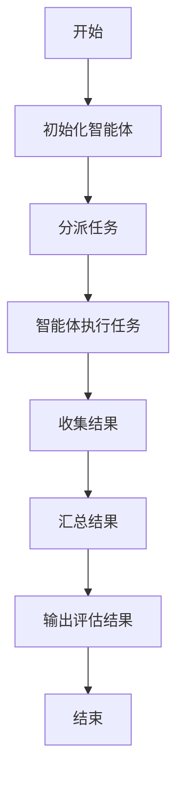
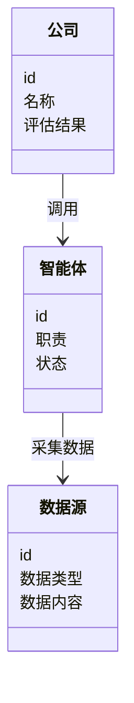
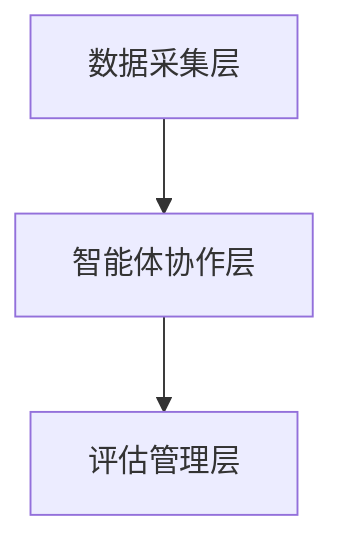
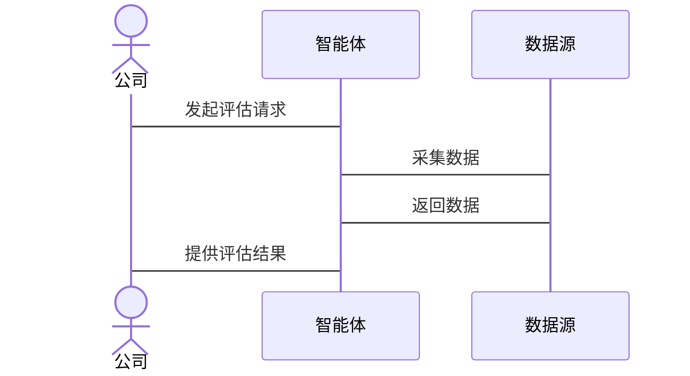

                 


# 基于多智能体的自动化公司质量评估

## 关键词：多智能体系统、自动化公司评估、质量评估模型、协作算法、系统架构、企业信息化

## 摘要：  
本文详细探讨了基于多智能体的自动化公司质量评估方法，结合多智能体系统与机器学习技术，构建了一种高效的公司质量评估模型。通过分析多智能体协作算法、系统架构设计以及实际案例，展示了如何利用智能体的分布式协作能力，实现对公司质量的自动化、精准化评估。本文内容涵盖背景分析、核心原理、算法实现、系统设计及项目实战，为读者提供全面的技术指导。

---

## 目录

1. [背景介绍](#背景介绍)
2. [核心概念与联系](#核心概念与联系)
3. [算法原理与数学模型](#算法原理与数学模型)
4. [系统分析与架构设计](#系统分析与架构设计)
5. [项目实战](#项目实战)
6. [总结与展望](#总结与展望)

---

## 1. 背景介绍

### 1.1 问题背景  
公司质量评估是企业管理中的重要环节，传统的评估方法依赖人工数据收集和分析，存在效率低、主观性强、覆盖范围有限等问题。随着企业规模的扩大和信息化需求的增加，如何利用技术手段实现自动化、精准化的公司质量评估成为亟待解决的问题。

### 1.2 问题描述  
公司质量评估涉及多个维度，包括财务状况、市场表现、管理能力等。传统方法通常依赖经验丰富的专家团队，评估过程耗时长、成本高，且容易受到主观因素的影响。此外，数据来源分散、信息不一致的问题也增加了评估的难度。

### 1.3 解决策略  
引入多智能体系统，通过多个智能体协同工作，分别负责数据采集、分析、预测等任务，实现公司质量评估的自动化。这种方法能够提高评估效率，降低人为误差，同时支持大规模数据处理。

---

## 2. 核心概念与联系

### 2.1 多智能体系统  
多智能体系统（MAS）由多个相互作用的智能体组成，每个智能体负责特定的任务。智能体之间通过通信和协作，共同完成复杂问题的求解。其特点包括分布式、协作性和自治性。

### 2.2 自动化评估模型  
自动化评估模型基于多智能体协作，利用机器学习算法对数据进行分析和预测。模型的核心在于智能体的协作机制，确保各智能体能够高效地完成任务。

### 2.3 对比分析  
| 特性          | 传统评估方法     | 基于多智能体的自动化评估     |
|---------------|------------------|----------------------------|
| 评估效率       | 低               | 高                         |
| 评估范围       | 有限            | 广泛                        |
| 评估准确性     | 易受主观影响      | 高                         |
| 成本           | 高               | 低                         |

### 2.4 实体关系图  
通过ER图展示公司质量评估系统的核心实体关系：

```mermaid
erd
actor 公司, 评估系统, 数据源
company has_many assessment, data_source
assessment has_many metric
```

---

## 3. 算法原理与数学模型

### 3.1 多智能体协作算法  
多智能体协作算法包括分布式协作、博弈论协作和联合学习。以下是基于分布式协作的算法流程：



### 3.2 数学模型  
目标函数：  
$$ f(x) = \sum_{i=1}^{n} f_i(x_i) $$  

优化模型：  
$$ \min_{x} \sum_{i=1}^{n} f_i(x_i) $$  

---

## 4. 系统分析与架构设计

### 4.1 问题场景  
以一家中型制造企业为例，需要评估其财务状况、生产效率和客户满意度。

### 4.2 领域模型  
领域模型展示公司评估的核心实体和关系：



### 4.3 系统架构设计  
系统架构分为数据采集层、智能体协作层和评估管理层：



### 4.4 接口设计  
智能体与数据源的交互流程：



---

## 5. 项目实战

### 5.1 环境安装  
安装必要的库和工具，如Python、TensorFlow、Flask等。

### 5.2 核心代码实现  
以下是一个智能体协作的示例代码：

```python
class Agent:
    def __init__(self, role):
        self.role = role
        self.state = None

    def act(self):
        # 根据角色执行任务
        pass

    def receive(self, data):
        # 接收其他智能体的数据
        pass

# 初始化智能体
agents = [Agent('财务'), Agent('生产'), Agent('客户')]
```

### 5.3 案例分析  
以某制造企业的实际数据为例，展示如何利用上述模型进行评估。

---

## 6. 总结与展望

### 6.1 最佳实践  
- 定期更新模型，确保评估结果的准确性。
- 优化智能体间的通信机制，提高协作效率。

### 6.2 小结  
基于多智能体的自动化公司质量评估系统通过智能体协作，实现了高效、精准的评估。本文详细探讨了算法、系统设计和实战案例，为企业的信息化管理提供了参考。

### 6.3 注意事项  
- 数据质量和隐私保护是系统设计的关键。
- 确保智能体间的通信安全，防止数据泄露。

### 6.4 拓展阅读  
建议读者深入研究多智能体系统在其他领域的应用，如智能交通和金融风险评估。

---

## 结语  
通过本文的探讨，读者可以全面了解基于多智能体的自动化公司质量评估的核心原理和实现方法。未来，随着人工智能技术的不断发展，这一领域的应用前景将更加广阔。

