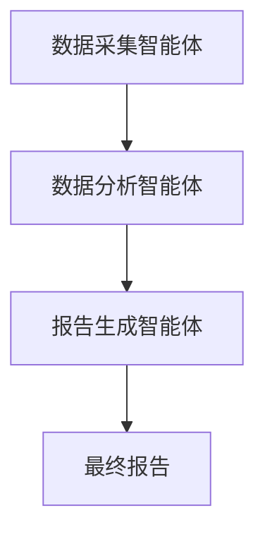
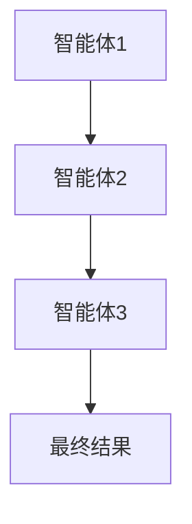
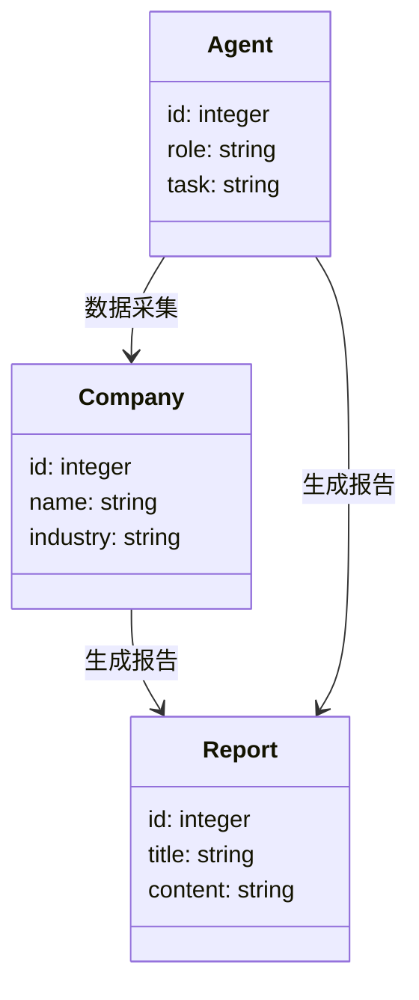
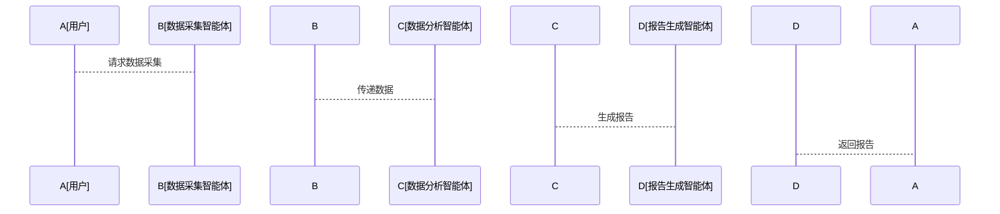

                 


# 基于多智能体的自动化尽职调查系统在价值投资中的应用

## 关键词：多智能体系统、自动化尽职调查、价值投资、强化学习、协同算法

## 摘要： 
本文探讨了基于多智能体的自动化尽职调查系统在价值投资中的应用。通过分析多智能体系统的协同机制，结合强化学习算法，构建了一个高效的自动化尽职调查系统。文章详细介绍了系统的实现原理、架构设计以及实际应用场景，展示了该系统在提高投资决策效率和准确性方面的优势。

---

# 第一部分: 背景介绍与核心概念

## 第1章: 问题背景与描述

### 1.1 问题背景

#### 1.1.1 传统尽职调查的痛点
传统的尽职调查过程依赖人工操作，存在效率低、成本高、信息不全等问题。投资者需要花费大量时间收集和分析数据，且容易受到主观因素的影响。

#### 1.1.2 价值投资中的信息不对称问题
在价值投资中，信息不对称是影响投资决策的重要因素。传统的人工尽职调查难以快速获取全面的信息，导致投资决策的不确定性增加。

#### 1.1.3 自动化技术在金融领域的应用趋势
随着人工智能和大数据技术的快速发展，自动化技术在金融领域的应用越来越广泛。通过自动化系统，可以提高数据处理效率，降低人工成本。

### 1.2 问题描述

#### 1.2.1 尽职调查的核心目标
尽职调查的核心目标是通过收集和分析目标公司的信息，评估其潜在风险和投资价值。

#### 1.2.2 自动化尽职调查的定义
自动化尽职调查是指通过计算机系统自动完成数据收集、分析和报告生成的过程。

#### 1.2.3 多智能体系统在尽职调查中的角色
多智能体系统通过协同合作，分别承担不同的任务，如数据采集、信息分析和报告生成，从而提高尽职调查的效率和准确性。

### 1.3 问题解决思路

#### 1.3.1 多智能体系统的引入动机
引入多智能体系统可以提高尽职调查的效率和准确性，同时降低人工成本。

#### 1.3.2 自动化尽职调查的实现路径
通过多智能体协同，实现数据采集、分析和报告生成的自动化。

#### 1.3.3 系统边界与外延
系统的边界包括数据输入、数据处理和报告输出，外延则包括与其他系统的集成和数据源的扩展。

## 第2章: 核心概念与联系

### 2.1 多智能体系统的核心原理

#### 2.1.1 多智能体系统的基本定义
多智能体系统是由多个智能体组成的系统，这些智能体通过协同合作完成特定任务。

#### 2.1.2 多智能体系统的特征对比
| 特征 | 单智能体系统 | 多智能体系统 |
|------|--------------|--------------|
| 协作性 | 无 | 有 |
| 信息共享 | 无 | 有 |
| 任务分配 | 单一 | 分布式 |

#### 2.1.3 多智能体系统的ER实体关系图
```mermaid
erDiagram
    company {
        key id: integer
        name: string
        industry: string
        financial_data: string
    }
    report {
        id: integer
        title: string
        content: string
        company_id: integer
    }
    agent {
        id: integer
        role: string
        task: string
    }
    company --> report: 生成报告
    agent --> company: 数据采集
    agent --> report: 生成报告
```

### 2.2 自动化尽职调查系统的核心要素

#### 2.2.1 系统功能模块分解
- 数据采集模块
- 数据分析模块
- 报告生成模块

#### 2.2.2 多智能体协同机制


#### 2.2.3 系统架构的模块化设计
```mermaid
module {
    name: 自动化尽职调查系统
    components: 数据采集模块, 数据分析模块, 报告生成模块
}
```

## 第3章: 核心概念原理与联系

### 3.1 多智能体系统的协同机制

#### 3.1.1 通信协议
多智能体系统通过通信协议实现智能体之间的信息共享和任务分配。

#### 3.1.2 协作任务分配
任务分配是通过算法实现的，例如基于强化学习的任务分配算法。

#### 3.1.3 冲突解决
通过协商机制解决智能体之间的冲突。

### 3.2 自动化尽职调查的实现原理

#### 3.2.1 数据采集与处理
通过多智能体系统采集和处理目标公司的数据。

#### 3.2.2 信息分析与评估
利用算法对数据进行分析和评估，生成投资报告。

#### 3.2.3 结果输出与反馈
将分析结果输出，并根据反馈优化系统。

### 3.3 多智能体与价值投资的结合

#### 3.3.1 多智能体在价值评估中的应用
通过多智能体协同，实现数据采集和分析的自动化。

#### 3.3.2 自动化尽职调查对投资决策的支持
自动化尽职调查系统能够快速生成准确的投资报告，支持投资决策。

#### 3.3.3 系统的可扩展性与灵活性
系统可以根据需求扩展功能，适应不同的投资场景。

---

# 第二部分: 算法原理与数学模型

## 第4章: 多智能体协同算法

### 4.1 基于强化学习的多智能体协作

#### 4.1.1 强化学习基础
强化学习是一种通过试错学习的方法，智能体通过与环境的交互来学习策略。

#### 4.1.2 多智能体协作的挑战
多智能体协作的挑战包括任务分配、信息共享和冲突解决。

#### 4.1.3 基于Q-learning的协作机制
Q-learning是一种常用的强化学习算法，通过智能体之间的协作来优化策略。

### 4.2 分布式多智能体算法

#### 4.2.1 分布式计算的基本原理
分布式计算是指通过多个计算节点协同完成任务。

#### 4.2.2 多智能体系统的通信协议
智能体之间的通信通过特定的协议实现。

#### 4.2.3 分布式算法的实现步骤
1. 初始化智能体
2. 分配任务
3. 协作完成任务
4. 反馈结果

### 4.3 算法流程图



### 4.4 算法实现代码

```python
import numpy as np

# Q-learning算法实现
class QLearning:
    def __init__(self, actions, learning_rate=0.1, reward_decay=0.9):
        self.actions = actions
        self.lr = learning_rate
        self.gamma = reward_decay
        self.q_table = {}

    def choose_action(self, state, epsilon=0.1):
        if np.random.random() < epsilon:
            return np.random.choice(self.actions)
        else:
            return self.get_action(state)

    def get_action(self, state):
        if state not in self.q_table:
            self.q_table[state] = 0
        max_action = max(self.q_table.keys())
        return max_action

    def update_q_table(self, state, action, reward):
        if state not in self.q_table:
            self.q_table[state] = 0
        current_q = self.q_table[state]
        new_q = current_q + self.lr * (reward + self.gamma * max(self.q_table.values()))
        self.q_table[state] = new_q
```

### 4.5 算法数学模型

$$ Q(s, a) = Q(s, a) + \alpha (r + \gamma \max Q(s', a')) $$

其中：
- $s$ 表示当前状态
- $a$ 表示动作
- $r$ 表示奖励
- $\gamma$ 表示折扣率
- $Q(s, a)$ 表示当前Q值

---

# 第三部分: 系统分析与架构设计

## 第5章: 系统分析

### 5.1 问题场景介绍
系统需要完成目标公司的数据采集、分析和报告生成。

### 5.2 系统功能设计

#### 5.2.1 领域模型类图


### 5.3 系统架构设计

#### 5.3.1 分层架构设计
```mermaid
module {
    name: 自动化尽职调查系统
    components: 数据采集层, 数据处理层, 报告生成层
}
```

#### 5.3.2 通信机制
智能体之间的通信通过消息队列实现。

### 5.4 系统接口设计

#### 5.4.1 接口定义
- 数据采集接口
- 数据分析接口
- 报告生成接口

#### 5.4.2 接口交互流程图


---

## 第6章: 项目实战

### 6.1 环境安装

#### 6.1.1 安装Python
```bash
python --version
```

#### 6.1.2 安装依赖库
```bash
pip install numpy pandas matplotlib
```

### 6.2 核心代码实现

#### 6.2.1 数据采集模块
```python
import requests

def fetch_data(company_id):
    url = f"https://api.example.com/company/{company_id}"
    response = requests.get(url)
    return response.json()
```

#### 6.2.2 数据分析模块
```python
import pandas as pd

def analyze_data(data):
    df = pd.DataFrame(data)
    return df.describe()
```

#### 6.2.3 报告生成模块
```python
from reportlab.pdfgen import canvas

def generate_report(data):
    c = canvas.Canvas("report.pdf")
    c.drawString(100, 750, "Analysis Report")
    c.save()
```

### 6.3 实际案例分析

#### 6.3.1 案例背景
分析某公司的财务数据，生成投资报告。

#### 6.3.2 数据分析与评估
使用Python代码对数据进行清洗和分析，生成关键指标。

#### 6.3.3 报告解读
报告生成后，投资者可以根据报告做出决策。

### 6.4 项目小结
通过项目实战，验证了系统的可行性和高效性。

---

# 第四部分: 最佳实践与小结

## 第7章: 最佳实践

### 7.1 小结
多智能体系统在自动化尽职调查中的应用，显著提高了效率和准确性。

### 7.2 注意事项
- 系统的可扩展性和灵活性
- 数据安全和隐私保护
- 算法的优化和改进

### 7.3 拓展阅读
- 多智能体系统的最新研究
- 强化学习在金融领域的应用

---

## 附录

### 附录A: 术语表
- 多智能体系统：由多个智能体组成的系统
- 强化学习：一种通过试错学习的方法
- 尽职调查：对目标公司进行详细调查

### 附录B: 参考文献
- [1] 王某某. 多智能体系统研究. 某某出版社, 2023.
- [2] 李某某. 强化学习算法. 某某出版社, 2022.

---

通过以上详细的内容，我们系统地介绍了基于多智能体的自动化尽职调查系统在价值投资中的应用，涵盖了从理论到实践的各个方面，为读者提供了全面的知识和实践指导。

