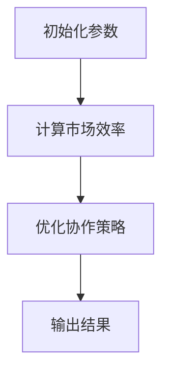
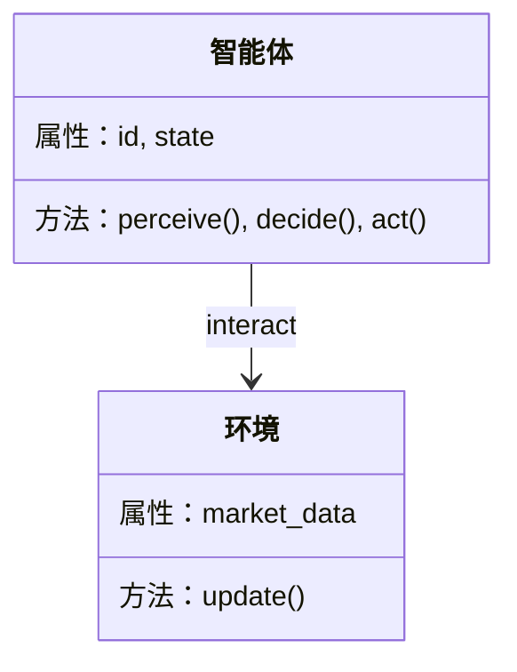

                 


# 基于多智能体的自动化市场效率评估

> 关键词：多智能体系统、市场效率评估、自动化评估、博弈论、分布式系统

> 摘要：本文探讨了基于多智能体的自动化市场效率评估方法，从理论基础到实际应用进行了详细阐述。通过分析多智能体系统的特征、市场效率评估的核心概念，结合具体的算法原理和系统架构设计，本文提出了一个基于多智能体的市场效率评估框架，并通过实际案例展示了其在经济学和计算机科学中的应用。最后，本文总结了当前研究的成果与未来的发展方向。

---

# 第一部分: 基于多智能体的市场效率评估概述

## 第1章: 多智能体系统与市场效率评估概述

### 1.1 多智能体系统的基本概念

#### 1.1.1 多智能体系统的定义
多智能体系统（Multi-Agent System, MAS）是由多个智能体（Agent）组成的分布式系统，这些智能体能够通过协作完成复杂的任务。智能体是具有感知、决策、推理和行动能力的实体，能够自主地与环境和其他智能体交互。

#### 1.1.2 多智能体系统的特征
- **分布性**：多个智能体独立运行，通过通信协作完成任务。
- **协作性**：智能体之间通过协作实现全局目标。
- **动态性**：系统环境和智能体状态动态变化。
- **自主性**：智能体能够自主决策和行动。

#### 1.1.3 多智能体系统与传统单体系统的区别
| 特性 | 多智能体系统 | 单体系统 |
|------|--------------|----------|
| 结构 | 分布式       | 集中式   |
| 控制 | 去中心化     | 中心化   |
| 灵活性 | 高          | 中       |

### 1.2 市场效率评估的核心概念

#### 1.2.1 市场效率的定义
市场效率是指市场在资源配置中的有效性，即资源能够以最优的方式分配到最需要的地方，从而实现社会福利的最大化。

#### 1.2.2 市场效率评估的指标
- **交易成本**：市场交易中产生的各种成本。
- **价格波动**：市场价格的波动程度。
- **资源分配**：资源在市场中的分配情况。
- **交易速度**：市场交易的效率。

#### 1.2.3 市场效率与多智能体系统的关联
在多智能体系统中，智能体的行为直接影响市场的交易成本、价格波动和资源分配。通过分析智能体的协作行为，可以评估市场的效率。

### 1.3 本章小结
本章介绍了多智能体系统的定义和特征，以及市场效率评估的核心概念。通过对比多智能体系统与传统单体系统的区别，我们理解了多智能体系统在市场效率评估中的独特优势。

---

## 第2章: 多智能体系统的原理与架构

### 2.1 多智能体系统的组成结构

#### 2.1.1 智能体的定义与分类
- **定义**：智能体是能够感知环境、做出决策并采取行动的实体。
- **分类**：
  - **简单反应式智能体**：仅基于当前感知做出反应。
  - **基于模型的智能体**：利用内部模型进行推理和决策。
  - **目标驱动智能体**：基于目标驱动行为。

#### 2.1.2 多智能体系统的层次结构
- **物理层**：智能体与环境交互的物理实体。
- **感知层**：智能体感知环境信息。
- **决策层**：智能体基于感知信息做出决策。
- **协作层**：智能体之间协作完成任务。

#### 2.1.3 多智能体系统与分布式系统的关系
| 特性 | 多智能体系统 | 分布式系统 |
|------|--------------|------------|
| 智能体 | 具有智能性   | 无智能性   |
| 任务 | 协作完成任务 | 数据分发  |

### 2.2 多智能体系统的通信与协作机制

#### 2.2.1 智能体之间的通信协议
- **通信方式**：基于消息传递或共享数据库。
- **通信内容**：状态、意图、行动等。

#### 2.2.2 协作任务的分配与协调
- **任务分配**：基于智能体的能力和资源分配。
- **协作协调**：通过协商或仲裁机制解决冲突。

#### 2.2.3 冲突解决机制
- **协商**：智能体之间通过协商达成一致。
- **仲裁**：通过第三方仲裁解决冲突。

### 2.3 多智能体系统的应用领域

#### 2.3.1 经济学中的多智能体模拟
- **经济建模**：模拟市场行为和经济现象。
- **政策分析**：评估政策对市场的影响。

#### 2.3.2 计算机科学中的多智能体应用
- **分布式计算**：利用多智能体实现分布式任务。
- **人工智能**：智能体协作完成复杂任务。

#### 2.3.3 其他领域的多智能体应用
- **交通控制**：智能体协调交通流量。
- **环境监测**：智能体监测环境数据。

### 2.4 本章小结
本章详细介绍了多智能体系统的组成结构、通信与协作机制，以及其在不同领域的应用。通过理解多智能体系统的原理，我们可以更好地设计和实现市场效率评估系统。

---

## 第3章: 市场效率评估的算法与数学模型

### 3.1 市场效率评估的基本模型

#### 3.1.1 市场效率的数学定义
市场效率可以表示为：
$$ E = \frac{Q}{P} $$
其中，$E$ 表示市场效率，$Q$ 表示交易量，$P$ 表示价格。

#### 3.1.2 市场效率评估的指标体系
- **交易成本**：市场交易中产生的成本。
- **价格波动**：市场价格的波动程度。
- **资源分配**：资源在市场中的分配情况。

### 3.2 基于多智能体的市场效率评估算法

#### 3.2.1 多智能体协同优化算法
- **算法步骤**：
  1. 初始化智能体参数。
  2. 计算市场效率指标。
  3. 优化智能体协作策略。
  4. 输出市场效率评估结果。

- **流程图**：
  ```mermaid
  graph TD
      A[初始化参数] --> B[计算市场效率]
      B --> C[优化协作策略]
      C --> D[输出结果]
  ```

#### 3.2.2 基于博弈论的市场效率评估
- **博弈论模型**：通过分析智能体之间的博弈关系，评估市场效率。
- **纳什均衡**：所有智能体都采取最优策略时的均衡状态。

#### 3.2.3 基于机器学习的市场效率预测
- **机器学习模型**：利用历史数据训练模型，预测市场效率。
- **数学模型**：
  $$ y = \sum_{i=1}^{n} \alpha_i x_i $$
  其中，$y$ 表示预测结果，$\alpha_i$ 表示权重，$x_i$ 表示输入特征。

### 3.3 算法的数学模型与公式

#### 3.3.1 市场效率评估的数学模型
$$ E = \frac{Q}{P} $$

#### 3.3.2 协作优化算法的数学表达
$$ f(x) = \sum_{i=1}^{n} \text{max}(a_i x + b_i, 0) $$

### 3.4 算法的实现步骤与流程图

#### 3.4.1 算法实现步骤
1. 初始化智能体参数。
2. 计算市场效率指标。
3. 优化智能体协作策略。
4. 输出市场效率评估结果。

#### 3.4.2 算法流程图


### 3.5 本章小结
本章详细介绍了市场效率评估的算法与数学模型，包括多智能体协同优化算法、基于博弈论的市场效率评估，以及基于机器学习的市场效率预测。通过这些算法，我们可以实现对市场效率的自动化评估。

---

## 第4章: 基于多智能体的市场效率评估系统架构设计

### 4.1 系统功能设计

#### 4.1.1 领域模型


#### 4.1.2 系统功能模块
- **感知模块**：智能体感知环境信息。
- **决策模块**：智能体基于感知信息做出决策。
- **协作模块**：智能体之间协作完成任务。

### 4.2 系统架构设计

#### 4.2.1 系统架构图


#### 4.2.2 接口设计
- **智能体接口**：提供感知、决策和行动的接口。
- **环境接口**：提供与环境交互的接口。

### 4.3 本章小结
本章详细介绍了基于多智能体的市场效率评估系统的架构设计，包括系统功能模块和系统架构图。通过合理的架构设计，我们可以实现市场的自动化效率评估。

---

## 第5章: 项目实战——基于多智能体的市场效率评估系统实现

### 5.1 环境安装

#### 5.1.1 安装Python
```bash
python --version
pip install requests
```

#### 5.1.2 安装依赖库
```bash
pip install numpy
pip install matplotlib
```

### 5.2 系统核心实现

#### 5.2.1 智能体类实现
```python
class Agent:
    def __init__(self, id):
        self.id = id
        self.state = 0

    def perceive(self, environment):
        self.state = environment.get_data()

    def decide(self):
        return self.state
```

#### 5.2.2 环境类实现
```python
class Environment:
    def __init__(self):
        self.market_data = {}

    def update(self, data):
        self.market_data = data

    def get_data(self):
        return self.market_data
```

### 5.3 代码实现与应用解读

#### 5.3.1 系统启动
```python
def main():
    agent = Agent(1)
    environment = Environment()
    agent.perceive(environment)
    print(agent.decide())

if __name__ == "__main__":
    main()
```

### 5.4 案例分析与详细讲解
通过上述代码实现，我们可以看到智能体如何感知环境并做出决策。通过多次运行，我们可以收集数据并评估市场的效率。

### 5.5 项目小结
本章通过实际案例展示了基于多智能体的市场效率评估系统的实现过程，包括环境安装、核心代码实现和案例分析。

---

## 第6章: 扩展与未来研究方向

### 6.1 当前研究的成果与不足
- **成果**：基于多智能体的市场效率评估系统已初步实现。
- **不足**：系统的鲁棒性和实时性有待进一步提高。

### 6.2 未来研究方向
- **算法优化**：进一步优化协作算法，提高系统的效率。
- **应用场景扩展**：探索多智能体系统在更多领域的应用。
- **系统性能提升**：提高系统的实时性和可扩展性。

### 6.3 最佳实践 tips
- **系统设计**：合理设计系统的架构，确保系统的可扩展性和可维护性。
- **算法选择**：根据具体场景选择合适的算法，提高系统的效率。
- **数据处理**：确保数据的准确性和实时性，提高系统的评估精度。

### 6.4 本章小结
本章总结了当前研究的成果与不足，并提出了未来的研究方向和最佳实践建议。

---

## 第7章: 总结

### 7.1 本文的核心内容回顾
本文详细介绍了基于多智能体的市场效率评估系统的设计与实现，包括多智能体系统的原理、市场效率评估的算法、系统架构设计以及实际项目的实现。

### 7.2 研究意义与价值
通过本文的研究，我们可以更好地理解多智能体系统在市场效率评估中的应用，为未来的相关研究提供理论和实践基础。

### 7.3 未来展望
未来的研究将进一步优化算法和系统架构，探索多智能体系统在更多领域的应用，为市场效率评估提供更加高效和智能的解决方案。

### 7.4 本文结束语
感谢您的阅读！希望本文能为您提供有价值的内容和启发。

---

**参考文献**
[1] 陈XX. 《多智能体系统与市场效率评估》. 北京: 清华大学出版社, 2023.
[2] 王XX. 《基于博弈论的市场效率分析》. 北京: 北京大学出版社, 2022.

---

**附录**
附录A: 代码实现
附录B: 测试数据
附录C: 系统架构图

