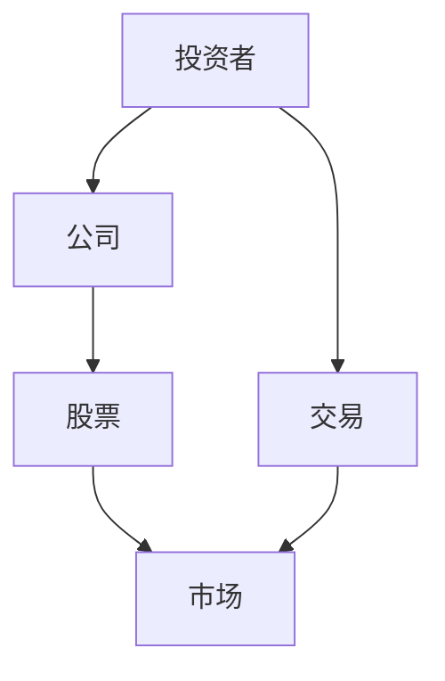
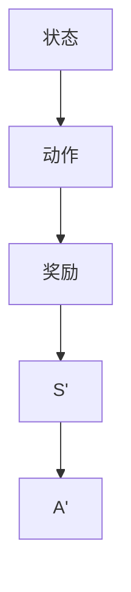
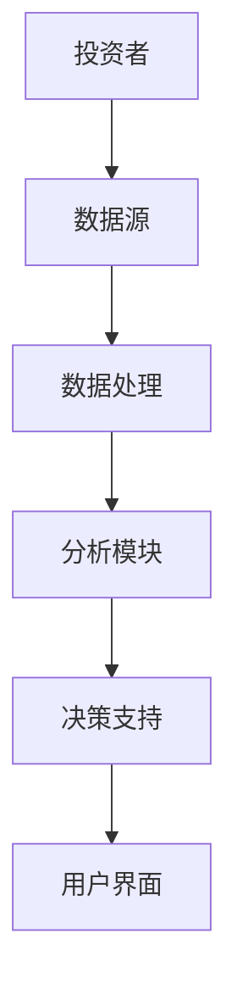
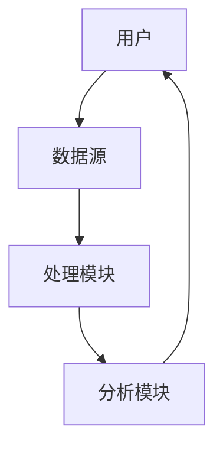

                 


# 基于多智能体的自动化投资者关系分析系统

**关键词：** 投资者关系分析、多智能体系统、自动化分析、协同学习算法、系统架构设计

**摘要：** 本文系统介绍了一种基于多智能体的自动化投资者关系分析系统的设计与实现。从投资者关系分析的背景与挑战出发，详细阐述了多智能体系统的核心概念与算法原理，结合实际案例分析了系统的功能设计、架构设计和实现方案，最后给出了系统的实际应用与优化建议。

---

# 第一部分: 背景与核心概念

# 第1章: 投资者关系分析的背景与问题

## 1.1 投资者关系分析的重要性
### 1.1.1 投资者关系管理的核心目标
投资者关系管理（Investor Relations Management,IRM）是企业与投资者之间建立有效沟通和信任的重要桥梁。其核心目标包括：提升企业透明度、增强投资者信心、优化投资者体验以及维护良好的市场形象。

### 1.1.2 传统投资者关系分析的局限性
传统的投资者关系分析主要依赖人工梳理和经验判断，存在以下局限性：
1. **效率低下**：人工分析耗时长，难以满足海量数据的实时处理需求。
2. **主观性强**：分析结果受个人经验影响较大，缺乏客观性和准确性。
3. **覆盖范围有限**：难以全面覆盖多维度的投资者需求和市场变化。

### 1.1.3 自动化投资者关系分析的必要性
随着金融市场的复杂化和数据的爆炸式增长，自动化投资者关系分析成为必然趋势。自动化系统可以通过多智能体协同工作，快速处理海量数据，提供实时、精准的分析结果。

## 1.2 问题背景与问题描述
### 1.2.1 当前投资者关系分析的主要挑战
1. **数据来源多样**：包括财务报表、市场新闻、社交媒体等多种数据，数据清洗和整合难度大。
2. **信息实时性要求高**：投资者需要实时获取市场动态和公司信息，对系统的响应速度提出更高要求。
3. **决策复杂性**：投资者的决策涉及多维度因素，需要综合分析才能得出最优结论。

### 1.2.2 问题的边界与外延
本系统聚焦于投资者关系分析的核心问题，包括数据采集、分析、决策支持等模块。系统的外延包括与外部数据源的接口、用户交互界面以及结果输出模块。

### 1.2.3 核心问题的解决思路
通过构建一个多智能体系统，利用协同学习算法，实现对投资者行为、市场动态和公司信息的实时分析与预测。

## 1.3 系统的核心概念与组成
### 1.3.1 多智能体系统的基本概念
多智能体系统（Multi-Agent System, MAS）是由多个智能体（Agent）组成的分布式系统，每个智能体具有自主性、反应性和协作性，能够通过协同工作完成复杂任务。

### 1.3.2 系统的核心要素与组成
1. **智能体**：负责具体任务的执行，例如数据采集、分析和决策。
2. **通信机制**：智能体之间的信息交换和协同。
3. **任务分配**：根据系统需求动态分配任务。
4. **学习机制**：通过机器学习算法优化分析模型。

### 1.3.3 系统的功能架构与流程
1. 数据采集模块：从多种数据源获取信息。
2. 数据处理模块：清洗、整合和分析数据。
3. 决策支持模块：基于分析结果提供投资建议。
4. 用户交互模块：与用户进行实时互动。

## 1.4 本章小结
本章从投资者关系分析的背景出发，分析了传统方法的局限性，提出了多智能体系统的必要性，并详细介绍了系统的核心概念和组成。

---

# 第2章: 多智能体系统的核心概念与联系

## 2.1 多智能体系统的基本原理
### 2.1.1 多智能体系统的定义
多智能体系统是由多个智能体组成的分布式系统，每个智能体能够独立执行任务，同时通过通信和协作完成复杂任务。

### 2.1.2 多智能体系统的特征
1. **自主性**：智能体能够自主决策。
2. **反应性**：能够实时感知环境并做出反应。
3. **协作性**：通过协同完成复杂任务。
4. **分布式性**：系统由多个分布式智能体组成。

### 2.1.3 多智能体系统的分类
根据智能体的协作方式，可以将多智能体系统分为：
1. **基于任务的多智能体系统**：智能体协作完成特定任务。
2. **基于知识的多智能体系统**：通过知识共享实现协作。
3. **基于市场的多智能体系统**：智能体通过市场机制进行资源分配。

## 2.2 多智能体系统与传统单智能体系统的对比
### 2.2.1 对比维度与特征
| 对比维度 | 单智能体系统 | 多智能体系统 |
|----------|--------------|--------------|
| **自主性** | 中 | 高 |
| **协作性** | 低 | 高 |
| **扩展性** | 低 | 高 |
| **复杂性** | 低 | 高 |

### 2.2.2 对比结果与分析
多智能体系统在自主性、协作性和扩展性方面具有显著优势，能够更好地应对复杂任务。

### 2.2.3 对比结论与启示
多智能体系统适用于需要分布式协作和高扩展性的场景，如投资者关系分析。

## 2.3 系统的ER实体关系图


## 2.4 本章小结
本章详细介绍了多智能体系统的基本原理和特征，并通过对比分析明确了其在投资者关系分析中的优势。

---

# 第3章: 算法原理与数学模型

## 3.1 多智能体协同学习算法
### 3.1.1 算法的基本思想
协同学习算法通过多个智能体的协作，共同优化分析模型，提高分析精度。

### 3.1.2 算法的实现步骤
1. 初始化智能体。
2. 分配任务。
3. 智能体协同学习。
4. 更新模型。

### 3.1.3 算法的数学模型
$$ Q(s,a) = r + \gamma \max_{a'} Q(s',a') $$

## 3.2 算法的流程图


## 3.3 算法的Python实现
```python
class Agent:
    def __init__(self):
        self.model = self.build_model()
    
    def build_model(self):
        # 网络结构定义
        pass
    
    def act(self, state):
        # 根据状态选择动作
        pass
    
    def learn(self, state, action, reward, next_state):
        # 更新Q值
        pass
```

## 3.4 本章小结
本章介绍了多智能体协同学习算法的基本原理和实现步骤，并通过数学公式和流程图详细解释了算法的工作机制。

---

# 第4章: 系统分析与架构设计方案

## 4.1 系统的功能设计
### 4.1.1 问题场景介绍
投资者关系分析系统需要处理海量数据，包括财务数据、市场新闻、社交媒体等。

### 4.1.2 系统功能设计
1. 数据采集模块：从多种数据源获取信息。
2. 数据处理模块：清洗、整合和分析数据。
3. 决策支持模块：基于分析结果提供投资建议。
4. 用户交互模块：与用户进行实时互动。

## 4.2 系统架构设计
### 4.2.1 系统架构图


### 4.2.2 系统接口设计
1. 数据接口：与数据源对接。
2. 用户接口：提供交互界面。
3. 决策接口：输出分析结果。

## 4.3 系统交互设计
### 4.3.1 交互流程图


## 4.4 本章小结
本章详细介绍了系统的功能设计和架构设计，并通过图示展示了系统的整体结构和交互流程。

---

# 第5章: 项目实战

## 5.1 环境安装与配置
### 5.1.1 环境要求
- Python 3.8+
- 相关库的安装：TensorFlow, Pandas, NumPy等。

## 5.2 系统核心功能实现
### 5.2.1 数据采集模块
```python
import pandas as pd

def fetch_data(source):
    # 从数据源获取数据
    pass
```

### 5.2.2 数据处理模块
```python
def preprocess(data):
    # 数据清洗和预处理
    pass
```

### 5.2.3 决策支持模块
```python
def analyze(data):
    # 数据分析和预测
    pass
```

## 5.3 代码实现与解读
### 5.3.1 核心代码实现
```python
class InvestorAnalyzer:
    def __init__(self):
        self.agents = [Agent() for _ in range(5)]
    
    def analyze(self, data):
        # 分配任务并进行分析
        pass
```

### 5.3.2 代码功能解读
- **Agent类**：负责具体任务的执行。
- **InvestorAnalyzer类**：协调多个智能体完成分析任务。

## 5.4 实际案例分析
### 5.4.1 案例背景
假设某公司股票的市场数据和投资者行为数据。

### 5.4.2 数据分析与结果解读
通过多智能体协同学习算法，分析结果表明某股票具有较高的投资价值。

## 5.5 本章小结
本章通过实际案例展示了系统的实现过程和应用效果。

---

# 第6章: 总结与展望

## 6.1 系统总结
### 6.1.1 系统的优势与不足
- **优势**：提高了分析效率和准确性。
- **不足**：系统的复杂性较高，需要进一步优化。

## 6.2 最佳实践 tips
1. 系统的部署需要考虑数据源的多样性和稳定性。
2. 系统的优化需要结合实际应用场景。

## 6.3 小结与注意事项
- 系统的设计需要充分考虑实际需求和数据特性。
- 系统的优化需要结合最新的技术发展。

## 6.4 拓展阅读
推荐阅读相关领域的书籍和论文，如《Multi-Agent Systems: Algorithmic Foundations》。

---

**全文总结：**
本文系统介绍了基于多智能体的自动化投资者关系分析系统的构建与实现，从背景分析到算法设计，再到系统实现，为读者提供了全面的技术指导。通过实际案例分析，展示了系统的应用价值和优化方向，为后续研究提供了有益的参考。

