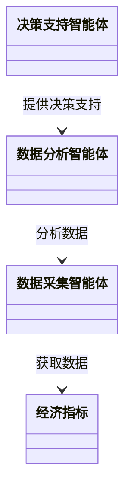
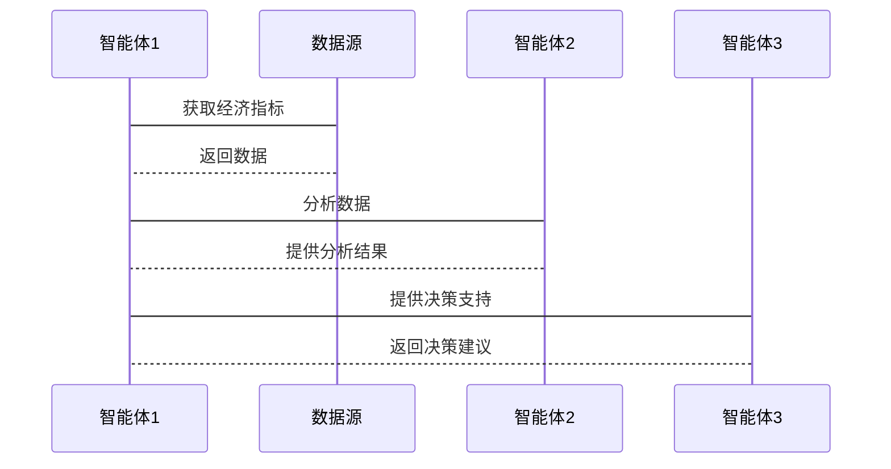

                 


# 基于多智能体的自动化经济周期定位

> 关键词：多智能体系统、经济周期定位、自动化分析、协同算法、时间序列分析

> 摘要：本文探讨了基于多智能体系统的经济周期定位方法，分析了多智能体系统在经济周期定位中的应用优势，并详细介绍了多智能体协同算法和经济周期定位算法的结合。文章还通过实际案例展示了系统的实现过程，为读者提供了从理论到实践的全面指导。

---

# 第一部分: 经济周期定位与多智能体系统概述

## 第1章: 经济周期定位的背景与意义

### 1.1 经济周期的基本概念
经济周期是指经济活动在增长与衰退之间的波动过程，通常分为扩张期、峰值、衰退期和 trough 等阶段。准确识别经济周期对于政府政策制定、企业战略规划以及投资决策具有重要意义。

### 1.2 多智能体系统在经济周期定位中的优势
传统的经济周期分析方法依赖于单一的分析模型，存在数据维度不足、模型鲁棒性差等问题。多智能体系统通过多个智能体的协同工作，能够从多个维度获取信息，提高分析的准确性和全面性。

### 1.3 问题背景与解决方案
经济周期的复杂性使得单一模型难以捕捉所有关键指标。多智能体系统通过分布式计算和协同学习，能够更好地处理复杂经济环境中的不确定性。

---

## 第2章: 多智能体系统的基本概念

### 2.1 多智能体系统的定义
多智能体系统（Multi-Agent System，MAS）是由多个相互作用的智能体组成的系统，每个智能体具有一定的自主性、反应性和协作性。

### 2.2 多智能体系统的组成与特点
- **组成**：智能体、环境、通信机制、协作机制。
- **特点**：分布性、自主性、反应性、协作性。

### 2.3 多智能体系统与单智能体系统的区别
- **计算方式**：多智能体系统采用分布式计算，单智能体系统采用集中式计算。
- **数据处理**：多智能体系统能够处理更复杂的数据关系，单智能体系统处理能力有限。

---

## 第3章: 多智能体系统在经济周期定位中的应用前景

### 3.1 经济周期定位的复杂性与挑战
经济周期受多种因素影响，如 GDP、就业率、通胀率等，传统模型难以捕捉所有变量之间的复杂关系。

### 3.2 多智能体系统的优势
- **分布式计算**：能够处理大规模数据。
- **协同学习**：多个智能体协同工作，提高分析准确性。

### 3.3 局限性
- **复杂性**：多智能体系统的实现较为复杂。
- **协调问题**：智能体之间的协调可能带来额外的计算开销。

---

# 第二部分: 多智能体系统与经济周期定位的核心概念

## 第4章: 多智能体系统的原理与机制

### 4.1 通信机制
智能体之间的通信可以通过消息传递机制完成，例如使用队列或发布-订阅模式。

### 4.2 协作机制
通过协商和任务分配，多个智能体可以协同完成复杂任务。

### 4.3 决策机制
基于环境反馈和历史数据，智能体能够做出决策。

---

## 第5章: 经济周期定位的核心算法

### 5.1 经济周期定位的基本原理
通过分析经济指标的时间序列数据，识别经济周期的波动特征。

### 5.2 关键指标
- GDP增长率
- 失业率
- 通胀率
- 利率

### 5.3 数学模型
使用ARIMA模型进行时间序列预测。

---

## 第6章: 多智能体系统与经济周期定位的结合

### 6.1 多智能体系统在经济周期定位中的角色
- 数据采集智能体
- 数据分析智能体
- 决策支持智能体

### 6.2 协作流程
1. 数据采集：智能体从不同数据源获取经济指标。
2. 数据分析：智能体协同分析数据，识别周期特征。
3. 决策支持：基于分析结果，提供经济周期定位的建议。

---

# 第三部分: 算法原理与实现

## 第7章: 多智能体协同算法

### 7.1 强化学习算法
通过智能体与环境的交互，学习最优策略。

### 7.2 博弈论算法
通过纳什均衡等理论，解决智能体之间的冲突。

### 7.3 分布式计算算法
通过分布式计算，提高系统的处理能力。

---

## 第8章: 经济周期定位算法

### 8.1 时间序列分析算法
使用ARIMA模型对经济指标进行预测。

### 8.2 机器学习算法
使用随机森林等算法对经济周期进行分类。

---

## 第9章: 算法结合与实现

### 9.1 算法结合
将多智能体协同算法与时间序列分析算法结合，实现经济周期定位。

### 9.2 实现步骤
1. 数据预处理
2. 智能体协同分析
3. 模型训练与优化

---

# 第四部分: 系统分析与架构设计

## 第10章: 问题场景介绍

### 10.1 经济周期定位的实际需求
企业需要实时掌握经济周期变化，以便调整经营策略。

### 10.2 系统目标
开发一个多智能体协同系统，实现自动化经济周期定位。

---

## 第11章: 系统功能设计

### 11.1 领域模型类图


---

## 第12章: 系统架构设计

### 12.1 系统架构图


---

## 第13章: 系统接口设计

### 13.1 接口描述
- 数据采集接口
- 数据分析接口
- 决策支持接口

---

## 第14章: 系统交互流程

### 14.1 交互流程图


---

# 第五部分: 项目实战与案例分析

## 第15章: 项目实战

### 15.1 环境安装
安装Python、NumPy、Pandas、Scikit-learn等库。

### 15.2 核心代码实现
```python
import numpy as np
from sklearn.metrics import mean_squared_error

def economic_cycle_prediction(data):
    # 数据预处理
    # 模型训练
    # 预测结果
    return prediction_result

if __name__ == "__main__":
    data = np.array([...])  # 输入数据
    result = economic_cycle_prediction(data)
    print(result)
```

---

## 第16章: 案例分析

### 16.1 数据分析
使用历史经济指标数据训练模型。

### 16.2 案例解读
通过具体案例展示模型的应用效果。

---

## 第17章: 项目小结

### 17.1 项目总结
详细总结项目的实现过程和成果。

### 17.2 经验与教训
总结项目中的经验教训，为后续工作提供参考。

---

# 第六部分: 最佳实践与拓展阅读

## 第18章: 最佳实践 tips

### 18.1 实践建议
- 定期更新模型
- 优化智能体之间的通信机制
- 提高系统的容错能力

---

## 第19章: 小结

### 19.1 核心内容回顾
总结文章的核心内容，强调多智能体系统在经济周期定位中的重要性。

---

## 第20章: 注意事项

### 20.1 实施中的注意事项
- 数据质量
- 智能体协同效率
- 系统安全性

---

## 第21章: 拓展阅读

### 21.1 推荐阅读
- 多智能体系统相关书籍
- 经济周期分析的经典文献
- 机器学习在经济分析中的应用

---

# 结语

通过本文的详细讲解，读者可以全面了解基于多智能体的经济周期定位方法。未来，随着技术的发展，多智能体系统在经济分析中的应用将更加广泛和深入。

--- 

**全文完**

