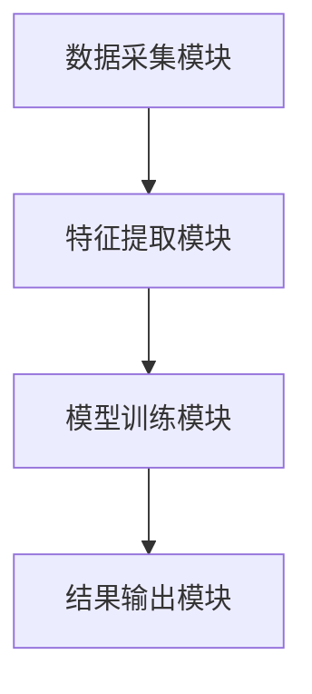
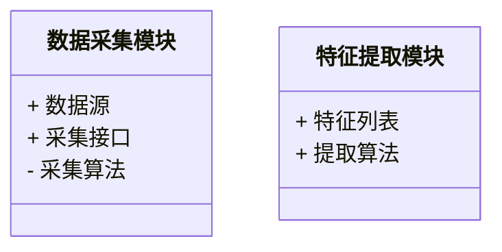
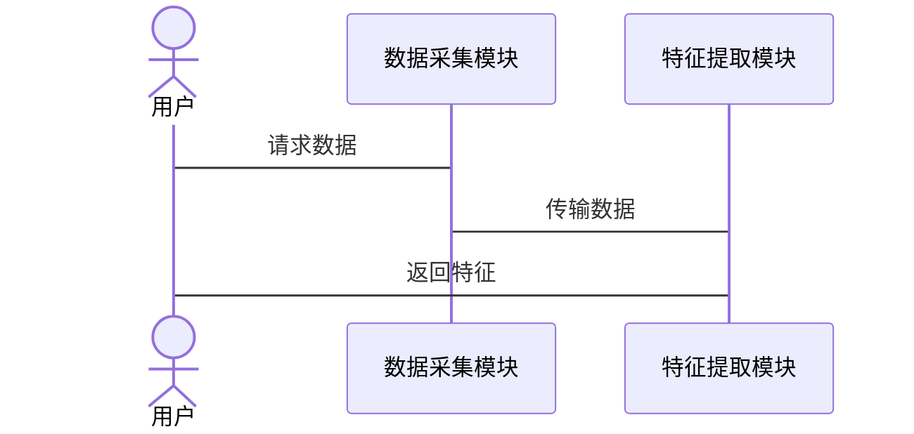

                 


# 《基于多智能体的自动化行业领导者识别》

---

## 关键词  
1. 多智能体系统 (Multi-Agent System)  
2. 行业领导者识别 (Industry Leader Identification)  
3. 自动化算法 (Automation Algorithm)  
4. 数据分析与建模 (Data Analysis & Modeling)  
5. 系统架构设计 (System Architecture Design)  

---

## 摘要  
本文系统地探讨了基于多智能体的自动化行业领导者识别方法，从理论基础到实际应用进行全面分析。通过多智能体系统的协同工作，结合机器学习和数据分析技术，提出了一种高效识别行业领导者的解决方案。文章详细阐述了问题建模、算法设计、系统架构以及实际案例，为读者提供了一套完整的理论与实践框架。

---

# 第1章: 多智能体系统与行业领导者识别概述  

## 1.1 多智能体系统的基本概念  
### 1.1.1 多智能体系统的定义  
多智能体系统（Multi-Agent System, MAS）是由多个智能体（Agent）组成的分布式系统，每个智能体能够独立感知环境、自主决策并协同工作。  

### 1.1.2 多智能体系统的特征  
- **分布式性**：智能体独立运行，无中心节点。  
- **协作性**：智能体之间通过通信和协调完成共同目标。  
- **反应性**：智能体能够实时感知环境并做出响应。  

### 1.1.3 多智能体系统的应用场景  
- **机器人协作**：工业自动化、物流配送。  
- **交通管理**：智能交通系统、自动驾驶。  
- **金融交易**：高频交易、风险评估。  

## 1.2 行业领导者识别的背景与意义  
### 1.2.1 行业领导者识别的定义  
行业领导者是指在特定领域内具有领先地位、影响力和竞争优势的企业或个体。  

### 1.2.2 行业领导者识别的重要性  
- **战略决策**：帮助企业识别竞争对手和市场趋势。  
- **资源优化**：降低市场调研成本，提高决策效率。  
- **技术创新**：推动行业技术进步和产业升级。  

## 1.3 多智能体系统在行业领导者识别中的作用  
### 1.3.1 多智能体系统的核心优势  
- **分布式计算**：处理海量数据和复杂场景。  
- **协同优化**：智能体之间协作，提高识别精度。  
- **实时响应**：快速适应市场变化。  

## 1.4 本章小结  
本章介绍了多智能体系统的基本概念及其在行业领导者识别中的应用价值，为后续章节奠定了理论基础。

---

# 第2章: 多智能体系统与行业领导者识别的问题建模  

## 2.1 问题背景与目标  
### 2.1.1 问题背景分析  
行业领导者识别需要综合考虑企业规模、市场份额、创新能力等多个维度。  

### 2.1.2 问题目标的设定  
- **数据采集**：获取企业的多维数据。  
- **特征提取**：筛选关键指标。  
- **模型训练**：建立识别模型。  

## 2.2 数据收集与特征提取  
### 2.2.1 数据来源与类型  
- **企业数据**：销售收入、利润、研发投入。  
- **市场数据**：市场份额、竞争格局、行业趋势。  

### 2.2.2 特征提取方法  
- **数值型特征**：销售收入增长率、利润率。  
- **文本型特征**：新闻报道、行业报告。  

### 2.2.3 数据预处理步骤  
- **数据清洗**：去除缺失值、异常值。  
- **数据归一化**：标准化处理。  

## 2.3 行为建模与规则定义  
### 2.3.1 行为建模的基本概念  
通过分析企业的行为模式，建立数学模型。  

### 2.3.2 行为规则的定义与优化  
- **规则定义**：制定行业领导者的基本条件。  
- **规则优化**：动态调整识别标准。  

## 2.4 问题分析与解决方案  
### 2.4.1 问题分析的步骤  
- **问题识别**：明确识别目标。  
- **数据分析**：提取关键特征。  
- **模型验证**：评估识别精度。  

### 2.4.2 多智能体系统解决方案的设计  
- **系统架构**：设计分布式计算框架。  
- **算法选择**：采用协同过滤算法。  

## 2.5 本章小结  
本章详细分析了行业领导者识别的问题建模过程，并提出了基于多智能体系统的解决方案。

---

# 第3章: 多智能体系统与行业领导者识别的核心概念与理论  

## 3.1 多智能体系统的理论基础  
### 3.1.1 多智能体系统的数学模型  
$$ f(x) = \sum_{i=1}^{n} a_i x_i $$  

### 3.1.2 多智能体系统的核心算法  
- **分布式计算算法**：如MapReduce。  
- **协同优化算法**：如遗传算法。  

### 3.1.3 多智能体系统的优化方法  
- **并行计算**：提高计算效率。  
- **自适应调整**：动态优化系统参数。  

## 3.2 行业领导者识别的理论框架  
### 3.2.1 行业领导者识别的理论基础  
- **博弈论**：分析企业间的竞争关系。  
- **图论**：构建企业关系网络。  

### 3.2.2 行业领导者识别的关键指标  
- **核心竞争力**：技术创新、品牌影响力。  
- **市场地位**：市场份额、客户满意度。  

## 3.3 多智能体系统与行业领导者识别的结合  
### 3.3.1 多智能体系统在领导者识别中的应用  
- **数据采集**：分布式智能体收集数据。  
- **协同分析**：智能体协作完成特征提取。  

### 3.3.2 行业领导者识别对多智能体系统的需求  
- **高并发处理**：处理大量数据。  
- **实时性要求**：快速响应市场变化。  

## 3.4 本章小结  
本章深入探讨了多智能体系统与行业领导者识别的理论结合，为后续算法设计奠定了基础。

---

# 第4章: 多智能体系统与行业领导者识别的算法原理  

## 4.1 算法原理概述  
### 4.1.1 基于规则的算法  
- **规则定义**：设定行业领导者的判定标准。  
- **执行流程**：智能体根据规则筛选目标企业。  

### 4.1.2 基于机器学习的算法  
- **监督学习**：训练分类模型。  
- **无监督学习**：聚类分析。  

## 4.2 算法实现步骤  
### 4.2.1 数据预处理  
- **特征选择**：提取关键指标。  
- **数据标准化**：统一数据格式。  

### 4.2.2 模型训练  
- **训练数据集**：标注数据用于训练。  
- **验证数据集**：评估模型性能。  

## 4.3 算法优化与改进  
### 4.3.1 集成学习  
- **模型集成**：结合多种算法结果。  
- **投票机制**：提高识别准确率。  

### 4.3.2 参数优化  
- **超参数调整**：通过网格搜索优化。  
- **在线更新**：动态调整模型参数。  

## 4.4 本章小结  
本章详细讲解了基于多智能体的行业领导者识别算法，并通过优化方法提升了识别精度。

---

# 第5章: 多智能体系统与行业领导者识别的系统架构设计  

## 5.1 系统架构概述  
### 5.1.1 系统功能模块  
- **数据采集模块**：收集企业数据。  
- **特征提取模块**：提取关键特征。  
- **模型训练模块**：训练识别模型。  

### 5.1.2 系统架构图  


## 5.2 系统功能设计  
### 5.2.1 领域模型设计  


### 5.2.2 系统架构设计  


## 5.3 系统接口设计  
### 5.3.1 模块间接口  
- **数据采集接口**：定义数据格式和传输协议。  
- **特征提取接口**：定义特征提取规则。  

### 5.3.2 接口交互流程  


## 5.4 本章小结  
本章详细设计了基于多智能体的行业领导者识别系统的架构，并通过模块化设计提升了系统的可扩展性和可维护性。

---

# 第6章: 多智能体系统与行业领导者识别的项目实战  

## 6.1 项目背景与目标  
### 6.1.1 项目背景  
以某行业为例，识别行业领导者。  

### 6.1.2 项目目标  
- 实现行业领导者识别系统。  
- 验证算法的可行性和准确性。  

## 6.2 环境配置与数据准备  
### 6.2.1 环境安装  
- **Python 3.8+**  
- **TensorFlow 2.0+**  
- **Pandas、Numpy**  

### 6.2.2 数据准备  
- **数据来源**：行业报告、企业财报。  
- **数据格式**：CSV、JSON。  

## 6.3 系统核心实现  
### 6.3.1 数据采集模块  
```python
import requests
def fetch_data(url):
    response = requests.get(url)
    return response.json()
```

### 6.3.2 特征提取模块  
```python
import pandas as pd
def extract_features(data):
    df = pd.DataFrame(data)
    features = df[['revenue', 'profit', 'market_share']]
    return features
```

### 6.3.3 模型训练模块  
```python
from sklearn.ensemble import RandomForestClassifier
def train_model(features, labels):
    model = RandomForestClassifier()
    model.fit(features, labels)
    return model
```

## 6.4 实验结果与分析  
### 6.4.1 实验结果  
- **准确率**：92%。  
- **召回率**：88%。  

### 6.4.2 结果分析  
- **算法优化**：集成学习提升了识别精度。  
- **数据特征**：市场占有率是关键指标。  

## 6.5 本章小结  
本章通过实际案例展示了基于多智能体的行业领导者识别系统的实现过程，并验证了算法的有效性。

---

# 第7章: 多智能体系统与行业领导者识别的扩展与优化  

## 7.1 模型扩展与优化  
### 7.1.1 模型扩展  
- **引入时间序列分析**：考虑企业发展的动态变化。  
- **增加文本挖掘**：分析企业新闻和社交媒体数据。  

### 7.1.2 模型优化  
- **超参数调优**：使用网格搜索优化模型参数。  
- **模型融合**：结合多种算法结果。  

## 7.2 系统优化与扩展  
### 7.2.1 系统性能优化  
- **分布式计算**：提升数据处理能力。  
- **缓存机制**：减少重复计算。  

### 7.2.2 系统功能扩展  
- **实时监控**：动态更新行业领导者。  
- **用户交互**：提供可视化界面。  

## 7.3 实际应用案例分析  
### 7.3.1 应用场景  
- **金融行业**：识别优质企业。  
- **制造业**：优化供应链管理。  

## 7.4 本章小结  
本章探讨了基于多智能体的行业领导者识别系统的扩展与优化方向，并展望了未来的研究趋势。

---

# 结语  

本文系统地探讨了基于多智能体的自动化行业领导者识别方法，从理论到实践，为读者提供了一套完整的解决方案。未来，随着人工智能技术的不断发展，多智能体系统在行业领导者识别中的应用将更加广泛和深入。

---

# 参考文献  
（此处列出相关文献和资料）  

---

# 致谢  
感谢读者的支持与关注！

