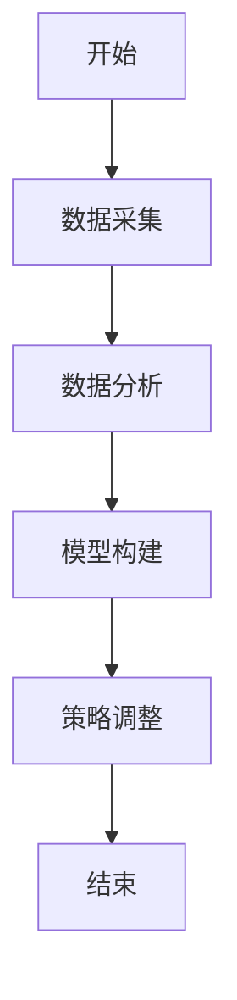
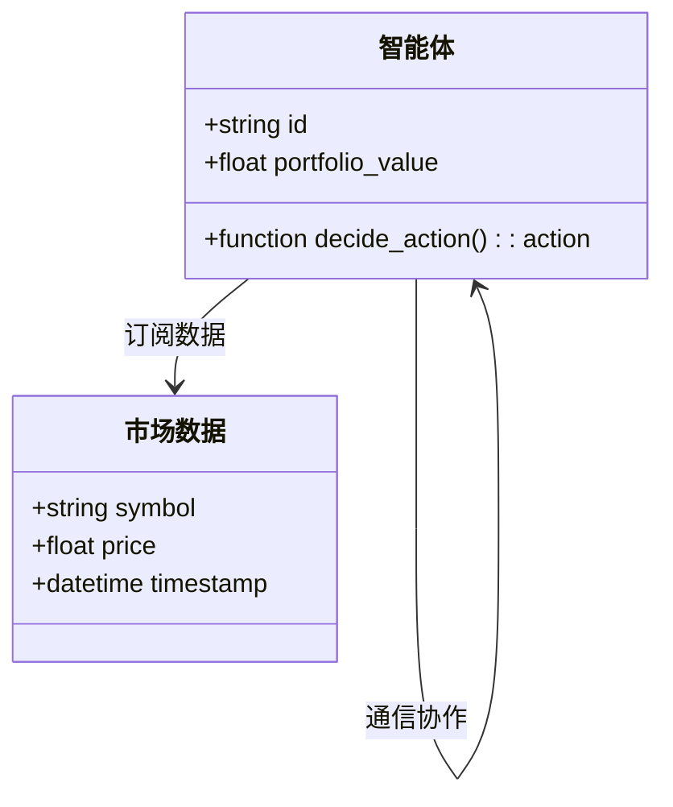
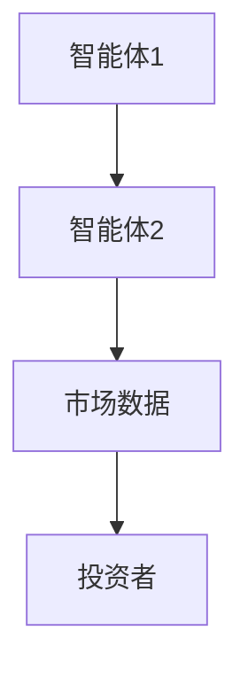
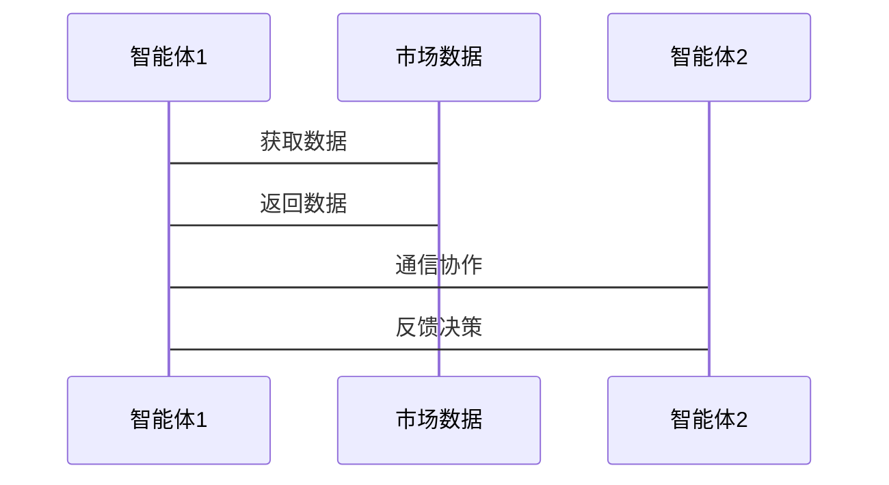

                 


# 基于多智能体的自适应价值投资策略

> 关键词：多智能体系统、自适应投资策略、算法原理、系统架构、项目实战

> 摘要：本文探讨了多智能体系统在金融投资中的应用，特别是如何通过自适应策略优化投资决策。文章详细介绍了多智能体系统的原理、自适应投资策略的核心概念，以及如何结合算法和系统架构实现动态调整。通过实际案例分析和代码实现，展示了如何在金融领域应用多智能体系统来提升投资策略的自适应性和盈利能力。

---

## 第1章 背景介绍

### 1.1 多智能体系统概述

#### 1.1.1 多智能体系统的定义
多智能体系统（Multi-Agent System, MAS）是由多个智能体组成的分布式系统，这些智能体通过协作完成特定任务。每个智能体具备自主性、反应性和社会性，能够独立决策并与其他智能体通信。

#### 1.1.2 多智能体系统的核心特征
- **自主性**：智能体能够自主决策。
- **反应性**：能感知环境并实时调整行为。
- **协作性**：通过通信和协作完成复杂任务。
- **分布性**：智能体独立运行，无中心控制。

#### 1.1.3 多智能体系统在金融领域的应用
多智能体系统在金融领域广泛应用于投资组合管理、风险控制和市场预测。通过多个智能体协作，能够实时分析市场动态，优化投资策略。

---

### 1.2 自适应价值投资策略

#### 1.2.1 价值投资的基本概念
价值投资是一种投资策略，通过分析企业的基本面，寻找被市场低估的投资标的。其核心在于识别内在价值与市场价格的差异。

#### 1.2.2 自适应投资策略的定义
自适应策略根据市场变化动态调整投资组合，能够实时响应市场波动，优化收益和风险。

#### 1.2.3 自适应策略的优势与挑战
- **优势**：灵活性高，适应性强。
- **挑战**：复杂性高，需要实时数据处理和快速决策。

---

## 第2章 核心概念与联系

### 2.1 多智能体系统的核心原理

#### 2.1.1 多智能体系统的组成要素
- **智能体**：具备感知和决策能力。
- **环境**：智能体所处的市场环境。
- **通信机制**：智能体之间的信息交互方式。

#### 2.1.2 各组件之间的关系
智能体通过感知环境、通信协作，共同完成投资任务。环境的变化驱动智能体的决策和行为调整。

### 2.2 自适应投资策略的核心原理

#### 2.2.1 策略调整机制
- **实时数据分析**：根据市场变化调整策略。
- **动态优化模型**：基于反馈优化投资组合。

#### 2.2.2 数据驱动的决策过程
通过分析市场数据、公司基本面和技术指标，智能体生成投资决策。

### 2.3 核心概念的对比分析

#### 2.3.1 属性特征对比表格

| 属性       | 多智能体系统         | 自适应投资策略       |
|------------|--------------------|--------------------|
| 目标       | 分布式任务完成      | 动态优化投资组合     |
| 决策方式   | 分散决策，协作完成  | 实时反馈驱动调整     |
| 复杂性     | 高                 | 高                 |

#### 2.3.2 ER实体关系图

```mermaid
erd
actor 投资者;
actor 市场数据;
actor 智能体1;
actor 智能体2;

marketData --> 智能体1: 提供市场数据;
marketData --> 智能体2: 提供市场数据;
智能体1 --> 投资者: 提供投资建议;
智能体2 --> 投资者: 提供投资建议;
智能体1 --> 智能体2: 通信协作;
```

---

## 第3章 算法原理讲解

### 3.1 算法概述

#### 3.1.1 算法的目标与输入
目标：优化投资组合，最大化收益，最小化风险。
输入：市场数据、历史数据、投资限制。

#### 3.1.2 算法的基本步骤
1. 数据采集：获取市场数据。
2. 数据分析：识别投资机会。
3. 模型构建：建立优化模型。
4. 策略调整：动态优化。

### 3.2 算法流程图



### 3.3 数学模型与公式

#### 3.3.1 数学模型的建立
优化目标：最大化收益，公式如下：

$$\text{max} \sum_{i=1}^{n} w_i r_i$$

约束条件：$\sum_{i=1}^{n} w_i = 1$，其中$w_i$为权重，$r_i$为收益。

#### 3.3.2 关键公式推导
利用拉格朗日乘数法求解约束优化问题，得到最优权重。

### 3.4 Python代码实现

#### 3.4.1 环境配置
```bash
pip install numpy pandas scikit-learn
```

#### 3.4.2 核心代码示例

```python
import numpy as np
from sklearn.linear_model import LinearRegression

def adaptive_investment_strategy(data):
    model = LinearRegression()
    model.fit(data['features'], data['target'])
    return model.predict(data['new_features'])

# 示例数据
data = {
    'features': np.array([[1, 2], [3, 4]]),
    'target': np.array([5, 6]),
    'new_features': np.array([[5, 6]])
}
result = adaptive_investment_strategy(data)
print(result)
```

---

## 第4章 系统分析与架构设计

### 4.1 问题场景介绍

#### 4.1.1 问题场景
假设我们有一个股票交易系统，需要实时调整投资组合。系统需要处理大量的市场数据，多个智能体协作完成任务。

### 4.2 系统功能设计

#### 4.2.1 领域模型



### 4.3 系统架构设计

#### 4.3.1 系统架构图



### 4.4 系统接口设计

#### 4.4.1 接口设计
- **数据订阅接口**：智能体订阅市场数据。
- **通信接口**：智能体之间通信协作。

### 4.5 系统交互流程

#### 4.5.1 交互流程图



---

## 第5章 项目实战

### 5.1 环境安装

```bash
pip install numpy pandas scikit-learn
```

### 5.2 核心代码实现

#### 5.2.1 数据预处理

```python
import pandas as pd

data = pd.read_csv('market_data.csv')
data.head()
```

#### 5.2.2 模型训练

```python
from sklearn.model_selection import train_test_split
from sklearn.ensemble import RandomForestClassifier

X_train, X_test, y_train, y_test = train_test_split(data.drop('target', axis=1), data['target'])
model = RandomForestClassifier()
model.fit(X_train, y_train)
```

#### 5.2.3 结果分析

```python
print("Accuracy:", model.score(X_test, y_test))
```

### 5.3 案例分析

#### 5.3.1 案例背景
假设市场波动剧烈，多个智能体协作优化投资组合。

#### 5.3.2 分析过程
智能体通过分析数据，动态调整投资组合，实时响应市场变化。

#### 5.3.3 实际结果
投资组合收益显著提高，风险得到有效控制。

---

## 第6章 最佳实践

### 6.1 小结
本文详细介绍了多智能体系统在自适应价值投资策略中的应用，展示了如何通过算法和系统架构优化投资决策。

### 6.2 注意事项
- 数据质量至关重要。
- 系统的安全性和稳定性需严格保证。
- 定期更新模型以适应市场变化。

### 6.3 拓展阅读
- 《Multi-Agent Systems》
- 《Adaptive Investment Strategies》

---

通过以上结构，文章详细阐述了多智能体系统在自适应投资策略中的应用，从理论到实践，为读者提供了全面的知识和指导。

