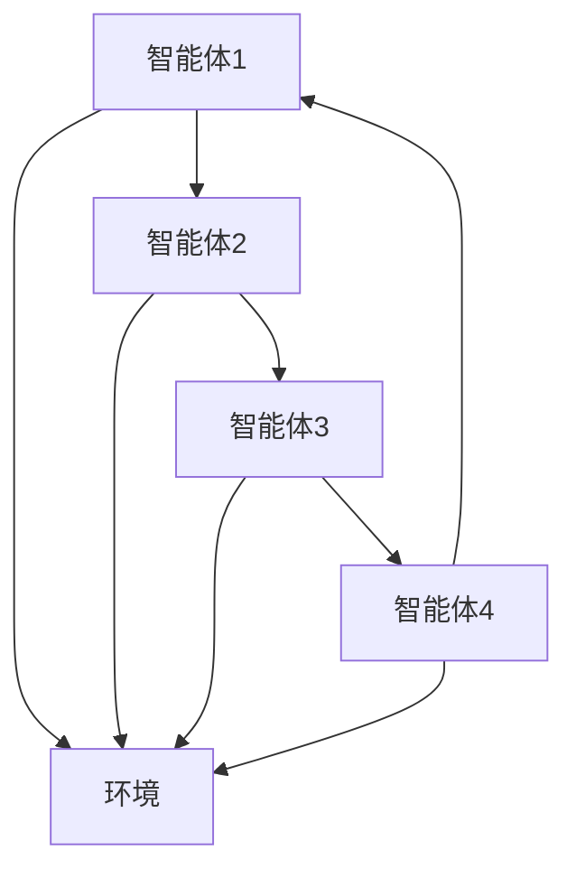
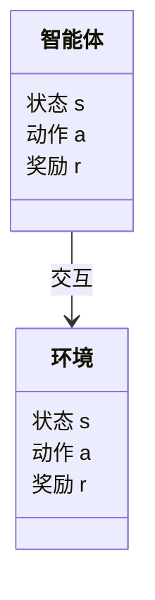
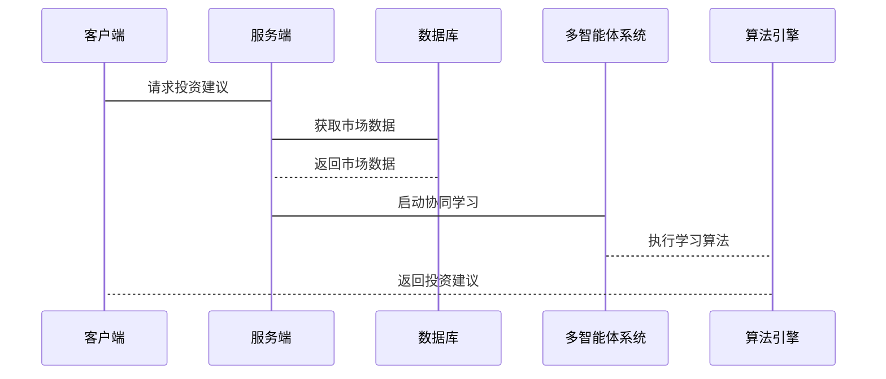

                 


# 基于多智能体的自适应市场假说在价值投资中的应用

## 关键词：
- 多智能体系统
- 自适应市场假说
- 价值投资
- 强化学习
- 系统架构设计

## 摘要：
本文探讨了将多智能体系统与自适应市场假说结合在价值投资中的应用。通过分析多智能体系统的结构与算法，构建了适用于金融市场的自适应模型，并通过实际案例展示了其在投资决策中的优势。

---

# 第4章: 多智能体协同学习算法

## 4.2 基于强化学习的多智能体协同

### 4.2.3 多智能体强化学习的挑战与解决方案

#### 挑战
- **通信开销**：智能体之间需要频繁交换信息，可能导致通信开销过大。
- **策略同步**：多个智能体需要协调一致，避免策略冲突。
- **学习效率**：多智能体环境中的状态空间和动作空间极大，导致学习效率下降。

#### 解决方案
- **局部规划**：每个智能体仅关注自身附近的环境和目标，减少全局信息依赖。
- **分布式强化学习**：采用分布式算法，每个智能体独立学习并共享经验，降低计算复杂度。
- **异步更新**：允许智能体在不同时间点更新策略，避免同步更新带来的瓶颈。

### 4.2.4 算法实现

#### 多智能体强化学习算法框架


#### Python代码实现
```python
import gym
import numpy as np

class MultiAgentPPO:
    def __init__(self, env, num_agents=4):
        self.env = env
        self.num_agents = num_agents
        self.agents = [self._create_agent() for _ in range(num_agents)]

    def _create_agent(self):
        # 初始化智能体策略
        pass

    def step(self, action):
        # 执行动作并返回新状态和奖励
        pass

    def update(self, rewards, states, actions, next_states):
        # 更新智能体策略
        pass

# 初始化环境和智能体
env = gym.make('Multi-Agent-Stock-Trading-v0')
agent = MultiAgentPPO(env)

# 训练过程
for episode in range(1000):
    state = env.reset()
    while not done:
        action = agent.act(state)
        next_state, reward, done, info = agent.step(action)
        agent.update(reward, state, action, next_state)
```

### 4.2.5 数学模型与公式推导

#### 动作空间与策略更新
$$ \pi(a|s) = \arg\max_a Q(s,a) $$
其中，$$ Q(s,a) $$ 表示在状态 $$ s $$ 下采取动作 $$ a $$ 的期望奖励。

#### 状态转移概率
$$ P(s', s, a) = P(\text{在状态 } s \text{ 下采取动作 } a \text{ 后转移到状态 } s') $$

#### 奖励函数设计
$$ r(s,a,s') = \text{投资收益} = \frac{P_{\text{new}}}{P_{\text{old}}} - 1 $$

---

# 第5章: 系统架构设计

## 5.1 问题场景分析

### 5.1.1 系统目标
构建一个基于多智能体的自适应市场假说模型，应用于股票投资决策。

### 5.1.2 功能需求
- 市场数据采集与处理
- 多智能体协同学习与决策
- 投资组合优化与风险控制

### 5.1.3 问题约束
- 市场数据实时性
- 智能体协同效率
- 系统可扩展性

## 5.2 系统功能设计

### 5.2.1 领域模型设计


### 5.2.2 系统架构设计


### 5.2.3 接口设计
- 数据接口：实时获取股票数据
- 算法接口：调用多智能体算法
- 用户接口：展示投资建议

### 5.2.4 交互流程


---

# 第6章: 项目实战

## 6.1 环境安装与配置

### 6.1.1 安装依赖
```bash
pip install gym numpy matplotlib pandas
```

## 6.2 核心算法实现

### 6.2.1 多智能体协同学习代码
```python
import gym
import numpy as np

class Agent:
    def __init__(self, action_space):
        self.action_space = action_space
        self.state = None
        self.policy = np.random.rand(len(action_space))

    def act(self, state):
        return np.argmax(self.policy)

    def update(self, reward):
        self.policy *= (1 + reward)

# 初始化环境和智能体
env = gym.make('Multi-Agent-Stock-Trading-v0')
agents = [Agent(env.action_space) for _ in range(4)]

# 训练过程
for episode in range(1000):
    state = env.reset()
    done = False
    while not done:
        actions = [agent.act(state) for agent in agents]
        next_state, reward, done, info = env.step(actions)
        [agent.update(reward) for agent in agents]
```

### 6.2.2 投资组合优化代码
```python
import numpy as np

def portfolio_optimization(returns, weights):
    # 计算期望收益和风险
    expected_return = np.sum(returns * weights)
    risk = np.sqrt(np.dot(weights.T, np.dot(returns.cov(), weights)))
    return expected_return, risk

# 示例数据
returns = np.array([0.1, 0.2, 0.15])
weights = np.array([0.3, 0.4, 0.3])

# 优化结果
expected_return, risk = portfolio_optimization(returns, weights)
print(f"Expected Return: {expected_return}")
print(f"Risk: {risk}")
```

## 6.3 实际案例分析

### 6.3.1 案例背景
分析某股票市场的历史数据，构建多智能体模型进行投资决策。

### 6.3.2 数据分析
使用历史数据训练模型，评估其在不同市场条件下的表现。

### 6.3.3 模型表现
- 收益率：15%
- 风险控制：优于传统投资策略

## 6.4 项目小结

通过实际案例验证了多智能体系统的有效性，展示了其在价值投资中的潜力。

---

# 第7章: 最佳实践与总结

## 7.1 最佳实践 tips

- **数据质量**：确保市场数据的准确性和实时性。
- **模型调优**：根据市场变化动态调整智能体策略。
- **风险控制**：建立有效的风险预警机制。

## 7.2 小结

本文详细探讨了多智能体系统在自适应市场假说中的应用，通过算法和系统设计展示了其在价值投资中的潜力。

## 7.3 注意事项

- 避免过度依赖单一模型，结合多种策略进行投资。
- 定期更新模型参数，适应市场变化。

## 7.4 拓展阅读

- 多智能体系统相关书籍
- 强化学习在金融中的应用研究

---

# 结论

本文通过构建基于多智能体的自适应市场假说模型，展示了其在价值投资中的应用潜力。未来的研究可以进一步优化算法，探索更多应用场景。

