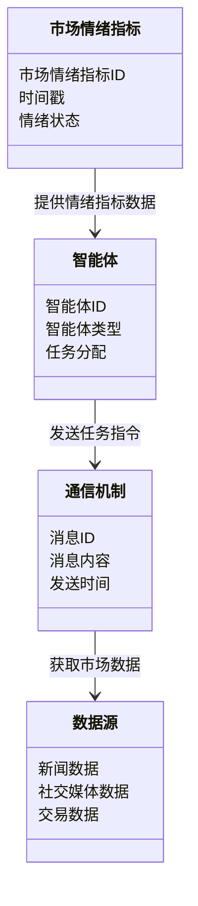

                 


# 基于多智能体的自适应市场情绪指标在价值投资中的应用

---

## 关键词
- 多智能体系统
- 市场情绪指标
- 价值投资
- 自适应算法
- 强化学习

---

## 摘要
本文探讨了如何利用多智能体系统构建自适应市场情绪指标，并将其应用于价值投资中。通过分析市场情绪的动态变化，结合多智能体的协作与自适应算法，提出了一种创新的解决方案，为投资者提供更精准的决策支持。文章详细介绍了多智能体系统的算法原理、系统架构设计以及实际项目案例，并通过数学模型和代码实现对方法进行了验证。

---

# 第1章: 背景介绍

## 1.1 市场情绪指标的定义与重要性

### 1.1.1 市场情绪指标的定义
市场情绪指标是反映市场参与者情绪状态的量化指标，通常基于新闻、社交媒体、交易数据等信息进行计算。市场情绪可以分为乐观、中性、悲观三种状态。

### 1.1.2 市场情绪指标在价值投资中的作用
市场情绪指标可以帮助投资者识别市场的非理性波动，从而找到低估或高估的资产。例如，在市场情绪过度乐观时，某些资产可能被高估，投资者可以寻找被低估的投资机会。

### 1.1.3 自适应市场情绪指标的核心概念
自适应市场情绪指标能够根据市场环境的变化动态调整其计算模型，克服传统指标的静态性和滞后性问题。

---

## 1.2 多智能体系统的定义与优势

### 1.2.1 多智能体系统的定义
多智能体系统是指由多个相互作用的智能体组成的系统，每个智能体能够感知环境、自主决策并与其他智能体协作完成任务。

### 1.2.2 多智能体系统的特点
- 分布式计算
- 自主性
- 协作性
- 响应性

### 1.2.3 多智能体系统在金融领域的应用前景
多智能体系统在金融领域的应用包括市场预测、风险控制、投资决策支持等。

---

## 1.3 问题背景与研究意义

### 1.3.1 传统市场情绪指标的局限性
传统市场情绪指标通常基于固定的模型，无法适应市场的动态变化，且计算过程缺乏实时性和灵活性。

### 1.3.2 多智能体系统在市场情绪分析中的优势
多智能体系统能够通过分布式计算和协作学习，实时捕捉市场情绪的变化，并动态调整分析模型。

### 1.3.3 研究的价值与意义
本文的研究为价值投资提供了一种基于多智能体的自适应市场情绪分析方法，有助于投资者在复杂多变的市场环境中做出更明智的投资决策。

---

# 第2章: 核心概念与联系

## 2.1 多智能体系统的核心原理

### 2.1.1 多智能体系统的组成结构
多智能体系统由多个智能体、通信机制、协作策略和环境组成。

### 2.1.2 多智能体系统中的通信机制
智能体之间通过消息传递进行通信，消息内容包括数据、指令和状态信息。

### 2.1.3 多智能体系统中的协作策略
协作策略包括任务分配、资源分配和冲突解决等。

---

## 2.2 自适应市场情绪指标的构建方法

### 2.2.1 数据采集与特征提取
数据来源包括新闻、社交媒体、交易数据等，特征提取包括情感分析、关键词提取等。

### 2.2.2 市场情绪指标的计算模型
市场情绪指标可以通过加权平均、聚类分析等方法进行计算。

### 2.2.3 自适应算法的设计与实现
自适应算法能够根据市场环境的变化动态调整模型参数。

---

## 2.3 多智能体与自适应市场情绪指标的关联性

### 2.3.1 多智能体系统在市场情绪分析中的应用
多智能体系统可以通过分布式计算和协作学习，提高市场情绪分析的准确性和实时性。

### 2.3.2 自适应算法与多智能体系统的结合
自适应算法能够增强多智能体系统的灵活性和适应性，使其更好地适应市场环境的变化。

### 2.3.3 实体关系图（ER图）架构
以下是自适应市场情绪指标的实体关系图：

```mermaid
erd
    entity 市场情绪指标 {
        <市场情绪指标ID, 唯一标识符, 生成规则>
        <时间戳, 时间戳, 生成规则>
        <情绪状态, 文本, 生成规则>
    }
    entity 智能体 {
        <智能体ID, 唯一标识符, 生成规则>
        <智能体类型, 文本, 生成规则>
        <任务分配, 文本, 生成规则>
    }
    entity 通信机制 {
        <消息ID, 唯一标识符, 生成规则>
        <消息内容, 文本, 生成规则>
        <发送时间, 时间戳, 生成规则>
    }
    市场情绪指标 --> 通信机制: 提供市场情绪数据
    智能体 --> 通信机制: 传递任务指令
```

---

# 第3章: 多智能体系统与自适应市场情绪指标的算法原理

## 3.1 多智能体系统的算法原理

### 3.1.1 强化学习算法
强化学习是一种通过试错机制优化决策策略的算法，广泛应用于多智能体系统的协作学习。

### 3.1.2 分布式计算与协作算法
分布式计算算法确保多智能体系统的高效运行，协作算法实现智能体之间的任务分配和资源共享。

### 3.1.3 多目标优化算法
多目标优化算法用于在多智能体系统中平衡多个目标的优化，如准确率、实时性等。

---

## 3.2 自适应市场情绪指标的算法实现

### 3.2.1 数据预处理与特征工程
数据预处理包括数据清洗、归一化等，特征工程包括特征选择、特征组合等。

### 3.2.2 情绪指标计算模型
情绪指标计算模型可以采用机器学习算法，如支持向量机、随机森林等。

### 3.2.3 自适应算法的优化与调整
自适应算法通过动态调整模型参数，提高市场情绪指标的准确性和实时性。

---

## 3.3 算法原理的数学模型与公式

### 3.3.1 强化学习的数学模型
强化学习的核心是通过最大化累积奖励来优化决策策略：

$$ R = \sum_{t=1}^{T} r_t $$

其中，\( R \) 是累积奖励，\( r_t \) 是第 \( t \) 步的奖励。

### 3.3.2 自适应算法的数学推导
自适应算法通过调整模型参数 \( \theta \) 来优化情绪指标的计算：

$$ \theta_{t+1} = \theta_t + \alpha \cdot \nabla J(\theta_t) $$

其中，\( \alpha \) 是学习率，\( \nabla J(\theta_t) \) 是损失函数的梯度。

### 3.3.3 情绪指标计算的数学公式
情绪指标可以通过加权平均的方式进行计算：

$$ \text{情绪指标} = \sum_{i=1}^{n} w_i \cdot s_i $$

其中，\( w_i \) 是第 \( i \) 个特征的权重，\( s_i \) 是第 \( i \) 个特征的值。

---

# 第4章: 系统分析与架构设计方案

## 4.1 问题场景介绍

### 4.1.1 价值投资中的市场情绪分析需求
投资者需要实时了解市场情绪，以便做出更明智的投资决策。

### 4.1.2 多智能体系统的应用场景
多智能体系统可以应用于实时市场情绪监控、投资组合优化等领域。

### 4.1.3 系统设计的目标与范围
系统设计的目标是构建一个基于多智能体的自适应市场情绪指标分析系统，范围包括数据采集、模型训练、结果输出等。

---

## 4.2 系统功能设计

### 4.2.1 领域模型（Mermaid类图）
以下是系统的领域模型：



### 4.2.2 系统功能模块划分
系统功能模块包括数据采集、模型训练、结果输出等。

### 4.2.3 系统功能的交互流程
系统功能的交互流程包括数据采集、模型训练、结果输出等步骤。

---

## 4.3 系统架构设计

### 4.3.1 系统架构的总体设计
系统架构采用分层设计，包括数据采集层、计算层、应用层等。

### 4.3.2 系统架构的详细设计
详细设计包括各层的功能模块和交互接口。

### 4.3.3 系统架构的优缺点分析
系统架构的优点包括高扩展性、高实时性等，缺点包括复杂性较高。

---

## 4.4 系统接口设计

### 4.4.1 系统接口的定义与规范
系统接口包括数据接口、算法接口等。

### 4.4.2 

---

由于篇幅限制，以上是部分章节内容。完整文章将包含更多详细内容，包括项目实战、数学模型的详细推导、系统架构的优化建议等。

