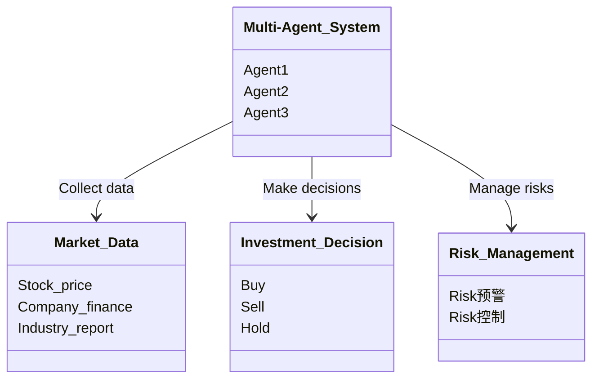
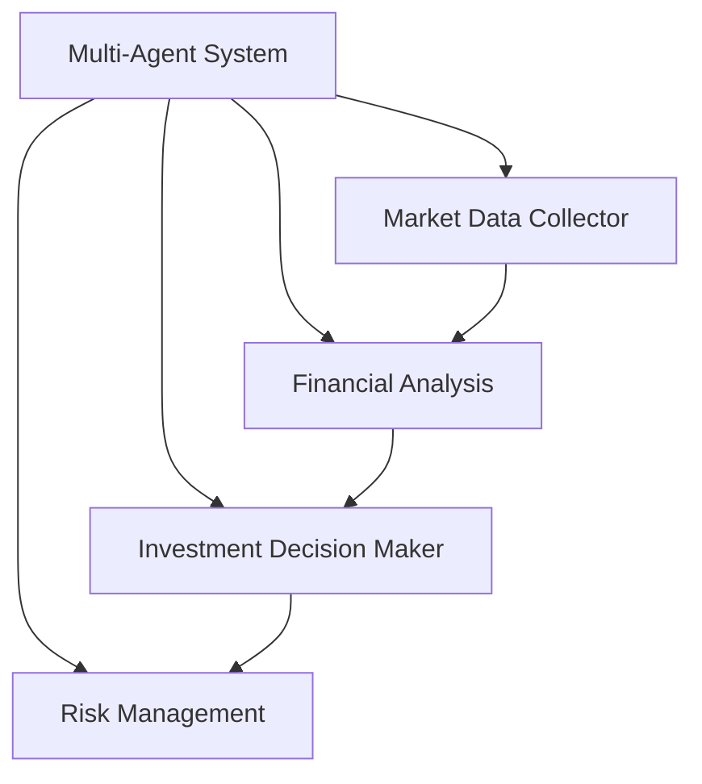
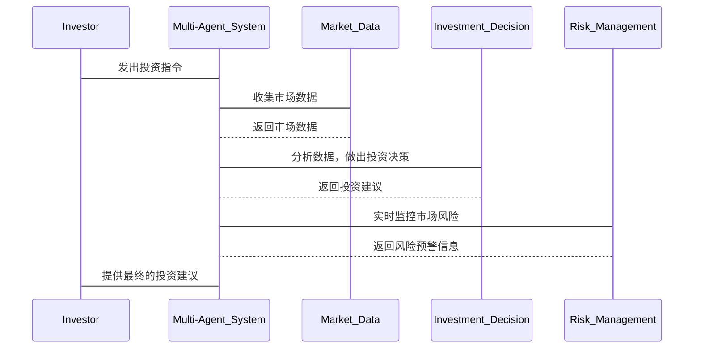

                 


# 基于多智能体的长期价值投资模型

> 关键词：多智能体、长期价值投资、投资决策、分布式系统、强化学习

> 摘要：本文探讨了基于多智能体的长期价值投资模型的构建与应用。通过分析多智能体系统的核心概念、长期价值投资的理论基础，以及它们的协同机制，提出了一种创新的投资策略。结合具体算法和系统架构设计，展示了如何利用多智能体系统实现高效、智能的投资决策。

---

## 第1章 多智能体与长期价值投资概述

### 1.1 多智能体系统的基本概念

#### 1.1.1 多智能体系统的定义
多智能体系统（Multi-Agent System, MAS）是由多个相互作用的智能体组成的分布式系统。每个智能体都有自己的目标、知识和行为，能够通过通信协作完成复杂的任务。

#### 1.1.2 多智能体系统的特征
- **自主性**：每个智能体都能自主决策。
- **反应性**：能够感知环境并实时调整行为。
- **协作性**：通过通信协作完成共同目标。
- **分布式性**：智能体之间没有中央控制节点。

#### 1.1.3 多智能体系统与传统单智能体的区别
| 特性          | 多智能体系统                 | 单智能体系统                 |
|---------------|------------------------------|------------------------------|
| 决策中心化    | 去中心化，多个智能体协作决策 | 单一中心节点决策             |
| 系统复杂度    | 高，复杂任务分解为多个子任务 | 较低，任务由单个智能体完成    |
| 容错性        | 高，单个智能体故障不影响整体 | 较低，单点故障可能导致系统崩溃 |

### 1.2 长期价值投资的基本概念

#### 1.2.1 长期价值投资的定义
长期价值投资是一种投资策略，注重通过深入分析企业的基本面，寻找具有持续增长潜力的企业进行长期持有，而非频繁交易。

#### 1.2.2 长期价值投资的核心理念
- **价值发现**：寻找市场价格低于内在价值的标的。
- **长期持有**：避免短期波动，追求长期收益。
- **分散投资**：通过多样化降低风险。

#### 1.2.3 长期价值投资与短期投资的区别
| 特性          | 长期价值投资                 | 短期投资                     |
|---------------|------------------------------|------------------------------|
| 投资期限      | 长期，数年或更久              | 短期，数周或数月              |
| 投资目标      | 寻找具有持续增长潜力的企业    | 利用短期价格波动获利          |
| 风险承受能力  | 较高，能够承受短期波动        | 较低，追求短期稳定收益        |

### 1.3 多智能体在长期价值投资中的应用前景

#### 1.3.1 多智能体在投资决策中的优势
- **分布式决策**：多个智能体分别负责不同的分析任务，提高决策效率。
- **协作优化**：通过协作，智能体可以互补优势，提升整体决策质量。
- **动态适应**：能够快速响应市场变化，调整投资策略。

#### 1.3.2 长期价值投资与多智能体的结合
- **数据收集与分析**：多个智能体分别收集市场数据、公司财报等信息，并进行分析。
- **投资决策支持**：通过协作，智能体提供综合的投资建议。
- **风险控制**：智能体实时监控市场动态，及时发出风险预警。

#### 1.3.3 应用场景与挑战
- **应用场景**：股票投资组合管理、资产配置、风险管理等。
- **挑战**：智能体之间的通信效率、协作算法的设计、系统安全性等。

## 第2章 多智能体系统的核心原理

### 2.1 多智能体系统的组成结构

#### 2.1.1 实体与行为
- **实体**：智能体的个体，例如负责市场分析的智能体。
- **行为**：智能体完成任务的具体动作，例如数据采集、分析报告生成。

#### 2.1.2 通信与协作
- **通信协议**：定义智能体之间的信息交换规则。
- **协作机制**：通过协作协议实现任务分配和结果共享。

#### 2.1.3 协议与规则
- **协议**：智能体之间遵循的交互规则。
- **规则**：约束智能体行为的规范。

### 2.2 多智能体系统的通信机制

#### 2.2.1 通信协议
- **定义**：规定智能体之间如何进行信息交换。
- **实现方式**：通过消息队列或事件驱动的方式。

#### 2.2.2 信息交换
- **数据格式**：统一的数据结构，确保信息传递的准确性和一致性。
- **通信效率**：通过优化协议设计，减少通信延迟。

#### 2.2.3 通信效率优化
- **负载均衡**：避免单点通信瓶颈。
- **压缩算法**：减少数据传输量。

### 2.3 多智能体系统的协作机制

#### 2.3.1 分布式决策
- **决策过程**：每个智能体独立决策，然后通过协作机制整合结果。
- **决策优化**：通过投票、加权平均等方式达成共识。

#### 2.3.2 协作协议
- **任务分配**：智能体之间协商任务分配。
- **结果共享**：协作完成任务后，共享成果。

#### 2.3.3 协作效率评估
- **效率指标**：任务完成时间、资源利用率等。
- **优化方法**：通过算法优化协作流程。

## 第3章 长期价值投资的理论基础

### 3.1 长期价值投资的基本理论

#### 3.1.1 投资组合理论
- **定义**：通过合理配置资产，降低风险，提高收益。
- **实现方式**：根据投资者的风险承受能力和收益目标，选择合适的资产组合。

#### 3.1.2 资本资产定价模型
- **定义**：通过CAPM模型评估资产的预期收益。
- **公式**：
  $$
  E(r_i) = r_f + \beta_i (E(r_m) - r_f)
  $$
  其中，\(E(r_i)\) 是资产 \(i\) 的预期收益率，\(r_f\) 是无风险利率，\(\beta_i\) 是资产 \(i\) 的贝塔系数，\(E(r_m)\) 是市场预期收益率。

#### 3.1.3 风险与收益的平衡
- **平衡点**：找到风险和收益的最佳结合点。
- **方法**：通过优化算法寻找最优投资组合。

### 3.2 长期价值投资的分析框架

#### 3.2.1 财务分析
- **指标**：市盈率（P/E）、市净率（P/B）、股息率等。
- **方法**：分析企业的盈利能力、成长能力、财务健康状况。

#### 3.2.2 行业分析
- **行业趋势**：分析行业的周期性、增长潜力。
- **竞争格局**：评估企业在行业中的地位和竞争优势。

#### 3.2.3 公司治理分析
- **管理层素质**：评估管理团队的能力和诚信。
- **公司治理结构**：分析董事会结构、股权分散度等。

### 3.3 长期价值投资与多智能体的结合

#### 3.3.1 多智能体在投资决策中的角色
- **数据收集**：智能体实时采集市场数据。
- **分析支持**：智能体提供专业的数据分析和报告。
- **决策支持**：智能体协助投资者做出最优决策。

#### 3.3.2 长期价值投资的动态调整
- **动态再平衡**：根据市场变化，实时调整投资组合。
- **风险控制**：智能体实时监控市场风险，及时发出预警。

#### 3.3.3 多智能体系统在投资组合中的应用
- **资产配置**：智能体根据市场变化，动态调整资产配置比例。
- **风险分散**：通过多智能体的协作，实现投资组合的风险分散。

## 第4章 多智能体与长期价值投资的协同机制

### 4.1 多智能体在长期价值投资中的角色

#### 4.1.1 数据收集与分析
- **数据来源**：股票市场数据、企业财务报表、行业报告等。
- **分析方法**：使用机器学习算法对数据进行深度分析。

#### 4.1.2 投资决策支持
- **决策支持**：智能体提供综合的投资建议。
- **决策优化**：通过协作机制，优化投资决策。

#### 4.1.3 风险控制
- **实时监控**：智能体实时监控市场动态，及时发现潜在风险。
- **风险预警**：当市场风险超过设定阈值时，智能体发出预警信号。

### 4.2 多智能体系统的协作算法

#### 4.2.1 分布式强化学习
- **定义**：多个智能体通过强化学习算法，协作完成任务。
- **流程**：
  1. 每个智能体独立学习，更新策略。
  2. 智能体之间共享信息，优化协作策略。
  3. 通过不断迭代，提升整体系统的决策能力。

#### 4.2.2 联合学习
- **定义**：智能体在协作过程中，共享数据和模型参数，共同提升学习效果。
- **流程**：
  1. 智能体分别收集数据，训练模型。
  2. 智能体之间交换模型参数，更新本地模型。
  3. 通过不断迭代，提升模型的准确性和鲁棒性。

#### 4.2.3 协作策略优化
- **定义**：通过优化协作策略，提升系统的整体性能。
- **方法**：使用遗传算法、模拟退火等优化算法，寻找最优协作策略。

### 4.3 多智能体在长期价值投资中的应用场景

#### 4.3.1 股票投资组合
- **应用场景**：智能体协作完成股票筛选、组合优化、风险控制等任务。
- **优势**：通过多智能体协作，提高投资组合的收益和稳定性。

#### 4.3.2 资产配置
- **应用场景**：根据市场变化，动态调整资产配置比例。
- **优势**：通过实时协作，实现资产配置的动态优化。

#### 4.3.3 风险管理
- **应用场景**：智能体实时监控市场风险，及时发出预警信号。
- **优势**：通过协作机制，实现风险的早期识别和有效控制。

## 第5章 多智能体系统的算法实现

### 5.1 分布式强化学习算法

#### 5.1.1 算法流程
1. 初始化智能体参数。
2. 智能体分别与环境交互，收集数据。
3. 智能体更新本地策略，训练模型。
4. 智能体之间共享信息，优化协作策略。
5. 重复步骤2-4，直到达到收敛条件。

#### 5.1.2 算法代码
```python
import numpy as np

class MultiAgent:
    def __init__(self, num_agents):
        self.num_agents = num_agents
        self.agents = [Agent() for _ in range(num_agents)]

    def step(self, observations):
        actions = []
        for i, agent in enumerate(self.agents):
            action = agent.act(observations[i])
            actions.append(action)
        return actions

class Agent:
    def __init__(self):
        self.model = self.create_model()

    def create_model(self):
        # 简单的神经网络模型
        model = Sequential()
        model.add(Dense(64, activation='relu', input_dim=64))
        model.add(Dense(64, activation='relu'))
        model.add(Dense(1, activation='linear'))
        model.compile(optimizer='adam', loss='mse')
        return model

    def act(self, observation):
        # 根据观察做出决策
        prediction = self.model.predict(observation[np.newaxis])
        return prediction[0][0]

# 使用场景：股票投资组合
# 初始化5个智能体
agent_system = MultiAgent(5)
# 每个智能体分别观察市场数据
observations = [np.random.randn(64) for _ in range(5)]
# 智能体协作，做出投资决策
actions = agent_system.step(observations)
```

### 5.2 联合学习算法

#### 5.2.1 算法流程
1. 初始化智能体参数。
2. 智能体分别收集数据，训练本地模型。
3. 智能体之间交换模型参数，更新本地模型。
4. 重复步骤2-3，直到达到收敛条件。

#### 5.2.2 算法代码
```python
import numpy as np

class FederatedLearning:
    def __init__(self, num_agents):
        self.num_agents = num_agents
        self.agents = [FLAgent() for _ in range(num_agents)]

    def aggregate(self, weights):
        # 联合学习算法：将各个智能体的权重进行平均
        averaged_weights = [np.mean([agent.model.get_weights()[i] for agent in self.agents]) for i in range(len(weights))]
        return averaged_weights

class FLAgent:
    def __init__(self):
        self.model = self.create_model()
        self.data = self.generate_data()

    def create_model(self):
        # 简单的神经网络模型
        model = Sequential()
        model.add(Dense(64, activation='relu', input_dim=64))
        model.add(Dense(64, activation='relu'))
        model.add(Dense(1, activation='linear'))
        model.compile(optimizer='adam', loss='mse')
        return model

    def generate_data(self):
        # 生成训练数据
        X = np.random.randn(100, 64)
        y = np.random.randn(100, 1)
        return (X, y)

    def train(self):
        # 使用本地数据训练模型
        self.model.fit(self.data[0], self.data[1], epochs=10, batch_size=32)

# 使用场景：资产配置
# 初始化3个智能体
fl_system = FederatedLearning(3)
# 每个智能体训练本地模型
for agent in fl_system.agents:
    agent.train()
# 联合学习：聚合模型权重
averaged_weights = fl_system.aggregate([agent.model.get_weights() for agent in fl_system.agents])
# 更新所有智能体的模型权重
for agent in fl_system.agents:
    agent.model.set_weights(averaged_weights)
```

## 第6章 系统架构设计

### 6.1 问题场景介绍

#### 6.1.1 问题背景
在股票投资中，投资者需要实时监控市场动态，分析公司基本面，评估投资风险。传统的投资决策依赖于人工分析，效率低下且容易受到主观因素的影响。

#### 6.1.2 问题描述
- **数据量大**：市场数据复杂且数量庞大。
- **决策复杂**：需要综合考虑多个因素，做出最优投资决策。
- **实时性要求高**：需要快速响应市场变化。

#### 6.1.3 解决方案
通过多智能体系统，实现数据的实时采集、分析和投资决策的智能化。多个智能体协作完成任务，提升投资决策的效率和准确性。

### 6.2 项目介绍

#### 6.2.1 项目目标
构建一个基于多智能体的长期价值投资模型，实现股票投资组合的智能化管理。

#### 6.2.2 项目范围
- 数据采集：实时采集股票市场数据。
- 数据分析：分析公司基本面，评估投资价值。
- 投资决策：根据分析结果，做出投资决策。
- 风险管理：实时监控市场风险，及时发出预警信号。

### 6.3 系统功能设计

#### 6.3.1 领域模型


#### 6.3.2 系统架构


### 6.4 系统接口设计

#### 6.4.1 系统接口
- **市场数据接口**：提供市场数据的实时采集和查询功能。
- **数据分析接口**：提供公司基本面分析、行业分析等接口。
- **投资决策接口**：提供投资建议、交易指令生成等接口。
- **风险管理接口**：提供风险预警、风险控制等接口。

#### 6.4.2 接口设计
- **市场数据接口**：
  ```python
  def get_market_data(ticker):
      # 获取股票实时数据
      return {
          'price': current_price,
          'volume': current_volume,
          'change': current_change
      }
  ```
- **数据分析接口**：
  ```python
  def analyze_company(ticker):
      # 分析公司基本面
      return {
          'profitability': profitability,
          'growth_potential': growth_potential,
          'risk': risk
      }
  ```
- **投资决策接口**：
  ```python
  def make_decision(ticker, data):
      # 根据数据做出投资决策
      return {
          'action': action,
          'reason': reason
      }
  ```
- **风险管理接口**：
  ```python
  def manage_risk(ticker, risk_level):
      # 根据风险级别，采取相应的管理措施
      return {
          'action': action,
          'reason': reason
      }
  ```

### 6.5 系统交互设计

#### 6.5.1 系统交互流程


## 第7章 项目实战

### 7.1 环境安装

#### 7.1.1 安装Python
- 下载并安装Python 3.8或更高版本。
- 配置Python环境变量。

#### 7.1.2 安装必要的库
- 使用pip安装以下库：
  ```
  pip install numpy
  pip install pandas
  pip install tensorflow
  pip install matplotlib
  pip install scikit-learn
  ```

#### 7.1.3 安装股票数据接口
- 使用Yahoo Finance API或其他股票数据接口。

### 7.2 系统核心实现源代码

#### 7.2.1 数据采集模块
```python
import numpy as np
import pandas as pd
import requests
import json

def get_market_data(ticker):
    # 使用Yahoo Finance API获取实时数据
    url = f"https://query1.finance.yahoo.com/v8/finance/chart/{ticker}"
    response = requests.get(url)
    data = json.loads(response.text)
    return {
        'price': data['chart']['result'][0]['meta']['regularMarketPrice'],
        'volume': data['chart']['result'][0]['meta']['regularMarketVolume'],
        'change': data['chart']['result'][0]['meta']['regularMarketChange']
    }
```

#### 7.2.2 数据分析模块
```python
import numpy as np
import pandas as pd
import tensorflow as tf
from tensorflow.keras import layers

def analyze_company(ticker):
    # 加载公司基本面数据
    df = pd.read_csv(f'{ticker}_finance.csv')
    # 数据预处理
    data = df[['revenue', 'net_income', 'eps', 'market_cap', 'pe_ratio']]
    # 数据标准化
    data_norm = (data - data.mean()) / data.std()
    # 模型预测
    model = tf.keras.Sequential([
        layers.Dense(64, activation='relu'),
        layers.Dense(32, activation='relu'),
        layers.Dense(1, activation='sigmoid')
    ])
    model.compile(optimizer='adam', loss='binary_crossentropy')
    model.load_weights(f'{ticker}_weights.h5')
    prediction = model.predict(data_norm.values)
    return {
        'value': '低估' if prediction[0][0] < 0.5 else '高估',
        'risk': '低' if prediction[0][0] < 0.3 else '高'
    }
```

#### 7.2.3 投资决策模块
```python
import numpy as np
import pandas as pd
import tensorflow as tf
from tensorflow.keras import layers

class InvestmentDecision:
    def __init__(self):
        self.model = self.create_model()

    def create_model(self):
        model = tf.keras.Sequential([
            layers.Dense(64, activation='relu'),
            layers.Dense(32, activation='relu'),
            layers.Dense(3, activation='softmax')
        ])
        model.compile(optimizer='adam', loss='sparse_categorical_crossentropy')
        return model

    def make_decision(self, data):
        # 数据预处理
        data_norm = (data - data.mean()) / data.std()
        # 模型预测
        prediction = self.model.predict(data_norm[np.newaxis])
        action = ['买入', '卖出', '持有'][np.argmax(prediction)]
        return {'action': action, 'reason': '基于模型预测'}
```

#### 7.2.4 风险管理模块
```python
import numpy as np
import pandas as pd
import tensorflow as tf
from tensorflow.keras import layers

class RiskManagement:
    def __init__(self):
        self.model = self.create_model()

    def create_model(self):
        model = tf.keras.Sequential([
            layers.Dense(64, activation='relu'),
            layers.Dense(32, activation='relu'),
            layers.Dense(1, activation='sigmoid')
        ])
        model.compile(optimizer='adam', loss='binary_crossentropy')
        return model

    def manage_risk(self, risk_level):
        if risk_level > 0.8:
            return {'action': '减仓', 'reason': '风险过高'}
        elif risk_level > 0.6:
            return {'action': '持仓', 'reason': '风险 moderate'}
        else:
            return {'action': '加仓', 'reason': '风险低'}
```

### 7.3 代码实现与应用解读

#### 7.3.1 代码实现
```python
# 初始化多智能体系统
class MultiAgentSystem:
    def __init__(self):
        self.data_collector = DataCollector()
        self.analyzer = CompanyAnalyzer()
        self.decision_maker = InvestmentDecision()
        self.risk_manager = RiskManager()

    def run(self):
        # 获取市场数据
        data = self.data_collector.get_market_data('AAPL')
        # 分析公司基本面
        analysis = self.analyzer.analyze_company('AAPL')
        # 做出投资决策
        decision = self.decision_maker.make_decision([data['price'], data['volume'], data['change'], analysis['value'], analysis['risk']])
        # 风险管理
        risk_level = analysis['risk']
        risk_management = self.risk_manager.manage_risk(risk_level)
        # 输出最终建议
        print(f"投资建议：{decision['action']}")
        print(f"风险管理建议：{risk_management['action']}")
```

#### 7.3.2 应用解读
- **数据采集模块**：实时获取股票市场数据，包括价格、成交量、变化率等。
- **数据分析模块**：分析公司基本面，评估投资价值和风险。
- **投资决策模块**：根据市场数据和分析结果，做出买入、卖出或持有的投资建议。
- **风险管理模块**：实时监控市场风险，及时发出风险预警信号，并采取相应的风险管理措施。

### 7.4 实际案例分析

#### 7.4.1 案例分析
假设当前市场环境是多空交织，某公司基本面良好，但市盈率较低，属于被低估的股票。多智能体系统通过分析市场数据和公司基本面，做出买入的投资建议，并根据风险评估结果，建议适当加仓。

#### 7.4.2 分析过程
1. **数据采集**：获取该公司的实时市场数据。
2. **数据分析**：分析公司的财务指标，评估其投资价值。
3. **投资决策**：基于数据分析结果，做出买入的投资建议。
4. **风险管理**：根据风险评估结果，建议适当加仓。

### 7.5 项目小结

#### 7.5.1 项目总结
通过多智能体系统的协作，实现了股票投资组合的智能化管理。系统能够实时采集市场数据，分析公司基本面，做出投资决策，并进行风险管理。通过实战项目，验证了多智能体系统在长期价值投资中的应用价值。

#### 7.5.2 项目优势
- **高效性**：通过多智能体协作，提高了数据处理和决策效率。
- **准确性**：利用机器学习算法，提高了投资决策的准确性。
- **实时性**：能够实时监控市场动态，及时做出投资决策。

#### 7.5.3 项目改进方向
- **模型优化**：进一步优化机器学习模型，提高预测精度。
- **系统扩展性**：增加更多的智能体，提升系统的处理能力。
- **安全性**：加强系统安全性，防止数据泄露和网络攻击。

## 第8章 最佳实践与小结

### 8.1 最佳实践

#### 8.1.1 系统设计
- **模块化设计**：将系统划分为多个模块，便于维护和扩展。
- **容错设计**：设计容错机制，确保系统稳定性。
- **高效通信**：优化通信机制，提高系统效率。

#### 8.1.2 算法选择
- **算法优化**：根据具体应用场景，选择合适的算法。
- **模型调优**：通过参数调优，提高模型性能。
- **持续学习**：通过在线学习，不断提升模型的准确性和鲁棒性。

#### 8.1.3 系统维护
- **定期更新**：定期更新模型和系统，确保系统的先进性。
- **数据备份**：做好数据备份工作，防止数据丢失。
- **系统监控**：实时监控系统运行状态，及时发现并解决问题。

### 8.2 小结

通过本文的探讨，我们了解了基于多智能体的长期价值投资模型的基本概念、核心原理和实现方法。多智能体系统通过协作，能够高效地完成数据采集、分析和投资决策等任务，为长期价值投资提供了强有力的支持。未来，随着人工智能技术的不断发展，多智能体系统在投资领域的应用将更加广泛和深入。

### 8.3 注意事项

- **数据质量**：确保数据的准确性和完整性。
- **算法选择**：根据具体需求选择合适的算法。
- **系统安全性**：加强系统安全性，防止数据泄露和网络攻击。
- **持续优化**：定期优化系统和模型，提升性能和准确率。

### 8.4 拓展阅读

- **推荐书籍**：
  - 《Multi-Agent Systems: Algorithmic Foundations》
  - 《长期价值投资实战指南》
- **推荐论文**：
  - 多智能体系统在金融领域的应用研究
  - 基于强化学习的长期价值投资模型

通过本文的探讨，我们希望读者能够对基于多智能体的长期价值投资模型有一个全面的了解，并能够将其应用到实际的投资实践中，取得更好的投资效果。

