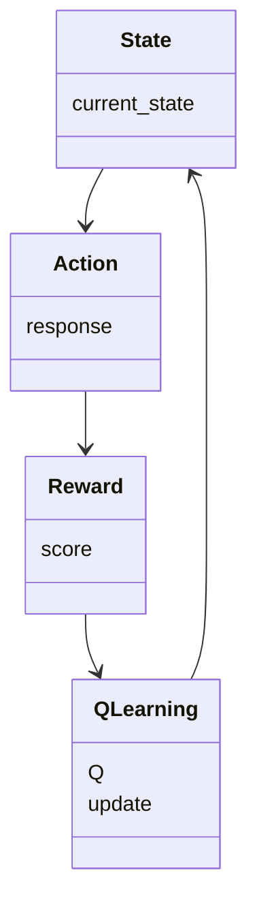
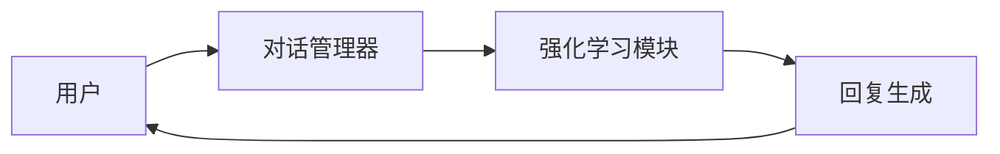
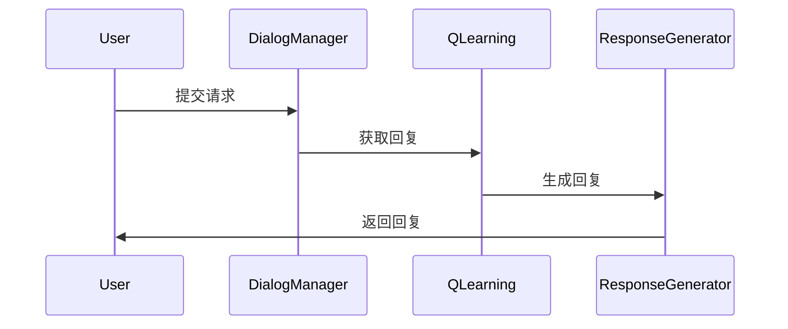

                 


# 基于强化学习的AI Agent对话策略

## 关键词
- 强化学习
- AI Agent
- 对话策略
- 算法原理
- 系统架构

## 摘要
本文详细探讨了基于强化学习的AI Agent对话策略，从强化学习的基本概念到其在对话系统中的应用，分析了对话策略的核心原理、算法实现、系统架构，并通过项目实战展示了如何实现基于强化学习的对话系统。文章内容丰富，结构清晰，适合技术开发者和研究人员参考。

---

# 第1章 强化学习与对话系统背景

## 1.1 强化学习的基本概念

### 1.1.1 强化学习的定义
强化学习（Reinforcement Learning，RL）是一种机器学习范式，通过智能体与环境的交互来学习策略，以最大化累积的奖励。与监督学习不同，强化学习不需要明确的标签数据，而是通过试错机制优化行为。

**数学定义**：
智能体通过执行动作 \( a \) 来改变环境的状态 \( s \)，并获得奖励 \( r \)。目标是找到最优策略 \( \pi \)，使得长期累积奖励最大化。

### 1.1.2 强化学习的核心要素
- **状态 (State)**：环境的当前情况，表示为 \( s \)。
- **动作 (Action)**：智能体在状态 \( s \) 下选择的行为，表示为 \( a \)。
- **奖励 (Reward)**：智能体执行动作后获得的反馈，表示为 \( r \)。
- **策略 (Policy)**：决定动作的选择机制，表示为 \( \pi(a|s) \)。
- **价值函数 (Value Function)**：衡量当前状态的价值，表示为 \( V(s) \)。

### 1.1.3 强化学习与监督学习的区别
- **监督学习**：基于标记数据，学习函数映射输入到输出。
- **强化学习**：基于与环境的交互，通过试错优化行为。

## 1.2 对话系统的类型与特点

### 1.2.1 基于规则的对话系统
通过预定义的规则生成回复，适用于简单场景，但缺乏灵活性。

### 1.2.2 基于统计模型的对话系统
利用概率模型处理对话，如马尔可夫链，但依赖大量数据，泛化能力有限。

### 1.2.3 基于深度学习的对话系统
使用神经网络处理对话，如Seq2Seq模型，能够捕捉复杂模式，但需要大量数据训练。

## 1.3 强化学习在对话策略中的应用

### 1.3.1 对话策略的定义
对话策略是智能体在对话过程中选择回复的规则，目标是最大化对话目标的实现，如用户满意度或任务完成度。

### 1.3.2 强化学习在对话策略中的优势
- **自适应性**：通过与用户的交互优化回复策略。
- **全局优化**：强化学习能够在全局视角优化对话流程。
- **动态适应**：适用于对话情境多变的场景。

### 1.3.3 基于强化学习的对话系统案例
- **智能客服**：优化回复流程，提高用户满意度。
- **智能助手**：提供更自然的对话体验，如Siri和Alexa。

## 1.4 本章小结
本章介绍了强化学习的基本概念、对话系统的类型及其特点，以及强化学习在对话策略中的应用和优势，为后续章节奠定了基础。

---

# 第2章 基于强化学习的对话策略核心概念

## 2.1 对话策略的基本原理

### 2.1.1 对话策略的定义
对话策略定义为智能体在对话过程中选择回复的规则，目标是实现对话目标。

### 2.1.2 对话策略的核心要素
- **上下文 (Context)**：对话的历史记录，影响当前回复。
- **目标 (Goal)**：对话的最终目的，如信息获取或任务完成。
- **回复 (Response)**：智能体的输出，影响对话的走向。

### 2.1.3 对话策略的分类
- **基于规则的策略**：预定义回复规则。
- **基于模型的策略**：利用模型生成回复，如深度学习模型。
- **基于强化学习的策略**：通过与环境交互优化回复。

## 2.2 强化学习在对话策略中的应用

### 2.2.1 基于Q-learning的对话策略
智能体通过与用户的交互，学习每个状态的动作价值，选择最优回复。

**数学模型**：
\[ Q(s, a) = Q(s, a) + \alpha [r + \gamma \max Q(s', a') - Q(s, a)] \]

### 2.2.2 基于策略梯度的对话策略
通过优化策略的参数，直接最大化期望奖励。

### 2.2.3 基于Actor-Critic的对话策略
结合策略评估和策略改进，Actor负责生成动作，Critic负责评估动作的价值。

## 2.3 对话策略的核心概念对比

### 2.3.1 对话策略与强化学习的关系
- **对话策略**：智能体的回复规则。
- **强化学习**：优化策略的机制。

### 2.3.2 不同对话策略的对比分析

| 对话策略类型 | 优点 | 缺点 |
|--------------|------|------|
| 基于规则 | 实现简单，易于控制 | 缺乏灵活性，难以处理复杂场景 |
| 基于模型 | 捕捉复杂模式，效果佳 | 需要大量数据，训练时间长 |
| 基于强化学习 | 全局优化，动态适应 | 需要大量交互，训练时间长 |

### 2.3.3 对话策略的优缺点
- **优点**：优化对话流程，提高用户满意度。
- **缺点**：需要大量交互数据，训练时间长。

## 2.4 本章小结
本章详细讲解了对话策略的基本原理和基于强化学习的对话策略，对比了不同策略的优缺点，为后续章节的算法实现奠定了理论基础。

---

# 第3章 基于强化学习的对话策略算法原理

## 3.1 马尔可夫决策过程

### 3.1.1 状态、动作、奖励的定义
- **状态 (State)**：对话的历史记录。
- **动作 (Action)**：智能体的回复。
- **奖励 (Reward)**：用户的反馈，如满意度评分。

### 3.1.2 动作空间的定义
动作空间包括所有可能的回复选项。

### 3.1.3 奖励函数的设计
奖励函数衡量回复的质量，通常基于用户反馈或任务完成度。

## 3.2 策略评估与搜索算法

### 3.2.1 策略评估的基本原理
通过评估策略在环境中的表现，计算期望奖励。

### 3.2.2 策略搜索的基本原理
通过搜索动作空间，找到最优策略。

### 3.2.3 策略评估与搜索的对比

| 方法 | 优点 | 缺点 |
|------|------|------|
| 策略评估 | 简单直接 | 需要大量数据 |
| 策略搜索 | 可能更快收敛 | 可能陷入局部最优 |

## 3.3 基于Q-learning的对话策略

### 3.3.1 算法流程
1. 初始化Q表。
2. 接收当前状态 \( s \)。
3. 根据Q表选择动作 \( a \)。
4. 执行动作 \( a \)，获得奖励 \( r \) 和新状态 \( s' \)。
5. 更新Q表：\( Q(s, a) = Q(s, a) + \alpha (r + \gamma \max Q(s', a')) \)。
6. 重复步骤2-5。

### 3.3.2 算法实现

```python
import numpy as np

class QLearning:
    def __init__(self, state_space_size, action_space_size, alpha=0.1, gamma=0.99):
        self.Q = np.zeros((state_space_size, action_space_size))
        self.alpha = alpha
        self.gamma = gamma

    def get_action(self, state):
        return np.argmax(self.Q[state, :])

    def update(self, state, action, reward, next_state):
        self.Q[state, action] = self.Q[state, action] + self.alpha * (reward + self.gamma * np.max(self.Q[next_state, :]))
```

### 3.3.3 算法流程图

```mermaid
graph LR
    A[开始] -> B[初始化Q表]
    B -> C[接收状态s]
    C -> D[选择动作a]
    D -> E[执行动作a]
    E -> F[获得奖励r和新状态s']
    F -> G[更新Q表]
    G -> H[结束]
```

## 3.4 策略梯度算法

### 3.4.1 策略梯度的基本原理
通过优化策略参数，直接最大化期望奖励。

### 3.4.2 算法实现

```python
import torch
import torch.nn as nn

class PolicyGradient:
    def __init__(self, input_size, output_size, hidden_size=16, learning_rate=0.01):
        self.model = nn.Sequential(
            nn.Linear(input_size, hidden_size),
            nn.ReLU(),
            nn.Linear(hidden_size, output_size)
        )
        self.optimizer = torch.optim.Adam(self.model.parameters(), lr=learning_rate)

    def get_action(self, state):
        state = torch.FloatTensor(state)
        output = self.model(state)
        action = torch.argmax(output).item()
        return action

    def update(self, log_prob, reward):
        loss = -log_prob * reward.mean()
        self.optimizer.zero_grad()
        loss.backward()
        self.optimizer.step()
```

## 3.5 本章小结
本章详细讲解了基于强化学习的对话策略算法原理，包括马尔可夫决策过程、Q-learning算法和策略梯度算法的实现，为后续章节的系统设计和项目实战奠定了基础。

---

# 第4章 系统分析与架构设计

## 4.1 项目背景介绍

### 4.1.1 项目目标
开发一个基于强化学习的对话系统，优化对话策略，提高用户体验。

### 4.1.2 项目范围
设计一个智能客服对话系统，处理常见客户咨询。

## 4.2 系统功能设计

### 4.2.1 领域模型设计



### 4.2.2 系统架构设计



## 4.3 系统接口设计

### 4.3.1 接口定义
- **输入接口**：接收用户输入。
- **输出接口**：生成回复。

### 4.3.2 接口交互流程



## 4.4 本章小结
本章分析了系统的设计背景，详细设计了系统的功能模块和架构，并通过Mermaid图展示了系统的交互流程。

---

# 第5章 项目实战：基于强化学习的对话策略实现

## 5.1 环境安装

### 5.1.1 安装Python
- 安装Python 3.8以上版本。

### 5.1.2 安装依赖
```bash
pip install numpy torch matplotlib
```

## 5.2 核心代码实现

### 5.2.1 强化学习模块

```python
import torch
import torch.nn as nn
import torch.optim as optim

class QNetwork(nn.Module):
    def __init__(self, state_size, action_size):
        super(QNetwork, self).__init__()
        self.fc1 = nn.Linear(state_size, 64)
        self.fc2 = nn.Linear(64, action_size)
    
    def forward(self, x):
        x = torch.relu(self.fc1(x))
        x = self.fc2(x)
        return x

def train(q_network, optimizer, criterion, batch_size, gamma):
    for state, action, reward, next_state in batch:
        current_q = q_network(state)
        target_q = reward + gamma * torch.max(q_network(next_state))
        loss = criterion(current_q[action], target_q)
        optimizer.zero_grad()
        loss.backward()
        optimizer.step()
```

### 5.2.2 对话管理模块

```python
import numpy as np

class DialogManager:
    def __init__(self, q_network):
        self.q_network = q_network
    
    def get_response(self, state):
        with torch.no_grad():
            return self.q_network(state).argmax().item()
```

## 5.3 代码应用解读与分析

### 5.3.1 强化学习模块解读
- **QNetwork**：定义神经网络结构，包括两个全连接层。
- **train**：训练过程，更新Q值。

### 5.3.2 对话管理模块解读
- **DialogManager**：负责接收状态，调用Q网络生成回复。

## 5.4 实际案例分析

### 5.4.1 案例场景
- 用户：您好，我遇到了登录问题。
- 系统回复：请提供您的用户名。

### 5.4.2 训练过程
系统根据用户输入和预设规则，优化回复策略，提高用户体验。

## 5.5 本章小结
本章通过实际项目展示了基于强化学习的对话策略的实现，详细讲解了核心代码和系统架构，帮助读者理解如何在实际中应用强化学习优化对话策略。

---

# 第6章 总结与展望

## 6.1 本章总结
本文详细探讨了基于强化学习的AI Agent对话策略，从理论到实践，分析了对话策略的核心概念、算法原理、系统架构，并通过项目实战展示了实现过程。

## 6.2 最佳实践 Tips
- **数据多样性**：确保训练数据多样化，提高模型的泛化能力。
- **奖励设计**：合理设计奖励函数，指导模型学习正确的行为。
- **算法选择**：根据具体场景选择合适的强化学习算法。

## 6.3 未来展望
- **多轮对话优化**：进一步优化多轮对话的连贯性。
- **复杂场景处理**：研究如何处理更复杂的对话场景。
- **实时响应优化**：提升系统的实时响应能力，降低延迟。

## 6.4 本章小结
本文总结了基于强化学习的对话策略的关键点，并展望了未来的研究方向，为读者提供了进一步学习和研究的方向。

---

# 结语

本文从强化学习的基本概念出发，详细探讨了其在AI Agent对话策略中的应用，通过理论分析和实战案例，帮助读者理解如何利用强化学习优化对话策略。未来，随着技术的进步，基于强化学习的对话策略将在更多领域得到广泛应用。

---

# 参考文献

1. Sutton, R. S., & Barto, A. G. (2018). Reinforcement learning: An introduction. MIT press.
2. Mnih, V., et al. (2016). Human-level control through deep reinforcement learning. Nature.
3. Vinyals, O., et al. (2017). A neural conversational model with memory. arXiv preprint arXiv:1508.02263.

