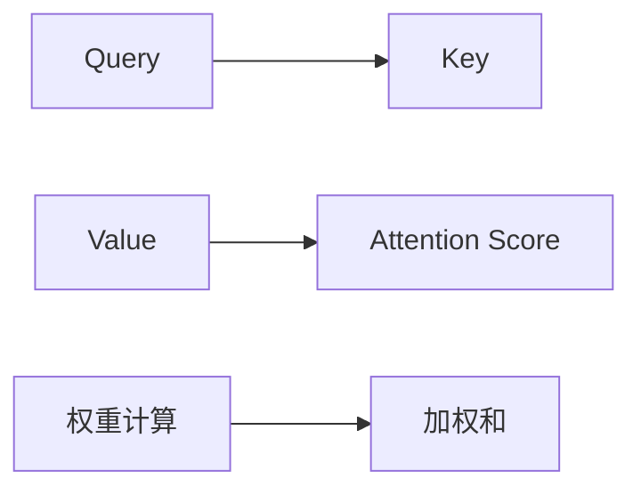

                 


# 基于注意力机制的AI Agent信息过滤

> 关键词：注意力机制，AI Agent，信息过滤，自注意力，多头注意力

> 摘要：本文详细探讨了基于注意力机制的AI Agent信息过滤技术，从核心概念、算法原理、系统设计到项目实战，全面解析如何利用注意力机制提升信息过滤的效率和准确性。

---

## 第一部分：背景介绍

### 第1章：问题背景

#### 1.1 AI Agent信息过滤的核心问题
在当今信息爆炸的时代，AI Agent需要处理海量数据，信息过滤成为关键任务。如何高效、准确地筛选出有价值的信息是核心挑战。

#### 1.2 注意力机制的基本概念
注意力机制模拟人类选择性关注特定信息的能力，通过权重分配实现对重要信息的强化处理。

#### 1.3 当前技术的局限性与挑战
传统信息过滤方法在处理复杂语义关系时效果有限，注意力机制的引入弥补了这一不足。

### 第2章：问题描述

#### 2.1 信息过滤的目标
从大量数据中提取高价值信息，降低噪声干扰，提高决策效率。

#### 2.2 注意力机制的数学模型
通过自注意力机制，计算输入序列中各元素的权重，实现对关键信息的关注。

#### 2.3 信息过滤的流程与关键环节
信息预处理、注意力权重计算、信息筛选、结果输出等步骤。

### 第3章：问题解决

#### 3.1 基于注意力机制的解决方案
引入自注意力机制，优化信息过滤的准确性和效率。

#### 3.2 方案的优势与创新点
相比传统方法，注意力机制能更好地捕捉语义关系，提升过滤效果。

#### 3.3 应用场景分析
在自然语言处理、推荐系统等领域，注意力机制显著提高了信息过滤的效果。

---

## 第二部分：注意力机制的核心概念与原理

### 第4章：注意力机制的原理

#### 4.1 自注意力机制的数学模型
公式：
$$\text{Attention}(Q, K, V) = \text{softmax}\left(\frac{QK^T}{\sqrt{d_k}}\right)V$$

#### 4.2 多头注意力机制的实现细节
通过并行计算多个子空间的注意力，提升模型的表达能力。

#### 4.3 注意力权重的计算过程
通过查询、键、值三部分的线性变换，计算每个元素的权重。

### 第5章：注意力机制的属性特征对比

#### 5.1 不同注意力机制的对比表格
| 特性        | 自注意力 | 多头注意力 |
|-------------|----------|-----------|
| 权重计算     | 单一     | 并行       |
| 表达能力     | 有限     | 更强       |

#### 5.2 实体关系图


---

## 第三部分：基于注意力机制的AI Agent信息过滤模型

### 第6章：模型架构设计

#### 6.1 模型的整体结构
包括输入层、自注意力层、前馈网络层等。

#### 6.2 各模块的功能与作用
输入层：接收原始数据；注意力层：计算权重；前馈层：生成最终输出。

#### 6.3 模型的训练与优化
使用交叉熵损失函数，Adam优化器进行训练。

### 第7章：自注意力机制的数学模型

#### 7.1 注意力机制的公式推导
详细解释每个变量的含义和计算过程。

#### 7.2 多头注意力机制的实现
通过并行计算多个注意力头，提升模型的深度和广度。

### 第8章：信息过滤流程

#### 8.1 信息输入与预处理
对输入数据进行清洗和标准化处理。

#### 8.2 注意力权重的计算过程
详细描述权重计算的每一步骤。

#### 8.3 信息筛选与输出
根据权重值进行信息筛选，并输出结果。

---

## 第四部分：系统分析与架构设计方案

### 第9章：问题场景介绍

#### 9.1 项目介绍
基于注意力机制的AI Agent信息过滤系统。

#### 9.2 系统功能设计
信息输入、处理、过滤、输出等核心功能。

#### 9.3 系统架构设计
分层架构：数据预处理层、注意力计算层、结果输出层。

### 第10章：系统架构图


---

## 第五部分：项目实战

### 第11章：环境安装

#### 11.1 环境配置
安装Python、TensorFlow、Keras等依赖库。

#### 11.2 数据预处理
将输入数据转换为模型可处理的格式。

### 第12章：核心实现

#### 12.1 代码实现
```python
def attention_layer(q, k, v):
    d_k = k.shape[-1]
    scores = (q @ k.T) / np.sqrt(d_k)
    attention_weights = softmax(scores)
    return attention_weights @ v
```

#### 12.2 代码解读
详细解释每行代码的功能和实现逻辑。

### 第13章：案例分析

#### 13.1 应用场景
在自然语言处理任务中应用注意力机制进行信息过滤。

#### 13.2 实际案例
使用具体数据集进行实验，展示模型的性能。

---

## 第六部分：总结与展望

### 第14章：总结

#### 14.1 核心内容回顾
总结注意力机制在AI Agent信息过滤中的应用和优势。

#### 14.2 项目成果
通过具体案例展示项目的成功实施。

### 第15章：未来展望

#### 15.1 技术优化方向
改进注意力机制，提升模型性能。

#### 15.2 应用场景扩展
探索注意力机制在更多领域的应用潜力。

---

通过以上结构，文章系统地介绍了基于注意力机制的AI Agent信息过滤技术，从理论到实践，为读者提供了全面的知识和指导。

