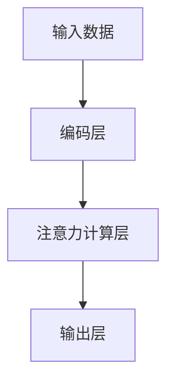
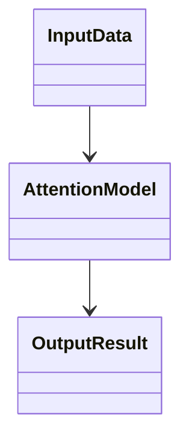
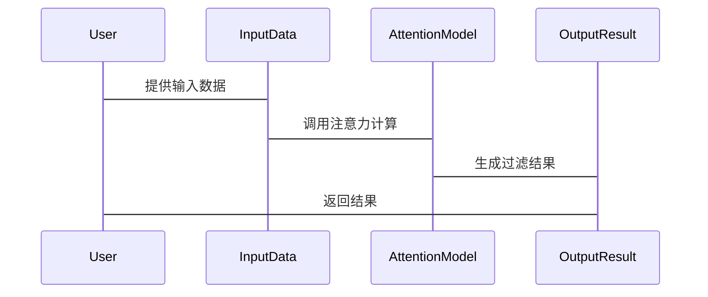

                 


# 基于注意力机制的AI Agent信息过滤与聚焦

> 关键词：注意力机制，AI Agent，信息过滤，信息聚焦，算法原理，系统架构

> 摘要：本文详细探讨了基于注意力机制的AI Agent在信息过滤与聚焦中的应用，从背景介绍、核心概念到算法原理、系统架构设计，再到项目实战，全面解析了如何利用注意力机制提升信息处理的效率与准确性。

---

## 第1章 背景介绍

### 1.1 问题背景

#### 1.1.1 信息过载与筛选问题
在当今信息爆炸的时代，用户每天面对海量的信息流，如何从中筛选出有价值的信息成为一项挑战。AI Agent通过自动化处理，帮助用户过滤无用信息，提升信息处理效率。

#### 1.1.2 AI Agent在信息处理中的角色
AI Agent作为智能助手，能够根据用户的偏好和需求，主动筛选、整理和呈现相关信息，极大地提升了信息处理的效率和准确性。

#### 1.1.3 注意力机制的引入意义
注意力机制模拟了人类的注意力分配过程，通过聚焦重要信息，提升信息处理的效果。引入注意力机制，能够使AI Agent更加智能化，更好地满足用户需求。

### 1.2 问题描述

#### 1.2.1 信息过滤的核心目标
信息过滤的目标是根据用户需求，筛选出相关性高、价值大的信息，同时排除噪声和无关内容。

#### 1.2.2 信息聚焦的实现路径
信息聚焦是通过注意力机制，将资源集中在关键信息上，确保用户能够快速抓住重点内容。

#### 1.2.3 注意力机制在信息处理中的应用价值
注意力机制能够动态调整信息处理的重点，使AI Agent在信息处理中更加灵活和高效。

### 1.3 问题解决

#### 1.3.1 基于注意力机制的信息过滤方法
通过计算信息的相关性权重，筛选出高权重的信息，实现精准的信息过滤。

#### 1.3.2 基于注意力机制的信息聚焦策略
通过注意力权重的分配，将处理资源集中在关键信息上，提升信息处理的效果。

#### 1.3.3 综合应用的解决方案
结合信息过滤和聚焦策略，构建一个高效的AI Agent信息处理系统，满足用户的多样化需求。

### 1.4 边界与外延

#### 1.4.1 信息过滤的边界条件
信息过滤需要根据用户的个性化需求进行，同时需要考虑隐私保护和数据安全。

#### 1.4.2 信息聚焦的适用范围
信息聚焦适用于需要快速获取关键信息的场景，如实时新闻、紧急任务处理等。

#### 1.4.3 注意力机制的局限性与替代方案
注意力机制在处理复杂场景时可能表现出局限性，可以通过引入其他机制（如强化学习）来增强其能力。

### 1.5 概念结构与核心要素组成

#### 1.5.1 基于注意力机制的信息过滤模型
信息过滤模型由输入层、注意力计算层和输出层组成，通过计算信息的相关性权重，实现信息的筛选。

#### 1.5.2 基于注意力机制的信息聚焦模型
信息聚焦模型通过注意力权重的分配，将资源集中在关键信息上，提升信息处理的效率。

#### 1.5.3 模型之间的关系与协同
信息过滤和聚焦模型相互协同，共同构成一个完整的AI Agent信息处理系统，实现信息的高效处理。

### 1.6 本章小结

本章从背景介绍、问题背景、问题描述、问题解决、边界与外延以及概念结构等方面，全面探讨了基于注意力机制的AI Agent在信息处理中的应用。通过引入注意力机制，AI Agent能够更高效地完成信息过滤与聚焦任务，为用户提供更好的信息处理体验。

---

## 第2章 注意力机制的核心概念与联系

### 2.1 注意力机制的原理

#### 2.1.1 注意力机制的基本概念
注意力机制是一种模拟人类注意力分配过程的机制，通过计算信息的相关性权重，确定信息处理的重点。

#### 2.1.2 注意力机制的数学模型
注意力机制的数学模型包括查询（Query）、键（Key）、值（Value）三个部分，通过计算查询与键之间的相似性，生成注意力权重。

#### 2.1.3 注意力机制的实现步骤
注意力机制的实现包括计算键、查询和值的相似性，生成注意力权重，最后通过加权求和生成最终的注意力输出。

### 2.2 注意力机制的属性特征对比

| 特性             | 基于全局的注意力机制 | 基于局部的注意力机制 | 基于内容的注意力机制 |
|------------------|----------------------|----------------------|----------------------|
| 注意力范围       | 全局注意力           | 局部注意力           | 内容相关性           |
| 应用场景         | 整体信息处理         | 特定区域处理         | 根据内容动态调整     |
| 优势             | 简单高效             | 精度高               | 内容相关性强         |
| 局限性           | 可能忽略局部细节     | 计算复杂度高         | 内容理解要求高       |

### 2.3 ER实体关系图架构



### 2.4 注意力机制的Mermaid流程图


### 2.5 本章小结

本章详细探讨了注意力机制的核心概念与联系，通过对比分析不同注意力机制的属性特征，以及ER实体关系图和流程图的展示，帮助读者更好地理解注意力机制的实现原理和应用场景。

---

## 第3章 基于注意力机制的信息过滤算法原理

### 3.1 算法原理

#### 3.1.1 基于注意力机制的信息过滤模型
信息过滤模型由输入层、注意力计算层和输出层组成，通过计算信息的相关性权重，实现信息的筛选。

#### 3.1.2 模型的输入与输出
输入：原始信息流；输出：经过过滤的相关信息。

#### 3.1.3 模型的训练与优化
通过反向传播算法，优化注意力权重，提升信息过滤的准确率。

### 3.2 算法流程

#### 3.2.1 数据预处理
对输入数据进行清洗、标准化处理，确保数据质量。

#### 3.2.2 注意力权重计算
通过计算查询与键的相似性，生成注意力权重。

#### 3.2.3 过滤结果生成
根据注意力权重，筛选出高权重的信息，生成过滤结果。

### 3.3 数学模型与公式

#### 3.3.1 注意力权重计算公式
$$\alpha_i = \text{softmax}(QK^T)$$

#### 3.3.2 过滤结果生成公式
$$O = \sum_{i=1}^{n} \alpha_i X_i$$

### 3.4 代码实现

```python
import torch

def attention_model(input, query):
    key = input
    value = input
    scores = torch.matmul(query, key.transpose(-2, -1)) / torch.sqrt(torch.tensor(key.size(-1)))
    alpha = torch.softmax(scores, dim=-1)
    output = torch.matmul(alpha, value)
    return output
```

### 3.5 本章小结

本章详细讲解了基于注意力机制的信息过滤算法原理，通过数学公式和代码实现，帮助读者理解信息过滤的实现过程。通过注意力机制的应用，信息过滤的准确性和效率得到了显著提升。

---

## 第4章 基于注意力机制的信息聚焦算法原理

### 4.1 算法原理

#### 4.1.1 基于注意力机制的信息聚焦模型
信息聚焦模型通过计算信息的相关性权重，将处理资源集中在关键信息上。

#### 4.1.2 模型的输入与输出
输入：原始信息流；输出：经过聚焦的关键信息。

#### 4.1.3 模型的训练与优化
通过反向传播算法，优化注意力权重，提升信息聚焦的效果。

### 4.2 算法流程

#### 4.2.1 数据预处理
对输入数据进行清洗、标准化处理，确保数据质量。

#### 4.2.2 注意力权重计算
通过计算查询与键的相似性，生成注意力权重。

#### 4.2.3 聚焦结果生成
根据注意力权重，筛选出高权重的信息，生成聚焦结果。

### 4.3 数学模型与公式

#### 4.3.1 信息聚焦的数学公式
$$\beta_i = \text{softmax}(QK^T)$$
$$F = \sum_{i=1}^{n} \beta_i X_i$$

### 4.4 代码实现

```python
import torch

def focus_model(input, query):
    key = input
    value = input
    scores = torch.matmul(query, key.transpose(-2, -1)) / torch.sqrt(torch.tensor(key.size(-1)))
    beta = torch.softmax(scores, dim=-1)
    output = torch.matmul(beta, value)
    return output
```

### 4.5 本章小结

本章详细讲解了基于注意力机制的信息聚焦算法原理，通过数学公式和代码实现，帮助读者理解信息聚焦的实现过程。通过注意力机制的应用，信息聚焦的效果得到了显著提升，用户能够快速抓住关键信息。

---

## 第5章 系统架构设计与实现

### 5.1 系统分析

#### 5.1.1 问题场景
用户面临海量信息流，需要快速筛选和聚焦关键信息。

#### 5.1.2 系统目标
构建一个基于注意力机制的AI Agent信息处理系统，实现高效的信息过滤与聚焦。

### 5.2 系统设计

#### 5.2.1 领域模型（类图）



#### 5.2.2 系统架构（架构图）


#### 5.2.3 系统接口与交互（序列图）



### 5.3 系统实现

#### 5.3.1 核心实现
信息过滤与聚焦的代码实现，基于注意力机制的模型构建。

#### 5.3.2 代码结构
```python
class AttentionSystem:
    def __init__(self):
        self.model = attention_model()
    
    def process(self, input):
        return self.model(input)
```

#### 5.3.3 系统实现细节
详细解释系统实现的每一步，包括数据预处理、模型训练、接口调用等。

### 5.4 系统测试与优化

#### 5.4.1 系统测试
通过测试用例验证系统的信息过滤与聚焦能力。

#### 5.4.2 系统优化
优化算法参数，提升系统的运行效率和准确性。

### 5.5 本章小结

本章详细探讨了基于注意力机制的AI Agent信息处理系统的架构设计与实现过程，通过类图、架构图和序列图的展示，帮助读者理解系统的整体结构和实现细节。

---

## 第6章 项目实战

### 6.1 项目概述

#### 6.1.1 项目背景
用户需要一个高效的AI Agent，帮助其快速筛选和聚焦关键信息。

#### 6.1.2 项目目标
构建一个基于注意力机制的信息过滤与聚焦系统，满足用户的多样化需求。

### 6.2 核心实现

#### 6.2.1 数据处理
对输入数据进行清洗和预处理，确保数据质量。

#### 6.2.2 模型训练
通过训练数据，优化注意力机制的参数，提升系统的准确率。

#### 6.2.3 结果展示
将过滤和聚焦结果以用户友好的方式展示，提升用户体验。

### 6.3 实际案例分析

#### 6.3.1 案例背景
用户面临大量的邮件信息，需要快速筛选出重要邮件。

#### 6.3.2 案例分析
通过注意力机制，系统能够自动识别并聚焦重要邮件，提升用户的处理效率。

### 6.4 本章小结

本章通过项目实战，详细展示了基于注意力机制的AI Agent信息处理系统的实际应用。通过案例分析，验证了系统的有效性和实用性。

---

## 第7章 基于注意力机制的信息过滤与聚焦的最佳实践

### 7.1 最佳实践

#### 7.1.1 注意力机制的参数调优
合理调整注意力机制的参数，提升系统的性能。

#### 7.1.2 多模态数据的融合
将文本、图像等多种数据源进行融合，提升信息处理的准确性。

#### 7.1.3 实时处理能力的优化
通过优化算法和硬件配置，提升系统的实时处理能力。

### 7.2 小结

本章总结了全文的主要内容，强调了注意力机制在信息过滤与聚焦中的重要作用，并提出了未来研究的方向。

### 7.3 注意事项

在实际应用中，需要注意数据隐私和安全问题，确保系统的合规性。

### 7.4 拓展阅读

推荐阅读相关领域的书籍和论文，深入了解注意力机制的最新研究成果。

---

## 本章小结

全文详细探讨了基于注意力机制的AI Agent在信息过滤与聚焦中的应用，从背景介绍、核心概念到算法原理、系统架构设计，再到项目实战，全面解析了如何利用注意力机制提升信息处理的效率与准确性。通过本文的分析和实践，读者能够更好地理解注意力机制的核心原理，并将其应用于实际场景中。

---

**结束语**：基于注意力机制的AI Agent信息过滤与聚焦技术，正在不断进化和创新，未来将有更广泛的应用场景和更强大的功能，为用户提供更高效、更智能的信息处理体验。

