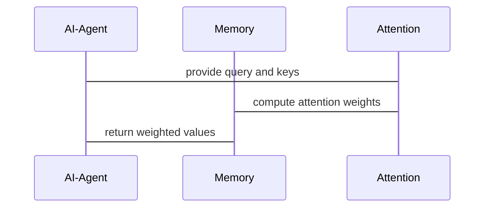

                 


# 基于注意力机制的AI Agent长期记忆管理

## 关键词：注意力机制，AI Agent，长期记忆管理，自注意力，深度学习

## 摘要：本文详细探讨了基于注意力机制的AI Agent长期记忆管理方法，从背景、核心概念、算法原理、系统架构到项目实战，全面解析如何利用注意力机制提升AI Agent的记忆管理能力。通过对比分析、数学模型和实际案例，深入浅出地展示了注意力机制在长期记忆管理中的应用及其优势。

---

# 第1章: 背景介绍

## 1.1 问题背景

### 1.1.1 AI Agent的基本概念

AI Agent（人工智能代理）是指能够感知环境、自主决策并执行任务的智能实体。AI Agent广泛应用于自然语言处理、机器人控制、自动驾驶等领域，其核心能力之一是记忆管理。

### 1.1.2 长期记忆管理的重要性

AI Agent需要处理大量信息，并在任务执行过程中保持对过去信息的记忆。长期记忆管理是AI Agent持续学习和自适应的基础，能够帮助其在复杂环境中做出更智能的决策。

### 1.1.3 注意力机制在记忆管理中的作用

注意力机制是一种模拟人类注意力的选择性关注机制，能够在信息处理中突出重要信息，抑制无关信息。在长期记忆管理中，注意力机制能够帮助AI Agent更高效地存储、检索和更新记忆。

## 1.2 问题描述

### 1.2.1 长期记忆管理的核心挑战

- **信息冗余**：AI Agent处理的信息量庞大，如何筛选出重要信息是关键。
- **信息关联性**：长期记忆中的信息可能存在复杂的关联性，如何有效组织和检索是难点。
- **动态更新**：随着环境的变化，记忆需要动态更新，这对记忆管理的实时性和准确性提出了挑战。

### 1.2.2 注意力机制如何解决记忆管理问题

注意力机制能够根据当前任务或环境需求，动态调整对不同信息的关注程度，从而优化记忆存储和检索效率。

### 1.2.3 长期记忆管理的边界与外延

长期记忆管理不仅包括信息的存储和检索，还包括信息的组织、更新和删除。注意力机制在这些过程中起到关键作用，帮助AI Agent更好地管理其长期记忆。

## 1.3 问题解决

### 1.3.1 注意力机制的基本原理

注意力机制通过计算信息的相关性权重，选择性关注重要信息，忽略次要信息。

### 1.3.2 长期记忆管理的实现方法

- **基于注意力机制的记忆存储**：通过注意力权重决定信息的重要性，优先存储重要信息。
- **基于注意力机制的记忆检索**：根据当前任务需求，检索相关记忆。
- **基于注意力机制的记忆更新**：动态调整记忆内容，适应环境变化。

### 1.3.3 问题解决的步骤与流程

1. **信息预处理**：对输入信息进行特征提取和表示。
2. **注意力权重计算**：计算信息之间的相关性权重。
3. **记忆存储**：根据注意力权重存储重要信息。
4. **记忆检索**：根据当前任务需求，检索相关记忆。
5. **记忆更新**：动态调整记忆内容，保持长期记忆的有效性。

## 1.4 核心概念结构与组成

### 1.4.1 AI Agent的组成要素

- **感知器**：感知环境信息。
- **决策器**：根据感知信息做出决策。
- **执行器**：执行决策动作。
- **记忆器**：存储和管理长期记忆。

### 1.4.2 注意力机制的组成部分

- **查询（Query）**：表示当前任务需求。
- **键（Key）**：表示输入信息的特征。
- **值（Value）**：表示输入信息的内容。

### 1.4.3 长期记忆管理的系统架构

- **输入层**：接收外部输入信息。
- **注意力层**：计算注意力权重。
- **存储层**：存储长期记忆。
- **检索层**：根据需求检索记忆。
- **更新层**：动态更新记忆内容。

---

# 第2章: 核心概念与联系

## 2.1 注意力机制的原理

### 2.1.1 注意力机制的数学模型

注意力机制的核心思想是通过计算信息的相关性权重，选择性关注重要信息。数学模型如下：

$$
\text{Attention}(q, k, v) = \text{softmax}\left(\frac{q \cdot k}{\sqrt{d}}\right) \cdot v
$$

其中，\( q \) 是查询向量，\( k \) 是键向量，\( v \) 是值向量，\( d \) 是向量维度。

### 2.1.2 注意力机制的计算流程

1. **计算键值对**：将输入信息转换为键和值。
2. **计算注意力权重**：通过点积计算注意力权重。
3. **加权求和**：根据注意力权重对值向量进行加权求和，得到最终的注意力输出。

### 2.1.3 注意力机制的优缺点对比

| 特性       | 优点                       | 缺点                       |
|------------|----------------------------|----------------------------|
| **计算效率** | 计算效率高                 | 参数量较大                 |
| **适用场景** | 适用于序列数据处理         | 对长序列计算效率较低       |

---

## 2.2 长期记忆管理的实现方法

### 2.2.1 基于注意力机制的记忆存储

通过注意力机制筛选重要信息，优先存储关键内容。

### 2.2.2 基于注意力机制的记忆检索

根据当前任务需求，检索相关记忆内容，提高检索效率。

### 2.2.3 基于注意力机制的记忆更新

动态调整记忆内容，保持记忆的有效性和相关性。

### 2.2.4 对比分析

| 方法               | 优点                       | 缺点                       |
|--------------------|----------------------------|----------------------------|
| **传统方法**       | 实现简单                   | 记忆检索效率低             |
| **注意力机制方法** | 检索效率高                 | 实现复杂                   |

---

## 2.3 核心概念对比分析

### 2.3.1 不同注意力机制的对比表格

| 机制类型       | 描述                       | 优点                       | 缺点                       |
|----------------|----------------------------|----------------------------|----------------------------|
| **点积注意力**   | 基于点积计算注意力权重       | 计算简单                   | 对长序列效率较低           |
| **自注意力机制** | 基于序列内部的相互关系     | 适合长序列数据             | 参数量较大                 |
| **多头注意力机制**| 通过多头机制提高表达能力   | 表达能力强                 | 计算复杂                   |

### 2.3.2 注意力机制与传统记忆管理的对比分析

| 特性               | 注意力机制                 | 传统记忆管理               |
|--------------------|----------------------------|----------------------------|
| **灵活性**         | 高                        | 低                        |
| **效率**           | 高                        | 低                        |
| **适应性**         | 强                        | 弱                        |

### 2.3.3 长期记忆管理与短期记忆管理的对比分析

| 特性               | 长期记忆管理               | 短期记忆管理               |
|--------------------|----------------------------|----------------------------|
| **存储时间**       | 长时间存储                 | 短时间存储                 |
| **存储容量**       | 较大                      | 较小                      |
| **更新频率**       | 低                       | 高                       |

---

# 第3章: 注意力机制的算法原理

## 3.1 注意力机制的数学模型

### 3.1.1 点积注意力模型

点积注意力模型是最简单的注意力机制，计算公式如下：

$$
\text{score}(i, j) = q_i \cdot k_j
$$

其中，\( q_i \) 是查询向量，\( k_j \) 是键向量。

### 3.1.2 自注意力机制的计算公式

自注意力机制的计算公式如下：

$$
\text{Attention}(Q, K, V) = \text{softmax}\left(\frac{Q K^T}{\sqrt{d}}\right) V
$$

其中，\( Q \) 是查询矩阵，\( K \) 是键矩阵，\( V \) 是值矩阵。

### 3.1.3 多头注意力机制的实现原理

多头注意力机制通过并行计算多个注意力头，提高模型的表达能力。其计算公式如下：

$$
\text{Multi-Head}(Q, K, V) = \text{Concat}(\text{Attention}_1(Q, K, V), \text{Attention}_2(Q, K, V), \dots, \text{Attention}_n(Q, K, V))
$$

其中，\( n \) 是注意力头的数量。

## 3.2 注意力机制的算法流程

### 3.2.1 输入序列的处理流程

1. **输入序列**：接收输入序列 \( X \)。
2. **计算键、查询和值**：将输入序列转换为键 \( K \)、查询 \( Q \) 和值 \( V \)。
3. **计算注意力权重**：通过点积计算注意力权重。
4. **加权求和**：根据注意力权重对值向量进行加权求和，得到最终的注意力输出。

### 3.2.2 注意力权重计算的步骤

1. **计算点积**：计算查询与键的点积。
2. **计算 softmax**：将点积结果进行 softmax 计算，得到注意力权重。
3. **加权求和**：将注意力权重与值向量相乘并求和，得到最终的注意力输出。

### 3.2.3 注意力机制的 Python 实现

```python
import numpy as np

def compute_attention(Q, K, V):
    # 计算点积
    scores = np.dot(Q, K.T)
    # 计算 softmax
    scores = np.exp(scores / np.sqrt(Q.shape[1])) / np.sum(np.exp(scores / np.sqrt(Q.shape[1])), axis=1, keepdims=True)
    # 加权求和
    output = np.dot(scores, V)
    return output

# 示例输入
Q = np.random.randn(1, 5, 5)
K = np.random.randn(1, 5, 5)
V = np.random.randn(1, 5, 5)

# 计算注意力
output = compute_attention(Q[0], K[0], V[0])
print("Attention output:", output)
```

---

# 第4章: 长期记忆管理的系统分析与架构设计

## 4.1 系统问题场景介绍

### 4.1.1 长期记忆管理的典型场景

AI Agent在处理复杂任务时，需要结合历史信息和当前信息，做出更智能的决策。

### 4.1.2 注意力机制在系统中的应用

注意力机制帮助AI Agent选择性关注重要信息，优化记忆存储和检索效率。

### 4.1.3 系统设计的目标与约束

系统设计目标是实现高效的长期记忆管理，提高AI Agent的智能性和适应性。

## 4.2 系统功能设计

### 4.2.1 领域模型设计（Mermaid类图）

```mermaid
classDiagram
    class AI-Agent {
        +memory: Memory
        +attention: Attention
        +decision: Decision
        +execute: Execute
    }
    class Memory {
        +storage: Storage
        +retrieval: Retrieval
        +update: Update
    }
    class Attention {
        +computeAttention(Q, K, V): Output
    }
    AI-Agent -> Memory: uses
    Memory -> Storage: store
    Memory -> Retrieval: retrieve
    Memory -> Update: update
```

### 4.2.2 系统功能模块划分

- **输入处理模块**：接收外部输入信息。
- **注意力计算模块**：计算注意力权重。
- **记忆存储模块**：存储长期记忆。
- **记忆检索模块**：检索相关记忆。
- **记忆更新模块**：动态更新记忆内容。

### 4.2.3 功能模块之间的交互关系

1. 输入处理模块接收外部输入信息。
2. 注意力计算模块根据输入信息计算注意力权重。
3. 记忆存储模块根据注意力权重存储重要信息。
4. 记忆检索模块根据当前任务需求检索相关记忆。
5. 记忆更新模块动态调整记忆内容，保持记忆的有效性。

## 4.3 系统架构设计

### 4.3.1 系统架构图（Mermaid架构图）


### 4.3.2 模块之间的接口设计

- **输入处理模块**与**注意力计算模块**通过查询和键值对进行交互。
- **注意力计算模块**与**记忆存储模块**通过注意力权重进行交互。
- **记忆检索模块**与**记忆存储模块**通过检索请求进行交互。
- **记忆更新模块**与**记忆存储模块**通过更新请求进行交互。

### 4.3.3 系统交互流程（Mermaid序列图）



---

# 第5章: 项目实战

## 5.1 环境安装与配置

### 5.1.1 开发环境的选择

建议使用Python 3.6以上版本，推荐使用Anaconda或virtualenv管理虚拟环境。

### 5.1.2 依赖库的安装

安装必要的依赖库，如numpy、tensorflow、pytorch等。

### 5.1.3 环境配置与验证

配置开发环境，验证安装是否成功。

## 5.2 核心代码实现

### 5.2.1 注意力机制的实现

```python
import numpy as np

def compute_attention(Q, K, V):
    # 计算点积
    scores = np.dot(Q, K.T)
    # 计算 softmax
    scores = np.exp(scores / np.sqrt(Q.shape[1])) / np.sum(np.exp(scores / np.sqrt(Q.shape[1])), axis=1, keepdims=True)
    # 加权求和
    output = np.dot(scores, V)
    return output

# 示例输入
Q = np.random.randn(1, 5, 5)
K = np.random.randn(1, 5, 5)
V = np.random.randn(1, 5, 5)

# 计算注意力
output = compute_attention(Q[0], K[0], V[0])
print("Attention output:", output)
```

### 5.2.2 长期记忆管理的实现

```python
class MemoryManager:
    def __init__(self):
        self.storage = {}

    def store(self, key, value):
        self.storage[key] = value

    def retrieve(self, key):
        return self.storage.get(key, None)

    def update(self, key, value):
        self.storage[key] = value
```

### 5.2.3 系统功能的实现

```python
class AI-Agent:
    def __init__(self):
        self.memory = MemoryManager()
        self.attention = AttentionMechanism()

    def process_input(self, input_data):
        # 计算注意力
        attention_output = self.attention.compute_attention(input_data)
        # 存储记忆
        self.memory.store(input_data, attention_output)
        # 检索记忆
        retrieved_memory = self.memory.retrieve(input_data)
        # 更新记忆
        self.memory.update(input_data, retrieved_memory)
```

## 5.3 代码应用解读与分析

### 5.3.1 核心代码的功能分析

- **compute_attention**函数实现了注意力机制的核心计算。
- **MemoryManager**类实现了长期记忆的存储、检索和更新功能。
- **AI-Agent**类实现了AI Agent的核心功能，包括输入处理、注意力计算、记忆管理和更新。

### 5.3.2 代码运行与结果分析

运行代码，观察输出结果，分析注意力机制在长期记忆管理中的应用效果。

## 5.4 实际案例分析和详细讲解剖析

### 5.4.1 案例分析

假设AI Agent需要处理一个自然语言理解任务，输入是一段文本，AI Agent需要利用注意力机制选择性关注重要词汇，存储长期记忆，并根据当前任务需求检索相关记忆。

### 5.4.2 详细讲解剖析

通过具体案例，详细讲解注意力机制在长期记忆管理中的应用过程，包括输入处理、注意力计算、记忆存储、记忆检索和记忆更新的详细步骤。

## 5.5 项目小结

通过项目实战，验证了基于注意力机制的长期记忆管理方法的有效性，展示了如何将理论应用于实际场景，提高了AI Agent的智能性和适应性。

---

# 第6章: 最佳实践、小结、注意事项和拓展阅读

## 6.1 最佳实践

- **合理选择注意力机制类型**：根据具体任务需求选择合适的注意力机制。
- **优化参数设置**：通过实验优化注意力机制的参数设置，提高性能。
- **结合其他技术**：将注意力机制与其他技术结合，提升AI Agent的整体性能。

## 6.2 小结

本文详细探讨了基于注意力机制的AI Agent长期记忆管理方法，从背景、核心概念、算法原理、系统架构到项目实战，全面解析了如何利用注意力机制提升AI Agent的记忆管理能力。

## 6.3 注意事项

- **计算效率**：注意优化计算效率，避免资源浪费。
- **数据安全**：保护长期记忆中的敏感信息，确保数据安全。
- **模型泛化能力**：注意模型的泛化能力，避免过拟合。

## 6.4 拓展阅读

- **多头注意力机制**：深入研究多头注意力机制的原理和应用。
- **Transformer架构**：学习Transformer架构的核心思想和应用场景。
- **深度学习前沿技术**：关注深度学习领域的最新研究和进展。

---

# 结语

通过本文的详细讲解，读者可以全面了解基于注意力机制的AI Agent长期记忆管理方法，掌握其核心原理和实际应用。希望本文能够为相关领域的研究和实践提供有价值的参考和指导。

