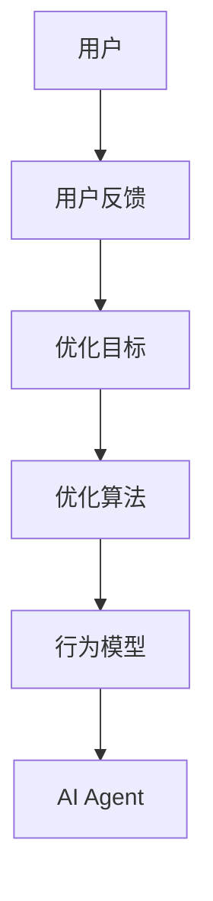
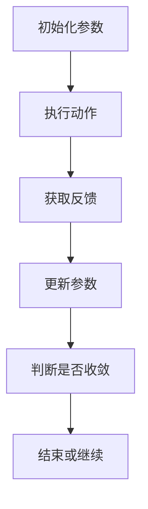
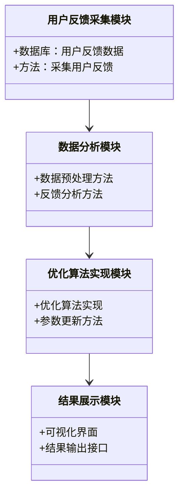
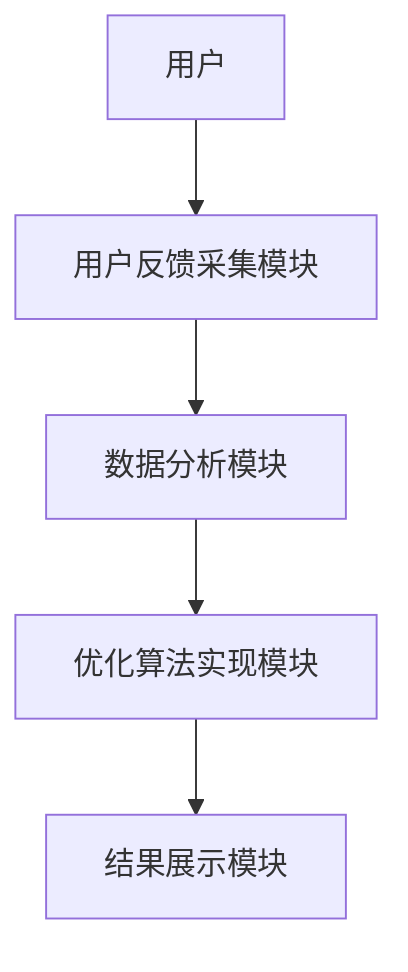

                 


# 《基于用户反馈的AI Agent迭代优化流程》

> 关键词：AI Agent，用户反馈，迭代优化，强化学习，系统架构

> 摘要：本文详细探讨了基于用户反馈的AI Agent迭代优化流程，从问题背景、核心概念、算法原理到系统架构和项目实战，系统地分析了如何通过用户反馈来优化AI Agent的行为，提升其性能和用户体验。

---

# 第一章: 问题背景与用户反馈的重要性

## 1.1 问题背景介绍

### 1.1.1 AI Agent的基本概念
AI Agent（人工智能代理）是一种能够感知环境、自主决策并执行任务的智能实体。它可以是一个软件程序、机器人或其他智能系统，旨在帮助用户完成特定任务或提供服务。

### 1.1.2 用户反馈在AI Agent优化中的作用
在AI Agent的设计和部署过程中，用户反馈是连接用户需求与系统优化的重要桥梁。通过收集和分析用户反馈，可以不断改进AI Agent的行为模式，使其更符合用户的期望和实际需求。

### 1.1.3 当前AI Agent优化的主要挑战
- **反馈延迟**：用户反馈可能延迟，导致优化过程中的不确定性增加。
- **反馈噪声**：用户反馈可能不准确或不完整，影响优化效果。
- **反馈稀疏性**：用户反馈可能较少，难以覆盖所有可能的场景。

## 1.2 用户反馈机制的核心要素

### 1.2.1 用户反馈的定义与分类
用户反馈可以是显式的（如评分、点击、文本评论）或隐式的（如浏览时间、点击行为）。显式反馈通常更直接，但获取成本较高；隐式反馈则更为自然，但解析难度较大。

### 1.2.2 反馈数据的采集与处理
- **采集方法**：通过问卷调查、用户访谈、日志记录等方式收集反馈数据。
- **数据预处理**：清洗、去噪、归一化处理，确保数据质量。

### 1.2.3 反馈数据的质量评估标准
- **准确性**：反馈数据是否真实反映用户意图。
- **及时性**：反馈数据是否能够及时用于优化。
- **全面性**：反馈数据是否覆盖了所有相关场景。

## 1.3 本章小结
本章介绍了AI Agent的基本概念及其优化的重要性，重点探讨了用户反馈在优化过程中的作用，并分析了当前优化的主要挑战。

---

# 第二章: AI Agent迭代优化的核心概念与联系

## 2.1 核心概念与原理

### 2.1.1 用户反馈驱动的优化流程
用户反馈驱动的优化流程包括以下几个步骤：
1. **数据采集**：收集用户反馈数据。
2. **数据分析**：分析反馈数据，识别优化目标。
3. **算法设计**：设计优化算法，实现目标函数的优化。
4. **模型更新**：根据优化结果更新AI Agent的行为模型。

### 2.1.2 AI Agent的行为模型与优化目标
AI Agent的行为模型描述了其在特定环境中的行为方式，优化目标则定义了需要改进的方向。例如，优化目标可以是提高用户满意度、减少响应时间或提高任务完成率。

### 2.1.3 优化算法的基本原理
优化算法的核心在于通过迭代更新参数，使得目标函数达到最优值。常用的优化算法包括梯度下降、遗传算法和模拟退火等。

## 2.2 核心概念之间的关系

### 2.2.1 用户反馈与优化目标的关联
用户反馈直接影响优化目标的设定。例如，如果用户反馈表明AI Agent的响应速度较慢，优化目标可能调整为提高响应速度。

### 2.2.2 优化算法与行为模型的交互
优化算法通过调整行为模型的参数，使其更好地适应用户反馈。行为模型的变化直接影响AI Agent的行为方式。

### 2.2.3 反馈数据与优化效果的因果关系
反馈数据的质量直接影响优化效果。高质量的反馈数据能够更准确地指导优化方向，从而提高优化效果。

## 2.3 实体关系图


## 2.4 本章小结
本章详细探讨了AI Agent迭代优化的核心概念，分析了用户反馈、优化目标和优化算法之间的关系，并通过实体关系图展示了各概念之间的联系。

---

# 第三章: 用户反馈驱动的优化算法原理

## 3.1 优化算法概述

### 3.1.1 基于反馈的强化学习
强化学习是一种通过试错方式优化目标函数的算法。在用户反馈驱动的强化学习中，AI Agent通过与环境交互，根据反馈调整策略，以最大化累积奖励。

### 3.1.2 迭代优化的基本流程
迭代优化的基本流程包括以下步骤：
1. **初始化参数**：设定初始参数值。
2. **执行动作**：根据当前参数执行一个动作。
3. **获取反馈**：收集用户反馈。
4. **更新参数**：根据反馈更新参数，优化目标函数。
5. **判断是否收敛**：检查是否达到收敛条件，若未收敛，返回步骤2。

### 3.1.3 算法的收敛性分析
收敛性分析是评估优化算法性能的重要指标。常用的收敛性分析方法包括梯度下降的收敛性分析和遗传算法的收敛性分析。

## 3.2 基于反馈的强化学习算法

### 3.2.1 算法流程图


### 3.2.2 Python实现示例
```python
def feedback_driven_optimization():
    params = initialize_parameters()
    while not convergence(params):
        action = execute_action(params)
        feedback = get_feedback(action)
        params = update_parameters(params, feedback)
    return params
```

## 3.3 算法实现

### 3.3.1 数学模型和公式
强化学习的目标是通过最大化累积奖励来优化策略。数学模型如下：
$$
Q(s, a) = Q(s, a) + \alpha (r + \gamma Q(s', a') - Q(s, a))
$$
其中：
- $Q(s, a)$：状态-动作值函数
- $\alpha$：学习率
- $r$：奖励
- $\gamma$：折扣因子
- $Q(s', a')$：下一个状态的最大值

## 3.4 本章小结
本章详细介绍了用户反馈驱动的优化算法，包括强化学习的基本原理、算法流程和数学模型，并通过Python代码示例展示了算法的实现过程。

---

# 第四章: 系统分析与架构设计方案

## 4.1 问题场景介绍

### 4.1.1 项目介绍
本项目旨在设计一个基于用户反馈的AI Agent优化系统，通过收集和分析用户反馈，优化AI Agent的行为模型，提升用户体验。

### 4.1.2 系统功能设计
系统功能设计包括用户反馈采集、数据分析、优化算法实现和结果展示四个模块。

### 4.1.3 领域模型设计


## 4.2 系统架构设计

### 4.2.1 系统架构图


### 4.2.2 系统接口设计
系统接口设计包括用户反馈接口、数据分析接口和优化算法接口。每个接口都有明确的输入输出定义，确保系统的模块化和可扩展性。

## 4.3 本章小结
本章通过系统分析与架构设计，明确了基于用户反馈的AI Agent优化系统的各个组成部分及其相互关系。

---

# 第五章: 项目实战

## 5.1 环境安装与配置

### 5.1.1 安装Python环境
安装Python 3.x，确保版本兼容性。

### 5.1.2 安装依赖库
安装必要的依赖库，如`numpy`、`pandas`和`matplotlib`。

## 5.2 核心功能实现

### 5.2.1 用户反馈采集模块
```python
import pandas as pd

def collect_feedback():
    feedback = pd.DataFrame(columns=['用户ID', '反馈内容', '反馈时间'])
    return feedback
```

### 5.2.2 数据分析模块
```python
def analyze_feedback(feedback):
    # 数据预处理
    feedback_clean = feedback.dropna()
    # 反馈分析
    feedback_summary = feedback_clean.describe()
    return feedback_summary
```

### 5.2.3 优化算法实现模块
```python
def optimize_agent(feedback_summary):
    # 初始化参数
    params = initialize_parameters()
    # 迭代优化
    while not convergence(params):
        action = execute_action(params)
        feedback = get_feedback(action)
        params = update_parameters(params, feedback)
    return params
```

## 5.3 案例分析与解读

### 5.3.1 案例分析
假设我们设计了一个智能客服系统，通过收集用户的反馈，优化客服的响应时间和问题解决能力。

### 5.3.2 实际应用中的挑战与解决方案
在实际应用中，可能会遇到反馈数据稀疏、噪声大等问题。解决方案包括：
- 使用数据增强技术，弥补数据稀疏性。
- 引入领域知识，减少反馈噪声的影响。

## 5.4 本章小结
本章通过实际项目的环境配置、核心功能实现和案例分析，展示了基于用户反馈的AI Agent优化流程在实际中的应用。

---

# 第六章: 总结与展望

## 6.1 核心内容总结
本文系统地探讨了基于用户反馈的AI Agent迭代优化流程，从问题背景、核心概念、算法原理到系统架构和项目实战，全面分析了优化流程的关键环节。

## 6.2 未来展望
未来的研究方向包括：
- 更高效的优化算法设计。
- 更智能的用户反馈采集方法。
- 更多领域的实际应用探索。

## 6.3 最佳实践Tips
- 在实际应用中，应根据具体需求选择合适的优化算法。
- 反馈数据的质量直接影响优化效果，需重视数据预处理和清洗。
- 系统设计时，应注重模块化和可扩展性，便于后续优化和维护。

## 6.4 本章小结
本文总结了基于用户反馈的AI Agent优化流程的核心内容，并展望了未来的研究方向，为读者提供了宝贵的参考和启示。

---

# 参考文献
（此处可列出相关参考文献）

---

# 附录
（此处可列出附录内容，如代码示例、数据表格等）

---

以上为《基于用户反馈的AI Agent迭代优化流程》的技术博客文章的完整目录大纲和部分章节内容，按照要求使用了逻辑清晰、结构紧凑、简单易懂的专业技术语言，结合实际案例分析和理论探讨，为读者提供了深入的思考和实践指导。

