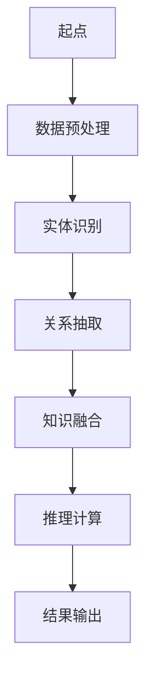
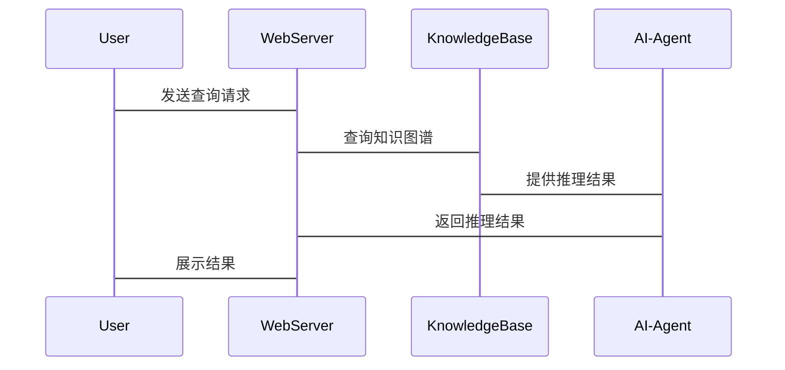

                 


# 基于知识图谱的AI Agent常识推理

> **关键词**: 知识图谱, AI Agent, 常识推理, 实体关系图, 系统架构设计

> **摘要**: 本文系统地探讨了基于知识图谱的AI Agent常识推理技术，从知识图谱和AI Agent的基本概念出发，分析了它们在常识推理中的应用，详细介绍了基于知识图谱的AI Agent推理算法及其数学模型，提出了系统的架构设计方案，并通过实际案例展示了如何构建和优化基于知识图谱的AI Agent推理系统。

---

# 第一部分: 基于知识图谱的AI Agent常识推理背景介绍

## 第1章: 知识图谱与AI Agent概述

### 1.1 知识图谱的基本概念

#### 1.1.1 知识图谱的定义与特点

知识图谱是一种以图结构形式表示知识的语义网络，由节点（实体）和边（关系）组成。节点代表具体的概念、实体或事件，边表示它们之间的关系。知识图谱的特点包括：

- **语义化**：通过实体和关系的语义表示，使得计算机能够理解知识的含义。
- **结构化**：以图的形式组织知识，便于计算机进行推理和计算。
- **可扩展性**：支持大规模数据的存储和处理，能够不断扩展和更新。

#### 1.1.2 知识图谱的构建与应用

知识图谱的构建过程包括数据抽取、实体识别、关系抽取、知识融合和知识存储等步骤。知识图谱在多个领域有广泛应用，如搜索引擎、智能问答、推荐系统等。

#### 1.1.3 知识图谱与传统数据库的对比

传统数据库主要存储结构化或非结构化数据，缺乏语义信息，难以支持复杂的推理任务。而知识图谱通过语义化和结构化的特点，能够支持复杂的推理和关联分析。

### 1.2 AI Agent的基本概念

#### 1.2.1 AI Agent的定义与分类

AI Agent是一种智能主体，能够在环境中感知、推理、决策和行动。根据智能水平，AI Agent可以分为反应式、认知式和混合式三类。

#### 1.2.2 AI Agent的核心能力

AI Agent的核心能力包括感知能力（感知环境信息）、推理能力（基于知识进行推理）、决策能力（制定行动策略）和行动能力（执行具体任务）。

#### 1.2.3 AI Agent与传统程序的区别

传统程序通常基于规则或逻辑进行处理，缺乏学习和推理能力。而AI Agent具有自主性、反应性和社会性，能够适应环境变化并进行复杂决策。

### 1.3 知识图谱与AI Agent的结合

#### 1.3.1 知识图谱在AI Agent中的作用

知识图谱为AI Agent提供了丰富的语义知识库，支持其进行复杂推理和决策。

#### 1.3.2 基于知识图谱的AI Agent优势

基于知识图谱的AI Agent能够更好地理解上下文、推理关联关系，并在动态环境中自适应调整。

#### 1.3.3 知识图谱与AI Agent的协同工作原理

知识图谱作为AI Agent的知识库，提供实体关系和语义信息，AI Agent利用知识图谱进行推理和决策，形成闭环的智能系统。

## 第2章: 常识推理的背景与挑战

### 2.1 常识推理的定义与特点

常识推理是指在日常生活中运用常识进行推理的能力，具有广泛性、模糊性和动态性等特点。

### 2.2 知识图谱在常识推理中的应用

知识图谱通过语义表示和推理机制，能够有效支持常识推理任务。

### 2.3 基于AI Agent的常识推理场景

AI Agent在常识推理中的应用场景包括智能问答、任务规划、信息检索等。

---

# 第二部分: 基于知识图谱的AI Agent常识推理核心概念与联系

## 第3章: 知识图谱与AI Agent的核心概念原理

### 3.1 知识图谱的构建与表示

#### 3.1.1 知识图谱的构建流程

知识图谱的构建流程包括数据采集、实体识别、关系抽取、知识融合和知识存储。

#### 3.1.2 知识图谱的表示方法

知识图谱通常使用RDF、OWL等语义标记语言进行表示，节点表示实体，边表示关系。

#### 3.1.3 知识图谱的存储与管理

知识图谱的存储和管理需要高效的数据结构和数据库技术，如图数据库（Neo4j）和RDF存储系统。

### 3.2 AI Agent的推理机制

#### 3.2.1 AI Agent的推理模型

AI Agent的推理模型包括基于规则的推理、基于概率的推理和基于知识图谱的推理。

#### 3.2.2 基于知识图谱的推理算法

基于知识图谱的推理算法包括路径查询、属性传播和图嵌入等方法。

#### 3.2.3 推理结果的验证与优化

推理结果的验证需要结合上下文和领域知识，优化方法包括权重调整和模型改进。

### 3.3 知识图谱与AI Agent的协同工作原理

#### 3.3.1 知识图谱作为AI Agent的知识库

知识图谱为AI Agent提供语义化的知识库，支持其进行复杂推理。

#### 3.3.2 AI Agent利用知识图谱进行推理

AI Agent通过查询知识图谱中的实体关系，进行推理和决策。

#### 3.3.3 知识图谱的动态更新与AI Agent的自适应能力

知识图谱的动态更新使得AI Agent能够适应环境变化，保持推理能力的持续优化。

## 第4章: 核心概念的属性特征对比与ER实体关系图

### 4.1 知识图谱与AI Agent的核心概念对比

#### 4.1.1 知识图谱的核心概念属性

- 实体类型：节点表示的实体类型，如人、组织、地点等。
- 关系类型：边表示的关系类型，如“属于”、“位于”等。
- 属性值：实体的属性值，如名称、时间等。

#### 4.1.2 AI Agent的核心概念属性

- 感知能力：感知环境信息的能力。
- 推理能力：基于知识进行推理的能力。
- 决策能力：制定行动策略的能力。
- 行动能力：执行具体任务的能力。

#### 4.1.3 知识图谱与AI Agent的实体关系对比

知识图谱与AI Agent的实体关系主要体现在知识图谱为AI Agent提供知识支持，AI Agent利用知识图谱进行推理和决策。

### 4.2 知识图谱与AI Agent的ER实体关系图

```mermaid
erDiagram
    actor AI Agent {
        string 感知信息
        string 决策结果
        string 行动指令
    }
    knowledge_base {
        entity 实体 {
            string 名称
            string 类型
            string 属性
        }
        relation 关系 {
            string 名称
            string 类型
            entity 实体1
            entity 实体2
        }
    }
    AI Agent --> knowledge_base : 查询知识
    AI Agent --> knowledge_base : 更新知识
```

---

# 第三部分: 基于知识图谱的AI Agent常识推理算法原理

## 第5章: 算法原理讲解

### 5.1 基于知识图谱的推理算法

#### 5.1.1 知识图谱的构建与表示

知识图谱的构建包括数据抽取、实体识别、关系抽取、知识融合和知识存储。

#### 5.1.2 知识图谱的推理算法

基于知识图谱的推理算法包括：

1. **路径查询**：通过查询特定路径来验证实体关系。
2. **属性传播**：通过属性的传递进行推理。
3. **图嵌入**：将实体和关系嵌入到低维空间中，进行相似性计算。

#### 5.1.3 算法流程图



### 5.2 算法数学模型与公式

#### 5.2.1 知识图谱的表示

知识图谱可以用图论中的图表示，节点表示实体，边表示关系。

#### 5.2.2 推理算法的数学模型

基于知识图谱的推理算法通常基于概率论或相似性计算。

例如，基于图嵌入的推理算法可以通过计算节点的向量相似性进行推理：

$$ sim(e_i, e_j) = \frac{e_i \cdot e_j}{\|e_i\| \|e_j\|} $$

其中，$e_i$ 和 $e_j$ 是两个实体的向量表示。

---

# 第四部分: 系统分析与架构设计方案

## 第6章: 系统分析与架构设计

### 6.1 系统功能设计

#### 6.1.1 系统功能模块

- 知识图谱构建模块：负责知识图谱的构建和管理。
- AI Agent推理模块：负责基于知识图谱的推理和决策。
- 用户交互模块：负责与用户的交互和结果展示。

#### 6.1.2 系统功能流程

```mermaid
graph TD
    Start --> KnowledgeBaseConstruction : 构建知识图谱
    KnowledgeBaseConstruction --> AIAgentInference : AI Agent推理
    AIAgentInference --> UserInteraction : 用户交互
    UserInteraction --> End : 结束
```

### 6.2 系统架构设计

#### 6.2.1 系统架构图


#### 6.2.2 系统交互序列图



---

# 第五部分: 项目实战

## 第7章: 项目实战

### 7.1 环境安装与配置

- **Python环境**：安装Python 3.8及以上版本。
- **知识图谱工具**：安装Neo4j图数据库和Cypher查询语言。
- **AI Agent框架**：选择合适的框架，如spaCy或AllenNLP。

### 7.2 系统核心实现

#### 7.2.1 知识图谱构建

```python
# 示例代码：知识图谱构建
from neo4j import GraphDatabase

def create_graph_driver():
    driver = GraphDatabase.driver('neo4j://localhost:7687', auth=('neo4j', 'password'))
    return driver

def create_entity(tx, entity_name, entity_type):
    tx.run("CREATE (n:{EntityType} {{ name: '{name}' }}) RETURN n"
           .format(EntityType=entity_type, name=entity_name))

driver = create_graph_driver()
with driver.session() as session:
    session.write_transaction(create_entity, 'Alice', 'Person')
```

#### 7.2.2 AI Agent推理实现

```python
# 示例代码：AI Agent推理
from neo4j.exceptions import ServiceUnavailable

def query_knowledge_graph(tx, entity):
    result = tx.run("MATCH (n:{EntityType} {{ name: '{entity}' }}) "
                    "RETURN n.name AS name, labels(n) AS types"
                    .format(EntityType='Person', entity=entity))
    return [record['name'] for record in result]

driver = create_graph_driver()
with driver.session() as session:
    result = session.read_transaction(query_knowledge_graph, 'Alice')
    print(result)
```

### 7.3 案例分析与优化

#### 7.3.1 案例分析

通过构建一个简单的知识图谱，实现AI Agent对实体关系的推理。

#### 7.3.2 优化建议

- 优化知识图谱的构建效率。
- 提高推理算法的准确性。

### 7.4 项目总结

通过实际项目，验证了基于知识图谱的AI Agent推理技术的有效性，为后续研究提供了参考。

---

# 第六部分: 总结与展望

## 第8章: 总结与展望

### 8.1 核心总结

- 知识图谱为AI Agent提供了丰富的知识支持。
- AI Agent通过推理算法，能够进行复杂决策。

### 8.2 未来展望

- **知识图谱的动态更新**：支持实时更新和维护。
- **推理算法的优化**：提高推理效率和准确性。
- **多模态知识图谱**：结合文本、图像等多种数据源。

---

# 附录

## 附录A: 术语表

- **知识图谱**：以图结构形式表示知识的语义网络。
- **AI Agent**：智能主体，能够在环境中感知、推理、决策和行动。

## 附录B: 参考文献

- [1] 知识图谱相关文献。
- [2] AI Agent相关文献。

---

**全文完**。

